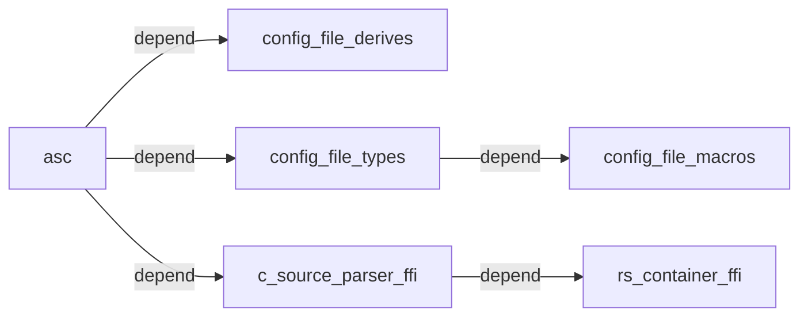

## C/C++ package manager and auto source builder (inspired by Rust Cargo)

```
 █████  ███████  ██████     ██████  ██   ██  ██████  
██   ██ ██      ██          ██   ██ ██  ██  ██       
███████ ███████ ██          ██████  █████   ██   ███ 
██   ██      ██ ██          ██      ██  ██  ██    ██ 
██   ██ ███████  ██████     ██      ██   ██  ██████  
```                                                     

### **crates dependency graph**



---


### asc
[English](asc_bin/README.md)
&nbsp;&nbsp;&nbsp;&nbsp;
[简体中文](asc_bin/README.zh-CN.md)

[](https://crates.io/crates/asc_bin)
[](https://pypi.org/project/asc-bin)
[](https://github.com/ascpkg/asc/releases)
[](https://crates.io/crates/asc_bin)


---


### config_file_derives

[](https://docs.rs/config_file_derives)
[](https://crates.io/crates/config_file_derives)
[](https://crates.io/crates/config_file_derives)


---


### config_file_macros

[](https://docs.rs/config_file_macros)
[](https://crates.io/crates/config_file_macros)
[](https://crates.io/crates/config_file_macros)


---


### config_file_types

[](https://docs.rs/config_file_types)
[](https://crates.io/crates/config_file_types)
[](https://crates.io/crates/config_file_types)


---


### c_source_parser_ffi

[](https://docs.rs/c_source_parser_ffi)
[](https://crates.io/crates/c_source_parser_ffi)
[](https://crates.io/crates/c_source_parser_ffi)


---


### rs_container_ffi

[](https://docs.rs/rs_container_ffi)
[](https://crates.io/crates/rs_container_ffi)
[](https://crates.io/crates/rs_container_ffi)
