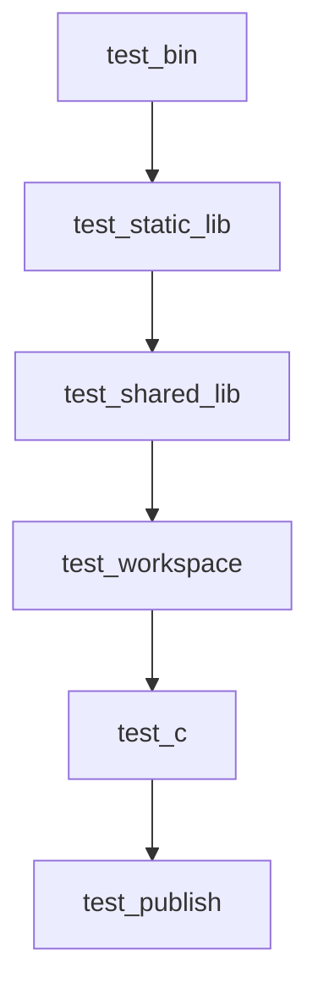

# C/C++包管理系统ASC


## 1. Rust Cargo

### 1.1 包管理

#### 1.1.1 search
> cargo search ffmpeg-sys-next
```
ffmpeg-sys-next = "7.1.0"             # FFI bindings to FFmpeg
```
#### 1.1.2 add
> cargo add tonic
```
    Updating crates.io index
      Adding tonic v0.12.3 to dependencies
             Features:
             + channel
             + codegen
             + prost
             + router
             + server
             + transport
             - gzip
             - tls
             - tls-native-roots
             - tls-roots
             - tls-webpki-roots
             - zstd
    Updating crates.io index
     Locking 62 packages to latest compatible versions
      Adding async-stream v0.3.6
      Adding async-stream-impl v0.3.6
      Adding async-trait v0.1.83
      Adding atomic-waker v1.1.2
```

#### 1.1.3 Cargo.toml
```toml
[dependencies]
tokio = { version = "1.40.0", features = ["full"]}
tonic = "0.12.3"
```


#### 1.1.4 内部registry
> cat .cargo/config.toml
```toml
[registries]
my-registry = { index = "https://my-intranet:8080/git/index" }
```
> cat Cargo.toml
```toml
[dependencies]
other-crate = { version = "1.0", registry = "my-registry" }
```

#### 1.1.5 离线模式
>cargo --offline
- 可以同步target/下的构建缓存
- 还可以使用cargo-prefetch插件

### 1.2 依赖控制

#### 1.2.1 版本控制
> cat plc_service/Cargo.toml
```toml
[dependencies]
prost = { version = "0.13.3" }
prost-types = { version = "0.13.3" }
```

#### 1.2.2 特性控制
> cat plc_service/Cargo.toml
```toml
[dependencies]
redis = { version = "0.27.2", features = ["tokio-comp", "cluster"] }

serde = { version = "1.0.210", features = ["derive"] }
serde_json = { version = "1.0.128" }

clap = { version = "4.5.18", features = ["derive"] }

tokio = { version = "1.40.0", features = ["rt-multi-thread", "macros"] }
```

### 1.3 多个子项目管理

#### 1.3.1 workspace
方便把一组强相关的crate组织到一起
> cat Cargo.toml
```toml
[workspace]
resolver = "2"

members = [
    "plc_build",
    "plc_log",
    "plc_client",
    "plc_service",
    "plc_adapter",
    "plc_proto",
    "plc_device",
]
```

#### 1.3.2 dependencies
这里我们引用了本workspace内的同级crate
> cat plc_service/Cargo.toml
```toml
[dependencies]
plc_log = { path = "../plc_log" }
plc_proto = { path = "../plc_proto" }
```

### 1.4 build.rs
在编译时触发，比如这里就调用了本workspace内的plc_build库来从git commit信息生成Cargo.toml版本号和version.rs
> cat plc_service/build.rs
```rust
use plc_build;

fn main() {
    println!("cargo:rerun-if-changed=./");
    println!("cargo:rerun-if-changed=../plc_build/");

    plc_build::replace_app_name_version()
}
```

#### 1.4.1 监听文件或者目录变化
```rust
println!("cargo:rerun-if-changed=./");
println!("cargo:rerun-if-changed=../plc_build/");
```

#### 1.4.2 根据git commit信息生成版本号等
```rust
plc_build::replace_app_name_version()
```

### 1.5 源码自组织
通过crate内原码mod化，就可以方便的生成依赖树，编译起来就非常方便了，完整不需要像C/C++那样手动写一堆源文件名

#### 1.5.1 mod
```rust
pub mod conf;
pub mod rpc;
pub mod store;

pub mod version;
```

```
> tree /f
│  conf.rs
│  main.rs
│  version.rs
│
├─rpc
│  │  mod.rs
│  │
│  └─handler
│          control_plc.rs
│          mod.rs
│
└─store
        activate_adapter.rs
        mod.rs
```

#### 1.5.2 super
可以引用本mod内的

> cat plc_service/src/rpc/handler/mod.rs
```rust
#[derive(Debug, Default)]
pub struct MyPlcService {
    pub store: RedisStore,
}
```

> cat plc_service/src/rpc/handler/control_plc.rs
```rust
use super::MyPlcService;

impl MyPlcService {
    // from plc_client
    pub async fn control_plc_handler(
        &self,
        request: tonic::Request<ControlPlcRequest>,
    ) -> std::result::Result<tonic::Response<ControlPlcResponse>, tonic::Status> {
    }
}
```

#### 1.5.3 crate
可以引用本crate内的

> cat plc_proto/src/rs/mapping/bar.rs
```rust
use crate::plc;
```

> cat plc_proto/src/lib.rs
```rust
pub mod plc {
    tonic::include_proto!("plc");
}
```

#### 1.5.4 use
- 可以引用开源crate
- 可以引用本workspace的crate
- 可以引用本crate内的mod
- 可以引用本mod内的符号


## 2. C/C++痛点
### 2.1 松散的标准委员会约束力弱
### 2.1.1 编译器众多实现有差异
工具链参数不一致，abi不兼容，对标准实现不一可能会出现语法不兼容
- gnu
- llvm
- msvc

### 2.1.2 没有统一的包管理系统
- 第三方包管理系统质和量不高
- linux系统依赖耦合度高

### 2.1.3 职责不明
- 编译器只管理编译
- 构建系统只管编译环境和调用
- 简单的源码依赖树双方都不想做，需要开发手动配置

### 2.2 编译复杂

#### 2.2.1 源码编译需要各种参数
- 指定参与编译的源文件
- 指定头文件搜索路径

#### 2.2.2 目标文件链接需要显示指定各种参数
- 库文件搜索路径
- 链接的库名

#### 2.2.3 复杂的编译器参数

#### 2.2.4 源码自组织度弱
- 没有mod和super
不方便在子目录内形成模块化
- 没有crate
不方便在项目内形成模块化
- #include处理简单
include顺序不当会造成符号冲突，不同的编译单元也可能会造成生命周期混乱
- 编译器和构建系统都不自动生成源码依赖树
- 尽管c++ module看上去很类似于rust mod，但几乎没有存量库支持和改造，在构建系统里也还是需要手动指定哪些源码参与编译 https://github.com/cdacamar/ball_pit

### 2.3 构建系统


#### 2.3.1 手动模式
- 动态库
    * gnu
    ```
    g++ -o libmy_library.so -shared -fPIC my_library.cpp -I/path/to/openssl/include -L/path/to/openssl/lib -lssl -lcrypto
    ```
    * llvm
    ```
    clang++ -o libmy_library.so -shared -fPIC my_library.cpp -I/path/to/openssl/include -L/path/to/openssl/lib -lssl -lcrypto
    ```
    * msvc
    ```
    cl /nologo /EHsc /MD /LD /I"path\to\openssl\include" my_library.cpp /link /LIBPATH:"path\to\openssl\lib" libssl.lib libcrypto.lib
    ```
- 静态库
    * gnu
    ```
    g++ -o libmy_library.a -c my_library.cpp -I/path/to/openssl/include
    ar rcs libmy_library.a my_library.o

    g++ -o my_executable main.cpp -L/path/to/openssl/lib -lssl -lcrypto -lmy_library -I/path/to/openssl/include
    ```
    * llvm
    ```
    clang++ -o libmy_library.a -c my_library.cpp -I/path/to/openssl/include
    ar rcs libmy_library.a my_library.o

    clang++ -o my_executable main.cpp -L/path/to/openssl/lib -lssl -lcrypto -lmy_library -I/path/to/openssl/include
    ```
    * msvc
    ```
    cl /nologo /EHsc /MD /c my_library.cpp /I"path\to\openssl\include"
    lib my_library.obj -OUT:libmy_library.lib

    cl /nologo my_executable main.cpp /link /LIBPATH:"path\to\openssl\lib" libssl.lib libcrypto.lib libmy_library.lib
    ```

#### 2.3.2 Makefile

- 至此，Makefile解决了对编译器参数的组合，继续通过拆分和组合，可以初步支持不同的编译器了
- 但这还不够，通常来讲，编译的代价会很高，如果靠编译器和报错的话，编译很多源码的时候可能已经编译了很久，才会失败
- 如果能在前置做一些工作，就更好了
```Makefile
CXX = g++ # 使用 g++ 编译器
# CXX = clang++ # 如果要使用 clang 编译器，请取消注释这一行

# 如果是 Windows 平台，请使用以下的设置
# CXX = cl
# CXXFLAGS = /EHsc /MD

CXXFLAGS = -std=c++11 -I/path/to/openssl/include
LDFLAGS = -L/path/to/openssl/lib -lssl -lcrypto

LIBRARY_NAME = my_library
EXECUTABLE_NAME = my_executable

all: $(LIBRARY_NAME).a $(EXECUTABLE_NAME)

$(LIBRARY_NAME).a: my_library.o
    ar rcs $@ $^

my_library.o: my_library.cpp
    $(CXX) $(CXXFLAGS) -c $< -o $@

$(EXECUTABLE_NAME): main.cpp $(LIBRARY_NAME).a
    $(CXX) $(CXXFLAGS) $< -o $@ -l$(LIBRARY_NAME) $(LDFLAGS)

clean:
    rm -f *.o *.a $(EXECUTABLE_NAME)
```

#### 2.3.3 configure
- configure的出现是为了弥补Makefile的不足
- 它用脚本的方式来检测一些东西，动态生成一些东西
- 比如说通常会检查CPU指令集、操作系统、编译器、头文件、库文本
- 还用来配置输出路径等
```bash
#!/bin/bash
# 检查 OpenSSL 库是否安装
OPENSSL_PATH="/path/to/openssl"
if [ ! -d "$OPENSSL_PATH" ]; then
    echo "OpenSSL not found. Please specify the correct path to OpenSSL."
    exit 1
fi

# 检查支持的 CPU 指令集
CPU_INSTRUCTION_SET=$(uname -m)

# 检查操作系统
OS=$(uname)

# 检查编译器
if command -v g++ &>/dev/null; then
    CXX=g++
elif command -v clang++ &>/dev/null; then
    CXX=clang++
else
    echo "No supported C++ compiler found. Please install g++ or clang++."
    exit 1
fi

# 检查输出路径
OUTPUT_PATH="build"
if [ ! -d "$OUTPUT_PATH" ]; then
    mkdir -p $OUTPUT_PATH
fi

# 生成 Makefile
cat > $OUTPUT_PATH/Makefile <<EOF
CXX = $CXX
CXXFLAGS = -std=c++11 -I\$(OPENSSL_PATH)/include
LDFLAGS = -L\$(OPENSSL_PATH)/lib -lssl -lcrypto

LIBRARY_NAME = my_library
EXECUTABLE_NAME = my_executable

all: \$(LIBRARY_NAME).a \$(EXECUTABLE_NAME)

\$(LIBRARY_NAME).a: my_library.o
    ar rcs \$@ \$^

my_library.o: my_library.cpp
    \$(CXX) \$(CXXFLAGS) -c \$< -o \$@

\$(EXECUTABLE_NAME): main.cpp \$(LIBRARY_NAME).a
    \$(CXX) \$(CXXFLAGS) \$< -o \$@ -l\$(LIBRARY_NAME) \$(LDFLAGS)

clean:
    rm -f *.o *.a \$(EXECUTABLE_NAME)
EOF

# 设置 OpenSSL 路径
sed -i "s|/path/to/openssl|\$OPENSSL_PATH|g" $OUTPUT_PATH/Makefile

echo "Makefile generated successfully in $OUTPUT_PATH!"
```


#### 2.3.4 Autotools
- 可以看出上面的configure+Makefile还是有很多不方便的地方，需要编写复杂的脚本
- 而gnu autotools引入了automake, autoheader, autoconf工具集来大大减少了工作量
- 至此，编译工作得到了一定的解决
- 而我们在编写库的时候通过会给别的项目使用，起初很原始，大家都把头文件和库文件拷贝到公共目录
- 在linux上非常常见，可以看到很多不同版本后缀，以及一堆软链接来解决版本冲突
- 后续能使用了pkgconfig配置来导出头文件和库文件位置，但还是比较原始，不够方便。可以看到 https://code.videolan.org/videolan/libdvdcss/-/blob/master/configure.ac 以及m4目录，autotools不够auto，也不够简洁
- 到了bazel/CMake/meson都催生了包管理系统，能够更方便的导出库供共他人使用


#### 2.3.5 bazel/CMake/meson
- 跨平台支持
- 多语言支持
- 增量构建
- 并行构建 (bazel)
- 依赖管理
- 包管理社区

#### 2.3.6 其它

#### 2.3.7 构建系统在做什么
- 检查环境
    * 检查指令集
    * 检查操作系统
    * 检查编译器
    * 检查头文件、库、符号
- 拼接编译器参数
- 组织编译顺序
- 增量构建
- 并行构建

#### 2.3.8 我该选择谁——CMake
- 基于语法规则简洁性选择meson
```bazel
# bazel
# Test code implementing the Foo controller.
package(default_testonly = True)

py_test(
    name = "foo_test",
    srcs = glob(["*.py"]),
    data = [
        "//data/production/foo:startfoo",
        "//foo",
        "//third_party/java/jdk:jdk-k8",
    ],
    flaky = True,
    deps = [
        ":check_bar_lib",
        ":foo_data_check",
        ":pick_foo_port",
        "//pyglib",
        "//testing/pybase",
    ],
)
```

```cmake
# cmake
# Define the project
cmake_minimum_required(VERSION 3.10)
project(FooTest)

# Add the test executable
add_executable(foo_test foo_test.py)

# Set the test data directories
set(TEST_DATA_DIR ${CMAKE_SOURCE_DIR}/data)
set(PRODUCTION_DATA_DIR ${TEST_DATA_DIR}/production/foo)

# Copy the necessary data files
file(COPY ${PRODUCTION_DATA_DIR}/startfoo DESTINATION ${CMAKE_BINARY_DIR}/data/production/foo)
file(COPY foo DESTINATION ${CMAKE_BINARY_DIR})
file(COPY third_party/java/jdk/jdk-k8 DESTINATION ${CMAKE_BINARY_DIR}/third_party/java/jdk)

# Add the flaky test property
set_tests_properties(foo_test PROPERTIES FAIL_REGULAR_EXPRESSION "Flaky test failure")

# Add test dependencies
target_link_libraries(foo_test check_bar_lib foo_data_check pick_foo_port pyglib pybase)

# Set the working directory for the test
set_property(TARGET foo_test PROPERTY VS_DEBUGGER_WORKING_DIRECTORY "${CMAKE_BINARY_DIR}")
```

```meson
# meson.build

# Define the project
project('my_project', 'cpp')

# Add the executable
executable('my_executable', 'main.cpp', dependencies : ['my_library'])

# Add the library
my_lib_sources = ['my_library.cpp']
my_library = library('my_library', my_lib_sources)

# Install bin
install_dir = join_paths(get_option('prefix'), 'bin')
install_data(install_dir, files('my_executable'))

# Install lib
install_dir = join_paths(get_option('prefix'), 'lib')
install_data(install_dir, files(my_lib_sources))
```

- 基于Google搜索热度变化选择meson
    * 趋势地址 https://trends.google.com/trends/explore?date=all&q=makefile,autotools,bazel,cmake,meson&hl=zh-CN
    * 
- 基于包数量、质量、活跃度选择基于CMake的vcpkg
    * bazel
        - 官方地址 [Bazel Central Registry](https://registry.bazel.build/all-modules)
        - 截止到2025-02-06日共收录474个
        - 没有CI测试

    * meson
        - 官方地址 [Meson WrapDB packages](https://mesonbuild.com/Wrapdb-projects.html)
        - 截止到2025-02-06日共收录305个
        - 没有CI测试，测试windows上sdl2编译失败


    * CMake
        - vcpkg官方地址 [Browse public vcpkg packages](https://vcpkg.io/en/packages)
        - 截止到2025-02-06日共收录2545个
        - 主流平台自动构建，PR触发自动构建
        - 几十种社区三元组支持

## 3. 搭建内部包管理系统

### 3.1 vcpkg

#### 3.1.1 三元组 triplet
- 官方参考：https://learn.microsoft.com/zh-cn/vcpkg/concepts/triplets
- 示例：x64-windows-static-md
- 说明：CPU指令集-OS-编译器-运行时
- 支持列表
```
Built-in Triplets:
  arm-neon-android
  arm64-android
  arm64-osx
  arm64-uwp
  arm64-windows
  x64-android
  x64-linux
  x64-osx
  x64-uwp
  x64-windows-static
  x64-windows
  x86-windows
Community Triplets:
  arm-android
  arm-ios
  arm-linux-release
  arm-linux
  arm-mingw-dynamic
  arm-mingw-static
  arm-uwp-static-md
  arm-uwp
  arm-windows-static
  arm-windows
  arm64-ios-release
  arm64-ios-simulator-release
  arm64-ios-simulator
  arm64-ios
  arm64-linux-release
  arm64-linux
  arm64-mingw-dynamic
  arm64-mingw-static
  arm64-osx-dynamic
  arm64-osx-release
  arm64-uwp-static-md
  arm64-windows-static-md
  arm64-windows-static-release
  arm64-windows-static
  arm64ec-windows
  armv6-android
  loongarch32-linux-release
  loongarch32-linux
  loongarch64-linux-release
  loongarch64-linux
  mips64-linux
  ppc64le-linux-release
  ppc64le-linux
  riscv32-linux-release
  riscv32-linux
  riscv64-linux-release
  riscv64-linux
  s390x-linux-release
  s390x-linux
  wasm32-emscripten
  x64-freebsd
  x64-ios
  x64-linux-dynamic
  x64-linux-release
  x64-mingw-dynamic
  x64-mingw-static
  x64-openbsd
  x64-osx-dynamic
  x64-osx-release
  x64-uwp-static-md
  x64-windows-release
  x64-windows-static-md-release
  x64-windows-static-md
  x64-windows-static-release
  x64-xbox-scarlett-static
  x64-xbox-scarlett
  x64-xbox-xboxone-static
  x64-xbox-xboxone
  x86-android
  x86-freebsd
  x86-ios
  x86-linux
  x86-mingw-dynamic
  x86-mingw-static
  x86-uwp-static-md
  x86-uwp
  x86-windows-static-md
  x86-windows-static
  x86-windows-v120
```

#### 3.1.2 经典模式
- 经典模式下库是全局安装到VCPKG_ROOT/installed路径下的
- 搜索库 vcpkg search port
- 安装库 vcpkg install port:triplet
- 移除库 vcpkg remove port:triplet
- 库位置 VCPKG_ROOT/installed/triplet
- debug库位置 VCPKG_ROOT/installed/triplet/debug
- include位置 VCPKG_ROOT/installed/triplet/include
- lib位置 VCPKG_ROOT/installed/triplet/lib
- pkgconfig配置位置 VCPKG_ROOT/installed/triplet/lib/pkgconfig
- bin位置 VCPKG_ROOT/installed/triplet/tools
- cmake配置位置 VCPKG_ROOT/installed/triplet/share

#### 3.1.3 清单模式
- 清单模式是安全到cmake build路径下的cmake_build_dir/vcpkg_installed/triplet路径下的
- 清单模式文件树如下
```
│  CMakeLists.txt
│  vcpkg-configuration.json
│  vcpkg.json
│
└─client
        CMakeLists.txt
        main.cpp
```
- vcpkg-configuration.json用于配置registry，default-registry/repository指定registry git路径，baseline用于指定registry git commit id
```json
{
  "default-registry": {
    "kind": "git",
    "baseline": "8bbffa13236d00099c64bc3007da4ab86200d181",
    "repository": "https://github.com/microsoft/vcpkg"
  },
  "registries": [
    {
      "kind": "artifact",
      "location": "https://github.com/microsoft/vcpkg-ce-catalog/archive/refs/heads/main.zip",
      "name": "microsoft"
    }
  ]
}
```
- vcpkg.json用于配置依赖，dependencies用于指定依赖库，overrides用于限定依赖库版本
```json
{
  "dependencies": [
    "cli11",
    "fmt",
    "spdlog",
    "libmodbus"
  ],
  "overrides": [
    {
      "name": "libmodbus",
      "version": "3.1.10"
    }
  ]
}
```
- 可以看到清单模式可以更精细的给某个工程指定对应的registry和dependencies，自由度更高，除了配置vcpkg-configuration.json和vcpkg.json之外，你仅需要编写项目相关的CMakeLists.txt即可


#### 3.1.4 使用基线
前面示例中展示的vcpkg-configuration.json/default-registry/baseline就是registry的git commit id了，在一个基线上库之间是互相兼容的

#### 3.1.5 指定版本
前面示例中展示的vcpkg.json/overrides/port/version就可以给port指定版本了，给每个库限定版本是个非常好的习惯，有利于清晰的控制依赖，避免版本冲突

#### 3.1.6 源码缓存
VCPKG_ROOT/downloads下就是源码缓存了

#### 3.1.7 编译结果缓存
VCPKG_ROOT/packages下就是编译结果缓存了

#### 3.1.8 源码解包路径

VCPKG_ROOT/buildtrees下就是源码解包路径了，如果编译出debug版本，那调试时依赖库符号就是指向这里的源码

#### 3.1.9 二进制资产缓存
在windows下%LOCALAPPDATA%/vcpkg/archives下就是编译好的依赖相关文件缓存了

#### 3.1.10 离线模式
上面我们了解了重要的几个缓存路径，我们就可以基于此构建我们自己的离线模式了，使用其它方式如存储介质或者局域网同步registry和源码缓存我们就可以在离线模式顺序的编译了，如果进一步同步二进制资源缓存，就可以复用编译输出了

#### 3.1.11 缺陷
- 同一baseline之间的库才保证兼容性，不方便像cargo/pypi/maven那样全局托管多版本，方便版本任意切换

### 3.2 cmake

#### 3.2.1 cmake版本声明
```cmake
cmake_minimum_required(VERSION 3.20)
```

#### 3.2.2 工程声明
```cmake
project(libcexample C)
```

#### 3.2.3 编译器参数指定
```cmake
if(MSVC)
    # utf-8 source code encoding
    add_compile_options("$<$<C_COMPILER_ID:MSVC>:/utf-8>")
    add_compile_options("$<$<CXX_COMPILER_ID:MSVC>:/utf-8>")
endif(MSVC)
```

#### 3.2.4 跨平台配置
- 检查头文件是否存在
```cmake
include(CheckIncludeFiles)
check_include_files("stdlib.h" HAVE_STDLIB_H)
```

- 检查类型大小
```cmake
# check types
include(CheckTypeSize)
# check_type_size(size_t SIZE_T)
```

- 检查函数是否存在
```cmake
# check functions
include(CheckFunctionExists)
check_function_exists(gettimeofday HAVE_GETTIMEOFDAY)
```

- 检查符号是否存在
```cmake
# check symbols
include(CheckSymbolExists)
check_symbol_exists(O_BINARY "fcntl.h" HAVE_O_BINARY)
```

- 其它检查

- 生成关于平台相关的config.h
```c
# platform config.h
configure_file(${CMAKE_SOURCE_DIR}/src/config.h.cm ${CMAKE_BINARY_DIR}/config.h)
```


- config.h.cm模板
```c
/* Define to 1 if you have the <stdlib.h> header file. */
#cmakedefine HAVE_STDLIB_H 1
 
/* Define to 1 if you have the `gettimeofday' function. */
#cmakedefine HAVE_GETTIMEOFDAY 1
 
/* Define to 1 if you have the `O_BINARY' symbol. */
#cmakedefine HAVE_O_BINARY 1
```

#### 3.2.5 版本配置
- 生成版本相关的version.h
```cmake
# version
set(LIB_C_EXAMPLE_VERSION_MAJOR 0)
set(LIB_C_EXAMPLE_VERSION_MINOR 0)
set(LIB_C_EXAMPLE_VERSION_MICRO 1)

# version.h
configure_file(${CMAKE_SOURCE_DIR}/src/version.h.in ${CMAKE_BINARY_DIR}/version.h @ONLY)
```

- version.h.in模板
```c
#pragma once
 
#define TEST_EXAMPLE_VERSION_CODE(major, minor, micro) \
    (((major) * 10000) +\
     ((minor) *100) +\
     ((micro) *1))
 
#define TEST_EXAMPLE_VERSION_MAJOR @TEST_EXAMPLE_VERSION_MAJOR@
#define TEST_EXAMPLE_VERSION_MINOR @TEST_EXAMPLE_VERSION_MINOR@
#define TEST_EXAMPLE_VERSION_MICRO @TEST_EXAMPLE_VERSION_MICRO@
 
#define TEST_EXAMPLE_VERSION_STRING "@TEST_EXAMPLE_VERSION_MAJOR@.@TEST_EXAMPLE_VERSION_MINOR@.@TEST_EXAMPLE_VERSION_MICRO@"
 
#define TEST_EXAMPLE_VERSION \
    TEST_EXAMPLE_VERSION_CODE(TEST_EXAMPLE_VERSION_MAJOR, TEST_EXAMPLE_VERSION_MINOR, TEST_EXAMPLE_VERSION_MICRO)
```
 
#### 3.2.6 组织头文件、源文件、分类
- 组织config.h和version.h
```cmake
# glob headers and sources
FILE(GLOB_RECURSE HEADER_FILES_CONF
    ${CMAKE_BINARY_DIR}/config.h
    ${CMAKE_BINARY_DIR}/version.h
)
```

- 组织头文件
```cmake
FILE(GLOB_RECURSE HEADER_FILES_TEST
    "src/headers/test/*.h"
)
```

- 组织源文件
```cmake
FILE(GLOB_RECURSE SOURCE_FILES_TEST
    "src/sources/test/*.c"
)
```

- 归类
```cmake
# classify
SOURCE_GROUP("headers/conf" FILES ${HEADER_FILES_CONF})
SOURCE_GROUP("headers/test" FILES ${HEADER_FILES_TEST})
SOURCE_GROUP("sources/test" FILES ${SOURCE_FILES_TEST})
```


#### 3.2.7 查找依赖
```cmake
# find deps
find_package(libcexample CONFIG REQUIRED)
find_package(libcppexample CONFIG REQUIRED)
```


#### 3.2.8 宏定义
```cmake
  # defines
  add_definitions(-DPATH_MAX=1024)
  add_definitions(-D_CRT_SECURE_NO_WARNINGS)
```

#### 3.2.9 生成库或者可执行文件
```cmake
# generate library
add_library(${PROJECT_NAME}
    ${HEADER_FILES_CONF}
    ${HEADER_FILES_TEST}
    ${SOURCE_FILES_TEST}
)

# generate executable
add_executable(${PROJECT_NAME}
    ${HEADER_FILES_CONF}
    ${HEADER_FILES_TEST}
    ${SOURCE_FILES_TEST}
    ${SOURCE_FILES_MAIN}
)
```

#### 3.2.10 链接库
```cmake
# link libraries
target_link_libraries(
    ${PROJECT_NAME}
    PRIVATE
    libcexample::libcexample
    libcppexample::libcppexample
)
```

#### 3.2.11 头文件搜索路径
```cmake
target_include_directories(
    ${PROJECT_NAME}
    PRIVATE
    "src/headers"
    ${CMAKE_CURRENT_BINARY_DIR}
)
```

#### 3.2.12 库文件搜索路径
```cmake
target_link_directories
```

#### 3.2.13 安装库和可执行文件
```cmake
# install lib and bin
install(
    TARGETS ${PROJECT_NAME}
    EXPORT ${PROJECT_NAME}-targets
    ARCHIVE DESTINATION lib
    LIBRARY DESTINATION lib
    RUNTIME DESTINATION bin
)
```

#### 3.2.13 安装头文件
```cmake
# install headers
install(FILES
  ${HEADER_FILES_CONF}
  ${HEADER_FILES_TEST}
  DESTINATION include/${PROJECT_NAME})
```

#### 3.2.14 导出库
```cmake
# export library
add_library(${PROJECT_NAME}::${PROJECT_NAME} ALIAS ${PROJECT_NAME})
```

#### 3.2.15 导出头文件搜索路径
```cmake
# export include path
target_include_directories(
    ${PROJECT_NAME}
    INTERFACE
    $<INSTALL_INTERFACE:include>
)
```

#### 3.2.16 安装*-config.cmake和targets供其它工程使用
```cmake
# install cmake config
include(CMakePackageConfigHelpers)

configure_package_config_file(
  "${CMAKE_CURRENT_SOURCE_DIR}/${PROJECT_NAME}-config.cmake.in"
  "${CMAKE_CURRENT_BINARY_DIR}/${PROJECT_NAME}-config.cmake"
  INSTALL_DESTINATION "share/${PROJECT_NAME}"
)
install(
  FILES "${CMAKE_CURRENT_BINARY_DIR}/${PROJECT_NAME}-config.cmake"
  DESTINATION "share/${PROJECT_NAME}"
)
 
# install cmake targets
install(
    EXPORT ${PROJECT_NAME}-targets
    DESTINATION share/${PROJECT_NAME}
    NAMESPACE ${PROJECT_NAME}::
)
```

### 3.3 初始化私有vcpkg registry
- 上文我们详细了解了vcpkg和cmake的使用
- 接下来我们将来了解如何使用registry管理内外部库和可执行文件
- 基于不同的baseline创建版本分支
- 虽然vcpkg可以指定老版本，但官方不保证其依赖的上下游兼容性
- 而我们内部不同的项目可能会依赖不同的库版本


## 4. C/C++ 包管理和源码树自动编译工具asc
[asc使用指南](../asc_bin/README.zh-CN.md)


