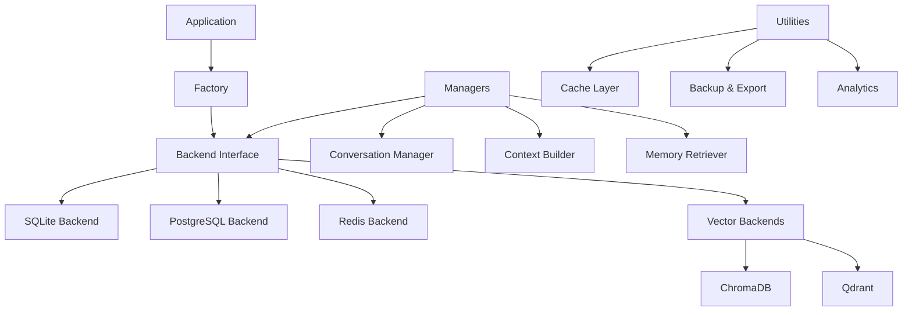

# bruno-memory

## Overview

bruno-memory is a high-performance, multi-backend memory system providing persistent storage and intelligent retrieval for AI conversations and context management.

### Key Features

- 🔌 **Multiple Backends**: SQLite, PostgreSQL, Redis, ChromaDB, Qdrant
- 🚀 **High Performance**: Connection pooling, caching, batch operations
- 🔍 **Semantic Search**: Vector embeddings with ChromaDB/Qdrant
- 💾 **Flexible Storage**: From lightweight SQLite to enterprise PostgreSQL
- 🔄 **Smart Context**: Intelligent conversation context building
- 📊 **Analytics**: Built-in analytics and performance tracking
- 🛡️ **Type Safe**: Full type hints and Pydantic validation
- 🔧 **Extensible**: Plugin architecture for custom backends

## Quick Example

```python
import asyncio
from bruno_memory import create_backend
from bruno_core.models import Message, MessageRole, MessageType

async def main():
    # Create a SQLite backend
    backend = create_backend("sqlite", database_path="memory.db")
    await backend.connect()
    
    # Store a message
    message = Message(
        content="Hello, how can I help you today?",
        role=MessageRole.ASSISTANT,
        message_type=MessageType.TEXT
    )
    await backend.store_message(message)
    
    # Retrieve conversation history
    messages = await backend.retrieve_messages(limit=10)
    for msg in messages:
        print(f"{msg.role}: {msg.content}")
    
    await backend.disconnect()

asyncio.run(main())
```

## Installation

```bash
pip install bruno-memory
```

### Optional Dependencies

```bash
# PostgreSQL support
pip install bruno-memory[postgresql]

# Redis support
pip install bruno-memory[redis]

# Vector search with ChromaDB
pip install bruno-memory[chromadb]

# Vector search with Qdrant
pip install bruno-memory[qdrant]

# All backends
pip install bruno-memory[all]
```

## Architecture



## Backend Comparison

| Feature | SQLite | PostgreSQL | Redis | ChromaDB | Qdrant |
|---------|--------|------------|-------|----------|--------|
| **Setup** | ⭐⭐⭐⭐⭐ | ⭐⭐⭐ | ⭐⭐⭐⭐ | ⭐⭐⭐⭐ | ⭐⭐⭐ |
| **Performance** | ⭐⭐⭐ | ⭐⭐⭐⭐ | ⭐⭐⭐⭐⭐ | ⭐⭐⭐⭐ | ⭐⭐⭐⭐⭐ |
| **Scalability** | ⭐⭐ | ⭐⭐⭐⭐⭐ | ⭐⭐⭐⭐ | ⭐⭐⭐⭐ | ⭐⭐⭐⭐⭐ |
| **Vector Search** | ❌ | ❌ | ❌ | ✅ | ✅ |
| **Full-Text Search** | ✅ | ✅ | ✅ | ❌ | ❌ |
| **Use Case** | Dev/Small | Enterprise | Cache/Fast | RAG/Semantic | RAG/Scale |

## Why bruno-memory?

### 🎯 Purpose-Built for AI

Unlike generic databases, bruno-memory is specifically designed for AI conversation management with built-in:

- Conversation threading and context
- Semantic similarity search
- Memory compression and summarization
- Context window management

### 🔌 Backend Flexibility

Start with SQLite for development, scale to PostgreSQL for production, add Redis for caching, and integrate vector databases for RAG—all without changing your application code.

### 📦 Batteries Included

- **Caching**: Multi-level caching (in-memory + Redis)
- **Backup**: Export to JSON, CSV, Excel
- **Analytics**: Conversation patterns, usage metrics
- **Migrations**: Automated schema management with Alembic

### 🚀 Production Ready

- Comprehensive test coverage (>90%)
- Connection pooling and retry logic
- Environment-based configuration
- Fallback chain support

## Next Steps

- [Quick Start Guide](getting-started/quickstart.md) - Get up and running in 5 minutes
- [Backend Selection](guide/backends.md) - Choose the right backend for your needs
- [API Reference](api/factory.md) - Complete API documentation
- [Examples](examples/basic.md) - Real-world usage patterns

## License

MIT License - see [LICENSE](about/license.md) for details.

## Contributing

We welcome contributions! See [Contributing Guide](development/contributing.md) for details.
