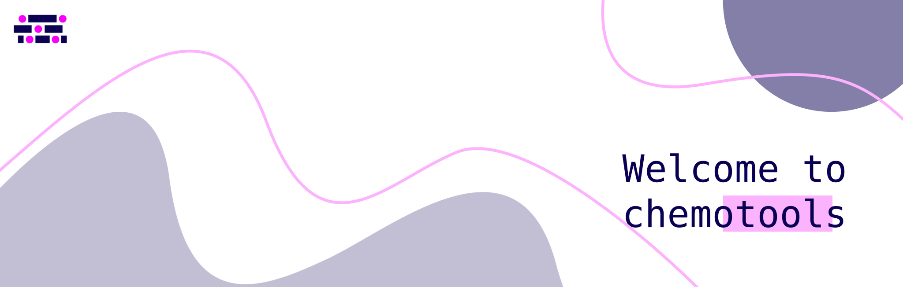

:html_theme.sidebar_secondary.remove:

.. toctree::
   :maxdepth: 1
   :hidden:

   User Guide <user/index>
   Explore <explore/index>
   Methods <methods/index>
   Learn <learn/index>
   Cite <cite/index>
   API <api/index>

.. image:: https://img.shields.io/pypi/v/chemotools
   :target: https://pypi.org/project/chemotools
   :alt: PyPI version

.. image:: https://img.shields.io/pypi/pyversions/chemotools
   :target: https://pypi.org/project/chemotools
   :alt: Python versions

.. image:: https://img.shields.io/pypi/l/chemotools
   :target: https://github.com/paucablop/chemotools/blob/main/LICENSE
   :alt: License

.. image:: https://codecov.io/github/paucablop/chemotools/branch/main/graph/badge.svg?token=D7JUJM89LN
   :target: https://codecov.io/github/paucablop/chemotools
   :alt: Code coverage

.. image:: https://static.pepy.tech/badge/chemotools
   :target: https://pepy.tech/project/chemotools
   :alt: Downloads

.. image:: https://joss.theoj.org/papers/10.21105/joss.06802/status.svg
   :target: https://doi.org/10.21105/joss.06802
   :alt: DOI

.. image:: https://www.codefactor.io/repository/github/paucablop/chemotools/badge/main
   :target: https://www.codefactor.io/repository/github/paucablop/chemotools/overview/main
   :alt: CodeFactor

----

Welcome to chemotools
=====================

``chemotools`` is a **Python package for spectral analysis**, designed to integrate natively with the widely adopted ``scikit-learn`` API and the broader **Python machine learning ecosystem**.

Developed after years of applying **spectroscopy** across industries, its mission is to empower **scientists and engineers** with the tools needed to build **production-ready chemometric models**. ``chemotools`` provides an **intuitive, flexible environment** that streamlines the **development and deployment** of models, making it easier to **standardize workflows** and **scale chemometric solutions**.

.. image:: _static/images/main/chemotools_overview.png
   :alt: chemotools workflow

----

Start exploring
===============

.. grid:: 1 1 3 3
   :gutter: 2 3 4 4

   .. grid-item-card::
      :img-top: _static/images/index/discover.png
      :text-align: center

      .. button-ref:: explore/index
            :expand:
            :color: secondary
            :click-parent:

            **Discover the environment**

   .. grid-item-card::
      :img-top: _static/images/index/learn6.png
      :text-align: center

      .. button-ref:: learn/index
            :expand:
            :color: secondary
            :click-parent:

            **Chemometrics tutorials**

   .. grid-item-card::
      :img-top: _static/images/index/webinar2.png
      :text-align: center

      .. button-link:: https://www.youtube.com/watch?v=leB43KchETw&t
         :expand:
         :color: secondary
         :click-parent:

            **Check out our Webinar**

