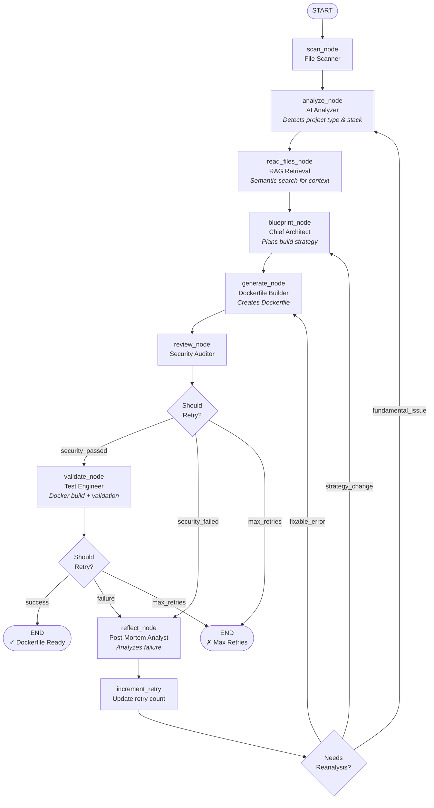

# DockAI 🐳🤖

**The Customizable AI Dockerfile Generation Framework**

[](https://github.com/itzzjb/dockai)
[](https://www.python.org/downloads/)
[](LICENSE)
[](https://github.com/langchain-ai/langgraph)

DockAI is an intelligent, adaptive framework that generates production-ready Dockerfiles for any project using Large Language Models (LLMs). It goes beyond simple template generation by understanding your codebase through RAG (Retrieval-Augmented Generation), analyzing your project architecture, and iteratively improving Dockerfiles until they pass all security and validation checks.

## 🌟 Key Features

### 🧠 **Intelligent Context Understanding**
- **RAG-Powered Analysis**: Uses semantic embeddings (sentence-transformers) to understand your entire codebase
- **AST Code Intelligence**: Extracts entry points, ports, environment variables, and framework dependencies automatically
- **Multi-Language Support**: Works with JavaScript/TypeScript, Python, Go, Java, Ruby, PHP, .NET, and more

### 🏗️ **Multi-Agent Architecture**
DockAI v4.0 features a sophisticated multi-agent system orchestrated by LangGraph:
- **Analyzer Agent**: Project discovery and technology stack detection
- **Blueprint Agent**: Architectural planning and runtime configuration
- **Generator Agent**: Dockerfile creation with best practices
- **Reviewer Agent**: Security auditing and vulnerability detection
- **Reflector Agent**: Failure analysis and adaptive learning
- **Iterative Improver Agent**: Surgical fixes based on validation feedback

### 🔄 **Adaptive & Self-Improving**
- **Automatic Validation**: Builds and tests the Docker image locally
- **Iterative Refinement**: Learns from failures and auto-fixes issues (up to configurable retries)
- **Smart Fallback**: Reverts to the last working Dockerfile if fixes fail (ignoring non-critical warnings)
- **Smart Reflection**: AI analyzes build/runtime errors and adjusts strategy
- **Reanalysis**: Detects when fundamental assumptions are wrong and pivots

### 🔒 **Security & Best Practices**
- **Hadolint Integration**: Strict Dockerfile linting (warnings are treated as errors and auto-fixed)
- **Trivy Security Scanning**: Container vulnerability detection
- **AI Security Review**: Identifies security anti-patterns (root users, exposed secrets, etc.)
- **Multi-Stage Builds**: Optimizes for smaller, more secure images

### 🎯 **Production-Ready Features**
- **Health Check Detection**: Auto-discovers and configures health endpoints
- **Resource Optimization**: Configurable memory, CPU, and process limits
- **Multi-Platform Support**: Works with Docker, Podman, and GitHub Actions
- **Observability**: OpenTelemetry and LangSmith tracing support

### 🛠️ **Highly Customizable**
- **Multi-LLM Support**: OpenAI, Google Gemini, Anthropic Claude, Azure OpenAI, Ollama
- **Per-Agent Model Selection**: Choose different models for different tasks (cost vs. quality)
- **Custom Instructions**: Override default agent behavior
- **Custom Prompts**: Complete control over AI reasoning
- **Environment-Based Configuration**: 100+ configuration options via environment variables

## 🏛️ Architecture

DockAI v4.0 is built on a modern, agent-based architecture using LangGraph for workflow orchestration:



### Core Components

- **LangGraph Workflow Engine**: Orchestrates the agent flow with conditional routing
- **RAG Context Engine**: In-memory vector store for semantic code search
- **Multi-Agent System**: 8 specialized AI agents for different tasks
- **Validation Pipeline**: Docker build, Hadolint, Trivy, and health checks
- **State Management**: Centralized state for workflow coordination

For detailed architecture documentation, see [`docs/architecture.md`](docs/architecture.md).

## 🎯 Three Ways to Use DockAI

DockAI can be integrated into your workflow in multiple ways, depending on your needs:

### 1️⃣ **CLI Tool** (Local Development)

Install via **pip** or **uv** and use directly from the command line:

**Using pip:**
```bash
pip install dockai-cli
export OPENAI_API_KEY="your-key"
dockai build .
```

**Using uv (faster):**
```bash
# Install uv
curl -LsSf https://astral.sh/uv/install.sh | sh

# Install DockAI
uv pip install dockai-cli

# Use it
dockai build .
```

**Perfect for:**
- Local development and testing
- Quick Dockerfile generation
- Iterating on containerization

### 2️⃣ **GitHub Actions** (CI/CD Automation)

Integrate DockAI into your CI/CD pipeline with the GitHub Action:

```yaml
name: Generate Dockerfile
on: [push]

jobs:
  dockerize:
    runs-on: ubuntu-latest
    steps:
      - uses: actions/checkout@v4
      
      - name: Generate Dockerfile with DockAI
        uses: itzzjb/dockai@v4
        with:
          openai_api_key: ${{ secrets.OPENAI_API_KEY }}
          project_path: '.'
      
      - name: Commit Dockerfile
        run: |
          git config user.name "DockAI Bot"
          git add Dockerfile
          git commit -m "chore: update Dockerfile"
          git push
```

**Perfect for:**
- Automated Dockerfile updates
- Multi-service monorepos
- Continuous integration workflows
- Team collaboration

**Learn more:** [GitHub Actions Guide](docs/github-actions.md)

### 3️⃣ **MCP Integration** (Model Context Protocol)

Use DockAI as an MCP server with AI assistants like Claude Desktop:

**Setup MCP:**
```json
{
  "mcpServers": {
    "dockai": {
      "command": "uvx",
      "args": ["dockai-cli"]
    }
  }
}
```

**Usage with Claude Desktop:**
```
You: Can you dockerize this Node.js project?
Claude: [Uses DockAI MCP] I'll generate a Dockerfile for your project...
```

**Perfect for:**
- Interactive AI-assisted development
- Natural language Dockerfile generation
- Integration with Claude Desktop, VSCode, and other MCP clients
- Conversational containerization workflow

**Learn more:** [MCP Integration Guide](docs/mcp-integration.md)

---

## 🚀 Quick Start

### Prerequisites

- Python 3.10 or higher
- Docker installed and running
- An API key from at least one LLM provider (OpenAI, Google, Anthropic, etc.)

### Installation

#### Option 1: Install from PyPI (Recommended)

```bash
pip install dockai-cli
```

#### Option 2: Install with uv (Faster)

[uv](https://github.com/astral-sh/uv) is an extremely fast Python package installer and resolver:

```bash
# Install uv (if not already installed)
curl -LsSf https://astral.sh/uv/install.sh | sh

# Install DockAI
uv pip install dockai-cli
```

**Why use uv?**
- 🚀 **10-100x faster** than pip
- 📦 **Drop-in replacement** for pip
- 🔒 **Deterministic** dependency resolution

#### Option 3: Install from Source

```bash
git clone https://github.com/itzzjb/dockai.git
cd dockai
pip install -e .
```

### Basic Usage

1. **Set up your API key** (choose one provider):

```bash
# OpenAI (Default)
export OPENAI_API_KEY="your-api-key-here"

# Or Google Gemini
export GOOGLE_API_KEY="your-api-key-here"
export DOCKAI_LLM_PROVIDER="gemini"

# Or Anthropic Claude
export ANTHROPIC_API_KEY="your-api-key-here"
export DOCKAI_LLM_PROVIDER="anthropic"
```

2. **Navigate to your project** and run DockAI:

```bash
cd /path/to/your/project
dockai build .
```

3. **Done!** Your production-ready Dockerfile will be created and validated.

### Example Output

```
🔍 Scanning project...
✓ Found 42 files

🧠 Analyzing project with AI...
✓ Detected: Node.js Express application
✓ Entry point: src/server.js
✓ Dependencies: package.json

📖 Reading files with RAG (10 relevant chunks)...
✓ Context retrieved

🏗️ Creating architectural blueprint...
✓ Multi-stage build planned
✓ Health endpoint: /health

🔨 Generating Dockerfile...
✓ Dockerfile created

🔍 Reviewing security...
✓ No critical issues found

🧪 Validating with Docker...
✓ Image built successfully (142 MB)
✓ Container started
✓ Health check passed

✅ Dockerfile generated successfully!
```

## 📚 Documentation

Comprehensive documentation is available in the [`docs/`](docs/) directory:

- **[Getting Started](docs/getting-started.md)** - Installation, setup, and first steps
- **[Architecture](docs/architecture.md)** - Deep dive into v4.0 architecture and RAG system
- **[Configuration](docs/configuration.md)** - All environment variables and customization options
- **[LLM Providers](docs/llm-providers.md)** - Setting up different LLM providers
- **[GitHub Actions](docs/github-actions.md)** - Using DockAI in CI/CD pipelines
- **[MCP Integration](docs/mcp-integration.md)** - Using DockAI with Model Context Protocol
- **[API Reference](docs/api-reference.md)** - Code-level documentation
- **[FAQ](docs/faq.md)** - Common questions and troubleshooting


## 🎯 Use Cases

### Single Project Dockerization
```bash
# Automatically detects and handles any project type
cd /path/to/your/project
dockai build .
```

### Polyglot Projects
```bash
# Works with multi-language projects
dockai build ./my-fullstack-app
```

### Microservices Architecture
```bash
# Generate optimized Dockerfiles for each service
for service in api frontend worker; do
  dockai build ./services/$service
done
```

### Custom Requirements
```bash
# Add specific requirements for your organization
export DOCKAI_GENERATOR_INSTRUCTIONS="Always use Alpine Linux and pin all versions. Include MAINTAINER label."
dockai build .
```

### Cost-Optimized Generation
```bash
# Use cheaper models for analysis, powerful models for generation
export DOCKAI_MODEL_ANALYZER="gpt-4o-mini"
export DOCKAI_MODEL_GENERATOR="gpt-4o"
dockai build .
```


## ⚙️ Configuration

DockAI offers extensive configuration through environment variables:

### Model Selection

```bash
# Use different models for different agents (cost optimization)
export DOCKAI_MODEL_ANALYZER="gpt-4o-mini"      # Fast, cheap model for analysis
export DOCKAI_MODEL_GENERATOR="gpt-4o"          # Powerful model for generation
export DOCKAI_MODEL_REFLECTOR="gemini-1.5-pro"  # Strong reasoning for failure analysis
```

### Security & Validation

```bash
export DOCKAI_SKIP_HADOLINT="false"            # Enable Dockerfile linting
export DOCKAI_SKIP_SECURITY_SCAN="false"       # Enable Trivy scanning
export DOCKAI_STRICT_SECURITY="true"           # Fail on any vulnerability
export DOCKAI_MAX_IMAGE_SIZE_MB="500"          # Max acceptable image size
```

### RAG Configuration

```bash
export DOCKAI_USE_RAG="true"                   # Enable RAG (default in v4.0)
export DOCKAI_EMBEDDING_MODEL="all-MiniLM-L6-v2"  # Embedding model
export DOCKAI_READ_ALL_FILES="true"            # Read all source files
```

### Retry & Adaptation

```bash
export MAX_RETRIES="3"                         # Max attempts to fix failures
```

For complete configuration options, see [`docs/configuration.md`](docs/configuration.md).

## 🧪 Testing

Run the test suite:

```bash
# Install test dependencies
pip install -e ".[test]"

# Run all tests
pytest

# Run with coverage
pytest --cov=src/dockai --cov-report=html
```

## 🤝 Contributing

Contributions are welcome! Please see our [Contributing Guide](CONTRIBUTING.md) for details.

## 🗺️ Roadmap

- [ ] Support for Docker Compose generation
- [ ] .dockerignore file generation
- [ ] Multi-stage build optimization advisor
- [ ] Integration with container registries
- [ ] Web UI for interactive generation
- [ ] Plugin system for custom validators

## 📄 License

This project is licensed under the MIT License - see the [LICENSE](LICENSE) file for details.

## 🙏 Acknowledgments

- **LangGraph** for the agent orchestration framework
- **LangChain** for LLM abstractions and tools
- **Sentence Transformers** for efficient embeddings
- All the open-source projects that make DockAI possible

## 📧 Support

- **Issues**: [GitHub Issues](https://github.com/itzzjb/dockai/issues)
- **Discussions**: [GitHub Discussions](https://github.com/itzzjb/dockai/discussions)
- **Email**: desilvabethmin@gmail.com

---

**Made with ❤️ by [Januda Bethmin](https://github.com/itzzjb)**

**⭐ If you find DockAI useful, please give it a star on GitHub!**
