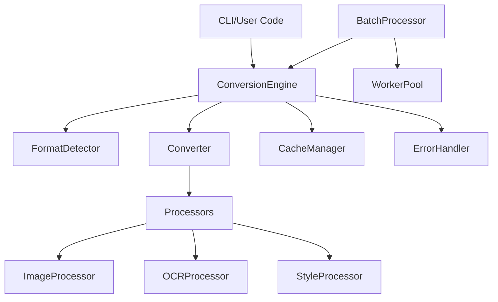

# Developer Guide

This guide is for developers who want to contribute to the Document Converter project or extend its functionality.

## Table of Contents

1. [Contributing](#contributing)
2. [Development Setup](#development-setup)
3. [Architecture Overview](#architecture-overview)
4. [Adding New Format Converters](#adding-new-format-converters)
5. [Testing Guidelines](#testing-guidelines)
6. [Code Style](#code-style)
7. [Performance Considerations](#performance-considerations)

---

## Contributing

We welcome contributions! Here's how to get started:

### Contribution Workflow

1. **Fork the repository** on GitHub
2. **Clone your fork locally**
3. **Create a feature branch**: `git checkout -b feat/my-feature`
4. **Make your changes** with clear, focused commits
5. **Write tests** (aim for >80% coverage)
6. **Run the full test suite**: `pytest`
7. **Update documentation** if needed
8. **Push to your fork**: `git push origin feat/my-feature`
9. **Submit a pull request** with a clear description

### Branch Naming

- Features: `feat/feature-name`
- Bug fixes: `fix/bug-description`
- Documentation: `docs/update-name`
- Performance: `perf/optimization-name`
- Tests: `test/test-description`

### Commit Message Guidelines

We follow the [Conventional Commits](https://www.conventionalcommits.org/) specification:

**Format:**
```
type(scope): brief description

[Optional body with detailed explanation]

[Optional footer: BREAKING CHANGE, Closes #123, etc.]
```

**Types:**
- `feat`: New feature
- `fix`: Bug fix
- `docs`: Documentation changes
- `test`: Adding or updating tests
- `refactor`: Code refactoring
- `perf`: Performance improvements
- `chore`: Maintenance tasks
- `style`: Code style changes (formatting, etc.)

**Examples:**
```bash
# Simple feature
feat(converter): add ODT format support

# Bug fix with issue reference
fix(cache): resolve memory leak in LRU eviction

Closes #42

# Documentation update
docs(api): update batch processor examples

# Breaking change
feat(api): change converter registration method

BREAKING CHANGE: register_converter() now requires converter class instead of instance
```

---

## Development Setup

### Prerequisites

- Python 3.9+
- pip
- virtualenv (recommended)

### Local Setup

#### 1. Clone the Repository
```bash
git clone https://github.com/MikeAMSDev/document-converter
cd document-converter
```

#### 2. Set Up Python Environment
```bash
# Create virtual environment
python -m venv venv

# Activate it
source venv/bin/activate      # Linux/Mac
venv\Scripts\activate         # Windows

# Upgrade pip
pip install --upgrade pip
```

#### 3. Install Dependencies
```bash
# Runtime dependencies
pip install -r requirements.txt

# Development dependencies (testing, linting, etc.)
pip install -r requirements-dev.txt

# Optional: Install in editable mode
pip install -e .
```

#### 4. Verify Installation
```bash
# Run a simple test
pytest tests/unit/test_engine_basic.py -v

# Or verify imports work
python -c "from converter.engine import ConversionEngine; print('✓ Setup successful!')"
```

### Development Tools & IDE Setup

#### Essential Tools
```bash
# Code formatting
pip install black isort

# Linting
pip install pylint flake8

# Type checking
pip install mypy
```

#### Pre-commit Hooks (Recommended)
```bash
# Install pre-commit
pip install pre-commit

# Set up git hooks
pre-commit install

# Run manually
pre-commit run --all-files
```

#### IDE Configuration

**VS Code** - Recommended extensions:
- Python (Microsoft)
- Pylance
- Python Test Explorer
- GitLens

**PyCharm** - Enable:
- Black formatter on save
- PEP 8 code inspections
- Pytest as test runner

---

## Architecture Overview

### High-Level Structure

```
document-converter/
├── converter/          # Core conversion logic
│   ├── engine.py       # Conversion orchestration
│   ├── batch_processor.py  # Batch processing
│   ├── template_engine.py  # Template rendering
│   ├── base/           # Base classes
│   ├── formats/        # Format-specific converters
│   └── processors/     # Content processors (OCR, images, etc.)
├── core/               # Core utilities
│   ├── cache_manager.py    # Two-tier caching
│   ├── error_handler.py    # Error handling
│   ├── transaction.py      # Rollback mechanism
│   └── worker_pool.py      # Parallel processing
├── cli/                # Command-line interface
├── utils/              # Helper utilities
└── tests/              # Test suite
```

### Component Interactions



### Key Components

#### 1. ConversionEngine

**Responsibilities:**
- Format detection
- Converter selection and registration
- Cache integration
- Error handling

**Key methods:**
- `register_converter()`: Register format handlers
- `convert()`: Perform conversion
- Integration with `CacheManager` and `ErrorHandler`

#### 2. BatchProcessor

**Responsibilities:**
- Directory scanning
- Task queue management
- Parallel processing via `WorkerPool`
- Progress reporting

**Architecture:**
```python
BatchProcessor
  └── WorkerPool (4-8 workers)
        └── ConversionEngine (per worker)
             └── Format Converters
```

#### 3. CacheManager

**Two-tier architecture:**

1. **Memory Cache (LRU)**:
   - Fast lookups (~0.3ms)
   - Size-limited (default: 128 entries)
   - Eviction on overflow

2. **Disk Cache**:
   - Persistent across sessions
   - TTL-based expiration
   - File hash + options as key

**Cache Key Generation:**
```python
key = hash(file_content) + hash(conversion_options)
```

#### 4. TemplateEngine

**Custom implementation supporting:**
- Variable interpolation: `{{ variable }}`
- Loops: ``
- Conditionals: ``
- Streaming for memory efficiency

**Parser Architecture:**
1. Tokenization (regex split)
2. AST generation (nested structure)
3. Evaluation (recursive with context)

#### 5. ErrorHandler

**Exception hierarchy:**
```
Exception
  └── DocumentConverterError (base)
       ├── ConversionError
       ├── FormatError
       ├── ConfigurationError
       └── ResourceError
```

**Features:**
- Automatic suggestion generation
- Context tracking
- Structured error reports

#### 6. TransactionManager

**Context manager for safe file operations:**

```python
with TransactionManager() as tm:
    tm.register_file(path)
    # Operations tracked
    # Auto-rollback on exception
```

**Mechanisms:**
- Backup existing files to temp location
- Track new files for deletion
- Cleanup on commit/rollback

---

## Adding New Format Converters

### Step 1: Create Converter Class

Create `converter/formats/your_format_converter.py`:

```python
from converter.base.converter_base import BaseConverter
import logging

logger = logging.getLogger(__name__)

class YourFormatConverter(BaseConverter):
    """Converter for YOUR_FORMAT files."""
    
    def convert(self, input_path: str, output_path: str, **kwargs) -> bool:
        """
        Convert YOUR_FORMAT to another format.
        
        Args:
            input_path: Path to input file
            output_path: Path to output file
            **kwargs: Additional options
                - option1: Description
                - option2: Description
        
        Returns:
            True if successful, False otherwise
        """
        try:
            # 1. Read input
            with open(input_path, 'r') as f:
                content = f.read()
            
            # 2. Process content
            processed = self._process_content(content, **kwargs)
            
            # 3. Write output
            with open(output_path, 'w') as f:
                f.write(processed)
            
            logger.info(f"Converted {input_path} to {output_path}")
            return True
            
        except Exception as e:
            logger.error(f"Conversion failed: {e}")
            return False
    
    def validate_input(self, file_path: str) -> bool:
        """Validate input file format."""
        # Check file extension
        if not file_path.endswith('.your_ext'):
            return False
        
        # Check file content/magic bytes if needed
        try:
            with open(file_path, 'rb') as f:
                header = f.read(4)
                # Validate magic bytes
                return header == b'YOUR'
        except:
            return False
    
    def extract_metadata(self, file_path: str) -> dict:
        """Extract metadata from file."""
        metadata = {
            'format': 'your_format',
            'version': '1.0'
        }
        
        # Extract additional metadata
        try:
            with open(file_path, 'r') as f:
                # Parse metadata
                pass
        except:
            pass
        
        return metadata
    
    def _process_content(self, content: str, **kwargs) -> str:
        """Process content (internal helper)."""
        # Your conversion logic here
        return content
```

### Step 2: Add Format Detection

Update `converter/base/format_detector.py`:

```python
# Add to MAGIC_BYTES dict
MAGIC_BYTES = {
    # ... existing entries
    b'YOUR': 'your_format',
}

# Add to EXTENSION_MAP
EXTENSION_MAP = {
    # ... existing entries
    '.your_ext': 'your_format',
}
```

### Step 3: Create Unit Tests

Create `tests/unit/test_your_format_converter.py`:

```python
import unittest
import os
import tempfile
from converter.formats.your_format_converter import YourFormatConverter

class TestYourFormatConverter(unittest.TestCase):
    def setUp(self):
        self.converter = YourFormatConverter()
        self.test_dir = tempfile.mkdtemp()
    
    def tearDown(self):
        import shutil
        shutil.rmtree(self.test_dir)
    
    def test_basic_conversion(self):
        """Test basic conversion works."""
        input_file = os.path.join(self.test_dir, 'test.your_ext')
        output_file = os.path.join(self.test_dir, 'test.txt')
        
        # Create test input
        with open(input_file, 'w') as f:
            f.write('Test content')
        
        # Convert
        result = self.converter.convert(input_file, output_file)
        
        # Verify
        self.assertTrue(result)
        self.assertTrue(os.path.exists(output_file))
    
    def test_validate_input(self):
        """Test input validation."""
        self.assertTrue(self.converter.validate_input('file.your_ext'))
        self.assertFalse(self.converter.validate_input('file.txt'))
    
    def test_extract_metadata(self):
        """Test metadata extraction."""
        input_file = os.path.join(self.test_dir, 'test.your_ext')
        with open(input_file, 'w') as f:
            f.write('Test')
        
        metadata = self.converter.extract_metadata(input_file)
        self.assertIn('format', metadata)
        self.assertEqual(metadata['format'], 'your_format')

if __name__ == '__main__':
    unittest.main()
```

### Step 4: Add Integration Tests

Create `tests/integration/test_your_format_integration.py`:

```python
import unittest
import os
import tempfile
from converter.engine import ConversionEngine
from converter.formats.your_format_converter import YourFormatConverter

class TestYourFormatIntegration(unittest.TestCase):
    def setUp(self):
        self.engine = ConversionEngine()
        self.engine.register_converter('your_format', YourFormatConverter)
        self.test_dir = tempfile.mkdtemp()
    
    def test_end_to_end_conversion(self):
        """Test full conversion through engine."""
        input_file = os.path.join(self.test_dir, 'document.your_ext')
        output_file = os.path.join(self.test_dir, 'document.txt')
        
        # Create realistic test file
        with open(input_file, 'w') as f:
            f.write('Sample document content')
        
        # Convert via engine
        success = self.engine.convert(input_file, output_file)
        
        self.assertTrue(success)
        self.assertTrue(os.path.exists(output_file))
```

### Step 5: Document the Converter

Update `docs/api_reference.md`:

```markdown
#### Your Format Converter
- **Module:** `converter.formats.your_format_converter`
- **Class:** `YourFormatConverter`
- **Supports:** YOUR_FORMAT → TXT, YOUR_FORMAT → PDF

**Usage:**
\`\`\`python
from converter.formats.your_format_converter import YourFormatConverter

engine.register_converter('your_format', YourFormatConverter)
engine.convert('document.your_ext', 'output.txt')
\`\`\`
```

### Step 6: Update README

Add to main README.md:

```markdown
- YOUR_FORMAT (.your_ext)
```

---

## Testing Guidelines

### Test Structure

```
tests/
├── unit/              # Unit tests (isolated)
├── integration/       # Integration tests (components together)
├── performance/       # Performance tests
└── stress/           # Stress tests (large files, many files)
```

### Writing Tests

#### Unit Tests

Test individual methods in isolation:

```python
def test_cache_get_miss(self):
    """Test cache returns None for cache miss."""
    cache = CacheManager()
    result = cache.get('nonexistent.txt')
    self.assertIsNone(result)
```

#### Integration Tests

Test component interactions:

```python
def test_engine_with_cache(self):
    """Test engine uses cache correctly."""
    cache = CacheManager()
    engine = ConversionEngine(cache_manager=cache)
    
    # First conversion
    engine.convert('input.txt', 'output1.html')
    
    # Second conversion (should hit cache)
    engine.convert('input.txt', 'output2.html')
```

#### Performance Tests

Measure performance metrics:

```python
def test_batch_throughput(self):
    """Test batch processing throughput."""
    processor = BatchProcessor(max_workers=4)
    
    start = time.time()
    processor.process_queue()
    duration = time.time() - start
    
    throughput = 100 / duration
    self.assertGreater(throughput, 10)  # At least 10 files/sec
```

### Running Tests

```bash
# Run all tests
pytest

# Run specific test file
pytest tests/unit/test_cache_manager.py

# Run tests by marker
pytest -m unit          # Only unit tests
pytest -m integration   # Only integration tests

# Run with coverage report
pytest --cov=converter --cov=core --cov-report=html

# Parallel execution (faster)
pytest -n auto          # Auto-detect CPU cores
pytest -n 4             # Use 4 workers

# Verbose output with print statements
pytest -v -s

# Stop on first failure (useful for debugging)
pytest -x

# Run only failed tests from last run
pytest --lf
```

### Test Coverage Requirements

| Category | Target Coverage |
|----------|----------------|
| Overall Project | 80%+ |
| Core Modules | 90%+ |
| New Features | 100% |
| Bug Fixes | Include regression test |

**Check coverage:**
```bash
# Generate HTML report
pytest --cov=converter --cov=core --cov-report=html

# Open coverage report
open htmlcov/index.html  # Mac
start htmlcov/index.html # Windows
```

---

## Code Style

### Python Standards

- **PEP 8** compliance
- **Type hints** for all public methods
- **Docstrings** (Google style) for all public classes/methods

### Code Formatting & Linting

#### Auto-format Your Code
```bash
# Format with Black (line length: 100)
black .

# Sort imports
isort .

# Or both at once
black . && isort .
```

#### Check Code Quality
```bash
# Style checking
flake8 converter/ core/

# Type checking
mypy converter/ core/

# Lint checking
pylint converter/ core/
```

#### Before Committing
```bash
# Run all checks
black --check . && isort --check . && flake8 && mypy converter/ core/ && pytest
```

### Example Code Style

```python
from typing import Optional, Dict, Any

class ExampleClass:
    """
    Brief class description.
    
    Detailed explanation of the class purpose and usage.
    """
    
    def __init__(self, param: str):
        """
        Initialize ExampleClass.
        
        Args:
            param: Description of parameter
        """
        self.param = param
    
    def method(self, arg1: str, arg2: int = 0) -> Optional[Dict[str, Any]]:
        """
        Brief method description.
        
        Args:
            arg1: Description of arg1
            arg2: Description of arg2 (default: 0)
        
        Returns:
            Optional dictionary with keys:
                - key1: Description
                - key2: Description
            Returns None if operation fails.
        
        Raises:
            ValueError: When arg1 is empty
        
        Example:
            >>> obj = ExampleClass("test")
            >>> result = obj.method("value", 5)
            >>> print(result)
            {'key1': 'value', 'key2': 5}
        """
        if not arg1:
            raise ValueError("arg1 cannot be empty")
        
        return {'key1': arg1, 'key2': arg2}
```

---

## Performance Considerations

### Optimization Strategies

#### 1. Use Caching

Always enable caching for production:

```python
cache = CacheManager(
    cache_dir=".cache",
    memory_cache_size=256  # Increase for high-volume
)
engine = ConversionEngine(cache_manager=cache)
```

#### 2. Parallel Processing

Use appropriate worker count:

```python
import os

# CPU-bound: use CPU count
workers = os.cpu_count()

# I/O-bound: use 2x CPU count
workers = os.cpu_count() * 2

processor = BatchProcessor(max_workers=workers)
```

#### 3. Memory Management

Use streaming for large data:

```python
# Instead of loading all at once
# BAD:
result = engine.render(template, huge_data)

# GOOD:
with open('output.txt', 'w') as f:
    for chunk in engine.render_stream(template, huge_data):
        f.write(chunk)
```

#### 4. Profiling

Profile performance bottlenecks:

```python
import cProfile
import pstats

profiler = cProfile.Profile()
profiler.enable()

# Your code here
processor.process_queue()

profiler.disable()
stats = pstats.Stats(profiler)
stats.sort_stats('cumulative')
stats.print_stats(20)
```

### Benchmarking

Run stress tests to measure performance:

```bash
python -m pytest tests/stress/test_large_files.py -v -s
```

Expected benchmarks:
- Template rendering (100K items): < 5s
- Batch processing (100 files): > 50 files/sec
- Cache lookup: < 1ms (memory), < 100ms (disk)

---

## Project Roadmap

See the main [README.md](../README.md) for current roadmap and planned features.

## Questions?

- Open an issue on GitHub
- Join our Discord community
- Email: developers@example.com

## License

This project is licensed under the MIT License. See [LICENSE](../LICENSE) for details.

---

**Happy coding!** 🚀
