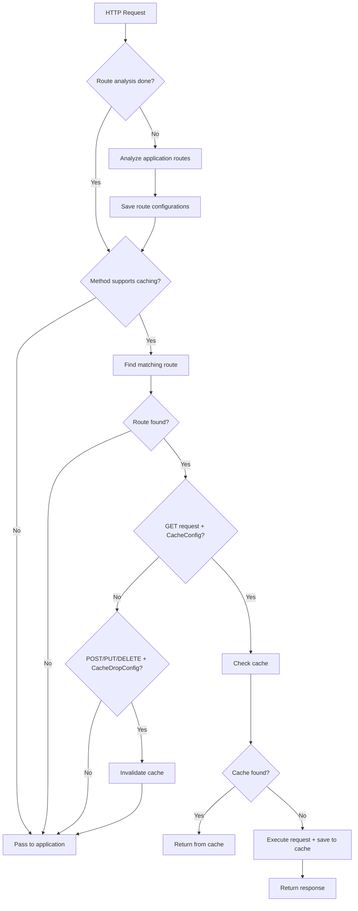

# FastCacheMiddleware

🚀 **High-performance ASGI middleware for caching with route resolution approach**

[](https://pypi.org/project/fast-cache-middleware/)
[](https://github.com/chud0/FastCacheMiddleware/actions/workflows/ci.yml)
## ✨ Key Features

FastCacheMiddleware uses a **route resolution approach** - it analyzes application routes at startup and extracts cache configurations from FastAPI dependencies.

### 🔧 How it works

1. **At application startup:**
   - Middleware analyzes all routes and their dependencies
   - Extracts `CacheConfig` and `CacheDropConfig` from dependencies
   - Creates internal route index with caching configurations

2. **During request processing:**
   - Checks HTTP method (cache only GET, invalidate for POST/PUT/DELETE)
   - Finds matching route by path and method
   - Extracts cache configuration from pre-analyzed dependencies
   - Performs caching or invalidation according to configuration

### 💡 Benefits

- **⚡ High performance** - pre-route analysis
- **🎯 Easy integration** - standard FastAPI dependencies
- **🔧 Flexible configuration** - custom key functions, route-level TTL
- **🛡️ Automatic invalidation** - cache invalidation for modifying requests
- **📊 Minimal overhead** - efficient handling of large numbers of routes

## 📦 Installation

```bash
pip install fast-cache-middleware
```

## 🎯 Quick Start

```python
import uvicorn
from fastapi import FastAPI

from fast_cache_middleware import CacheConfig, CacheDropConfig, FastCacheMiddleware

app = FastAPI()

# Add middleware - it will automatically analyze routes
app.add_middleware(FastCacheMiddleware)


# Routes with caching
@app.get("/users/{user_id}", dependencies=[CacheConfig(max_age=300)])
async def get_user(user_id: int) -> dict[str, int | str]:
    """This endpoint is cached for 5 minutes."""
    # Simulate database load
    return {"user_id": user_id, "name": f"User {user_id}"}


# Routes with cache invalidation
@app.post(
    "/users/{user_id}",
    dependencies=[CacheDropConfig(paths=["/users/*", "/api/users/*"])],
)
async def update_user(user_id: int) -> dict[str, int | str]:
    """It will invalidate cache for all /users/* paths."""
    return {"user_id": user_id, "status": "updated"}


if __name__ == "__main__":
    uvicorn.run(app, host="127.0.0.1", port=8000)
```

## 🔧 Configuration

### CacheConfig

Configure caching for GET requests:

```python
from fast_cache_middleware import CacheConfig

# Simple caching
CacheConfig(max_age=300)  # 5 minutes

# With custom key function, for personalized cache
def key_func(request: Request):
    user_id = request.headers.get("Authorization", "anonymous")
    path = request.url.path
    query = str(request.query_params)
    return f"{path}:{user_id}:{query}"

CacheConfig(max_age=600, key_func=key_func)  # 10 minutes
```

### CacheDropConfig

Configure cache invalidation for modifying requests:

```python
# Paths can be matched by startswith
CacheDropConfig(
    paths=[
        "/users/",  # Will match /users/123, /users/profile, etc.
        "/api/",    # Will match all API paths
    ]
)

# Paths can be matched by regexp
CacheDropConfig(
    paths=[
        r"^/users/\d+$",  # Will match /users/123, /users/456, etc.
        r"^/api/.*",      # Will match all API paths
    ]
)

# You can mix regexp and simple string matching - use what's more convenient
CacheDropConfig(
    paths=[
        "/users/",        # Simple prefix match
        r"^/api/\w+/\d+$" # Regexp for specific API endpoints
    ]
)
```

## 🏗️ Architecture

### System Components

```
FastCacheMiddleware
├── RouteInfo           # Route information with cache configuration
├── Controller          # Caching logic and validation
├── Storage             # Storages (InMemory, Redis, etc.)
├── Serializers         # Cached data serialization
└── Dependencies        # FastAPI dependencies for configuration
```

### Request Processing Flow



## 🎛️ Storages

### InMemoryStorage (default)

```python
from fast_cache_middleware import FastCacheMiddleware, InMemoryStorage

storage = InMemoryStorage(max_size=1000)
app.add_middleware(FastCacheMiddleware, storage=storage)
```

InMemoryStorage uses batch cleanup for better performance

### Custom Storage

```python
from fast_cache_middleware import BaseStorage

class RedisStorage(BaseStorage):
    def __init__(self, redis_url: str):
        import redis
        self.redis = redis.from_url(redis_url)
    
    async def store(self, key: str, response, request, metadata):
        # Implementation for saving to Redis
        pass
    
    async def retrieve(self, key: str):
        # Implementation for retrieving from Redis
        pass

app.add_middleware(FastCacheMiddleware, storage=RedisStorage("redis://localhost"))
```

## 🧪 Testing

```python
import pytest
from httpx import AsyncClient
from examples.basic import app

@pytest.mark.asyncio
async def test_caching():
    async with AsyncClient(app=app, base_url="http://test") as client:
        # First request - cache miss
        response1 = await client.get("/users/1")
        assert response1.status_code == 200
        
        # Second request - cache hit (should be faster)
        response2 = await client.get("/users/1")
        assert response2.status_code == 200
        assert response1.json() == response2.json()

@pytest.mark.asyncio  
async def test_cache_invalidation():
    async with AsyncClient(app=app, base_url="http://test") as client:
        # Cache data
        await client.get("/users/1")
        
        # Invalidate cache
        await client.post("/users/1", json={})
        
        # Next GET should execute new request
        response = await client.get("/users/1")
        assert response.status_code == 200
```

## 📊 Performance

### Benchmarks

- **Route analysis**: ~5ms for 100 routes at startup
- **Route lookup**: ~0.1ms per request (O(n) by number of cached routes)
- **Cache hit**: ~1ms per request
- **Cache miss**: original request time + ~2ms for saving

### Optimization

```python
# For applications with many routes
app.add_middleware(
    FastCacheMiddleware,
    storage=InMemoryStorage(max_size=10000),  # Increase cache size
    controller=Controller(default_ttl=3600)   # Increase default TTL
)
```

## 🔒 Security

### Cache Isolation

```python
def user_specific_cache() -> CacheConfig:
    def secure_key_func(request):
        # Include user token in key
        token = request.headers.get("authorization", "").split(" ")[-1]
        return f"{request.url.path}:token:{token}"
    
    return CacheConfig(max_age=300, key_func=secure_key_func)

@app.get("/private/data", dependencies=[Depends(user_specific_cache)])
async def get_private_data():
    return {"sensitive": "data"}
```

### Header Validation

Middleware automatically respects standard HTTP caching headers:

- `Cache-Control: no-cache` - skip cache
- `Cache-Control: no-store` - forbid caching
- `Cache-Control: private`  - don't cache private responses


## 🛠️ Advanced Usage

### Custom Controller

```python
from fast_cache_middleware import Controller

class CustomController(Controller):
    async def is_cachable_request(self, request):
        # Custom logic - don't cache admin requests
        if request.headers.get("x-admin-request"):
            return False
        return await super().should_cache_request(request)
    
    async def generate_cache_key(self, request):
        # Add API version to key
        version = request.headers.get("api-version", "v1")
        base_key = await super().generate_cache_key(request)
        return f"{version}:{base_key}"

app.add_middleware(
    FastCacheMiddleware,
    controller=CustomController()
)
```

## 📝 Examples

More examples in the `examples/` folder:

- **quick_start.py** - minimal example showing basic caching and invalidation
- **basic.py** - basic usage with FastAPI

## 🤝 Contributing

```bash
git clone https://github.com/chud0/FastCacheMiddleware
cd FastCacheMiddleware
poetry install --with dev
./scripts/test.sh
```

## 📄 License

MIT License - see [LICENSE](LICENSE)

---

⭐ **Like the project? Give it a star!**

🐛 **Found a bug?** [Create an issue](https://github.com/chud0/FastCacheMiddleware/issues)

💡 **Have an idea?** [Suggest a feature](https://github.com/chud0/FastCacheMiddleware/discussions/categories/ideas)