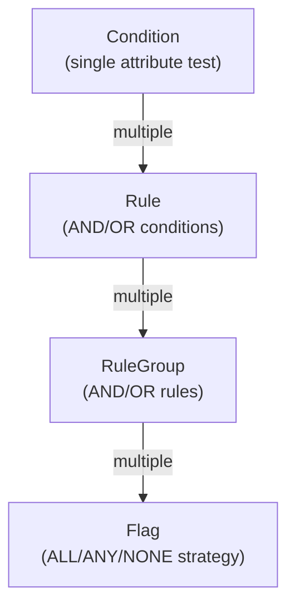
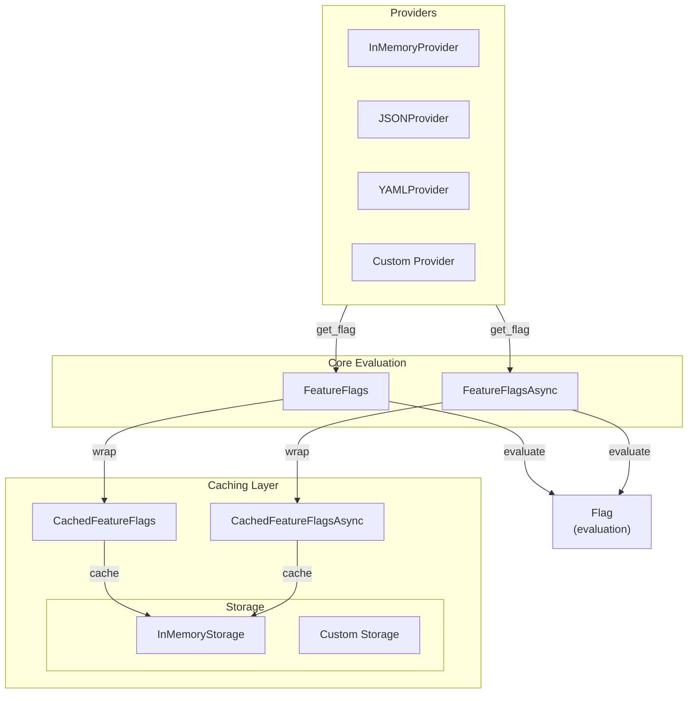

# fflgs

**Feature flag evaluation** with hierarchical rule-based architecture. Sync/async, type-safe, extensible.

## Motivation

Existing Python feature flag libraries fall into two categories: they're either SDKs for paid third-party services, or they lack proper rule-based evaluation capabilities. `fflgs` was created as a simple, easy to use, rule-based feature flag library suitable for hobby projects.

## Quick Start

```python
from fflgs.core import Condition, Rule, RuleGroup, Flag, FeatureFlags
from fflgs.providers.memory import InMemoryProvider

# Build your flag
flag = Flag(
    name="webhooks",
    description="Allow webhooks for enterprise users",
    rules_strategy="ALL",
    rule_groups=[
        RuleGroup(
            operator="AND",
            rules=[
                Rule(
                    operator="AND",
                    conditions=[
                        Condition("user.plan", "IN", ["pro", "enterprise"], active=True)
                    ],
                    active=True
                )
            ],
            active=True
        )
    ],
    enabled=True,
    version=1
)

# Evaluate
provider = InMemoryProvider()
provider.add_flag(flag)
ff = FeatureFlags(provider)

context = {"user": {"plan": "pro"}}
ff.is_enabled("webhooks", ctx=context)  # True
```

## Architecture

### Evaluation hierarchy



### `fflgs` architecture



## Operators

| Operator | Logic |
|----------|-------|
| `EQUALS` / `NOT_EQUALS` | Equality |
| `GREATER_THAN` / `LESS_THAN` / `GREATER_THAN_OR_EQUALS` / `LESS_THAN_OR_EQUALS` | Comparison |
| `IN` / `NOT_IN` | Containment |
| `CONTAINS` / `NOT_CONTAINS` | Container containment |
| `REGEX` | Pattern matching |

## Strategies

- **ALL**: Every rule group must pass (AND)
- **ANY**: At least one rule group passes (OR)
- **NONE**: All rule groups fail (NOR)

## Context Access

Dot notation supports nested dicts and object attributes:

```python
context = {
    "user": {"profile": {"role": "admin"}},
    "request": {"ip": "192.168.1.1"}
}

Condition("user.profile.role", "EQUALS", "admin", active=True)
Condition("request.ip", "REGEX", r"192\.168\..*", active=True)
```

## Providers

### Built-in Providers

#### JSON Provider

Load feature flags from a JSON file:

```python
from fflgs.providers.json import JSONProvider

provider = JSONProvider(
    "flags.json",
    cache_enabled=True,  # Cache file contents (default)
    cache_ttl_seconds=None,  # Cache indefinitely
)

ff = FeatureFlags(provider)
```

Disable file caching or set TTL:

```python
# Reload from file every call
provider = JSONProvider("flags.json", cache_enabled=False)

# Reload after 60 seconds
provider = JSONProvider("flags.json", cache_ttl_seconds=60)
```

#### YAML Provider

Load feature flags from a YAML file:

```python
from fflgs.providers.yaml import YAMLProvider

provider = YAMLProvider(
    "flags.yaml",
    cache_enabled=True,
    cache_ttl_seconds=None,
)

ff = FeatureFlags(provider)
```

Configuration options match JSON provider.

#### Async Providers

All built-in providers have async versions:

```python
from fflgs.providers.json import JSONProviderAsync
from fflgs.providers.yaml import YAMLProviderAsync

async def check():
    provider = JSONProviderAsync("flags.json")
    ff = FeatureFlagsAsync(provider)
    return await ff.is_enabled("flag_name", ctx=context)
```

## Caching

Optional in-memory caching layer to improve performance. Two caching levels are available:

1. **Provider-level caching** (built-in to JSON/YAML providers) - Caches file contents
2. **Result caching** (CachedFeatureFlags wrapper) - Caches evaluation results per flag and context

### Result Caching

Wrap your `FeatureFlags` instance to cache evaluation results:

```python
from fflgs.cache.memory import InMemoryStorage
from fflgs.cache.wrapper import CachedFeatureFlags

provider = InMemoryProvider()
ff = FeatureFlags(provider)
storage = InMemoryStorage()

cached_ff = CachedFeatureFlags(
    ff,
    storage=storage,
    default_ttl=300,  # 5 minutes (required)
    ttl_per_flag={"critical_flag": 60}  # Override default TTL per flag
)

result = cached_ff.is_enabled("webhooks", ctx=context)  # Cached result
```

Clear the cache:

```python
# Clear entire cache
cached_ff.clear_cache()

# Clear specific cache entry
from fflgs.cache._utils import generate_cache_key
key = generate_cache_key("my_flag", version=1, ctx={"user_id": 123})
cached_ff.clear_cache(cache_key=key)
```

Async version:

```python
from fflgs.cache.wrapper import CachedFeatureFlagsAsync

cached_ff = CachedFeatureFlagsAsync(ff_async, storage=storage, default_ttl=300)
result = await cached_ff.is_enabled("webhooks", ctx=context)

# Clearing works the same way
await cached_ff.clear_cache()
```

## Async

```python
from fflgs.core import FeatureFlagsAsync
from fflgs.providers.memory import InMemoryProviderAsync

async def check():
    provider = InMemoryProviderAsync()
    provider.add_flag(flag)
    ff = FeatureFlagsAsync(provider)
    return await ff.is_enabled("webhooks", ctx=context)
```

## Error Handling

```python
ff = FeatureFlags(
    provider,
    on_flag_not_found="raise",         # or "return_false"
    on_evaluation_error="return_false",
    on_provider_error="return_false"   # Handle provider exceptions
)

# Override per-call
ff.is_enabled("flag", ctx=context, on_flag_not_found="raise")
```

Error handling options:
- `on_flag_not_found`: Missing flag in provider
- `on_evaluation_error`: Malformed rules or context issues
- `on_provider_error`: Provider exceptions (DB down, network error, etc.)

Each option accepts:
- `"raise"`: Raise the corresponding exception
- `"return_false"`: Return `False` and log warning (default, safe for production)

## Custom Provider

Implement the `FeatureFlagsProvider` protocol:

```python
from fflgs.core import Flag, FeatureFlagsProviderError

class MyProvider:
    def get_flag(self, flag_name: str) -> Flag | None:
        """Fetch flag from database, API, or custom source.

        Returns:
            Flag object if found, None if not found

        Raises:
            FeatureFlagsProviderError: If an error occurs while fetching
        """
        try:
            # Fetch from DB, API, etc.
            flag = fetch_flag_from_database(flag_name)
            return flag
        except Exception as exc:
            raise FeatureFlagsProviderError(f"Failed to fetch flag: {exc}") from exc

ff = FeatureFlags(MyProvider())
```

For async, implement `FeatureFlagsProviderAsync`:

```python
class MyAsyncProvider:
    async def get_flag(self, flag_name: str) -> Flag | None:
        """Async version of get_flag."""
        try:
            return await db.query_flag(flag_name)
        except Exception as exc:
            raise FeatureFlagsProviderError(f"Failed to fetch flag: {exc}") from exc

ff = FeatureFlagsAsync(MyAsyncProvider())
```

**Important**: Always raise `FeatureFlagsProviderError` for any errors encountered while fetching flags. This allows proper error handling through the `on_provider_error` configuration.


## Development

For detailed development setup, running tests, code quality checks, and contribution guidelines, see [CONTRIBUTING.md](CONTRIBUTING.md).

## Examples

```python
Rule(
    operator="AND",
    conditions=[
        Condition("user.age", "GREATER_THAN", 21, True),
        Condition("user.region", "IN", ["US", "CA"], True),
    ],
    active=True
)
```

```python
Condition("user.id", "REGEX", r"^[0-4]", True)
```

```python
RuleGroup(
    operator="OR",
    rules=[
        Rule(operator="AND", conditions=[Condition("user.beta", "EQUALS", True, True)], active=True),
        Rule(operator="AND", conditions=[Condition("user.role", "EQUALS", "admin", True)], active=True),
    ],
    active=True
)
```

## License

MIT - See LICENSE.txt

## Credits

This package was created with [The Hatchlor] project template.

[The Hatchlor]: https://github.com/bartosz121/the-hatchlor
[hatch]: https://hatch.pypa.io/
