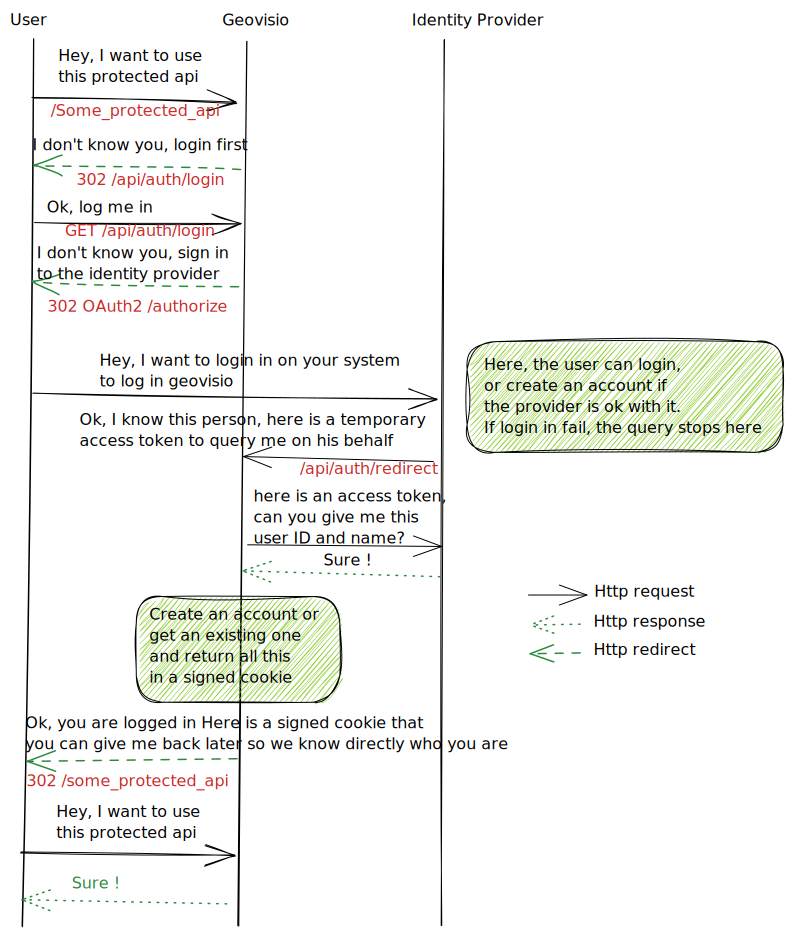

# External Identity Providers via OAuth2

Panoramax API does not handle accounts credentials in itself, but can be configured to use an external identity provider that support either [OAuth2](https://oauth.net/2/) or [OpenIdConnect](https://openid.net/connect/) (oidc).

## General architecture

The API handles the account on its own (in the `accounts` table in the database), but not the authentication to those accounts.

Users are logged in using a `/api/auth/login` route that starts the OAuth dance with the remote server. The user is redirected to the identity provider.

After login, if everything is OK, the external server calls back `/api/auth/redirect` with an access token. This token is used to:

- For an OAuth2 server (like OpenStreetMap), ask the server for the user id/name
- For an OIDC server, nothing as the token already has some user_info in them

Those information are used to lazily create an Account in our database, but without any sensitive information (we only need the user public ID and its name). Those information are then stored in a signed session cookie. The cookie is generated using Flask session, so providing a really random [SECRET_KEY](https://flask.palletsprojects.com/en/2.2.x/config/#SECRET_KEY) is **important**.

The cookie is then used for future calls to the API. We don't need to ask again the OAuth server after this, since:

- the cookie is signed, so we know the user id has not been forged
- it's not permission, we don't need to check a token for expiration.

The whole process describe here is summarized in the following diagram:

## Keycloak with OpenIdConnect

Panoramax should support any identity providers that support OIDC, but it has only been heavily tested with [Keycloak](https://keycloak.org/).

### Keycloak realm settings

An example of working Keycloak configuration can be seen in the [Keycloak configuration used in integration tests](https://gitlab.com/panoramax/server/api/-/blob/main/docker/keycloak-realm.json).

The configured realm should have an OIDC client with:

- `Valid redirect URIs` defined on `/api/auth/redirect` of the Panoramax server
- `Valid post logout redirect URIs` defined on `/api/auth/logout` of the Panoramax server
- `Client authentication` activated
- At least support the `Standard authentication flow` (corresponding to oidc `Authorization Code Flow`)

The client should have some credentials (`Client Id and Secret`). Also, the client id and secret should be noted, they will be required in Panoramax's settings.

### Panoramax settings

The following environment variables and values are needed in Panoramax API to set-up a Keycloak authentication:

- `OAUTH_PROVIDER`: set to `oidc`
- `OAUTH_OIDC_URL`: URL for the OIDC server. For a Keycloak it should be the realm URL (eg `http://localhost:3030/realms/geovisio` for a realm named `geovisio` in a locally deployed Keycloak)
- `OAUTH_CLIENT_ID`: name of the Keycloak client
- `OAUTH_CLIENT_SECRET`: secret of the Keycloak client
- `FLASK_SECRET_KEY`: the [Flask variable](https://flask.palletsprojects.com/en/2.2.x/config/#SECRET_KEY) used to securely sign the cookie, set it to a long random string as stated in flask's documentation.

## OpenStreetMap OAuth2

[OpenStreetMap](https://openstreetmap.org/)'s [OAuth2 implementation](https://wiki.openstreetmap.org/wiki/OAuth) can be used directly if an instance is willing to let their users open a Panoramax account using their OSM account.

### OpenStreetMap settings

The Panoramax application should be defined in the Panoramax instance maintainer's [OAuth2 applications in OSM settings](https://www.openstreetmap.org/oauth2/applications).

The application should ask for `read_prefs` scope (to be able to get the user id and name) and redirect to the Panoramax instance `/api/auth/redirect` route.

The application id and secret should be noted, they will be required in Panoramax settings.

### Panoramax settings

The following environment variables and values are needed in Panoramax API to set-up and OSM authentication:

- `OAUTH_PROVIDER`: set to 'osm'
- `OAUTH_CLIENT_ID`: id of the OSM application
- `OAUTH_CLIENT_SECRET`: secret of the OSM application
- `FLASK_SECRET_KEY`: the [Flask variable](https://flask.palletsprojects.com/en/2.2.x/config/#SECRET_KEY) used to securely sign the cookie, set it to a long random string as stated in flask's documentation.
