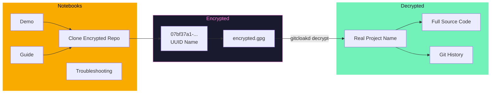
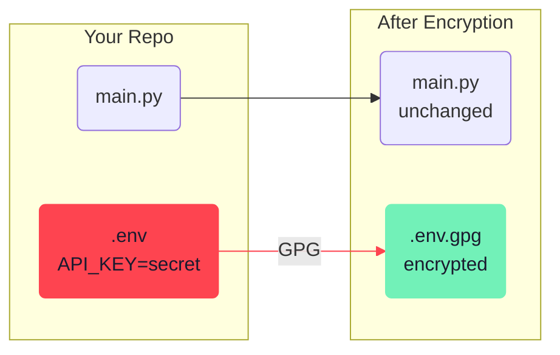
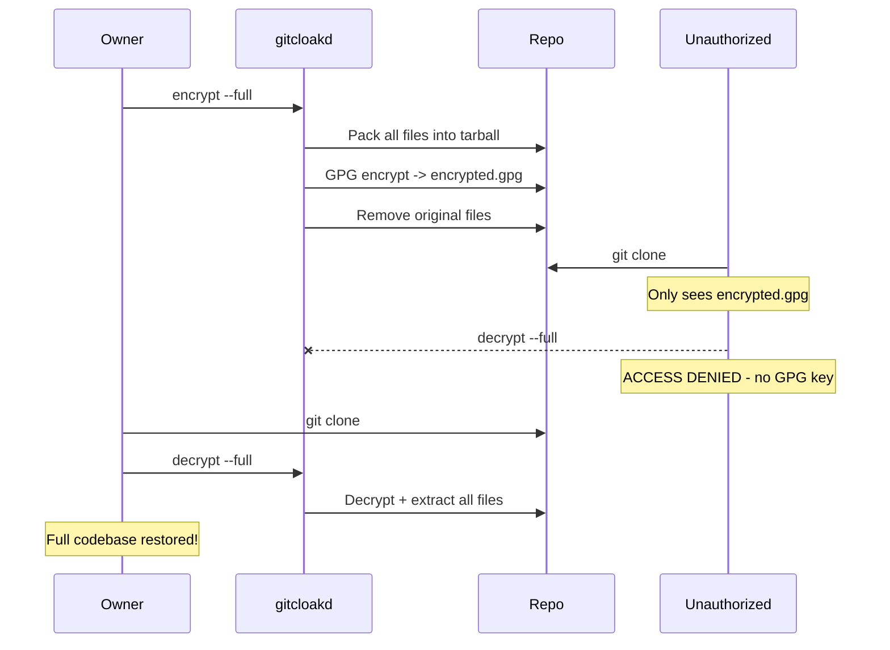
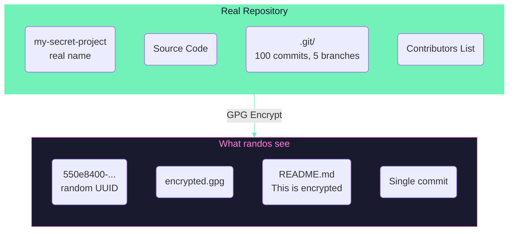
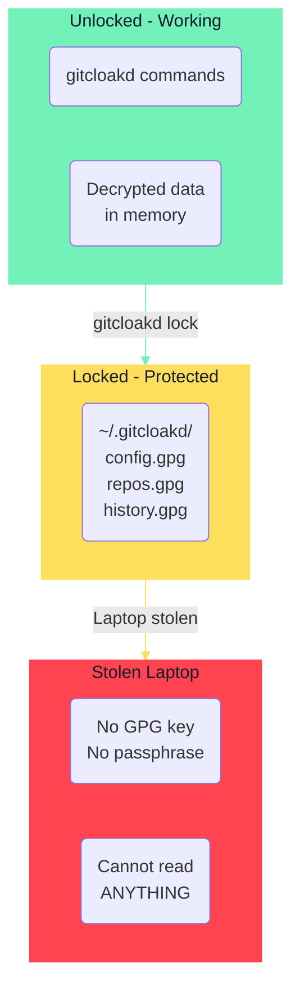
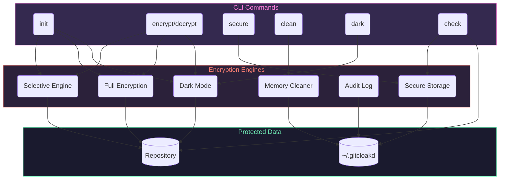
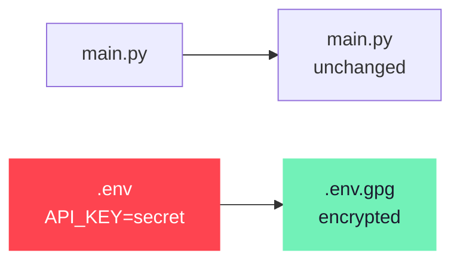
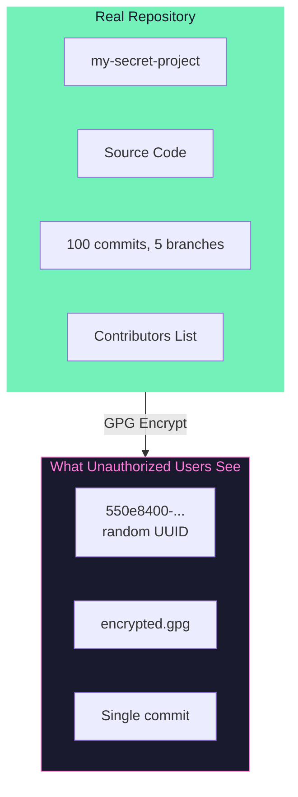

<p align="center">
  
</p>

<p align="center">
  
</p>

```
        ┌──────────────────────── [ R E L E A S E   I N F O ] ──────────────────────────┐
        │                                                                               │
        │  NAME................................................gitcloakd                │
        │  TYPE.......................................GPG Encryption for Git Repos      │
        │  VERSION........................................................v1.0.10       │
        │  PLATFORM............................................Python 3.9+ / Cross-OS   │
        │  CATEGORY..............................................Security / Encryption  │
        │  ENCRYPTION MODES........................................................3x   │
        │                                                                               │
        │  Hide ya repos. Hide ya code. They out here hacking everybody.               │
        │                                                                               │
        │  [*] SELECTIVE - Encrypt specific files (.env, keys, secrets)                 │
        │  [*] FULL - Encrypt entire codebase into single blob                          │
        │  [*] DARK - Encrypt EVERYTHING including git history + UUID repo name         │
        │                                                                               │
        └───────────────────────────────────────────────────────────────────────────────┘
```


---

## [::: TRY IT NOW :::]


| Resource | Description |
|----------|-------------|
| [](https://drive.google.com/file/d/1MFmQCljP1cs57bwpMDW14MxEfOUzGTgC/view?usp=drive_link) | Clone and decrypt an encrypted repo |
| [](https://drive.google.com/file/d/1f2hGf3aZbrgN7_nqeAbtMthtjs_rlAWi/view?usp=sharing) | All modes, commands, Python API |
| [](https://drive.google.com/file/d/1MmbopbuhXvHo6gW0D0c_uyZCwrFywCzr/view?usp=drive_link) | User management, GPG keys, common issues |
| [](https://github.com/haKC-ai/07bf37a1-ce68-4bd1-8e71-7767f7b0d07a) | See what unauthorized users see |



```
════════════════════════════════════════════════════════════════════════════════
  [*] Notebooks are view-only - click "File > Save a copy in Drive" to run
  [*] The encrypted demo repo shows EXACTLY what unauthorized users see
  [*] With the GPG key, you decrypt and see the real gitcloakd source
════════════════════════════════════════════════════════════════════════════════
```

---

## [::: WHAT IT DOES :::]


gitcloakd encrypts Git repositories using GPG. Three modes for different threat models:

| Mode | What's Encrypted | Git History | Repo Name | Use Case |
|------|------------------|-------------|-----------|----------|
|  | Specific files only | Visible | Visible | Open source with private secrets |
|  | Entire codebase | Visible | Visible | Private codebase, team access only |
|  | **EVERYTHING** | **Hidden** | **UUID** | Maximum privacy, zero metadata |

### Authorized vs Unauthorized View

```
# What authorized users see:
my-secret-project/
  src/api/payments.py
  src/core/algorithm.py
  .env
  README.md

# What everyone else sees (Dark Mode):
07bf37a1-ce68-4bd1-8e71-7767f7b0d07a/
  encrypted.gpg
  README.md ("This repository is encrypted")
```

```
════════════════════════════════════════════════════════════════════════════════
  DARK MODE HIDES:

  [*] Real project name (replaced with random UUID)
  [*] All source code and file structure
  [*] Git history, commits, branch names
  [*] Contributors and timestamps
  [*] GitHub insights show NOTHING useful
════════════════════════════════════════════════════════════════════════════════
```

---

## [::: WHY ENCRYPT YOUR REPOS :::]


| Threat | What Happens | gitcloakd Fix |
|--------|--------------|---------------|
| GitHub gets breached | Your code is leaked | They get encrypted blobs |
| Employee goes rogue | Copies private repos | Can't decrypt without your key |
| Laptop stolen | Attacker clones your repos | Local storage is GPG encrypted |
| Subpoena/legal request | GitHub hands over data | They hand over encrypted data |
| Nosy coworker/investor | Snoops your private repos | Sees nothing useful |
| You leave a company | They still have repo access | Revoke their key, re-encrypt |

**You control the keys. Not GitHub. Not your employer. You.**

---

## [::: INSTALLATION :::]


```bash
pip install gitcloakd
```

<p align="center">
  
</p>

---

## Encrypt an Existing Repo

Already got a repo with secrets you need to hide? Here's what you do:

```bash
cd your-existing-repo

# backup first (seriously, do this)
gitcloakd test backup

# preview what will happen (no changes)
gitcloakd test dry-run --mode selective

# if that looks good, init and encrypt
gitcloakd init --wizard
gitcloakd encrypt --all

# commit the encrypted versions
git add -A && git commit -m "encrypt secrets"

# optional: nuke the plaintext secrets from git history
gitcloakd purge-history --confirm
git push --force
```

For dark mode on an existing repo (hides everything):
```bash
gitcloakd test backup
gitcloakd init --dark
# this creates a new UUID-named repo with your encrypted code
```

---

## Mode 1: Selective Encryption (Default)

Open source projects with some secrets, normal collaboration.

Encrypts only sensitive files (`.env`, `.key`, `.pem`, etc.) while keeping source code readable.

```bash
gitcloakd init --wizard
gitcloakd encrypt --all
```



---

## Mode 2: Full Encryption

Private codebases where you want to hide all code but keep git history.

Packs the **entire codebase** into a single GPG blob. Randos see `encrypted.gpg` and nothing else.

```bash
gitcloakd init --full
gitcloakd encrypt --full
```

### What randos see

```
myrepo/
  .gitcloakd/          # config
  encrypted.gpg         # your entire codebase
  README.md             # "this repo is encrypted"
```

### What you get

> [Watch the decrypt demo](https://raw.githubusercontent.com/haKC-ai/gitcloakd/main/img/gitcloaded_logo.mp4)

After `gitcloakd decrypt --full`:
```
myrepo/
  src/
  tests/
  .env
  README.md
  ... (everything decrypted)
```



---

## Mode 3: Dark Mode (Max Paranoia)

When you need to hide **everything** - git history, commit messages, branch names, file structure, even the real project name. Repo gets a random UUID. Nobody learns anything.

```bash
gitcloakd init --dark
# prompts for real project name (encrypted, never exposed)
# generates random UUID for public repo name

gitcloakd encrypt --dark
```

### What's Hidden in Dark Mode

| Item | Selective | Full | Dark |
|------|-----------|------|------|
| Real project name | Visible | Visible | **Hidden (UUID only)** |
| Source code | Visible | Hidden | Hidden |
| File structure | Visible | Hidden | Hidden |
| Git commits | Visible | Visible | **Hidden** |
| Commit messages | Visible | Visible | **Hidden** |
| Branch names | Visible | Visible | **Hidden** |
| Contributors | Visible | Visible | **Hidden** |
| Repository stats | Visible | Visible | **Hidden** |

### What randos see

```
550e8400-e29b-41d4-a716-446655440000/   # random UUID, not real name
  .git/                 # single commit
  .gitcloakd/
  encrypted.gpg         # everything inside (including real name)
  README.md             # "this is encrypted"
```

Git log shows: `"gitcloakd: encrypted repository state"`

No history. No code. No clues. Not even the project name.



### Dark Mode Collaboration Limitations

Dark Mode encrypts everything into a single `encrypted.gpg` blob. This means:

- **No merge capability** - Two users can't merge changes; whoever pushes last wins
- **Coordination required** - Users need to communicate who's working
- **Pull → Decrypt → Work → Encrypt → Push** - Always get latest first, push quickly

**Best for:**
- Solo projects you want hidden
- Archiving finished projects
- Repos where one person pushes and others just pull/read

**For active team collaboration:** Use **Selective Mode** instead - it allows normal git workflows while protecting secrets.

### Adding Users with Name Control

Control whether users see the real project name or just the UUID:

```bash
# User can see real project name
gitcloakd dark add-user -e user@example.com -k KEY_ID --reveal-name

# User can only see UUID (maximum secrecy)
gitcloakd dark add-user -e user@example.com -k KEY_ID --hide-name

# List users and their access
gitcloakd dark list-users
```

---

## Local Workstation Protection

Laptop stolen? They could see what repos you manage, your command history, cached secrets. Unless you encrypt all that too.

```bash
gitcloakd secure init    # init encrypted local storage

gitcloakd unlock          # before working
gitcloakd lock            # when done

gitcloakd secure status   # check status
```

### What's Protected

| Data | Without secure init | With secure init |
|------|---------------------|------------------|
| List of repos | Plaintext | GPG Encrypted |
| Command history | Plaintext | GPG Encrypted |
| Cached tokens | Plaintext | GPG Encrypted |
| Session data | Plaintext | GPG Encrypted |



### Key Management

1. Store GPG passphrase in a password manager (Proton Pass, 1Password, Bitwarden)
2. Back up your GPG key (encrypted USB, paper backup)
3. Use gpg-agent for passphrase caching
4. Rotate keys periodically

---

## Security Checklist

Run the built-in security audit:

```bash
gitcloakd check
```

This checks:
- GPG key strength and expiration
- Local storage encryption
- File permissions
- Configuration issues

---

## Complete Workflow Example

### Setting Up Maximum Security with Dark Mode

```bash
# 1. Create GPG key if needed
gpg --full-generate-key

# 2. Initialize local protection
gitcloakd secure init
gitcloakd unlock

# 3. Initialize repository with dark mode
cd myproject
gitcloakd init --dark
# Enter real project name when prompted (will be encrypted)
# Note the UUID generated - use this for GitHub repo name!

# 4. Work on your code normally
# ... edit files, commit, etc ...

# 5. Before pushing - encrypt everything
gitcloakd encrypt --dark
git add -A
git commit -m "Updated encrypted state"
git push

# 6. Collaborator pulls and decrypts
git clone https://github.com/you/550e8400-e29b-...  # UUID repo name
cd 550e8400-e29b-...
gitcloakd decrypt --dark
# Now they have full repo with history and real name!
```

### Adding Team Members to Dark Mode

```bash
# Collaborator generates key and sends public key
gpg --armor --export colleague@example.com > colleague.pub

# You import and add them (with name visibility control)
gpg --import colleague.pub

# Option A: They can see real project name
gitcloakd dark add-user -e colleague@example.com -k THEIR_KEY_ID --reveal-name

# Option B: They only see UUID (maximum secrecy)
gitcloakd dark add-user -e colleague@example.com -k THEIR_KEY_ID --hide-name

# Re-encrypt to include new user
gitcloakd encrypt --dark
git add -A && git commit -m "Added team member" && git push
```

---

## All Commands

| Command | Description | Flags |
|---------|-------------|-------|
| `init` | Initialize repository | `--wizard`, `--full`, `--dark` |
| `encrypt` | Encrypt files | `--all`, `--full`, `--dark` |
| `decrypt` | Decrypt files | `--all`, `--full`, `--dark` |
| `add-user` | Add collaborator | `--email`, `--key-id`, `--fetch` |
| `remove-user` | Revoke access | `<email>` |
| `clone` | Clone + auto-decrypt | `<url>` |
| `scan` | Scan for secrets | `--deep` |
| `analyze` | Analyze GitHub repos | |
| `status` | Show encryption status | `--json` |
| `check` | Security checklist | |
| `lock` | Lock local storage | |
| `unlock` | Unlock local storage | |
| `secure init` | Set up local protection | |
| `secure status` | Local storage status | |
| `secure wipe` | Destroy local data | `--confirm` |
| `dark info` | Show dark mode repo info | |
| `dark add-user` | Add user to dark mode | `--reveal-name`, `--hide-name` |
| `dark list-users` | List dark mode users | |
| `clean quick` | Quick cache clean | |
| `clean standard` | Standard clean | |
| `clean paranoid` | Aggressive clean | `--confirm` |
| `clean footprint` | Show data footprint | |
| `test create` | Create demo test repo | `--path`, `--mode` |
| `test dry-run` | Preview encryption (no changes) | `--mode` |
| `test backup` | Backup repo before encryption | `--output` |
| `test verify` | Verify encryption works | |
| `menu` | Interactive menu | |

---

## Python API

Use gitcloakd programmatically in your code, CI/CD pipelines, or git hooks:

### Basic Usage

```python
from gitcloakd import encrypt_files, encrypt_matching, decrypt_files

# Encrypt specific files
result = encrypt_files([".env", "config/secrets.yaml"])
print(f"Encrypted: {result['encrypted']}")

# Encrypt all files matching configured patterns
result = encrypt_matching()

# Or with custom patterns
result = encrypt_matching(["*.env", "*.key", "**/*.pem"])

# Decrypt files
result = decrypt_files([".env.gpg", "config/secrets.yaml.gpg"])
```

### Pre-Commit Hook

Create `.git/hooks/pre-commit`:

```python
#!/usr/bin/env python3
from gitcloakd import encrypt_staged
import subprocess
import sys

result = encrypt_staged()

if result['encrypted']:
    print(f"Auto-encrypted {len(result['encrypted'])} files:")
    for f in result['encrypted']:
        print(f"  {f}")
        # Add encrypted version to staging
        subprocess.run(["git", "add", f + ".gpg"])

if result['errors']:
    print(f"Encryption errors: {result['errors']}")
    sys.exit(1)
```

### Available Functions

| Function | Description |
|----------|-------------|
| `encrypt_files(files)` | Encrypt specific files |
| `encrypt_matching(patterns)` | Encrypt files matching glob patterns |
| `encrypt_staged()` | Encrypt staged files (for pre-commit hooks) |
| `decrypt_files(files)` | Decrypt .gpg files |
| `is_initialized()` | Check if gitcloakd is set up |
| `get_encryption_patterns()` | Get configured patterns |
| `check_gpg()` | Check if GPG is installed |

### CI/CD Integration

```python
from gitcloakd import encrypt_matching, is_initialized

if is_initialized():
    result = encrypt_matching()
    if result['errors']:
        raise Exception(f"Encryption failed: {result['errors']}")
    print(f"Encrypted {len(result['encrypted'])} files")
```

---

## Architecture



---

## Requirements

| Requirement | Version | Purpose |
|-------------|---------|---------|
| Python | 3.9+ | Runtime |
| GPG | 2.x | Encryption |
| Git | 2.x | Version control |

```
════════════════════════════════════════════════════════════════════════════════
  [*] Works on Linux, macOS, Windows
  [*] No compilation required - pure Python
  [*] GPG must be installed and configured with at least one key
════════════════════════════════════════════════════════════════════════════════
```

---

## [::: QUICK START :::]


```bash
# Selective: encrypt specific files (.env, keys, etc.)
gitcloakd init --wizard
gitcloakd encrypt

# Full: encrypt entire codebase
gitcloakd init --full
gitcloakd encrypt --full

# Dark: encrypt everything including history and repo name
gitcloakd init --dark
gitcloakd encrypt --dark
```

### Test Before You Commit (Don't Nuke Your Repo)

```bash
gitcloakd test create --mode dark    # Create demo repo with fake secrets
gitcloakd test dry-run --mode full   # Preview changes (no modifications)
gitcloakd test backup                # Backup before encrypting
```

---

## [::: ENCRYPTION MODES :::]

### Mode 1: Selective (Default)


Encrypts only files matching patterns (`.env`, `*.key`, `*.pem`, etc.). Source code stays readable. Normal git workflow.

```bash
gitcloakd init --wizard
gitcloakd encrypt
```



### Mode 2: Full Encryption


Packs entire codebase into single encrypted blob. Git history preserved. Unauthorized users see only `encrypted.gpg`.

```bash
gitcloakd init --full
gitcloakd encrypt --full
```

**What unauthorized users see:**
```
myrepo/
  .gitcloakd/          # config
  encrypted.gpg        # your entire codebase
  README.md            # "this repo is encrypted"
```

### Mode 3: Dark Mode (Maximum Paranoia)


Encrypts code, git history, commit messages, and replaces repo name with random UUID. Zero metadata leakage.

```bash
gitcloakd init --dark
gitcloakd encrypt --dark
```

**What's hidden in Dark Mode:**

| Item | Selective | Full | Dark |
|------|-----------|------|------|
| Source code | Visible | Hidden | Hidden |
| File structure | Visible | Hidden | Hidden |
| Git history | Visible | Visible | **Hidden** |
| Commit messages | Visible | Visible | **Hidden** |
| Branch names | Visible | Visible | **Hidden** |
| Contributors | Visible | Visible | **Hidden** |
| Project name | Visible | Visible | **Hidden (UUID)** |



```
════════════════════════════════════════════════════════════════════════════════
  DARK MODE LIMITATION:

  Single encrypted blob = no merge capability. Whoever pushes last wins.

  Best for:
  [*] Solo projects you want hidden
  [*] Archiving finished projects
  [*] Repos where one person pushes and others just pull/read

  For active team collaboration, use Selective Mode instead.
════════════════════════════════════════════════════════════════════════════════
```

---

## [::: LOCAL WORKSTATION PROTECTION :::]


Laptop stolen? They could see what repos you manage, your command history, cached secrets. Unless you encrypt all that too.

```bash
gitcloakd secure init    # Set up encrypted local storage
gitcloakd unlock         # Decrypt to work
gitcloakd lock           # Re-encrypt when done
```

| Data | Without secure init | With secure init |
|------|---------------------|------------------|
| Repo list | Plaintext | GPG Encrypted |
| Command history | Plaintext | GPG Encrypted |
| Cached tokens | Plaintext | GPG Encrypted |

---

## [::: USER MANAGEMENT :::]


### Add Collaborators

```bash
# Import their GPG key
gpg --import colleague.pub

# Add to repository
gitcloakd add-user --email colleague@example.com --key-id THEIR_KEY_ID

# Re-encrypt to include new user
gitcloakd encrypt --dark
git add -A && git commit -m "Add collaborator" && git push
```

### Dark Mode Name Control

Control whether users see the real project name or only the UUID:

```bash
# User sees real name
gitcloakd dark add-user -e user@example.com -k KEY_ID --reveal-name

# User sees only UUID (maximum secrecy)
gitcloakd dark add-user -e user@example.com -k KEY_ID --hide-name
```

### Remove Access

```bash
gitcloakd remove-user colleague@example.com
gitcloakd encrypt --dark
git add -A && git commit -m "Revoke access" && git push
```

---

## [::: PYTHON API :::]


```python
from gitcloakd import encrypt_files, decrypt_files, encrypt_matching

# Encrypt specific files
encrypt_files([".env", "config/secrets.yaml"])

# Encrypt all files matching patterns
encrypt_matching(["*.env", "*.key", "**/*.pem"])

# Decrypt
decrypt_files([".env.gpg"])
```

### Pre-Commit Hook

```python
#!/usr/bin/env python3
from gitcloakd import encrypt_staged
import subprocess, sys

result = encrypt_staged()
if result['encrypted']:
    for f in result['encrypted']:
        subprocess.run(["git", "add", f + ".gpg"])
if result['errors']:
    sys.exit(1)
```

---

## [::: COMMANDS REFERENCE :::]


| Command | Description |
|---------|-------------|
| `init` | Initialize encryption (`--wizard`, `--full`, `--dark`) |
| `encrypt` | Encrypt files (`--all`, `--full`, `--dark`) |
| `decrypt` | Decrypt files (`--all`, `--full`, `--dark`) |
| `status` | Show encryption status |
| `check` | Run security audit |
| `add-user` | Add collaborator |
| `remove-user` | Revoke access |
| `secure init` | Set up local protection |
| `lock` / `unlock` | Lock/unlock local storage |
| `test create` | Create demo repo |
| `test dry-run` | Preview changes |
| `test backup` | Backup before encryption |
| `clean paranoid` | Secure cleanup |

---

## [::: SECURITY MODEL :::]


### What gitcloakd Protects

- Source code (Full/Dark modes)
- Sensitive files (all modes)
- Git history and commits (Dark mode)
- Project name (Dark mode)
- Local workstation data (with `secure init`)

### What gitcloakd Does NOT Protect

- Repository existence on GitHub (repo visible, contents encrypted)
- Network traffic (use HTTPS/SSH)
- Runtime secrets (use proper secret management)
- OS swap files or SSD wear leveling (use full-disk encryption)

### Threat Model

| Threat | Selective | Full | Dark |
|--------|-----------|------|------|
| Accidental secret commit | Yes | N/A | N/A |
| Unauthorized code access | No | Yes | Yes |
| Git history analysis | No | No | Yes |
| Project discovery | No | No | Yes |
| Server breach (GitHub) | Partial | Yes | Yes |
| Laptop theft | With secure init | With secure init | With secure init |

---

## [::: ALTERNATIVES :::]


| Tool | Full Repo | Git History | Repo Name | Local Protection |
|------|-----------|-------------|-----------|------------------|
| **gitcloakd** | Yes | Hidden (Dark) | UUID (Dark) | Yes |
| git-crypt | No | Visible | Visible | No |
| git-secret | No | Visible | Visible | No |
| BlackBox | No | Visible | Visible | No |
| SOPS | No | Visible | Visible | No |

```
════════════════════════════════════════════════════════════════════════════════
  WHY GITCLOAKD:

  git-crypt, git-secret - they still leak:
  [*] Project name
  [*] File structure
  [*] Git history and commit messages
  [*] Contributors and timestamps

  gitcloakd Dark Mode? They see NOTHING. UUID-named repo. Single encrypted blob.
════════════════════════════════════════════════════════════════════════════════
```

---

## [::: DISCLAIMER :::]

```
════════════════════════════════════════════════════════════════════════════════

  USE AT YOUR OWN RISK.

  Lose your GPG key or passphrase? Your data is GONE.
  No recovery. No backdoor. No magic fix.

  Back up your keys or cry later.

════════════════════════════════════════════════════════════════════════════════
```

---

## [::: LICENSE :::]

MIT

---

## [::: CREDITS :::]

Developed by the [haKC.ai](https://github.com/haKC-ai) collective

Part of the SecKC (Kansas City Security) community

---

*stay encrypted*
