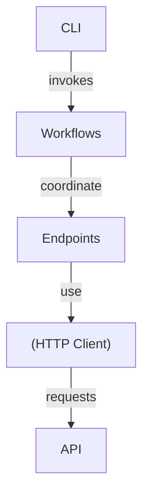

# imednet

<div align="center">
  
</div>

<div align="center">


**Unofficial Python SDK for the iMednet clinical trials API.**

Full documentation: <https://fderuiter.github.io/imednet-python-sdk/>

</div>

<div align="center">

[](https://pypi.org/project/imednet/)
[](https://pypi.org/project/imednet/)
[](https://pypi.org/project/imednet/)
[](https://pypi.org/project/imednet/)
[](LICENSE)
[](https://github.com/fderuiter/imednet-python-sdk/actions/workflows/ci.yml)
[](https://github.com/fderuiter/imednet-python-sdk)

</div>

This package simplifies integration with the iMednet REST API for clinical trial
management. It provides typed endpoint wrappers, helper workflows and a CLI so
researchers and developers can automate data extraction and submission without
reimplementing HTTP logic.

## Features

- Simple, consistent interface for API calls
- Automatic pagination across endpoints
- Pydantic models for requests and responses
- Workflow helpers for data extraction and mapping
- Pandas and CSV utilities
- Optional in-memory caching of study metadata
- Structured JSON logging and OpenTelemetry tracing
- Async client and command line interface

---

## Architecture

The SDK is organized around a core HTTP client layer, endpoint wrappers that model
the iMednet API, workflow helpers that combine multiple endpoint calls, and a CLI
built on top of those pieces.



---

## Installation

```bash
# PyPI release
pip install imednet
# Dev version
pip install git+https://github.com/fderuiter/imednet-python-sdk.git@main
```

---

## Quick Start

### Synchronous Example

```python
from imednet import ImednetSDK, load_config
from imednet.utils import configure_json_logging

configure_json_logging()
cfg = load_config()
sdk = ImednetSDK(
    api_key=cfg.api_key,
    security_key=cfg.security_key,
    base_url=cfg.base_url,
)
print(sdk.studies.list())
```

### Asynchronous Example

```python
import asyncio
from imednet import AsyncImednetSDK, load_config
from imednet.utils import configure_json_logging


async def main() -> None:
    configure_json_logging()
    cfg = load_config()
    async with AsyncImednetSDK(
        api_key=cfg.api_key,
        security_key=cfg.security_key,
        base_url=cfg.base_url,
    ) as sdk:
        print(await sdk.studies.async_list())


asyncio.run(main())
```

See [docs/async_quick_start.rst](docs/async_quick_start.rst) for more details.

---

## Configuration

The SDK and CLI read credentials from environment variables such as
`IMEDNET_API_KEY` and `IMEDNET_SECURITY_KEY`. You can set these in your shell or
use a `.env` file. Copy `.env.example` to `.env` to get started.

See [configuration](docs/configuration.rst) for the complete list of options.
Use `imednet.config.load_config()` to access these values in your code.

---

## CLI Usage

The package installs an `imednet` command with subcommands for studies, sites,
subjects, records, jobs, queries and more. Use `imednet --help` to explore all
options.

Example of exporting a subset of variables:

```bash
imednet export sql MY_STUDY table sqlite:///data.db --vars AGE,SEX --forms 10,20
```

When the connection string uses SQLite, the command splits the output into one
table per form to avoid the 2000 column limit. Pass ``--single-table`` to
disable this behaviour. See ``docs/cli.rst`` for full examples.

---

## Documentation & Resources

- **API Documentation**: Full documentation is available at
  <https://fderuiter.github.io/imednet-python-sdk/>.
- **Official iMednet API Docs**: <https://portal.prod.imednetapi.com/>.
- **Postman Collection**: Download
  [`imednet.postman_collection.json`](imednet.postman_collection.json) and import it
  into Postman to explore and test the API endpoints.

---

## Development & Contributing

### Tech Stack

- Python 3.10–3.12
- requests, httpx, pydantic, typer, tenacity, python-dotenv

### Project Structure

```
.
├── docs/       - Sphinx documentation
├── examples/   - Usage samples
├── imednet/    - SDK package
├── scripts/    - Helper scripts
└── tests/      - Unit and integration tests
```

### Testing & Development

```bash
./scripts/setup.sh  # once
poetry run ruff check --fix .
poetry run black --check .
poetry run isort --check --profile black .
poetry run mypy imednet
poetry run pytest -q
```

After running tests, validate documentation builds cleanly (no warnings):

```bash
make docs
```

See [docs/AGENTS.md](docs/AGENTS.md) for full documentation guidelines.

### Smoke-test workflow

The optional [smoke.yml](.github/workflows/smoke.yml) action runs the `tests/live` suite.
It relies on repository secrets `APIKEY` and `SECURITYKEY` and sets `IMEDNET_RUN_E2E`.
Use the workflow to confirm real API access on demand or via its nightly schedule.
INFO-level log messages stream to the terminal during these runs, making it easier to
debug failures.

### Building & Publishing

```bash
python -m build
python -m twine upload dist/*
```

Pushing a Git tag like `v0.1.4` triggers the GitHub Actions workflow that builds
and publishes the package to PyPI.

### Versioning & Changelog

This project follows [Semantic Versioning](https://semver.org). See
[GitHub Releases](https://github.com/fderuiter/imednet-python-sdk/releases) for release history.

### Contributing

Contributions are welcome! See the
[contributing guide](docs/contributing.rst) and
[CONTRIBUTING.md](CONTRIBUTING.md) for full details.

---

## License

This project is licensed under the MIT license. See [LICENSE](LICENSE) for
details.

---

## Acknowledgements

Built with open source libraries including requests, httpx, pydantic and typer.

