<div align="center">


**Universal Inference Pipeline Framework**

[](https://pypi.org/project/inferflow/)
[](https://pypi.org/project/inferflow/)
[](LICENSE)
[](https://6ixgodd.github.io/inferflow/)

</div>

---

## Overview

InferFlow is a production-grade inference pipeline framework designed for computer vision models. It provides a clean
abstraction layer that separates model runtime, preprocessing, postprocessing, and batching strategies, enabling
seamless deployment across multiple inference backends.

**Key Features:**

- 🚀 **Multi-Backend Support**: TorchScript, ONNX Runtime, TensorRT
- ⚡ **Dynamic Batching**: Automatic request batching with adaptive sizing
- 🎯 **Type Safe**: Full type hints with generic pipeline definitions
- 🔄 **Async & Sync**: Both synchronous and asynchronous APIs
- 📊 **Production Ready**: Comprehensive logging, metrics, and error handling
- 🧩 **Modular Design**:  Namespace-isolated pipelines for Torch and ONNX

---

## Installation

### Quick Install (Pure Python)

```bash
pip install inferflow
```

### Backend-Specific Installation

```bash
# PyTorch backend
pip install inferflow[torch]

# ONNX Runtime backend
pip install inferflow[onnx]

# TensorRT backend (Linux only)
pip install inferflow[tensorrt]

# All backends
pip install inferflow[all]
```

### Development Installation (with C++ optimizations)

```bash
git clone https://github.com/6ixGODD/inferflow.git
cd inferflow

# Install with C++ extensions for faster NMS
INFERFLOW_BUILD_CPP=1 pip install -e ".[dev]"

# With CUDA support
INFERFLOW_BUILD_CPP=1 INFERFLOW_CUDA=1 pip install -e ".[dev]"
```

**Build Options:**

| Variable              | Default | Description                           |
|-----------------------|---------|---------------------------------------|
| `INFERFLOW_BUILD_CPP` | `0`     | Enable C++ extensions                 |
| `INFERFLOW_CUDA`      | `0`     | Enable CUDA support in C++ extensions |

---

## Quick Start

### Synchronous API

#### Basic Classification (PyTorch)

```python
from inferflow.runtime.torch import TorchScriptRuntime
from inferflow.pipeline.classification.torch import ClassificationPipeline

# Setup runtime
runtime = TorchScriptRuntime(
    model_path="resnet50.pt",
    device="cuda:0",
)

# Create pipeline
pipeline = ClassificationPipeline(
    runtime=runtime,
    class_names={0: "cat", 1: "dog", 2: "bird"},
)

# Run inference
with pipeline.serve():
    with open("image.jpg", "rb") as f:
        result = pipeline(f.read())

    print(f"{result.class_name}: {result.confidence:.2%}")
```

#### Object Detection (ONNX)

```python
from inferflow.runtime.onnx import ONNXRuntime
from inferflow.pipeline.detection.onnx import YOLOv5DetectionPipeline

# Setup ONNX runtime
runtime = ONNXRuntime(
    model_path="yolov5s.onnx",
    device="cpu",
    precision=Precision.FP32,
)

# Create detection pipeline
pipeline = YOLOv5DetectionPipeline(
    runtime=runtime,
    conf_threshold=0.5,
    class_names={0: "person", 1: "car", 2: "dog"},
)

with pipeline.serve():
    detections = pipeline(image_bytes)
    for det in detections:
        print(f"{det.class_name}: {det.confidence:.2%} at {det.box}")
```

---

### Asynchronous API

#### Classification (Async + PyTorch)

```python
import asyncio
from inferflow.asyncio.runtime.torch import TorchScriptRuntime
from inferflow.asyncio.pipeline.classification.torch import ClassificationPipeline


async def main():
    runtime = TorchScriptRuntime(
        model_path="resnet50.pt",
        device="cuda:0",
    )

    pipeline = ClassificationPipeline(
        runtime=runtime,
        class_names={0: "cat", 1: "dog"},
    )

    async with pipeline.serve():
        with open("image.jpg", "rb") as f:
            result = await pipeline(f.read())

        print(f"{result.class_name}: {result.confidence:.2%}")


asyncio.run(main())
```

#### Instance Segmentation (Async + ONNX)

```python
import asyncio
from inferflow.asyncio.runtime.onnx import ONNXRuntime
from inferflow.asyncio.pipeline.segmentation.onnx import YOLOv5SegmentationPipeline


async def main():
    runtime = ONNXRuntime(
        model_path="yolov5s-seg.onnx",
        device="cpu",
    )

    pipeline = YOLOv5SegmentationPipeline(
        runtime=runtime,
        conf_threshold=0.5,
        class_names={0: "person"},
    )

    async with pipeline.serve():
        segments = await pipeline(image_bytes)
        for seg in segments:
            print(f"Mask:  {seg.mask.shape}, Box: {seg.box}")


asyncio.run(main())
```

---

## Dynamic Batching

Enable automatic request batching for higher throughput (GPU recommended):

```python
import asyncio
from inferflow.asyncio.batch.dynamic import DynamicBatchStrategy
from inferflow.asyncio.pipeline.classification.torch import ClassificationPipeline


async def main():
    # Configure batching strategy
    batch_strategy = DynamicBatchStrategy(
        min_batch_size=1,
        max_batch_size=32,
        max_wait_ms=50,
        queue_size=1000,
    )

    pipeline = ClassificationPipeline(
        runtime=runtime,
        batch_strategy=batch_strategy,
    )

    async with pipeline.serve():
        # Submit concurrent requests - automatically batched
        results = await asyncio.gather(
            *[
                pipeline(img) for img in images
            ]
            )

    # View metrics
    metrics = batch_strategy.get_metrics()
    print(f"Avg batch size:  {metrics.avg_batch_size:.2f}")
    print(f"Total batches: {metrics.total_batches}")
    print(f"Throughput: {metrics.total_requests / elapsed:.2f} req/s")


asyncio.run(main())
```

**Performance Tips:**

- **GPU**: 3-5x speedup with batching
- **CPU**: Limited benefit, focus on peak shaving
- **`max_wait_ms`**: Balance latency vs. batch size
- **`max_batch_size`**: GPU memory limit

---

## Custom Workflows

Build multi-stage pipelines with conditional logic and parallel execution:

```python
from inferflow.asyncio.workflow import task, parallel, sequence, Workflow
from dataclasses import dataclass


@dataclass
class QCContext:
    image: bytes
    is_valid: bool = True
    defects: list = None
    quality_grade: str = None


@task(name="validate_image")
async def validate(ctx: QCContext) -> QCContext:
    # Image validation logic
    ctx.is_valid = check_image_quality(ctx.image)
    return ctx


@task(
    name="detect_defects",
    condition=lambda ctx: ctx.is_valid,
)
async def detect(ctx: QCContext) -> QCContext:
    # Defect detection
    ctx.defects = await detection_pipeline(ctx.image)
    return ctx


@task(name="classify_grade")
async def classify(ctx: QCContext) -> QCContext:
    # Quality grading
    ctx.quality_grade = "A" if not ctx.defects else "B"
    return ctx


# Build workflow
workflow = Workflow[QCContext](
    validate,
    detect,
    parallel(
        classify,
        generate_report,
    ),
)

# Execute
context = QCContext(image=image_bytes)
result = await workflow.run(context)
print(f"Grade: {result.quality_grade}")
```

---

## Architecture

### Core Abstractions

```mermaid
graph TB
    subgraph Pipeline["Pipeline"]
        direction LR
        Pre[Preprocess]
        Runtime[Runtime]
        Post[Postprocess]
        Pre -->|Tensor| Runtime
        Runtime -->|Output| Post
    end

    BatchStrategy[BatchStrategy]
    Pre -.->|Batching| BatchStrategy
    Runtime -.->|Batching| BatchStrategy
    Post -.->|Batching| BatchStrategy
    style Pipeline fill: #1a1a1a, stroke: #00d9ff, stroke-width: 3px
    style Pre fill: #0d47a1, stroke: #42a5f5, stroke-width: 2px, color: #fff
    style Runtime fill: #e65100, stroke: #ff9800, stroke-width: 2px, color: #fff
    style Post fill: #6a1b9a, stroke: #ba68c8, stroke-width: 2px, color: #fff
    style BatchStrategy fill: #1b5e20, stroke: #66bb6a, stroke-width: 2px, color: #fff
```



**Codebase Structure:**

```
inferflow/
├── runtime/
│   ├── torch.py         # PyTorch runtime
│   ├── onnx.py          # ONNX runtime
│   └── tensorrt.py      # TensorRT runtime
│
├── pipeline/
│   ├── classification/
│   │   ├── torch.py     # Torch classification
│   │   └── onnx.py      # ONNX classification
│   ├── detection/
│   │   ├── torch.py     # Torch YOLOv5 detection
│   │   └── onnx.py      # ONNX YOLOv5 detection
│   └── segmentation/
│       ├── torch.py     # Torch YOLOv5 segmentation
│       └── onnx.py      # ONNX YOLOv5 segmentation
│
└── asyncio/             # Async versions (same structure)
```

---

## Examples

Check out the [examples/](examples/) directory for complete working examples:

- **[01_classification](examples/01_classification/)** - Image classification with ResNet
- **[02_detection](examples/02_detection/)** - YOLOv5 object detection
- **[03_segmentation](examples/03_segmentation/)** - YOLOv5 instance segmentation
- **[04_batch_processing](examples/04_batch_processing/)** - Dynamic batching benchmark
- **[05_custom_workflow](examples/05_custom_workflow/)** - Multi-stage QC pipeline

---

## Requirements

- Python ≥ 3.10
- PyTorch ≥ 2.0 (for torch backend)
- ONNX Runtime ≥ 1.15 (for onnx backend)
- TensorRT ≥ 8.6 (for tensorrt backend)
- OpenCV ≥ 4.5
- NumPy ≥ 1.23

---

## Contributing

Contributions are not currently accepted.This project is maintained for internal use.

---

## License

MIT License.See [LICENSE](LICENSE) for details.

---

## Citation

```bibtex
@software{inferflow2025,
  title={InferFlow: Universal Inference Pipeline Framework},
  author={6ixGODD},
  year={2025},
  url={https://github.com/6ixGODD/inferflow}
}
```
