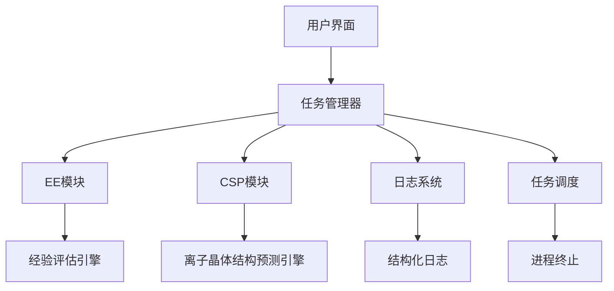
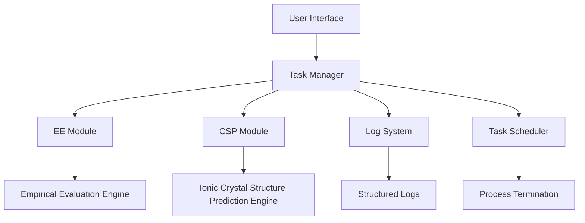

# 基于分子/离子构型的晶体结构设计软件 V2.2

## 项目概述

基于分子/离子构型的晶体结构设计软件通过结合经验公式、机器学习势函数微调、第一性原理分步优化和分子/离子识别技术，实现了从分子/离子构型出发的高效晶体结构设计。该软件采用模块化设计，支持全流程自动化材料筛选，在保证预测精度的同时显著提升计算效率。

## 功能特性

### 核心功能

- **双模块工作流**  
  - **EE模块**：基于经验评估的离子组合生成  
  - **CSP模块**：基于离子晶体结构预测的优化筛选  
- **智能任务管理**  
  - 实时进程监控（PID跟踪）
  - 日志文件自动符号链接
  - 进程安全终止与资源清理
- **高级日志系统**  
  - 分页浏览（10条/页）
  - 模块过滤（CSP/EE）
  - 软链接解析显示实际路径

### 技术特性

- 跨平台支持（Linux/Docker）
- 基于Python 3.11+的面向对象架构
- 集成psutil进程管理
- 结构化日志记录系统

## 安装指南

### 环境要求

| 组件        | 最低版本 |
|-------------|----------|
| Python      | 3.11     |
| psutil      | 5.9      |
| Docker      | 20.10    |
| ase         | 3.23.0   |
| deepmd-kit  | 3.0.1    |
| torch       | 2.5.0    |
| dpdispatcher| 0.6.7    |
| numpy       | 1.26.4   |
| paramiko    | 3.5.1    |
| pyxtal      | 1.0.4    |
| phonopy     | 2.28.0   |
| rdkit       | 2024.03.3|

### 安装步骤

```bash
pip install ion-csp
```

或

```bash
# 创建虚拟环境
python -m venv venv
source venv/bin/activate  # Linux/Mac

# 安装依赖
git clone https://github.com/Bagabaga007/ion_CSP.git
cd ion_CSP
pip install -e .
```

## 快速入门

### 交互模式

```bash
ion-csp
```

启动交互式命令行界面，支持以下操作：

- 模块选择
- 日志查看
- 进程管理

### 脚本调用

#### EE模块示例

```bash
./scripts/main_EE.sh examples/example_1
```

从SMILES表格生成离子组合

#### CSP模块示例

```bash
./scripts/main_CSP.sh examples/example_2
```

从离子组合生成并优化晶体结构

## 技术架构



## 贡献指南

1. Fork仓库并创建特性分支
2. 编写单元测试覆盖新功能
3. 提交Pull Request时注明关联Issue
4. 遵循PEP8代码规范

## 许可证

本项目采用MIT许可证，详见LICENSE文件。

---

## Project Overview

This software enables efficient crystal structure design from molecular/ion configurations by integrating empirical formulas, tuned machine learning potentials, stepwise first-principles optimization, and molecular/ion recognition techniques. The modular architecture ensures extensibility and maintainability while maintaining prediction accuracy.

## Key Features

### Core Functionalities

- **Dual-Module Workflow**
  - **EE Module**: Empirical evaluation-based ion combination generation
  - **CSP Module**: Ion crystal structure prediction and optimization
- **Intelligent Task Management**
  - Real-time process monitoring (PID tracking)
  - Automatic log file symlink creation
  - Safe process termination with resource cleanup
- **Advanced Logging System**
  - Paginated log viewing (10 entries/page)
  - Module-based filtering (CSP/EE)
  - Symlink resolution for actual log paths

### Technical Specifications

- Cross-platform support (Linux/Docker)
- Object-oriented architecture with Python 3.11+
- Integrated process management via psutil
- Structured logging system

## Installation

### Prerequisites

| Component   | Min Version |
|-------------|-------------|
| Python      | 3.11     |
| psutil      | 5.9      |
| Docker      | 20.10    |
| ase         | 3.23.0   |
| deepmd-kit  | 3.0.1    |
| torch       | 2.5.0    |
| dpdispatcher| 0.6.7    |
| numpy       | 1.26.4   |
| paramiko    | 3.5.1    |
| pyxtal      | 1.0.4    |
| phonopy     | 2.28.0   |
| rdkit       | 2024.03.3|

### Installation Steps

```bash
# Create virtual environment
python -m venv venv
source venv/bin/activate  # Linux/Mac

# Install dependencies
git clone https://github.com/Bagabaga007/ion_CSP.git
cd ion_CSP
pip install -e .
```

## Quick Start

### Interactive Mode

```bash
ion-csp
```

Launches CLI interface with:

- Module selection
- Log management
- Process control

### Script Execution

#### EE Module Example

```bash
./scripts/main_EE.sh examples/example_1
```

Generates ion combinations from SMILES tables

#### CSP Module Example

```bash
./scripts/main_CSP.sh examples/example_2
```

Optimizes crystal structures from ion combinations

## Technical Architecture



## Contribution Guide

1. Fork repository and create feature branch
2. Write unit tests for new features
3. Submit PR with issue reference
4. Follow PEP8 coding standards

## License

MIT License, see LICENSE file.
