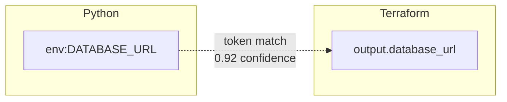
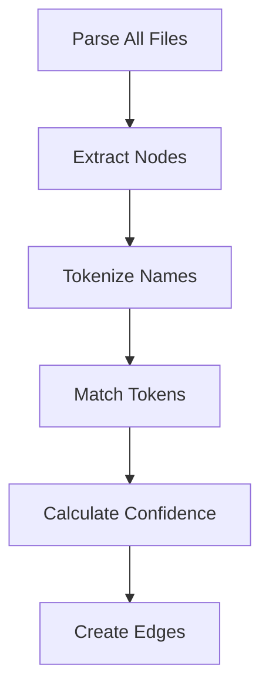

# Cross-Domain Dependencies

The "glue" problem Jnkn solves.

## The Problem

Modern systems span multiple domains:

```
┌─────────────┐     ┌─────────────┐     ┌─────────────┐
│   Python    │     │  Terraform  │     │ Kubernetes  │
│   Service   │     │   Infra     │     │  Manifests  │
└─────────────┘     └─────────────┘     └─────────────┘
       │                   │                   │
       └───────────────────┴───────────────────┘
                           │
                    ??? Dependencies ???
```

Each domain has its own tools:

| Domain | Tools | Blind Spot |
|--------|-------|------------|
| Python | pytest, mypy | Doesn't know about infra |
| Terraform | terraform plan | Doesn't know what code uses resources |
| Kubernetes | kubectl, helm | Doesn't know what secrets code expects |

**No tool checks across domains.**

## Real-World Scenarios

### Scenario 1: Renamed Variable

```hcl
# Before
output "db_host" { value = aws_rds.main.endpoint }

# After (renamed)
output "database_host" { value = aws_rds.main.endpoint }
```

```python
# This will break!
DB_HOST = os.getenv("DB_HOST")  # Still expects old name
```

**Terraform plan:** ✅ Success  
**Python tests:** ✅ Success (mocked)  
**Production:** 💥 Crash

### Scenario 2: Deleted Secret

```yaml
# Removed from Kubernetes
# apiVersion: v1
# kind: Secret
# metadata:
#   name: api-credentials
```

```python
# Still expects the secret
API_KEY = os.environ["API_KEY"]  # KeyError in production
```

### Scenario 3: Schema Change

```sql
-- dbt model change
-- Renamed column: user_id → customer_id
```

```python
# API still queries old column
query = "SELECT user_id FROM fct_orders"  # Column doesn't exist
```

## Why This Happens

1. **No explicit links** — Code references env vars by string, not by import
2. **Convention-based** — `DATABASE_URL` in code is expected to match infra output
3. **Different ownership** — Platform team manages infra, app team manages code
4. **Async changes** — Changes merged at different times

## How Jnkn Helps

Jnkn creates **implicit links** based on naming:



Now when you run:

```bash
jnkn blast infra:output.database_url
```

You see:

```
Impacted: env:DATABASE_URL, file://src/config.py
```

## The Stitching Process



1. **Parse** — Find all env vars, resources, etc.
2. **Tokenize** — `DATABASE_URL` → `[database, url]`
3. **Match** — Find nodes with overlapping tokens
4. **Score** — Calculate match confidence
5. **Link** — Create edges above threshold

## Limitations

Jnkn uses **lexical matching**, not semantic understanding:

| Can Detect | Cannot Detect |
|------------|---------------|
| `DB_HOST` ↔ `db_host` | IAM role → S3 permission |
| `REDIS_URL` ↔ `redis_cluster` | Table size → IOPS limit |
| Name-based connections | Behavioral dependencies |

For semantic understanding, you need runtime observability or explicit documentation.

## Best Practices

1. **Use consistent naming** — `DATABASE_URL` everywhere, not `DB_URL` in one place
2. **Run Jnkn in CI** — Catch cross-domain breaks before merge
3. **Review high-impact changes** — Pay attention to blast radius
4. **Document exceptions** — Suppress known false positives with reasons
