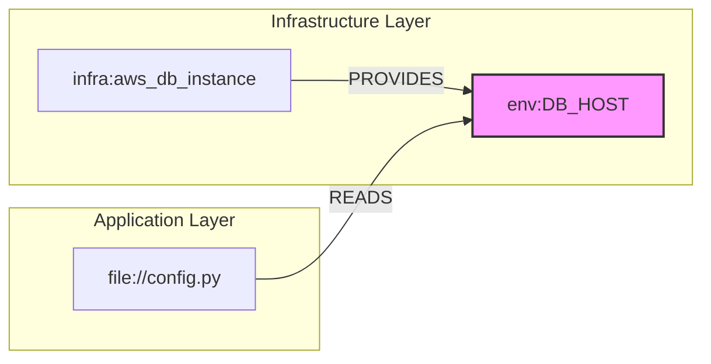

# Dependency Graph

The core data structure of Jnkn.

## What Is It?

The dependency graph is a directed graph that maps the relationships between every artifact in your stack. It serves as the "source of truth" for impact analysis.

Crucially, Jnkn distinguishes between **Dependency Direction** (structural) and **Impact Direction** (semantic):

  * **Dependency:** `App` → *reads* → `Env Var` (The App depends on the Env Var)
  * **Impact:** `Env Var` → *impacts* → `App` (Changing the Env Var breaks the App)

<!-- end list -->



## The IGraph Interface

The graph is implemented via a strict **IGraph Protocol**, decoupling the analysis logic from the underlying storage.

  * **Backend Agnostic:** Currently backed by high-performance **rustworkx** in memory, but swappable for NetworkX or Neo4j.
  * **Semantic Awareness:** The graph itself understands lineage logic (e.g., traversing `READS` edges in reverse to find downstream consumers).

## Nodes

Nodes represent unique artifacts across your stack.

```json
{
  "id": "env:DATABASE_URL",
  "name": "DATABASE_URL",
  "type": "env_var",
  "tokens": ["database", "url"],
  "metadata": {
    "source": "os.getenv",
    "file": "src/config.py"
  }
}
```

### Node Types

| Type | Represents | Example ID |
| :--- | :--- | :--- |
| `code_file` | Source Code File | `file://src/app.py` |
| `env_var` | Configuration Key | `env:DATABASE_URL` |
| `infra_resource` | Infrastructure Resource | `infra:aws_rds:main` |
| `config_key` | Terraform Output | `infra:output:db_host` |
| `data_asset` | Table or S3 Path | `data:public.users` |

## Edges & Semantics

Edges are directed, but their *semantic meaning* dictates how analysis tools traverse them.

| Edge Type | Direction | Semantic Flow | Example |
| :--- | :--- | :--- | :--- |
| `PROVIDES` | A → B | **Downstream** (A impacts B) | Infra → Env Var |
| `WRITES` | A → B | **Downstream** (A impacts B) | Job → Table |
| `READS` | A → B | **Upstream** (B impacts A) | Code → Env Var |
| `DEPENDS_ON` | A → B | **Upstream** (B impacts A) | Job → Upstream Job |

## Querying the Graph

### Impact Analysis (Blast Radius)

Calculates the "Blast Radius" by following data flow, not just dependencies.

```bash
# Finds everything that breaks if this Env Var changes
jnkn blast env:DATABASE_URL
```

### Lineage Tracing

Traces the full path of data from Infrastructure to Code to Data Assets.

```bash
# Traces: Infra -> Output -> Env Var -> App Code
jnkn trace infra:aws_db_instance:main file://src/app.py
```

## Storage

  * **Persistence:** Serialized to SQLite (`.jnkn/jnkn.db`) for caching.
  * **Runtime:** Hydrated into an in-memory `rustworkx` graph for sub-millisecond traversal.
