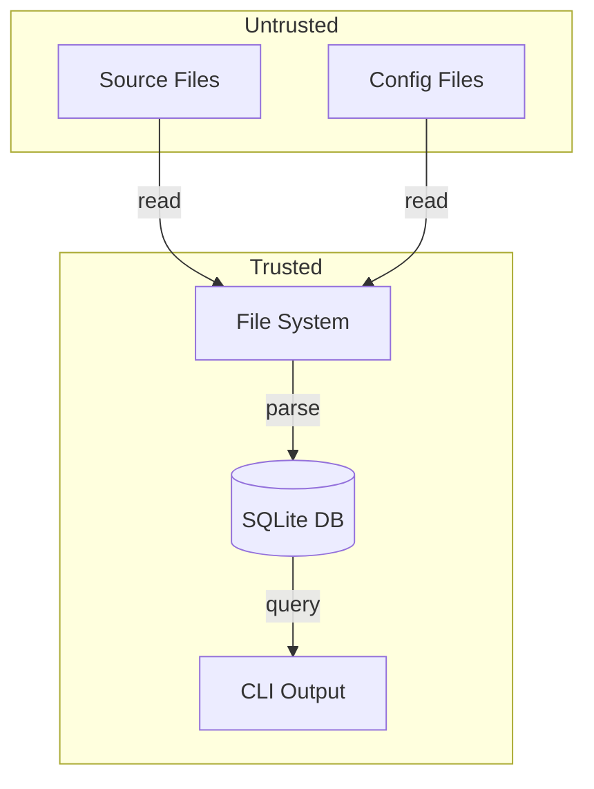

# Threat Model

Security considerations for Jnkn.

## What Jnkn Does

- Reads source files from disk
- Parses file contents into an AST
- Stores graph data in SQLite
- Outputs analysis results

## What Jnkn Does NOT Do

- Execute code
- Make network requests
- Access credentials or secrets
- Modify source files

## Trust Boundaries



### Trusted

- **File system** — Jnkn assumes it can read files you point it at
- **SQLite database** — Jnkn controls this file
- **CLI output** — Results are displayed to the user

### Untrusted

- **Source files** — May contain malicious patterns
- **Config files** — User-controlled

## Threat Analysis

### Threat 1: Malicious Source Files

**Scenario:** Attacker includes crafted code that exploits parser.

**Mitigation:**
- Tree-sitter is memory-safe (written in C with fuzzing)
- Jnkn doesn't execute code, only parses
- Regex patterns are bounded

**Residual risk:** Low

### Threat 2: Config Injection

**Scenario:** Attacker modifies `.jnkn/config.yaml` to load malicious code.

**Mitigation:**
- Extra extractors/rules must be importable Python modules
- Requires write access to config file
- Requires code execution environment

**Residual risk:** Medium (if attacker has write access, they have larger problems)

### Threat 3: Information Disclosure

**Scenario:** Jnkn output reveals sensitive information.

**Mitigation:**
- Jnkn only reports artifact names, not contents
- No secret values are extracted
- Environment variable names (not values) are detected

**Residual risk:** Low (env var names are not typically secret)

### Threat 4: Denial of Service

**Scenario:** Large or malformed file causes excessive resource usage.

**Mitigation:**
- File size limits in parsing
- Timeout on tree-sitter operations
- Bounded regex execution

**Residual risk:** Low

## Best Practices

### CI/CD Usage

```yaml
# Run in isolated container
- name: Jnkn
  uses: docker://ghcr.io/jnkn-io/jnkn:latest
  with:
    args: scan --dir /github/workspace
```

### Secret Handling

Jnkn detects env var **names**, not values. However:

- Don't commit `.jnkn/jnkn.db` if it might contain sensitive paths
- Use `.jnknignore` to skip sensitive directories

### Dependency Security

Jnkn's dependencies are:
- Scanned with Dependabot
- Pinned to specific versions
- Audited for known vulnerabilities

## Reporting Security Issues

Report vulnerabilities to: security@jnkn.io

We follow responsible disclosure with a 90-day window.
