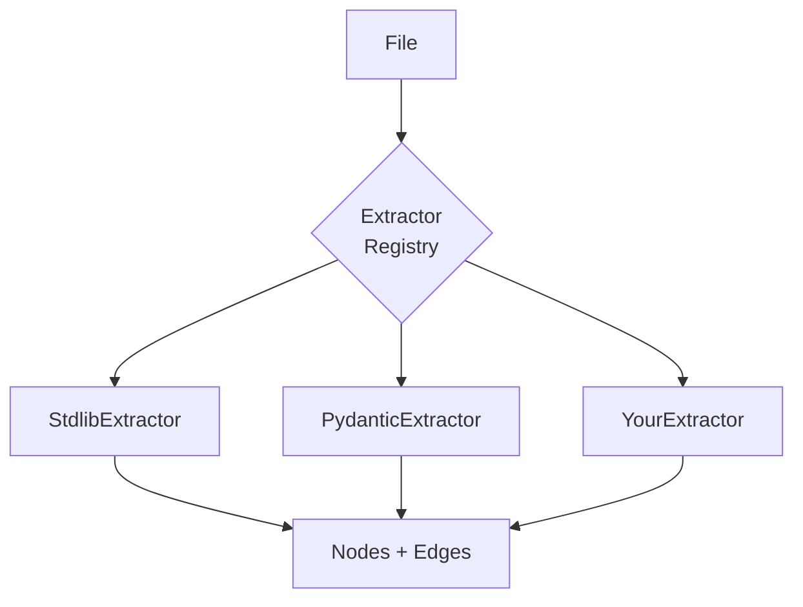

# Custom Parsers

Extend Jnkn to detect patterns in new languages or frameworks.

**Time:** 30 minutes

## When to Write a Custom Parser

- Your framework has unique configuration patterns
- You use an unsupported language
- You have internal conventions Jnkn doesn't recognize

## Architecture



Parsers are composed of **Extractors** — small, focused classes that detect specific patterns.

## Creating an Extractor

### Step 1: Define the Extractor

Create `my_extractors/internal_config.py`:

```python
"""Extractor for internal @config decorator pattern."""

from pathlib import Path
from typing import Generator, Set, Union
import re

from jnkn.parsing.python.extractors.base import BaseExtractor
from jnkn.core.types import Node, Edge, NodeType, RelationshipType


class InternalConfigExtractor(BaseExtractor):
    """
    Detects env vars from internal @config decorator.
    
    Pattern:
        @config(env="DATABASE_URL", required=True)
        def get_database_url() -> str:
            ...
    """
    
    @property
    def name(self) -> str:
        return "internal_config"
    
    @property
    def priority(self) -> int:
        return 75  # Between stdlib (100) and heuristic (10)
    
    # Regex pattern for the decorator
    PATTERN = re.compile(
        r'@config\s*\(\s*env\s*=\s*["\']([^"\']+)["\']',
        re.MULTILINE
    )
    
    def can_extract(self, text: str) -> bool:
        """Quick check if this file uses @config."""
        return "@config" in text and "env=" in text
    
    def extract(
        self,
        file_path: Path,
        file_id: str,
        tree,  # tree-sitter AST (optional)
        text: str,
        seen_vars: Set[str],
    ) -> Generator[Union[Node, Edge], None, None]:
        """Extract env vars from @config decorators."""
        
        for match in self.PATTERN.finditer(text):
            var_name = match.group(1)
            
            # Skip if already detected by another extractor
            if var_name in seen_vars:
                continue
            
            # Calculate line number
            line = text[:match.start()].count('\n') + 1
            
            env_id = f"env:{var_name}"
            
            # Yield the env var node
            yield Node(
                id=env_id,
                name=var_name,
                type=NodeType.ENV_VAR,
                metadata={
                    "source": self.name,
                    "file": str(file_path),
                    "line": line,
                },
            )
            
            # Yield edge: file reads this env var
            yield Edge(
                source_id=file_id,
                target_id=env_id,
                type=RelationshipType.READS,
                metadata={"pattern": self.name},
            )
```

### Step 2: Register the Extractor

Create `my_extractors/__init__.py`:

```python
from .internal_config import InternalConfigExtractor

CUSTOM_EXTRACTORS = [InternalConfigExtractor]
```

### Step 3: Configure Jnkn

In `.jnkn/config.yaml`:

```yaml
parsing:
  python:
    extra_extractors:
      - my_extractors.InternalConfigExtractor
```

Or programmatically:

```python
from jnkn.parsing.python import PythonParser
from my_extractors import InternalConfigExtractor

parser = PythonParser()
parser.register_extractor(InternalConfigExtractor())
```

## Using Tree-Sitter (Recommended)

For complex patterns, use tree-sitter instead of regex:

```python
from jnkn.parsing.python.extractors.base import BaseExtractor

class TypedConfigExtractor(BaseExtractor):
    """Extract env vars using tree-sitter AST."""
    
    # Tree-sitter query
    QUERY = """
    (decorated_definition
      (decorator
        (call
          function: (identifier) @_func
          arguments: (argument_list
            (keyword_argument
              name: (identifier) @_kwarg
              value: (string) @env_var))))
      (#eq? @_func "config")
      (#eq? @_kwarg "env"))
    """
    
    def extract(self, file_path, file_id, tree, text, seen_vars):
        if tree is None:
            return  # Fall back to regex if no tree-sitter
        
        query = self._language.query(self.QUERY)
        captures = query.captures(tree.root_node)
        
        for node, capture_name in captures:
            if capture_name != "env_var":
                continue
            
            var_name = node.text.decode("utf-8").strip('"\'')
            
            if var_name in seen_vars:
                continue
            
            yield Node(
                id=f"env:{var_name}",
                name=var_name,
                type=NodeType.ENV_VAR,
                metadata={
                    "source": self.name,
                    "file": str(file_path),
                    "line": node.start_point[0] + 1,
                },
            )
            
            yield Edge(
                source_id=file_id,
                target_id=f"env:{var_name}",
                type=RelationshipType.READS,
            )
```

## Testing Your Extractor

Create `tests/test_internal_config.py`:

```python
import pytest
from pathlib import Path
from my_extractors import InternalConfigExtractor
from jnkn.core.types import NodeType

class TestInternalConfigExtractor:
    @pytest.fixture
    def extractor(self):
        return InternalConfigExtractor()
    
    def test_detects_config_decorator(self, extractor):
        code = '''
@config(env="DATABASE_URL", required=True)
def get_db_url():
    pass

@config(env="API_KEY")
def get_api_key():
    pass
'''
        
        nodes = list(extractor.extract(
            file_path=Path("test.py"),
            file_id="file://test.py",
            tree=None,
            text=code,
            seen_vars=set(),
        ))
        
        env_nodes = [n for n in nodes if hasattr(n, 'type') and n.type == NodeType.ENV_VAR]
        env_names = {n.name for n in env_nodes}
        
        assert env_names == {"DATABASE_URL", "API_KEY"}
    
    def test_skips_already_seen(self, extractor):
        code = '@config(env="DATABASE_URL")\ndef f(): pass'
        
        nodes = list(extractor.extract(
            file_path=Path("test.py"),
            file_id="file://test.py",
            tree=None,
            text=code,
            seen_vars={"DATABASE_URL"},  # Already seen
        ))
        
        env_nodes = [n for n in nodes if hasattr(n, 'type') and n.type == NodeType.ENV_VAR]
        assert len(env_nodes) == 0
```

Run tests:

```bash
pytest tests/test_internal_config.py -v
```

## Complete Example: Go Parser

For a new language, create a full parser:

```python
# jnkn_go/parser.py
from jnkn.parsing.base import LanguageParser

class GoParser(LanguageParser):
    @property
    def name(self) -> str:
        return "go"
    
    @property
    def extensions(self) -> list[str]:
        return [".go"]
    
    def parse(self, file_path, content):
        # Detect os.Getenv("VAR")
        pattern = r'os\.Getenv\s*\(\s*"([^"]+)"\s*\)'
        ...
```

## Next Steps

- [:octicons-arrow-right-24: Custom stitching rules](custom-stitching-rules.md)
- [:octicons-arrow-right-24: Python patterns reference](../../reference/patterns/python-env-vars.md)
