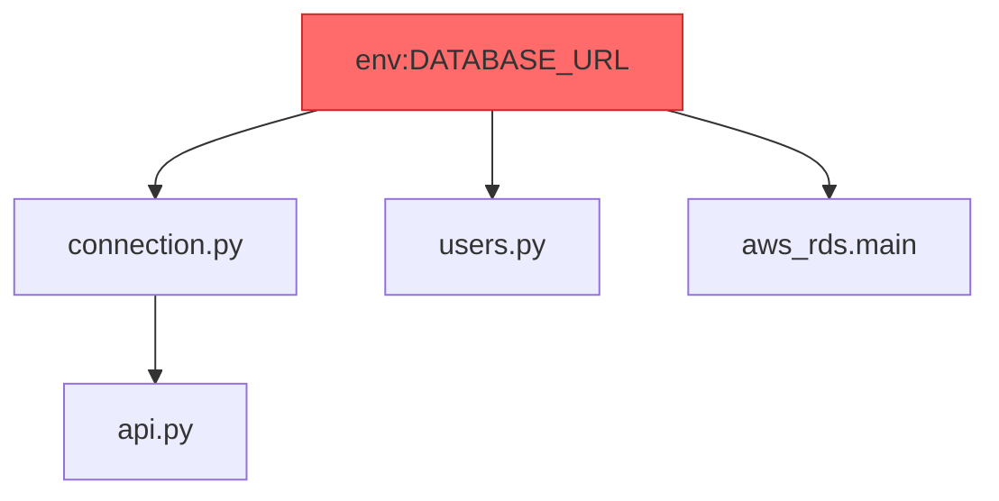

# Blast Radius

Understanding impact analysis.

## Definition

**Blast radius** is the set of artifacts affected by a change.

If you modify `env:DATABASE_URL`, what else might break?



**Blast radius of `env:DATABASE_URL`:** 4 artifacts

## How It's Calculated

Jnkn uses **Breadth-First Search (BFS)** from the source node:

```
1. Start at source node
2. Find all nodes with edges FROM source
3. Add to "impacted" set
4. Repeat from each impacted node
5. Stop at max_depth (if set)
```

## Direct vs. Transitive

**Direct impact (depth 1):**
- `connection.py` — directly reads `DATABASE_URL`
- `users.py` — directly reads `DATABASE_URL`
- `aws_rds.main` — directly provides `DATABASE_URL`

**Transitive impact (depth 2+):**
- `api.py` — imports `connection.py`, which reads `DATABASE_URL`

## Interpreting Results

```json
{
  "source_artifacts": ["env:DATABASE_URL"],
  "total_impacted_count": 4,
  "max_depth_reached": 2
}
```

### By Impact Size

| Impact | Risk Level | Action |
|--------|------------|--------|
| 1-3 | Low | Normal review |
| 4-10 | Medium | Careful review, notify teams |
| 10+ | High | Extra caution, staged rollout |

### By Artifact Type

```json
{
  "breakdown": {
    "code": ["connection.py", "users.py", "api.py"],
    "infra": ["aws_rds.main"],
    "env": [],
    "data": []
  }
}
```

Infrastructure impact often needs more scrutiny than code impact.

## Limiting Depth

For large graphs, limit traversal:

```bash
# Only direct dependencies
jnkn blast env:X --max-depth 1

# Up to 3 levels
jnkn blast env:X --max-depth 3
```

## Multiple Sources

Analyze combined impact:

```bash
jnkn blast env:DATABASE_URL env:REDIS_URL
```

Returns the **union** of all impacted artifacts.

## Use Cases

### Pre-Merge Review

"What does this PR affect?"

```bash
jnkn blast file://terraform/rds.tf
```

### Incident Response

"What could have caused this failure?"

```bash
jnkn blast infra:aws_rds.main --reverse
```

### Change Planning

"If we deprecate this env var, what needs updating?"

```bash
jnkn blast env:LEGACY_API_KEY
```

## Limitations

Blast radius shows **potential** impact, not guaranteed breakage:

- A code file might read an env var but handle missing values gracefully
- Infrastructure might be referenced but not actively used
- Some dependencies may be optional

Use blast radius as a **signal for investigation**, not absolute truth.
