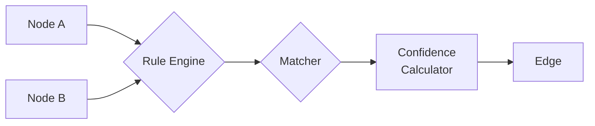

# Custom Stitching Rules

Create domain-specific rules for linking artifacts across your stack.

**Time:** 30 minutes

## When to Create Custom Rules

- Your organization has naming conventions Jnkn doesn't know
- You need to link artifact types in specific ways
- Default token matching produces too many false positives

## How Stitching Works



Rules filter which node pairs to consider. Matchers compute similarity. Confidence scores determine if a link is created.

## Creating a Custom Rule

### Example: Link Python Services to Their Terraform Modules

Convention: Python service `payment_service` should link to Terraform module `modules/payment`.

```python
# my_rules/service_to_module.py
from jnkn.stitching.rules import StitchingRule
from jnkn.core.types import Node, NodeType

class ServiceToModuleRule(StitchingRule):
    """
    Link Python service files to Terraform modules.
    
    Convention: src/services/{name}_service.py → terraform/modules/{name}/
    """
    
    @property
    def name(self) -> str:
        return "service_to_module"
    
    @property
    def source_types(self) -> set[NodeType]:
        return {NodeType.CODE_FILE}
    
    @property
    def target_types(self) -> set[NodeType]:
        return {NodeType.INFRA_RESOURCE}
    
    def should_evaluate(self, source: Node, target: Node) -> bool:
        """Quick filter before expensive matching."""
        # Source must be a Python service file
        if not source.path:
            return False
        if "_service.py" not in source.path:
            return False
        
        # Target must be a Terraform module resource
        if not target.id.startswith("infra:module."):
            return False
        
        return True
    
    def extract_service_name(self, path: str) -> str | None:
        """Extract service name from path like 'src/services/payment_service.py'."""
        import re
        match = re.search(r'/(\w+)_service\.py$', path)
        return match.group(1) if match else None
    
    def extract_module_name(self, node_id: str) -> str | None:
        """Extract module name from ID like 'infra:module.payment.aws_rds'."""
        import re
        match = re.search(r'^infra:module\.(\w+)\.', node_id)
        return match.group(1) if match else None
    
    def compute_confidence(self, source: Node, target: Node) -> float:
        """Compute match confidence."""
        service_name = self.extract_service_name(source.path)
        module_name = self.extract_module_name(target.id)
        
        if not service_name or not module_name:
            return 0.0
        
        # Exact match
        if service_name == module_name:
            return 0.95
        
        # Partial match (e.g., "payment" in "payment_gateway")
        if service_name in module_name or module_name in service_name:
            return 0.75
        
        return 0.0
```

### Register the Rule

In `.jnkn/config.yaml`:

```yaml
stitching:
  extra_rules:
    - my_rules.ServiceToModuleRule
```

Or programmatically:

```python
from jnkn.stitching import StitchingEngine
from my_rules import ServiceToModuleRule

engine = StitchingEngine()
engine.register_rule(ServiceToModuleRule())
```

## Rule Interface

```python
class StitchingRule(ABC):
    @property
    @abstractmethod
    def name(self) -> str:
        """Unique identifier for this rule."""
    
    @property
    @abstractmethod
    def source_types(self) -> set[NodeType]:
        """Node types this rule matches as sources."""
    
    @property
    @abstractmethod
    def target_types(self) -> set[NodeType]:
        """Node types this rule matches as targets."""
    
    @abstractmethod
    def should_evaluate(self, source: Node, target: Node) -> bool:
        """Quick filter before expensive computation."""
    
    @abstractmethod
    def compute_confidence(self, source: Node, target: Node) -> float:
        """Return confidence score 0.0-1.0."""
    
    def get_metadata(self, source: Node, target: Node) -> dict:
        """Optional: Add metadata to the created edge."""
        return {"rule": self.name}
```

## Advanced: Context-Aware Rules

Rules can access the full graph for context:

```python
class TransitiveDependencyRule(StitchingRule):
    """Link nodes that share a common dependency."""
    
    def __init__(self, graph):
        self.graph = graph
    
    def compute_confidence(self, source: Node, target: Node) -> float:
        # Find common dependencies
        source_deps = set(self.graph.get_dependencies(source.id))
        target_deps = set(self.graph.get_dependencies(target.id))
        
        common = source_deps & target_deps
        
        if not common:
            return 0.0
        
        # More shared dependencies = higher confidence
        overlap = len(common) / min(len(source_deps), len(target_deps))
        return min(0.9, overlap)
```

## Testing Rules

```python
import pytest
from my_rules import ServiceToModuleRule
from jnkn.core.types import Node, NodeType

class TestServiceToModuleRule:
    @pytest.fixture
    def rule(self):
        return ServiceToModuleRule()
    
    def test_exact_match(self, rule):
        source = Node(
            id="file://src/services/payment_service.py",
            name="payment_service.py",
            type=NodeType.CODE_FILE,
            path="src/services/payment_service.py",
        )
        target = Node(
            id="infra:module.payment.aws_rds",
            name="aws_rds",
            type=NodeType.INFRA_RESOURCE,
        )
        
        assert rule.should_evaluate(source, target) is True
        assert rule.compute_confidence(source, target) == 0.95
    
    def test_no_match(self, rule):
        source = Node(
            id="file://src/utils.py",
            name="utils.py",
            type=NodeType.CODE_FILE,
            path="src/utils.py",
        )
        target = Node(
            id="infra:module.payment.aws_rds",
            name="aws_rds",
            type=NodeType.INFRA_RESOURCE,
        )
        
        assert rule.should_evaluate(source, target) is False
```

## Built-in Rules

Jnkn ships with these rules:

| Rule | Source → Target | Description |
|------|-----------------|-------------|
| `EnvVarToInfraRule` | env_var → infra | Token matching |
| `CodeToEnvRule` | code_file → env_var | Direct detection |
| `K8sToSecretRule` | k8s_workload → k8s_secret | ConfigMap/Secret refs |
| `DbtRefRule` | dbt_model → dbt_model | `ref()` calls |

## Disabling Built-in Rules

```yaml
stitching:
  disabled_rules:
    - EnvVarToInfraRule  # Too many false positives for us
```

## Next Steps

- [:octicons-arrow-right-24: Confidence model explanation](../../explanation/architecture/confidence-model.md)
- [:octicons-arrow-right-24: Stitching engine architecture](../../explanation/architecture/stitching-engine.md)
