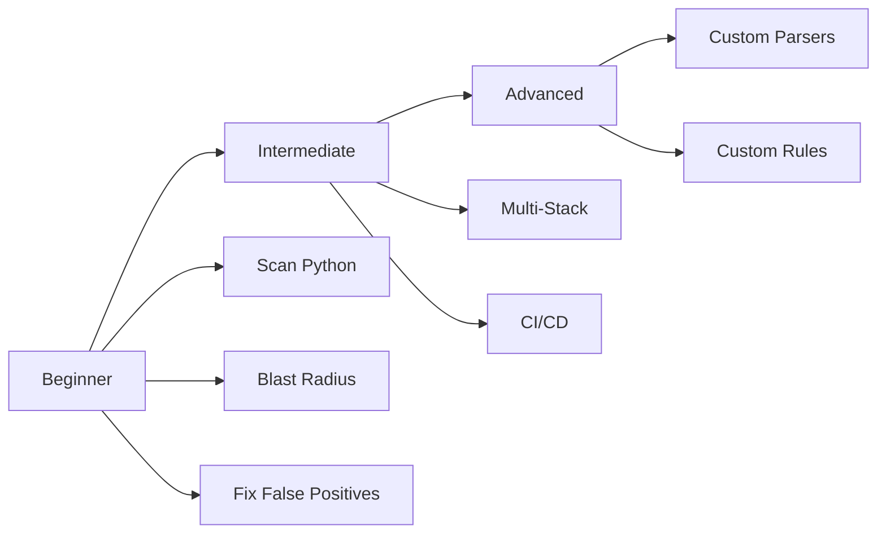

# Tutorials

Step-by-step guides to learn Jnkn from basics to advanced usage.

## Learning Path

## Beginner

Start here if you're new to Jnkn.

| Tutorial | Time | What You'll Learn |
|----------|------|-------------------|
| [Scanning a Python Project](beginner/scanning-python-project.md) | 10 min | Detect env vars in FastAPI/Django |
| [Understanding Blast Radius](beginner/understanding-blast-radius.md) | 15 min | Read and interpret results |
| [Fixing False Positives](beginner/fixing-false-positives.md) | 10 min | Suppressions and tuning |

## Intermediate

For teams integrating Jnkn into workflows.

| Tutorial | Time | What You'll Learn |
|----------|------|-------------------|
| [Multi-Stack Analysis](intermediate/multi-stack-analysis.md) | 20 min | Python + Terraform + dbt |
| [CI/CD Integration](intermediate/ci-cd-integration.md) | 25 min | Full pipeline setup |

## Advanced

Extend Jnkn for your specific needs.

| Tutorial | Time | What You'll Learn |
|----------|------|-------------------|
| [Custom Parsers](advanced/custom-parsers.md) | 30 min | Add new language support |
| [Custom Stitching Rules](advanced/custom-stitching-rules.md) | 30 min | Domain-specific matching |
