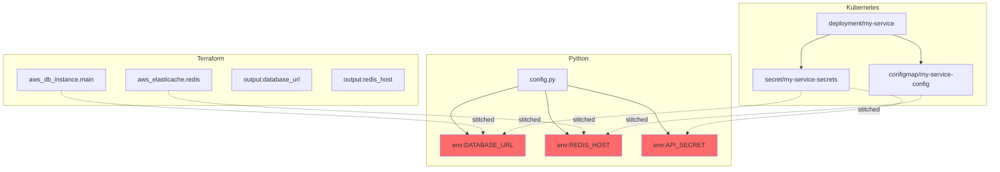

# Multi-Stack Analysis

Analyze dependencies across Python, Terraform, and Kubernetes together.

**Time:** 20 minutes

## The Setup

A typical production stack:

```
my-service/
├── src/
│   └── app/
│       ├── config.py      # Python settings
│       └── main.py        # Application code
├── terraform/
│   ├── main.tf           # Infrastructure
│   └── variables.tf
└── k8s/
    └── deployment.yaml   # Kubernetes manifests
```

## Python Configuration

`src/app/config.py`:

```python
import os

DATABASE_URL = os.getenv("DATABASE_URL")
REDIS_HOST = os.getenv("REDIS_HOST", "localhost")
API_SECRET = os.environ["API_SECRET"]
```

## Terraform Infrastructure

`terraform/main.tf`:

```hcl
resource "aws_db_instance" "main" {
  identifier = "my-service-db"
  engine     = "postgres"
}

resource "aws_elasticache_cluster" "redis" {
  cluster_id = "my-service-redis"
}

output "database_url" {
  value = "postgresql://${aws_db_instance.main.endpoint}/mydb"
}

output "redis_host" {
  value = aws_elasticache_cluster.redis.cache_nodes[0].address
}
```

## Kubernetes Deployment

`k8s/deployment.yaml`:

```yaml
apiVersion: apps/v1
kind: Deployment
metadata:
  name: my-service
spec:
  template:
    spec:
      containers:
        - name: app
          env:
            - name: DATABASE_URL
              valueFrom:
                secretKeyRef:
                  name: my-service-secrets
                  key: database-url
            - name: REDIS_HOST
              valueFrom:
                configMapKeyRef:
                  name: my-service-config
                  key: redis-host
            - name: API_SECRET
              valueFrom:
                secretKeyRef:
                  name: my-service-secrets
                  key: api-secret
```

## Scan Everything

```bash
jnkn scan
```

Output:

```
🔍 Scanning /path/to/my-service
📁 Found 5 files (2 Python, 2 Terraform, 1 Kubernetes)
✅ Parsed 15 nodes, 12 edges
🧵 Stitching cross-domain dependencies...
✅ Created 6 cross-domain links
```

## The Unified Graph

Jnkn builds a single graph across all stacks:



## Cross-Domain Queries

### What breaks if we change the database?

```bash
jnkn blast infra:aws_db_instance.main
```

```json
{
  "source": "infra:aws_db_instance.main",
  "impacted": [
    "env:DATABASE_URL",
    "file://src/app/config.py",
    "k8s:default/secret/my-service-secrets"
  ]
}
```

### What provides REDIS_HOST?

```bash
jnkn explain env:REDIS_HOST infra:aws_elasticache.redis
```

```
Confidence: 0.82 (HIGH)
  [+0.85] token_overlap: [redis, host] match
  [+0.10] terraform_output: output.redis_host references this resource
```

### What happens if we delete the ConfigMap?

```bash
jnkn blast k8s:default/configmap/my-service-config
```

```json
{
  "source": "k8s:default/configmap/my-service-config",
  "impacted": [
    "k8s:default/deployment/my-service",
    "env:REDIS_HOST",
    "file://src/app/config.py"
  ]
}
```

## Real-World Scenario

**PR:** "Rename `redis_host` output to `cache_endpoint`"

```bash
# What's the impact?
jnkn blast infra:output.redis_host
```

```
⚠️  4 artifacts affected:

  • env:REDIS_HOST (config.py will fail to get value)
  • k8s:default/configmap/my-service-config (references old name)
  • k8s:default/deployment/my-service (pod won't start)
  • file://src/app/config.py (REDIS_HOST will be None)
```

**Action:** Update ConfigMap and Python code before merging the Terraform change.

## Next Steps

- [:octicons-arrow-right-24: Set up CI to catch these automatically](ci-cd-integration.md)
- [:octicons-arrow-right-24: Add dbt to your analysis](../../reference/patterns/index.md)
