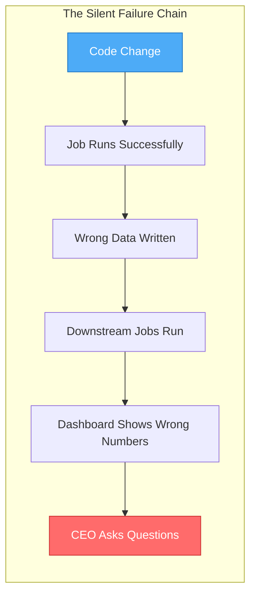
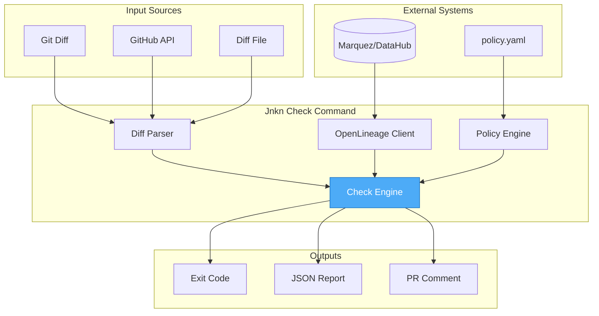
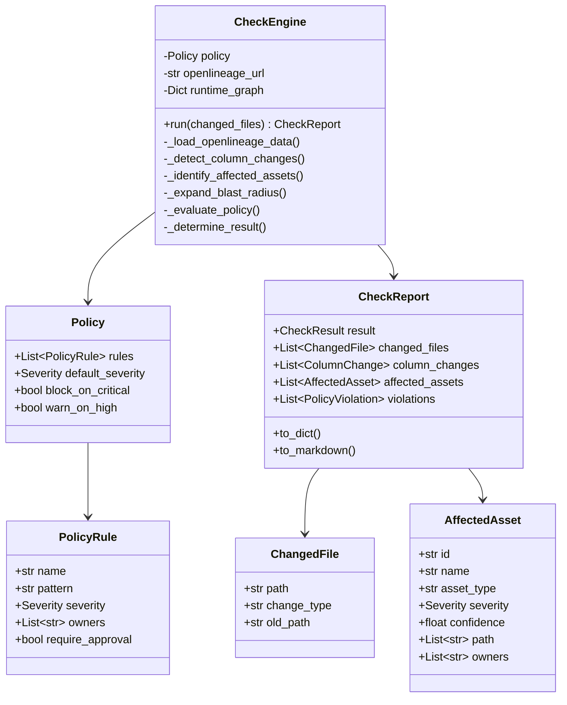
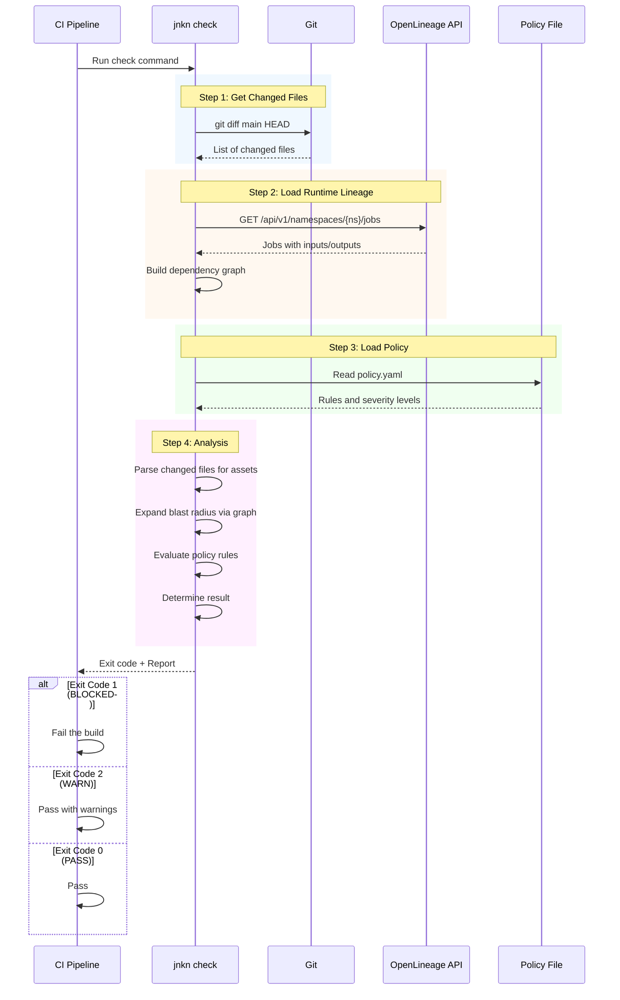
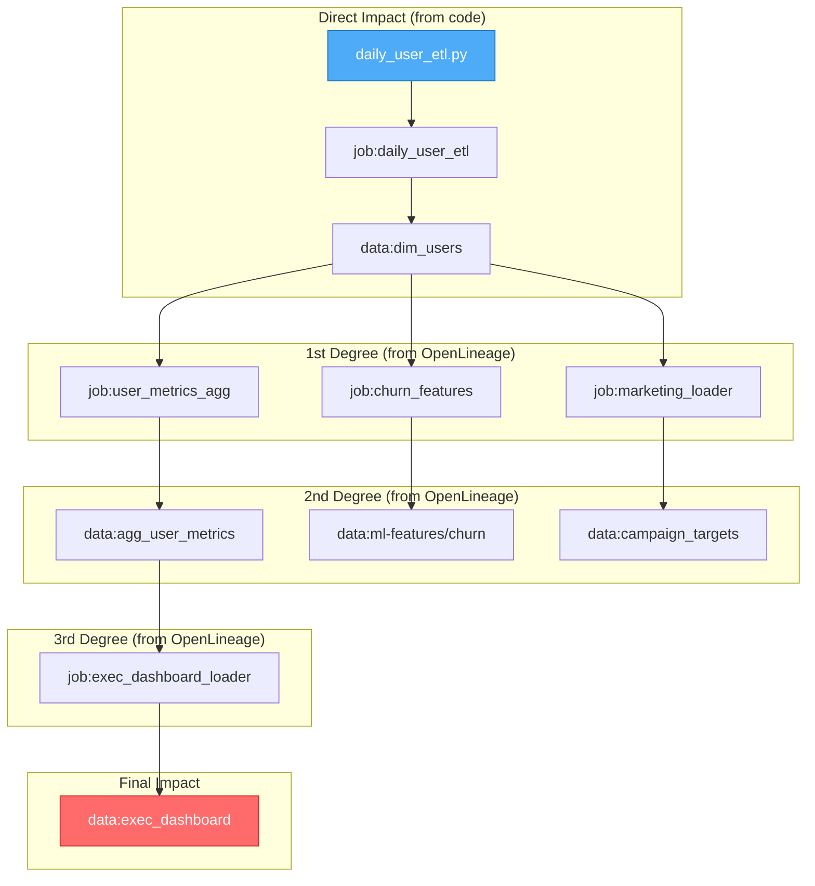
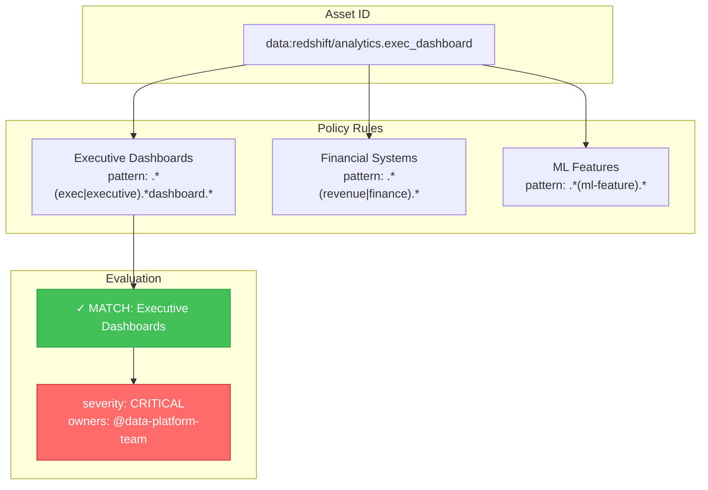
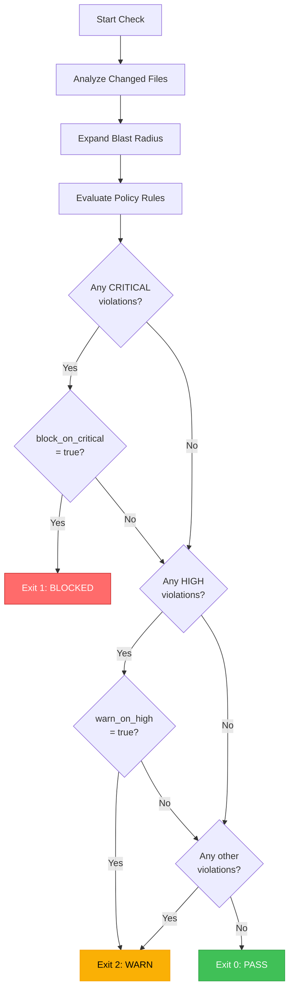

# CI/CD Gate Design

> **Version:** 1.0.0  
> **Last Updated:** December 2024

This document describes the design and implementation of Jnkn's CI/CD gate - a pre-merge enforcement layer that prevents breaking changes from reaching production.

---

## Table of Contents

1. [Value Proposition](#value-proposition)
2. [The Problem We Solve](#the-problem-we-solve)
3. [Solution Overview](#solution-overview)
4. [Architecture](#architecture)
5. [Data Flow](#data-flow)
6. [Policy Engine](#policy-engine)
7. [Exit Codes and Gate Logic](#exit-codes-and-gate-logic)
8. [Integration Points](#integration-points)
9. [Technical Implementation](#technical-implementation)
10. [Usage Examples](#usage-examples)
11. [Deployment Guide](#deployment-guide)

---

## Value Proposition

### The One-Liner

**Jnkn's CI/CD gate tells you "this PR will break the executive dashboard" before you merge, not after the CEO asks why the numbers are wrong.**

### Before Jnkn

```
Developer → PR → Code Review → Merge → Deploy → Run → Silent Failure → Alert
                      │                                       │
                      │                                       ▼
                      │                              Hours/days later:
                      │                              "Why are the numbers wrong?"
                      ▼
              Reviewer can only check:
              - Code quality
              - Test coverage
              - Logic correctness
              
              Reviewer CANNOT know:
              - What consumes this data in production
              - Which dashboards depend on it
              - Which ML models use it as input
```

### After Jnkn

```
Developer → PR → Jnkn Check → Decision
                      │
                      ├─→ PASS: Safe to merge
                      │
                      ├─→ WARN: "Affects ML pipeline, notify @ml-team"
                      │
                      └─→ BLOCK: "Affects executive dashboard, requires approval"
                              │
                              ▼
                      Before any damage occurs:
                      - Stakeholders notified
                      - Approvals requested
                      - Impact documented
```

### Quantified Value

| Metric | Without Jnkn | With Jnkn |
|--------|----------------|-------------|
| Time to detect impact | Hours to days | Seconds (at PR time) |
| Data incidents from code changes | Common | Preventable |
| Mean time to resolution | 4+ hours | N/A (prevented) |
| Stakeholder surprise | Frequent | Eliminated |
| Cross-team coordination | Reactive | Proactive |

---

## The Problem We Solve

### Silent Data Pipeline Failures

Data pipelines don't crash - they produce wrong data. A schema change, a filter modification, a column rename - none of these throw errors. They silently propagate incorrect data downstream.



### The Knowledge Gap

The developer making a change often doesn't know:

1. **Who consumes their output** - "I didn't know the ML team uses this table"
2. **What's considered critical** - "I didn't know this feeds the board deck"
3. **Who to notify** - "I didn't know @finance-data owns this"

This knowledge exists in two places:
- **OpenLineage**: Actual runtime dependencies
- **Tribal knowledge**: Who owns what, what's critical

Jnkn bridges both gaps.

---

## Solution Overview

### Core Concept

```
┌─────────────────────────────────────────────────────────────────────┐
│                         jnkn check                                │
├─────────────────────────────────────────────────────────────────────┤
│                                                                     │
│   INPUTS:                                                           │
│   ┌─────────────┐  ┌─────────────┐  ┌─────────────┐                │
│   │ Changed     │  │ OpenLineage │  │ Policy      │                │
│   │ Files       │  │ Data        │  │ Rules       │                │
│   │ (from PR)   │  │ (runtime)   │  │ (business)  │                │
│   └──────┬──────┘  └──────┬──────┘  └──────┬──────┘                │
│          │                │                │                        │
│          ▼                ▼                ▼                        │
│   ┌─────────────────────────────────────────────────┐              │
│   │              Analysis Engine                     │              │
│   │                                                  │              │
│   │  1. Parse changed files                          │              │
│   │  2. Identify affected assets                     │              │
│   │  3. Expand blast radius (OpenLineage)            │              │
│   │  4. Evaluate policy rules                        │              │
│   │  5. Determine gate decision                      │              │
│   └─────────────────────────────────────────────────┘              │
│                           │                                         │
│                           ▼                                         │
│   OUTPUT:                                                           │
│   ┌─────────────┐  ┌─────────────┐  ┌─────────────┐                │
│   │ Exit Code   │  │ PR Comment  │  │ JSON Report │                │
│   │ 0/1/2       │  │ (Markdown)  │  │ (Artifact)  │                │
│   └─────────────┘  └─────────────┘  └─────────────┘                │
│                                                                     │
└─────────────────────────────────────────────────────────────────────┘
```

### Key Design Principles

1. **Fail-safe defaults**: Unknown assets are flagged, not ignored
2. **Configurable severity**: Business defines what's critical
3. **Transparent decisions**: Every block/warn includes explanation
4. **Graceful degradation**: Works without OpenLineage (reduced accuracy)
5. **CI-native**: Exit codes, JSON output, environment variable support

---

## Architecture

### Component Diagram



### Class Hierarchy



---

## Data Flow

### Sequence Diagram



### Blast Radius Expansion



---

## Policy Engine

### Policy Configuration

```yaml
# policy.yaml

# Global settings
block_on_critical: true   # Exit 1 when critical systems affected
warn_on_high: true        # Exit 2 when high-severity systems affected

# Critical assets - BLOCK the PR
critical:
  - name: Executive Dashboards
    pattern: ".*(exec|executive|board).*dashboard.*"
    severity: critical
    owners:
      - "@data-platform-team"
      - "@analytics-leadership"
    require_approval: true
    notify_always: true

  - name: Financial Systems
    pattern: ".*(revenue|finance|billing).*"
    severity: critical
    owners:
      - "@finance-data"
    require_approval: true

# High-severity assets - WARN
rules:
  - name: ML Feature Pipelines
    pattern: ".*(ml-feature|feature-store|model).*"
    severity: high
    owners:
      - "@ml-engineering"
    require_approval: true

  - name: Data Warehouse Core
    pattern: ".*(dim_|fact_|warehouse\\.).*"
    severity: medium
    owners:
      - "@data-engineering"
    require_approval: false
```

### Pattern Matching



### Severity Levels

| Severity | Exit Code | Behavior | Use Case |
|----------|-----------|----------|----------|
| CRITICAL | 1 | Block PR | Executive dashboards, compliance, revenue |
| HIGH | 2 | Warn, request approval | ML pipelines, core warehouse |
| MEDIUM | 0 | Warn, notify owners | Reporting tables, analytics |
| LOW | 0 | Log only | Staging, temp tables |

---

## Exit Codes and Gate Logic

### Decision Tree



### Exit Code Semantics

```
Exit 0 (PASS)
─────────────
- No policy violations
- OR only LOW severity matches
- Safe to merge automatically

Exit 1 (BLOCKED)  
─────────────────
- CRITICAL severity violation
- AND block_on_critical = true
- PR cannot merge without override
- Requires explicit approval from owners

Exit 2 (WARN)
─────────────
- HIGH severity violation
- OR MEDIUM with notify
- PR can merge but stakeholders notified
- Approval recommended but not required
```

---

## Integration Points

### GitHub Actions

```yaml
name: Jnkn Impact Analysis

on:
  pull_request:
    paths:
      - 'src/**/*.py'
      - 'dbt/**/*.sql'

jobs:
  impact-check:
    runs-on: ubuntu-latest
    steps:
      - uses: actions/checkout@v4
        with:
          fetch-depth: 0
      
      - name: Run Jnkn Check
        id: jnkn
        env:
          OPENLINEAGE_URL: ${{ secrets.MARQUEZ_URL }}
        run: |
          jnkn check \
            --git-diff origin/${{ github.base_ref }} HEAD \
            --policy policy.yaml \
            --output report.json \
            --format json
        continue-on-error: true
      
      - name: Comment on PR
        uses: actions/github-script@v7
        with:
          script: |
            const report = require('./report.json');
            // Post formatted comment
      
      - name: Enforce Gate
        if: steps.jnkn.outcome == 'failure'
        run: exit 1
```

### GitLab CI

```yaml
jnkn-check:
  stage: validate
  script:
    - jnkn check --git-diff $CI_MERGE_REQUEST_TARGET_BRANCH_NAME HEAD
      --openlineage-url $MARQUEZ_URL
      --policy policy.yaml
      --output report.json
  artifacts:
    reports:
      dotenv: jnkn.env
    paths:
      - report.json
  allow_failure:
    exit_codes:
      - 2  # Allow WARN to pass
```

### Jenkins

```groovy
pipeline {
    stages {
        stage('Impact Analysis') {
            steps {
                sh '''
                    jnkn check \
                        --git-diff origin/main HEAD \
                        --policy policy.yaml \
                        --output report.json
                '''
            }
            post {
                always {
                    archiveArtifacts artifacts: 'report.json'
                }
                failure {
                    // Notify stakeholders
                }
            }
        }
    }
}
```

---

## Technical Implementation

### Command Interface

```python
@click.command()
@click.option("--diff", "diff_file", type=click.Path(exists=True),
              help="File containing list of changed files")
@click.option("--git-diff", "git_diff", nargs=2, metavar="BASE HEAD",
              help="Git refs to diff (e.g., main HEAD)")
@click.option("--github-pr", type=int, 
              help="GitHub PR number")
@click.option("--repo", 
              help="GitHub repo (owner/repo)")
@click.option("--openlineage-url", envvar="OPENLINEAGE_URL",
              help="OpenLineage/Marquez API URL")
@click.option("--policy", "policy_file", type=click.Path(exists=True),
              help="Policy YAML file")
@click.option("--fail-if-critical", is_flag=True,
              help="Exit 1 if critical systems affected")
@click.option("--output", "-o", type=click.Path(),
              help="Write JSON report to file")
@click.option("--format", type=click.Choice(["text", "json", "markdown"]),
              default="text")
def check(...):
    """Run pre-merge impact analysis."""
```

### Core Algorithm

```python
class CheckEngine:
    def run(self, changed_files: List[ChangedFile]) -> CheckReport:
        # Step 1: Load runtime lineage (if configured)
        if self.openlineage_url:
            self._load_openlineage_data()
        
        # Step 2: Detect column-level changes
        column_changes = self._detect_column_changes(changed_files)
        
        # Step 3: Identify directly affected assets
        direct_assets = self._identify_affected_assets(changed_files)
        
        # Step 4: Expand blast radius using OpenLineage graph
        all_affected = self._expand_blast_radius(direct_assets)
        
        # Step 5: Evaluate policy rules
        violations = self._evaluate_policy(all_affected)
        
        # Step 6: Determine final result
        result = self._determine_result(violations)
        
        return CheckReport(
            result=result,
            changed_files=changed_files,
            column_changes=column_changes,
            affected_assets=all_affected,
            violations=violations,
        )
```

### Output Formats

**Text (Terminal)**
```
╔════════════════════════════════════════╗
║  ❌ BLOCKED - Critical Impact Detected ║
╚════════════════════════════════════════╝

Summary:
  Changed files:     1
  Downstream impact: 10
  Critical systems:  2

Policy Violations:
  🚨 Executive Dashboards: Changes affect 2 assets
     Required approvers: @data-platform-team
```

**JSON (Artifacts)**
```json
{
  "result": "BLOCKED",
  "exit_code": 1,
  "summary": {
    "changed_files": 1,
    "total_downstream": 10,
    "critical_count": 2
  },
  "violations": [
    {
      "rule": "Executive Dashboards",
      "severity": "critical",
      "required_approvers": ["@data-platform-team"]
    }
  ]
}
```

**Markdown (PR Comments)**
```markdown
## 🔍 Jnkn Impact Analysis

### ❌ BLOCKED - Critical Impact Detected

| Metric | Count |
|--------|-------|
| Changed Files | 1 |
| Downstream Impact | 10 |
| Critical Systems | 2 |

### 🚨 Critical Systems Affected

- **exec_dashboard** (owners: @data-platform-team)
```

---

## Usage Examples

### Basic Usage

```bash
# Diff against main branch
jnkn check --git-diff main HEAD

# From a file of changed paths
jnkn check --diff changed_files.txt

# From GitHub PR
jnkn check --github-pr 123 --repo myorg/myrepo
```

### With OpenLineage

```bash
# Enrich with runtime lineage
jnkn check --git-diff main HEAD \
    --openlineage-url http://marquez:5000 \
    --openlineage-namespace spark-production
```

### With Policy

```bash
# Apply business rules
jnkn check --git-diff main HEAD \
    --policy policy.yaml \
    --fail-if-critical
```

### Full CI Integration

```bash
# Complete example for CI
jnkn check \
    --git-diff origin/main HEAD \
    --openlineage-url $MARQUEZ_URL \
    --policy policy.yaml \
    --output impact-report.json \
    --format json \
    --fail-if-critical

# Use exit code for gate decision
if [ $? -eq 1 ]; then
    echo "BLOCKED: Critical impact detected"
    exit 1
elif [ $? -eq 2 ]; then
    echo "WARNING: Review required"
fi
```

---

## Deployment Guide

### Prerequisites

1. **Jnkn installed**: `pip install jnkn`
2. **Git available**: For diff parsing
3. **OpenLineage/Marquez** (optional): For runtime enrichment
4. **Policy file**: Define your critical assets

### Quick Start

```bash
# 1. Create policy file
cat > policy.yaml << 'EOF'
block_on_critical: true
critical:
  - name: Executive Dashboards
    pattern: ".*exec.*dashboard.*"
    severity: critical
    owners: ["@data-platform"]
    require_approval: true
EOF

# 2. Test locally
jnkn check --git-diff main HEAD --policy policy.yaml

# 3. Add to CI pipeline
# (see GitHub Actions example above)
```

### Environment Variables

| Variable | Description | Default |
|----------|-------------|---------|
| `OPENLINEAGE_URL` | Marquez/DataHub API URL | None |
| `OPENLINEAGE_NAMESPACE` | Namespace to query | All |
| `GITHUB_TOKEN` | For GitHub PR API | None |
| `JUNKAN_POLICY` | Default policy file | None |

### Rollout Strategy

```
Phase 1: Shadow Mode (Week 1-2)
───────────────────────────────
- Run check but don't block
- Collect data on what would be blocked
- Tune policy rules based on findings

Phase 2: Warn Mode (Week 3-4)
─────────────────────────────
- Enable warn_on_high
- Post PR comments
- Don't block merges yet

Phase 3: Enforce Mode (Week 5+)
───────────────────────────────
- Enable block_on_critical
- Fail CI for critical impacts
- Full enforcement active
```

---

## Summary

### What We Built

| Component | Purpose |
|-----------|---------|
| `jnkn check` | CLI command for CI/CD integration |
| Policy Engine | Business rules for severity classification |
| OpenLineage Client | Runtime lineage enrichment |
| Multiple Outputs | Text, JSON, Markdown for different consumers |

### Key Differentiators

1. **Pre-merge, not post-facto** - Catch issues before they cause damage
2. **OpenLineage integration** - Real production dependencies, not guesses
3. **Policy-driven** - Business defines what's critical
4. **CI-native** - Exit codes, artifacts, PR comments

### What's Next

1. **Diff-aware analysis** - "Column X removed" vs "file changed"
2. **Approval workflows** - Native GitHub/GitLab approval integration
3. **Slack notifications** - Direct alerts to team channels
4. **Dashboard** - Web UI for exploring impact history