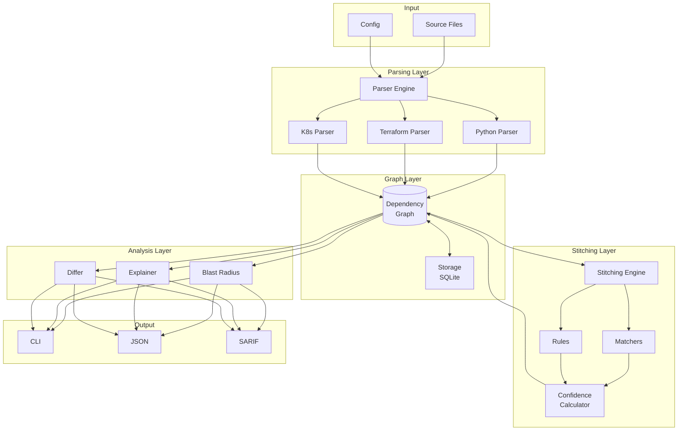

# Architecture Overview

Jnkn's architecture in one page.

## System Diagram



## Components

### Parsing Layer

**Responsibility:** Convert source files into nodes and edges.

- **Parser Engine** — Orchestrates file discovery and parser dispatch
- **Language Parsers** — Extract patterns from specific languages
- **Extractors** — Detect specific code patterns (e.g., `os.getenv`)

### Graph Layer

**Responsibility:** Store and query the dependency graph.

- **Dependency Graph** — In-memory NetworkX graph for traversal
- **Storage** — SQLite for persistence and incremental updates

### Stitching Layer

**Responsibility:** Create cross-domain edges.

- **Stitching Engine** — Evaluates all node pairs against rules
- **Matchers** — Compute similarity between artifact names
- **Rules** — Define which node types can be linked
- **Confidence Calculator** — Score match quality

### Analysis Layer

**Responsibility:** Answer questions about the graph.

- **Blast Radius** — BFS traversal to find downstream impact
- **Explainer** — Show why matches were made/rejected
- **Differ** — Compare graphs across git refs

## Data Flow

### Scan

```
Files → Parsers → Nodes/Edges → Graph → Stitching → Cross-Domain Edges → Storage
```

### Query

```
User Query → Graph Load → Traversal → Results → Output Format
```

## Key Design Principles

1. **Incremental by default** — Only re-scan changed files
2. **Explainable** — Every match can be explained
3. **Configurable** — Thresholds and rules are tunable
4. **Extensible** — Add new parsers/rules without core changes
5. **Fast** — SQLite + in-memory graph for speed

## Technology Choices

| Component | Technology | Rationale |
|-----------|------------|-----------|
| Parsing | Tree-sitter | Language-agnostic, accurate AST |
| Graph | NetworkX | Rich algorithms, Python-native |
| Storage | SQLite | Zero-config, portable, fast |
| CLI | Click | Standard for Python CLIs |
| Config | YAML | Human-readable, version-controllable |
