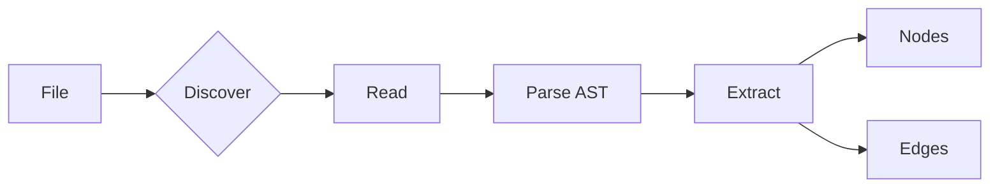

# Parsing Pipeline

How source files become nodes and edges.

## Pipeline Stages



## Stage 1: Discovery

The parser engine discovers files to scan:

```python
# Pseudocode
for file in walk_directory(root):
    if not ignored(file) and supported_extension(file):
        yield file
```

**Filters applied:**
- `.jnknignore` patterns
- Built-in ignores (`.git`, `node_modules`, etc.)
- File extension whitelist

## Stage 2: Read & Hash

Files are read and hashed for incremental scanning:

```python
content = file.read_bytes()
hash = xxhash.xxh64(content).hexdigest()

if hash == stored_hash:
    skip()  # File unchanged
```

## Stage 3: Parse AST

Tree-sitter parses the file into an Abstract Syntax Tree:

```python
parser = get_parser("python")
tree = parser.parse(content)
```

The AST represents code structure:

```
(module
  (expression_statement
    (assignment
      left: (identifier)  # DATABASE_URL
      right: (call
        function: (attribute
          object: (identifier)   # os
          attribute: (identifier))  # getenv
        arguments: (argument_list
          (string))))))  # "DATABASE_URL"
```

## Stage 4: Extract

Extractors run tree-sitter queries to find patterns:

```python
query = language.query("""
(call
  function: (attribute
    object: (identifier) @obj
    attribute: (identifier) @method)
  arguments: (argument_list (string) @env_var)
  (#eq? @obj "os")
  (#eq? @method "getenv"))
""")

for match in query.captures(tree.root_node):
    yield EnvVar(name=match.text)
```

**Extractors run in priority order:**
1. StdlibExtractor (100) — `os.getenv`, `os.environ`
2. PydanticExtractor (90) — BaseSettings
3. ClickTyperExtractor (80) — `envvar=`
4. HeuristicExtractor (10) — Fallback patterns

## Stage 5: Yield Nodes & Edges

Extractors yield graph elements:

```python
# Node: The env var itself
yield Node(
    id="env:DATABASE_URL",
    type=NodeType.ENV_VAR,
    metadata={"line": 10}
)

# Edge: File reads this env var
yield Edge(
    source="file://src/config.py",
    target="env:DATABASE_URL",
    type=RelationshipType.READS
)
```

## Complete Example

Input file `src/config.py`:

```python
import os

DATABASE_URL = os.getenv("DATABASE_URL")
REDIS_HOST = os.environ.get("REDIS_HOST", "localhost")
```

Output:

```
Nodes:
  - file://src/config.py (code_file)
  - env:DATABASE_URL (env_var)
  - env:REDIS_HOST (env_var)

Edges:
  - file://src/config.py → env:DATABASE_URL (reads)
  - file://src/config.py → env:REDIS_HOST (reads)
```

## Fallback: Regex Parsing

When tree-sitter isn't available, regex patterns are used:

```python
ENV_VAR_PATTERNS = [
    (r'os\.getenv\s*\(\s*["\']([^"\']+)["\']', "os.getenv"),
    (r'os\.environ\.get\s*\(\s*["\']([^"\']+)["\']', "os.environ.get"),
    ...
]
```

Regex is less accurate but provides broad compatibility.

## Adding a New Extractor

1. Implement `BaseExtractor`
2. Define tree-sitter query or regex pattern
3. Register with parser
4. Extractors are automatically run in priority order

See [Custom Parsers Tutorial](../../tutorials/advanced/custom-parsers.md).
