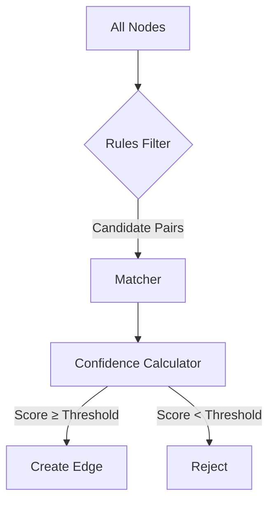

# Stitching Engine

How cross-domain links are discovered.

## The Problem

After parsing, we have nodes from different domains:

```
Python: env:DATABASE_URL, env:REDIS_HOST
Terraform: infra:aws_db_instance.main, infra:aws_elasticache.redis
```

These are **semantically related** but not explicitly connected. Stitching finds these implicit dependencies.

## How It Works



## Stage 1: Rule Filtering

Rules define which node pairs to consider:

```python
class EnvVarToInfraRule(StitchingRule):
    source_types = {NodeType.ENV_VAR}
    target_types = {NodeType.INFRA_RESOURCE}
    
    def should_evaluate(self, source, target):
        # Quick filter before expensive matching
        return len(source.tokens) > 0 and len(target.tokens) > 0
```

This reduces the search space from O(n²) to relevant pairs.

## Stage 2: Token Extraction

Names are tokenized for comparison:

```python
"DATABASE_URL"     → ["database", "url"]
"aws_db_instance"  → ["aws", "db", "instance"]
"REDIS_HOST"       → ["redis", "host"]
```

**Tokenization rules:**
- Split on `_`, `-`, case changes
- Lowercase everything
- Remove blocked tokens (`id`, `key`, etc.)
- Filter tokens shorter than `min_token_length`

## Stage 3: Matching

The matcher computes similarity:

```python
source_tokens = {"database", "url"}
target_tokens = {"database", "instance"}

overlap = source_tokens & target_tokens  # {"database"}
score = len(overlap) / max(len(source_tokens), len(target_tokens))
# score = 1/2 = 0.5
```

**Match types:**

| Type | Condition | Base Score |
|------|-----------|------------|
| Exact | Normalized names equal | 1.0 |
| Normalized | Lowercased names equal | 0.9 |
| High Overlap | >80% token overlap | 0.85 |
| Medium Overlap | 50-80% overlap | 0.7 |
| Suffix | Names end the same | 0.6 |
| Contains | One name contains the other | 0.5 |

## Stage 4: Confidence Calculation

Penalties adjust the base score:

```python
base_score = 0.85  # High token overlap

penalties = [
    0.5 if any(len(t) < 4 for t in matched_tokens) else 1.0,  # Short token
    0.7 if matched_only_common_tokens else 1.0,  # Common tokens
]

final_score = base_score * product(penalties)
# 0.85 * 0.5 = 0.425
```

## Stage 5: Edge Creation

If confidence ≥ threshold, create an edge:

```python
if confidence.score >= min_confidence:
    graph.add_edge(
        source=source.id,
        target=target.id,
        type=RelationshipType.REFERENCES,
        metadata={
            "rule": rule.name,
            "confidence": confidence.score,
            "matched_tokens": matched_tokens,
        }
    )
```

## Example Walkthrough

**Input:**
- `env:DATABASE_URL` (from Python)
- `infra:output.database_url` (from Terraform)

**Step 1: Rule check**
- EnvVarToInfraRule matches (env_var → infra_resource)

**Step 2: Tokenize**
- Source: `["database", "url"]`
- Target: `["database", "url"]`

**Step 3: Match**
- Overlap: `{"database", "url"}` = 100%
- Type: Normalized match (names equal after normalization)

**Step 4: Confidence**
- Base: 0.9 (normalized match)
- Penalties: none
- Final: 0.9 (HIGH)

**Step 5: Create edge**
- `env:DATABASE_URL → infra:output.database_url` (confidence: 0.9)

## Performance

Stitching is O(n × m) where n and m are node counts per type. Optimizations:

1. **Rule filtering** — Only evaluate relevant pairs
2. **Token indexing** — Hash tokens for fast lookup
3. **Early termination** — Skip if no token overlap possible
4. **Batch processing** — Process in chunks for large graphs

## Adding Custom Rules

See [Custom Stitching Rules Tutorial](../../tutorials/advanced/custom-stitching-rules.md).
