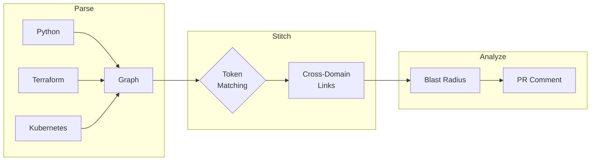

---
hide:
  - navigation
  - toc
---

# Jnkn

**Catch cross-domain breaking changes before they reach production.**

## Why `jnkn`?

<div class="grid cards" markdown>

-   :material-alert-circle:{ .lg .middle } **The 3am Page**

    ---

    You renamed a variable in Terraform. CI passed. Code review approved. Deploy went smooth. Then your app crashes at 3am because Python still expects the old name. Every team has this story.

-   :material-bomb:{ .lg .middle } **It Gets Worse**

    ---

    Your data engineer updates a dbt model, renaming `user_id` to `customer_id`. dbt tests pass. But downstream, three Airflow DAGs, a Spark job, and your ML pipeline all expect `user_id`. You find out when dashboards go blank Monday morning.

-   :material-shield-check:{ .lg .middle } **Junkan Catches It**

    ---

    Junkan builds a dependency graph across your entire stack. Before you merge, you see: *"This change impacts 4 Python files, 2 Terraform outputs, and 1 Kubernetes secret."* No more surprises.

</div>

## How It Works



1. **Parse** your codebase into a dependency graph
2. **Stitch** cross-domain links using token matching
3. **Analyze** the impact of your changes against the main branch

## Quick Start

<div class="grid cards" markdown>

-   **1. Install**

    ---

    ```bash
    pip install jnkn
    ```

-   **2. Start**

    ---

    ```bash
    jnkn init
    ```

-   **3. Analyze**

    ---

    ```bash
    jnkn check
    ```

</div>

## Features

<div class="grid cards" markdown>

  - :material-clock-fast:{ .lg .middle } **5-Minute Setup**

    -----

    Install and scan your first project in minutes. Auto-detection for Python, Terraform, dbt, and K8s.

    [:octicons-arrow-right-24: Quickstart](getting-started/quickstart.md)

  - :material-graph:{ .lg .middle } **Understand Impact**

    -----

    See exactly what breaks when you change infrastructure or code. Traverse dependencies across domains.

  - :material-github:{ .lg .middle } **CI/CD Ready**

    -----

    Block risky PRs automatically with GitHub Actions. Get impact analysis comments on every pull request.

    [:octicons-arrow-right-24: CI Integration](getting-started/first-ci-integration.md)

  - :material-lock:{ .lg .middle } **Secure by Design**

    -----

    Your code never leaves your environment. Analysis happens locally or in your CI runner. We don't see your secrets.

</div>

## Supported Stacks

| Language/Tool | Patterns Detected |
|---------------|-------------------|
| **Python** | `os.getenv`, Pydantic Settings, Click/Typer, django-environ |
| **Terraform** | Resources, variables, outputs, data sources |
| **Kubernetes** | ConfigMaps, Secrets, environment variables |
| **dbt** | `ref()`, `source()`, `var()` |
| **JavaScript** | `process.env`, dotenv |

## Get Started

<div class="grid cards" markdown>

  - :material-download:{ .lg .middle } **Install**

    -----

    [:octicons-arrow-right-24: Installation Guide](getting-started/installation.md)

  - :material-rocket-launch:{ .lg .middle } **Quickstart**

    -----

    [:octicons-arrow-right-24: 5-Minute Tutorial](getting-started/quickstart.md)

</div>