# OpenLineage Integration Architecture

> **Version:** 1.0.0  
> **Last Updated:** December 2024

This document describes how Jnkn integrates with OpenLineage to provide complete pre-merge impact analysis for data pipelines.

---

## Table of Contents

1. [Executive Summary](#executive-summary)
2. [The Problem](#the-problem)
3. [Why OpenLineage Alone Isn't Enough](#why-openlineage-alone-isnt-enough)
4. [The Jnkn + OpenLineage Solution](#the-jnkn--openlineage-solution)
5. [Architecture Overview](#architecture-overview)
6. [Data Flow](#data-flow)
7. [Integration Patterns](#integration-patterns)
8. [Technical Implementation](#technical-implementation)
9. [Confidence Model](#confidence-model)
10. [CI/CD Integration](#cicd-integration)
11. [Deployment Options](#deployment-options)

---

## Executive Summary

**The Problem:** Data pipeline failures are often caused by upstream code changes that existing tools only detect after downstream damage occurs.

**The Gap:** OpenLineage captures runtime lineage (what happened), but cannot predict the impact of code changes before they're deployed.

**The Solution:** Jnkn combines static code analysis with OpenLineage runtime data to provide pre-merge impact prediction with production-grade confidence.

```
┌─────────────────────────────────────────────────────────────────────┐
│                                                                     │
│   Code Change → Jnkn Analysis → OpenLineage Lookup → Impact Map   │
│                                                                     │
│   "This PR modifies     "Which jobs      "These 4 systems          │
│    column X"             consume X?"      will be affected"         │
│                                                                     │
└─────────────────────────────────────────────────────────────────────┘
```

---

## The Problem

### Silent Data Pipeline Failures

Data pipelines fail silently. Unlike application code that throws errors, data issues often manifest as:

- Wrong numbers in dashboards
- Degraded ML model performance
- Compliance reports with incorrect values
- Analytics that "look fine" but are subtly wrong

### The Root Cause

Most data incidents trace back to upstream changes:


### Current State: Siloed Tooling

| Tool | What It Sees | What It Misses |
|------|--------------|----------------|
| Unit Tests | Code logic | Downstream consumers |
| OpenLineage | Runtime dependencies | Future code changes |
| Data Quality Tools | Anomalies after the fact | Root cause in code |
| Code Review | Syntax and logic | Production dependencies |

---

## Why OpenLineage Alone Isn't Enough

OpenLineage is excellent at capturing **what happened**. It records:

- Which jobs ran
- What datasets were read/written
- Column-level lineage (with proper instrumentation)
- Execution timestamps and durations


### The Timing Gap

```
Timeline:
─────────────────────────────────────────────────────────────────────►

   PR Created    PR Merged    Job Runs    Failure Detected
       │             │            │              │
       ▼             ▼            ▼              ▼
   ┌───────┐    ┌────────┐   ┌────────┐    ┌──────────┐
   │ Code  │    │ Deploy │   │ OpenL. │    │ PagerDuty│
   │ Review│    │        │   │ Event  │    │ Alert    │
   └───────┘    └────────┘   └────────┘    └──────────┘
       │                          │              │
       │                          │              │
       ▼                          ▼              ▼
   No lineage              Lineage recorded   Too late
   info available          (post-facto)       to prevent
```

**OpenLineage tells you what broke. It cannot tell you what will break.**

---

## The Jnkn + OpenLineage Solution

Jnkn bridges the timing gap by combining:

1. **Static Analysis** (pre-merge): Parse code to understand what changes
2. **Runtime Lineage** (OpenLineage): Know actual production dependencies
3. **Impact Prediction**: Map code changes to affected systems

```mermaid
graph TB
    subgraph "Pre-Merge (Jnkn)"
        PR[Pull Request]
        STATIC[Static Analysis]
        DIFF[Change Detection]
    end
    
    subgraph "Runtime Data (OpenLineage)"
        OL_DB[(OpenLineage<br/>Marquez/DataHub)]
        JOBS[Job Catalog]
        DEPS[Dependencies]
    end
    
    subgraph "Combined Analysis"
        MERGE[Unified Graph]
        IMPACT[Impact Calculator]
        DECISION[Gate Decision]
    end
    
    PR --> STATIC
    STATIC --> DIFF
    DIFF --> MERGE
    
    OL_DB --> JOBS
    OL_DB --> DEPS
    JOBS --> MERGE
    DEPS --> MERGE
    
    MERGE --> IMPACT
    IMPACT --> DECISION
    
    DECISION --> BLOCK[❌ Block PR]
    DECISION --> WARN[⚠️ Warn + Notify]
    DECISION --> PASS[✅ Safe to Merge]
    
    style MERGE fill:#4dabf7,stroke:#1971c2,color:#fff
    style BLOCK fill:#ff6b6b,stroke:#c92a2a,color:#fff
    style WARN fill:#fab005,stroke:#f59f00,color:#000
    style PASS fill:#40c057,stroke:#2f9e44,color:#fff
```



### Value Proposition

| Capability | OpenLineage Only | Jnkn + OpenLineage |
|------------|------------------|----------------------|
| Know what ran | ✅ | ✅ |
| Know dependencies | ✅ | ✅ |
| Predict impact pre-merge | ❌ | ✅ |
| Block risky PRs | ❌ | ✅ |
| Auto-notify downstream teams | ❌ | ✅ |
| Confidence scoring | N/A | ✅ (100% for runtime data) |

---

## Architecture Overview

### System Components


### Data Model


---

## Data Flow

### End-to-End Flow


### OpenLineage Data Ingestion


---

## Integration Patterns

### Pattern 1: API-Based (Real-Time)

Query OpenLineage at PR time for freshest data.

```python
# In CI pipeline
from jnkn.parsing.openlineage import OpenLineageParser

parser = OpenLineageParser()
events = parser.fetch_from_marquez(
    base_url="http://marquez.internal:5000",
    namespace="spark-production"
)

for item in parser.parse_events(events):
    graph.add(item)
```

**Pros:** Always current  
**Cons:** Adds latency, requires network access from CI

### Pattern 2: Snapshot-Based (Periodic Sync)

Export OpenLineage data periodically, commit to repo or artifact store.

```yaml
# .github/workflows/sync-lineage.yml
name: Sync OpenLineage
on:
  schedule:
    - cron: '0 */6 * * *'  # Every 6 hours

jobs:
  sync:
    runs-on: ubuntu-latest
    steps:
      - run: |
          curl -o lineage.json \
            "$MARQUEZ_URL/api/v1/namespaces/spark/jobs"
      - uses: actions/upload-artifact@v3
        with:
          name: lineage-snapshot
          path: lineage.json
```

**Pros:** Fast CI, no runtime dependency  
**Cons:** Up to 6 hours stale

### Pattern 3: Hybrid (Cached + Delta)

Use cached snapshot, fetch only recent changes.

```python
# Load cached baseline
cached_graph = load_from_cache("lineage-snapshot.json")

# Fetch only events since last sync
recent_events = parser.fetch_from_marquez(
    base_url=MARQUEZ_URL,
    since=cached_graph.last_updated
)

# Merge
for item in parser.parse_events(recent_events):
    cached_graph.add(item)
```

**Pros:** Fast + fresh  
**Cons:** More complex implementation

---

## Technical Implementation

### OpenLineage Parser

```python
class OpenLineageParser:
    """
    Converts OpenLineage events to Jnkn nodes and edges.
    
    Supports:
    - Marquez API
    - DataHub API  
    - Raw JSON event files
    - Kafka event streams (planned)
    """
    
    def parse_events(self, events: List[Dict]) -> Iterator[Node | Edge]:
        for event in events:
            # Extract job node
            yield self._create_job_node(event["job"])
            
            # Extract input datasets + READS edges
            for input in event.get("inputs", []):
                yield self._create_dataset_node(input)
                yield Edge(
                    source_id=job_id,
                    target_id=dataset_id,
                    type=RelationshipType.READS,
                    confidence=1.0  # Observed in production
                )
            
            # Extract output datasets + WRITES edges
            for output in event.get("outputs", []):
                yield self._create_dataset_node(output)
                yield Edge(
                    source_id=job_id,
                    target_id=dataset_id,
                    type=RelationshipType.WRITES,
                    confidence=1.0
                )
            
            # Extract column lineage if present
            yield from self._extract_column_lineage(output)
```

### Cross-Domain Stitching

Jnkn links code files to OpenLineage jobs via token matching:


### Unified Graph Queries

```python
# Find all downstream consumers of a table
downstream = graph.get_downstream("data:s3/warehouse/dim_users")

# Result:
# [
#   ("job:spark/user_metrics", confidence=1.0, path=[...]),
#   ("job:spark/exec_dashboard_loader", confidence=1.0, path=[...]),
#   ("data:redshift/exec_dashboard", confidence=1.0, path=[...]),
# ]

# Find what code files affect a critical table
upstream = graph.get_upstream("data:redshift/exec_dashboard")

# Result includes both:
# - OpenLineage jobs (runtime)
# - Code files (static analysis)
```

---

## Confidence Model

### Confidence Levels by Source

| Source | Confidence | Rationale |
|--------|------------|-----------|
| OpenLineage (runtime) | 1.0 | Observed in production |
| Static: Direct column reference | 0.95 | High certainty from code |
| Static: Variable-resolved column | 0.80 | Resolved at parse time |
| Cross-domain stitch (exact match) | 0.95 | Name match |
| Cross-domain stitch (token overlap) | 0.70-0.85 | Fuzzy match |
| Static: Dynamic/unresolved | 0.50 | Flagged for review |

### Confidence Propagation

```mermaid
graph LR
    A[Code File<br/>conf: 0.95] -->|PROVIDES| B[Job<br/>conf: 1.0]
    B -->|WRITES| C[Table A<br/>conf: 1.0]
    C -->|READS| D[Job 2<br/>conf: 1.0]
    D -->|WRITES| E[Table B<br/>conf: 1.0]
    
    subgraph "Path Confidence"
        PATH["A → E: min(0.95, 1.0, 1.0, 1.0, 1.0) = 0.95"]
    end
```



Path confidence = minimum confidence along the path.

---

## CI/CD Integration

### GitHub Actions Example

```yaml
name: Jnkn Impact Analysis

on:
  pull_request:
    paths:
      - 'src/**/*.py'
      - 'dbt/**/*.sql'
      - 'terraform/**/*.tf'

jobs:
  impact-analysis:
    runs-on: ubuntu-latest
    steps:
      - uses: actions/checkout@v3
      
      - name: Setup Python
        uses: actions/setup-python@v4
        with:
          python-version: '3.11'
      
      - name: Install Jnkn
        run: pip install jnkn
      
      - name: Fetch OpenLineage Data
        env:
          MARQUEZ_URL: ${{ secrets.MARQUEZ_URL }}
        run: |
          jnkn openlineage fetch \
            --url $MARQUEZ_URL \
            --output lineage-cache.json
      
      - name: Run Impact Analysis
        run: |
          jnkn analyze \
            --changed-files "${{ github.event.pull_request.changed_files }}" \
            --openlineage lineage-cache.json \
            --critical-tables config/critical-tables.yaml \
            --output impact-report.json
      
      - name: Post Results
        uses: actions/github-script@v6
        with:
          script: |
            const report = require('./impact-report.json');
            
            let comment = '## 🔍 Jnkn Impact Analysis\n\n';
            
            if (report.critical_impact.length > 0) {
              comment += '### 🚨 Critical Systems Affected\n';
              for (const item of report.critical_impact) {
                comment += `- ${item.system} (confidence: ${item.confidence})\n`;
              }
              comment += '\n**This PR requires approval from data platform team.**\n';
            }
            
            if (report.downstream_count > 0) {
              comment += `\n### 📊 Downstream Impact\n`;
              comment += `- **${report.downstream_count}** jobs affected\n`;
              comment += `- **${report.tables_affected}** tables affected\n`;
            }
            
            github.rest.issues.createComment({
              issue_number: context.issue.number,
              owner: context.repo.owner,
              repo: context.repo.repo,
              body: comment
            });
      
      - name: Gate Decision
        run: |
          if jnkn gate --report impact-report.json --policy config/policy.yaml; then
            echo "✅ Safe to merge"
          else
            echo "❌ Blocked - requires approval"
            exit 1
          fi
```

### Critical Tables Configuration

```yaml
# config/critical-tables.yaml
critical:
  # Executive dashboards
  - pattern: "redshift/analytics.exec_*"
    severity: critical
    owners:
      - "@data-platform-team"
      - "@analytics-team"
    require_approval: true
  
  # ML feature stores
  - pattern: "s3/ml-features/*"
    severity: high
    owners:
      - "@ml-engineering"
    require_approval: true
  
  # Compliance/audit
  - pattern: "*/compliance.*"
    severity: critical
    owners:
      - "@compliance-team"
      - "@data-governance"
    require_approval: true
    notify_always: true
```

---

## Deployment Options

### Option 1: Standalone CLI

```bash
# Install
pip install jnkn

# One-time analysis
jnkn analyze \
  --dir ./src \
  --openlineage-url http://marquez:5000 \
  --output report.json
```

### Option 2: CI/CD Integration

See GitHub Actions example above. Also supports:
- GitLab CI
- Jenkins
- CircleCI
- Azure DevOps

### Option 3: Service Mode (Planned)

```yaml
# docker-compose.yml
services:
  jnkn:
    image: jnkn/server:latest
    ports:
      - "8080:8080"
    environment:
      - MARQUEZ_URL=http://marquez:5000
      - GITHUB_TOKEN=${GITHUB_TOKEN}
    volumes:
      - ./config:/config
```

Provides:
- REST API for impact queries
- Webhook receiver for PR events
- Continuous lineage sync
- Web UI for exploration

---

## Summary

### Before: Reactive Firefighting

```
Code Change → Deploy → Run → Failure → Alert → Debug → Fix → Deploy
                                         │
                                    Hours/Days of
                                    wrong data
```

### After: Proactive Prevention

```
Code Change → Jnkn + OpenLineage → Impact Known → Coordinated Deploy
                     │
              Block if critical,
              notify stakeholders
```

### Key Takeaways

1. **OpenLineage is necessary but not sufficient** - It captures runtime truth but can't predict future impact.

2. **Static analysis alone misses production reality** - Code doesn't know what actually runs in production.

3. **The combination is powerful** - Static analysis predicts what changes, OpenLineage knows what depends on what, together they prevent incidents.

4. **Confidence matters** - Runtime lineage has 100% confidence (observed), static analysis ranges from 50-95% (inferred). The unified model tracks this.

5. **CI/CD integration is the delivery mechanism** - The value is realized when every PR gets automatic impact analysis before merge.

---

## References

- [OpenLineage Specification](https://openlineage.io/spec)
- [Marquez Documentation](https://marquezproject.ai/docs)
- [DataHub Lineage](https://datahubproject.io/docs/lineage)
- [Jnkn Architecture](./ARCHITECTURE.md)
- [PySpark Column Lineage](./COLUMN_LINEAGE_DESIGN.md)