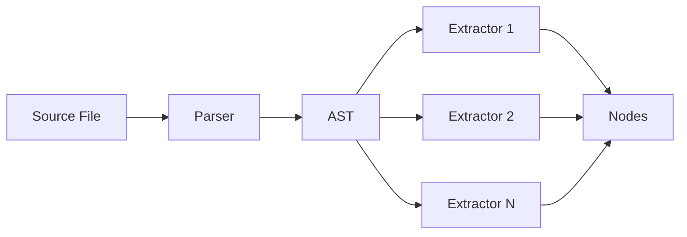

# Supported Patterns

Jnkn detects environment variables and configuration patterns across multiple languages and frameworks.

## How Detection Works

1. **Parse** — Tree-sitter parses source code into an AST
2. **Extract** — Pattern extractors find specific code patterns
3. **Normalize** — Variable names are tokenized for matching



## Supported Languages

| Language | Patterns | Status |
|----------|----------|--------|
| [Python](python-env-vars.md) | os.getenv, Pydantic, Click, django-environ | ✅ Full |
| [Terraform](terraform-resources.md) | Resources, variables, outputs | ✅ Full |
| [Kubernetes](kubernetes-refs.md) | ConfigMaps, Secrets, env vars | ✅ Full |
| JavaScript | process.env, dotenv | 🚧 Beta |
| dbt | ref(), source(), var() | ✅ Full |

## Adding New Patterns

If Jnkn doesn't detect your pattern:

1. Check if it's a supported variation
2. File a GitHub issue with an example
3. Or [write a custom extractor](../../tutorials/advanced/custom-parsers.md)

## Detection Confidence

Each pattern has inherent confidence:

| Source | Base Confidence | Notes |
|--------|-----------------|-------|
| Explicit (`os.getenv("VAR")`) | 1.0 | Direct reference |
| Framework (`Field(env="VAR")`) | 0.95 | Framework-specific |
| Inferred (Pydantic field name) | 0.85 | Name → env var mapping |
| Heuristic (`DATABASE_URL = ...`) | 0.7 | Pattern-based guess |

## Testing Detection

Check if a pattern is detected:

```bash
jnkn scan --verbose --files myfile.py
```

Or test in Python:

```python
from jnkn.parsing.python import PythonParser

parser = PythonParser()
content = b'DATABASE_URL = os.getenv("DATABASE_URL")'

for item in parser.parse(Path("test.py"), content):
    print(item)
```
