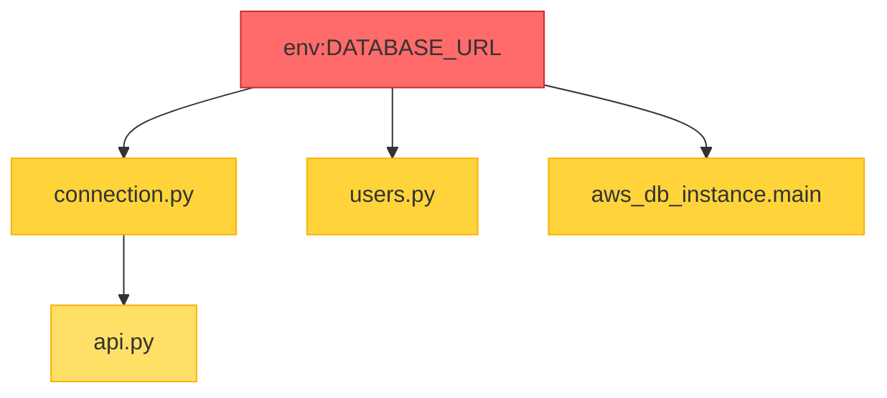

# Understanding Blast Radius

Learn to read Jnkn's impact analysis output.

**Time:** 15 minutes

## What is Blast Radius?

Blast radius answers: **"If I change X, what else might break?"**



Changing `DATABASE_URL` directly impacts 3 artifacts, and transitively impacts 1 more.

## Running Blast Radius

```bash
jnkn blast env:DATABASE_URL
```

### JSON Output (Default)

```json
{
  "source_artifacts": ["env:DATABASE_URL"],
  "total_impacted_count": 4,
  "impacted_artifacts": [
    "file://src/db/connection.py",
    "file://src/api/users.py",
    "infra:aws_db_instance.main",
    "file://src/api/api.py"
  ],
  "breakdown": {
    "code": ["file://src/db/connection.py", "file://src/api/users.py", "file://src/api/api.py"],
    "infra": ["infra:aws_db_instance.main"],
    "env": [],
    "data": []
  },
  "max_depth_reached": 2
}
```

### Understanding the Fields

| Field | Meaning |
|-------|---------|
| `source_artifacts` | What you're analyzing |
| `total_impacted_count` | Total downstream artifacts |
| `impacted_artifacts` | List of affected artifacts |
| `breakdown` | Grouped by type |
| `max_depth_reached` | How far the impact travels |

## Reading Artifact IDs

Jnkn uses prefixed IDs to identify artifact types:

| Prefix | Type | Example |
|--------|------|---------|
| `env:` | Environment variable | `env:DATABASE_URL` |
| `file://` | Code file | `file://src/app.py` |
| `infra:` | Infrastructure resource | `infra:aws_rds.main` |
| `data:` | Data asset (dbt model) | `data:fct_orders` |
| `k8s:` | Kubernetes resource | `k8s:default/deployment/api` |

## Limiting Depth

For large graphs, limit traversal depth:

```bash
jnkn blast env:DATABASE_URL --max-depth 1
```

This shows only direct dependencies, not transitive ones.

## Multiple Sources

Analyze multiple artifacts at once:

```bash
jnkn blast env:DATABASE_URL env:REDIS_URL
```

The result shows the **union** of all impacted artifacts.

## Output Formats

=== "JSON"

    ```bash
    jnkn blast env:X --format json
    ```

=== "Markdown"

    ```bash
    jnkn blast env:X --format markdown
    ```
    
    ```markdown
    ## Blast Radius: env:X
    
    **4 artifacts impacted**
    
    | Type | Artifact |
    |------|----------|
    | code | file://src/db/connection.py |
    | code | file://src/api/users.py |
    | infra | infra:aws_db_instance.main |
    ```

=== "Plain"

    ```bash
    jnkn blast env:X --format plain
    ```
    
    ```
    file://src/db/connection.py
    file://src/api/users.py
    infra:aws_db_instance.main
    ```

## Interpreting Results

### Low Impact (1-3 artifacts)

Safe to proceed. Normal for leaf nodes or well-encapsulated components.

### Medium Impact (4-10 artifacts)

Review carefully. Consider notifying affected teams.

### High Impact (10+ artifacts)

**Proceed with caution.** This change affects many components:

- Schedule deployment during low-traffic periods
- Have rollback plan ready
- Consider feature flags

## Why Is Something in the Blast Radius?

Use `explain` to understand why two artifacts are linked:

```bash
jnkn explain env:DATABASE_URL infra:aws_db_instance.main
```

```
Confidence: 0.87 (HIGH)

Signals:
  [+0.85] token_overlap: 3/3 tokens match [database, url, main]
  [+0.10] suffix_match: both end in common pattern
  
Penalties:
  [-0.08] short_token: 'url' is only 3 chars
```

## Next Steps

- [:octicons-arrow-right-24: Fix false positives](fixing-false-positives.md)
- [:octicons-arrow-right-24: Configure confidence](../../how-to/configuration/configure-confidence.md)
