# CI/CD Integration

Set up a complete CI pipeline with impact analysis, blocking, and notifications.

**Time:** 25 minutes

## Architecture

```mermaid
graph LR
    PR[Pull Request] --> Scan[jnkn scan]
    Scan --> Diff[jnkn diff]
    Diff --> Check{Impact > threshold?}
    Check -->|No| Pass[✅ Pass]
    Check -->|Yes| Block[❌ Block + Comment]
```



## GitHub Actions: Full Setup

Create `.github/workflows/jnkn.yml`:

```yaml
name: Jnkn Impact Analysis

on:
  pull_request:
    paths:
      - '**.py'
      - '**.tf'
      - '**.yaml'
      - '**.yml'

permissions:
  contents: read
  pull-requests: write

env:
  JUNKAN_MIN_CONFIDENCE: 0.5
  IMPACT_THRESHOLD: 10

jobs:
  analyze:
    runs-on: ubuntu-latest
    steps:
      - name: Checkout PR
        uses: actions/checkout@v4
        with:
          fetch-depth: 0

      - name: Checkout base branch
        run: git fetch origin ${{ github.base_ref }}

      - name: Set up Python
        uses: actions/setup-python@v5
        with:
          python-version: '3.11'
          cache: 'pip'

      - name: Install Jnkn
        run: pip install jnkn[full]

      - name: Scan base branch
        run: |
          git checkout origin/${{ github.base_ref }}
          jnkn scan --db .jnkn/base.db

      - name: Scan PR branch
        run: |
          git checkout ${{ github.sha }}
          jnkn scan --db .jnkn/pr.db

      - name: Analyze impact
        id: impact
        run: |
          # Get changed files
          CHANGED=$(git diff --name-only origin/${{ github.base_ref }}...HEAD)
          
          # Calculate total impact
          TOTAL_IMPACT=0
          REPORT=""
          
          for file in $CHANGED; do
            if [[ "$file" =~ \.(py|tf|yaml|yml)$ ]]; then
              IMPACT=$(jnkn blast "file://$file" --db .jnkn/pr.db --format json 2>/dev/null | jq -r '.total_impacted_count // 0')
              TOTAL_IMPACT=$((TOTAL_IMPACT + IMPACT))
              
              if [ "$IMPACT" -gt 0 ]; then
                REPORT="$REPORT\n### \`$file\` — $IMPACT artifacts\n"
                REPORT="$REPORT$(jnkn blast "file://$file" --db .jnkn/pr.db --format markdown 2>/dev/null || echo '')\n"
              fi
            fi
          done
          
          echo "total=$TOTAL_IMPACT" >> $GITHUB_OUTPUT
          echo "report<<EOF" >> $GITHUB_OUTPUT
          echo -e "$REPORT" >> $GITHUB_OUTPUT
          echo "EOF" >> $GITHUB_OUTPUT

      - name: Comment on PR
        uses: actions/github-script@v7
        with:
          script: |
            const impact = ${{ steps.impact.outputs.total }};
            const threshold = ${{ env.IMPACT_THRESHOLD }};
            const report = `${{ steps.impact.outputs.report }}`;
            
            let status = impact > threshold ? '🔴' : '🟢';
            let message = `## ${status} Jnkn Impact Analysis\n\n`;
            message += `**Total Impact:** ${impact} artifacts\n\n`;
            
            if (impact > threshold) {
              message += `⚠️ **High impact change!** Threshold is ${threshold}.\n\n`;
            }
            
            if (report.trim()) {
              message += `### Details\n${report}`;
            } else {
              message += `No cross-domain dependencies detected.`;
            }
            
            github.rest.issues.createComment({
              issue_number: context.issue.number,
              owner: context.repo.owner,
              repo: context.repo.repo,
              body: message
            });

      - name: Enforce threshold
        if: steps.impact.outputs.total > env.IMPACT_THRESHOLD
        run: |
          echo "::error::Impact (${{ steps.impact.outputs.total }}) exceeds threshold (${{ env.IMPACT_THRESHOLD }})"
          exit 1
```

## What This Does

1. **Scans both branches** — Compares base and PR states
2. **Calculates impact** — For each changed file
3. **Posts a comment** — With detailed breakdown
4. **Blocks if too risky** — Fails the check if impact exceeds threshold

## Example PR Comment

```markdown
## 🔴 Jnkn Impact Analysis

**Total Impact:** 15 artifacts

⚠️ **High impact change!** Threshold is 10.

### Details

### `terraform/rds.tf` — 8 artifacts

| Type | Artifact | Confidence |
|------|----------|------------|
| env_var | env:DATABASE_URL | 0.92 |
| code | src/db/connection.py | 0.88 |
| code | src/api/users.py | 0.85 |
| k8s | deployment/api | 0.82 |
...

### `src/config.py` — 7 artifacts
...
```

## Customization Options

### Adjust Threshold by Path

```yaml
- name: Set threshold
  run: |
    if [[ "${{ github.event.pull_request.base.ref }}" == "main" ]]; then
      echo "IMPACT_THRESHOLD=5" >> $GITHUB_ENV  # Stricter for main
    else
      echo "IMPACT_THRESHOLD=20" >> $GITHUB_ENV
    fi
```

### Skip Analysis for Certain PRs

```yaml
- name: Check skip label
  if: contains(github.event.pull_request.labels.*.name, 'skip-jnkn')
  run: echo "Skipping Jnkn analysis"
```

### Notify Slack on High Impact

```yaml
- name: Notify Slack
  if: steps.impact.outputs.total > 15
  uses: slackapi/slack-github-action@v1
  with:
    payload: |
      {
        "text": "🚨 High-impact PR: ${{ github.event.pull_request.html_url }}\nImpact: ${{ steps.impact.outputs.total }} artifacts"
      }
  env:
    SLACK_WEBHOOK_URL: ${{ secrets.SLACK_WEBHOOK }}
```

## Caching for Speed

```yaml
- name: Cache Jnkn database
  uses: actions/cache@v4
  with:
    path: .jnkn/
    key: jnkn-${{ hashFiles('**/*.py', '**/*.tf') }}
    restore-keys: jnkn-
```

## Next Steps

- [:octicons-arrow-right-24: GitLab CI setup](../../how-to/integration/gitlab-ci.md)
- [:octicons-arrow-right-24: Configure thresholds](../../how-to/configuration/configure-confidence.md)
