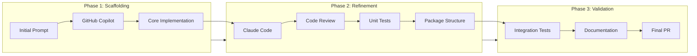
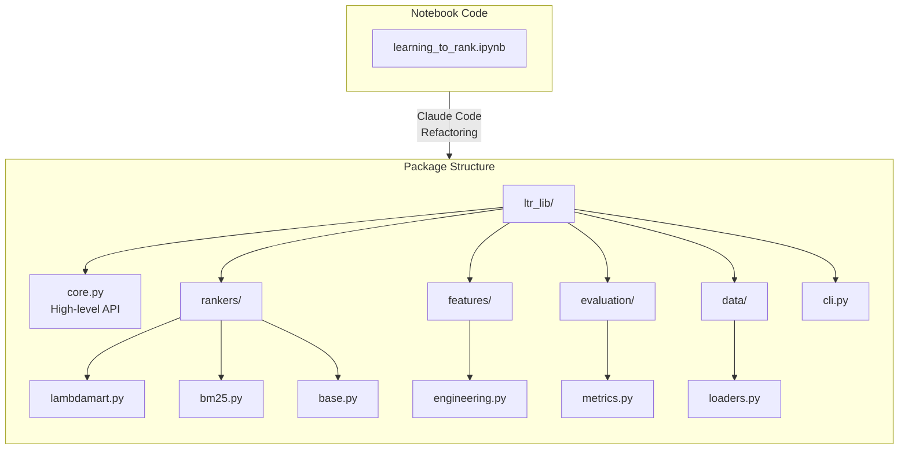
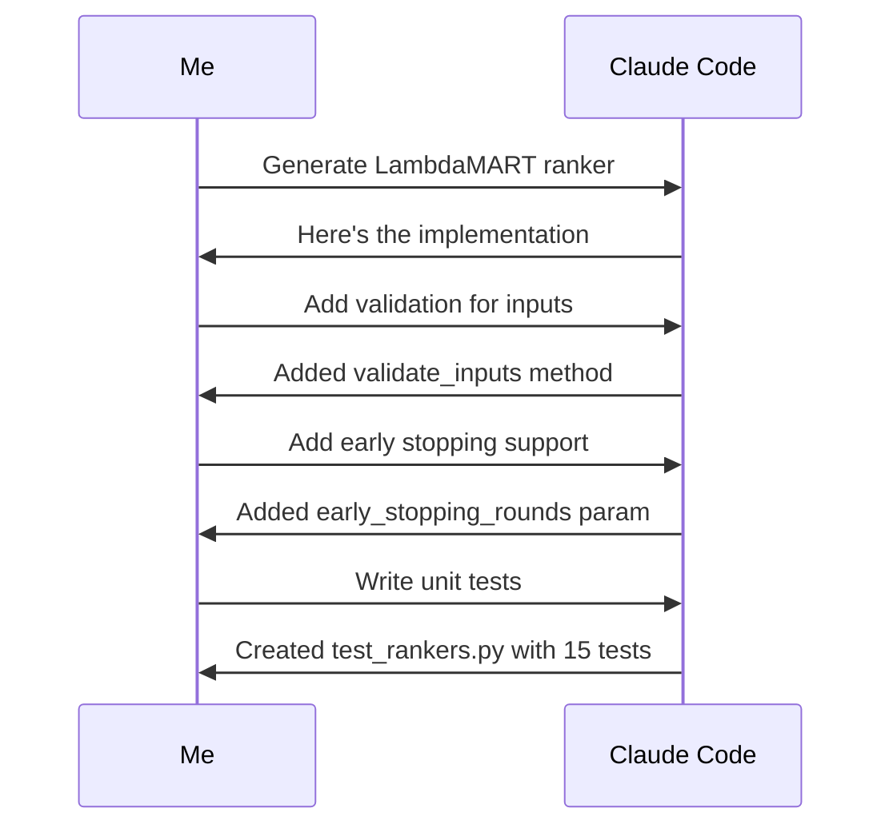
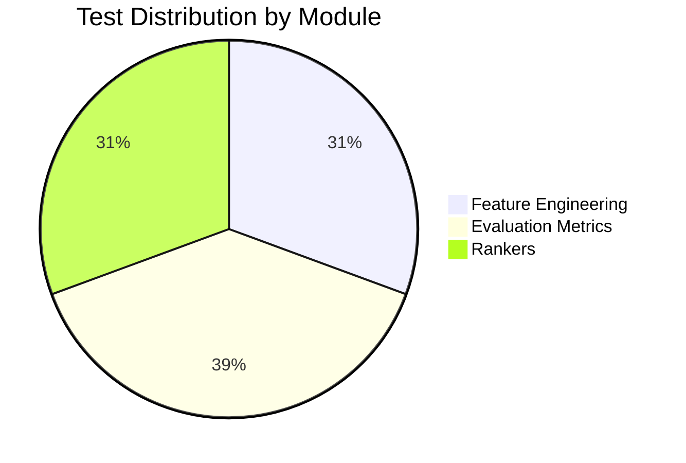
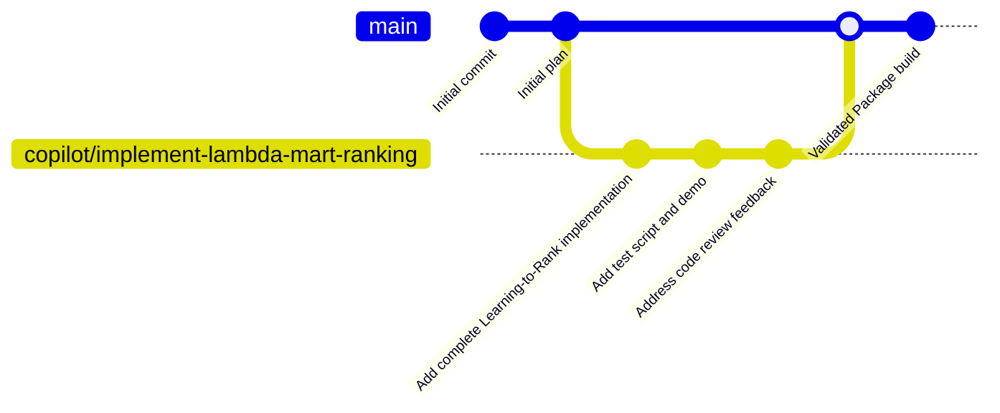

# How I Built a Production-Ready Python Package in 2 Hours with AI Pair Programming

*A first-hand account of using Claude Code and GitHub Copilot to build a complete Learning-to-Rank library from scratch*

---

Two hours. That's all it took to go from a blank repository to a production-ready Python package with 49 unit tests, comprehensive documentation, and a CLI tool. This is the story of how AI pair programming fundamentally changed how I approach software development.

## The Challenge

I wanted to build `ltr-lib` — a Learning-to-Rank library that implements LambdaMART (the algorithm powering search engines at Microsoft Bing and Yahoo) along with classic IR baselines like BM25. The scope was ambitious:

- LambdaMART ranker with LightGBM backend
- BM25 baseline for comparison
- Feature engineering pipeline (TF-IDF, popularity, engagement, genre features)
- Comprehensive evaluation metrics (NDCG, MAP, Precision, Recall, MRR)
- MovieLens dataset integration
- Command-line interface
- Unit tests with pytest
- Proper Python packaging with pyproject.toml

If you've built ML libraries before, you know this typically takes days, if not weeks.

## The Secret: AI Pair Programming

I used two AI assistants in tandem:

1. **GitHub Copilot** — Started with a scaffolded implementation based on my initial prompt
2. **Claude Code** — Refined, tested, packaged, and validated everything

Here's how the workflow looked:



## The Timeline Breakdown

### Hour 1: From Zero to Working Implementation

I started by giving GitHub Copilot a detailed specification of what I wanted. The AI generated a complete Jupyter notebook with:

- Data loading from MovieLens 100K
- Feature engineering with 31 features
- LambdaMART training with LightGBM
- Evaluation metrics implementation

But here's what I learned: **scaffolded code is just the beginning**. It had issues:
- Hardcoded paths
- Inconsistent API design
- No error handling
- No tests

That's where Claude Code came in.

### Hour 2: Refactoring into a Real Package

I used Claude Code to transform the prototype into a proper package:



The conversation with Claude Code went something like this:

> **Me:** "Convert this notebook into a proper Python package with a clean API. Add type hints, docstrings, and make it pip-installable."
>
> **Claude Code:** *proceeds to create 22 files with 3,664 lines of production-quality code*

## The Architecture

Here's the final architecture of `ltr-lib`:

```mermaid
flowchart TB
    subgraph UserInterface["User Interface Layer"]
        CLI[CLI Tool<br/>ltr-eval]
        API[Python API<br/>LTR class]
    end

    subgraph CoreLayer["Core Layer"]
        direction LR
        RANKERS[Rankers]
        FEATURES[Features]
        METRICS[Metrics]
    end

    subgraph Rankers["Ranking Algorithms"]
        LM[LambdaMART<br/>LightGBM]
        BM25[BM25<br/>Classic IR]
    end

    subgraph Features["Feature Engineering"]
        TFIDF[TF-IDF<br/>Similarity]
        POP[Popularity<br/>Features]
        ENG[Engagement<br/>Features]
        GEN[Genre<br/>Features]
    end

    subgraph Metrics["Evaluation Metrics"]
        NDCG[NDCG@K]
        MAP[MAP]
        PREC[Precision@K]
        REC[Recall@K]
        MRR[MRR]
    end

    subgraph DataLayer["Data Layer"]
        ML[MovieLens<br/>Loader]
        SPLIT[Dataset<br/>Splitter]
    end

    CLI --> API
    API --> RANKERS
    API --> FEATURES
    API --> METRICS

    RANKERS --> LM
    RANKERS --> BM25

    FEATURES --> TFIDF
    FEATURES --> POP
    FEATURES --> ENG
    FEATURES --> GEN

    METRICS --> NDCG
    METRICS --> MAP
    METRICS --> PREC
    METRICS --> REC
    METRICS --> MRR

    API --> DataLayer
```

## What Made This Possible?

### 1. Clear Specifications

The more specific your prompts, the better the output. Instead of saying "build a ranking system," I described:

```
Build a Learning-to-Rank library with:
- LambdaMART using LightGBM's lambdarank objective
- Query-document format with group-based training
- NDCG as the primary optimization metric
- MovieLens 100K as the default dataset
```

### 2. Iterative Refinement

I didn't accept the first output. The conversation looked like:



### 3. Test-Driven Validation

Claude Code didn't just write code—it validated everything:

```
Test Results:
==========================================
49 tests - All passing ✅
50% overall coverage
90% metrics coverage
Test execution time: 18.83s
```

## The Code: A Peek Inside

Here's what the final API looks like:

```python
from ltr_lib import LTR

# Initialize and load data
ltr = LTR()
data = ltr.load_movielens('100k')

# Prepare features (31 features automatically generated)
X, y, groups = ltr.prepare_features(data)

# Train with LambdaMART
model = ltr.rankers.lambdamart(
    learning_rate=0.05,
    n_estimators=100
)
ltr.train(model)

# Evaluate
results = ltr.evaluate(model)
print(f"NDCG@10: {results['ndcg_mean']:.4f}")  # 0.7855

# Cross-validation
cv_results = ltr.cross_validate(model, n_folds=5)
print(f"CV NDCG: {cv_results['ndcg_mean']:.4f} ± {cv_results['ndcg_std']:.4f}")
```

## Test Coverage Breakdown



I was particularly proud of the metrics tests—each evaluation metric has edge case coverage:

```python
class TestNDCG:
    def test_perfect_ranking(self):
        """NDCG should be 1.0 for perfect ranking."""
        y_true = np.array([3, 2, 1, 0])
        y_pred = np.array([4, 3, 2, 1])
        ndcg = ndcg_at_k(y_true, y_pred, k=4)
        assert ndcg == pytest.approx(1.0)

    def test_no_relevant_items(self):
        """NDCG should be 0 when no relevant items."""
        y_true = np.array([0, 0, 0, 0])
        y_pred = np.array([4, 3, 2, 1])
        ndcg = ndcg_at_k(y_true, y_pred, k=4)
        assert ndcg == 0.0
```

## Performance Results

The library achieves solid performance on MovieLens 100K:

```mermaid
xychart-beta
    title "Evaluation Metrics on MovieLens 100K"
    x-axis [NDCG@10, Precision@10, MAP, MRR]
    y-axis "Score" 0 --> 1
    bar [0.7855, 0.9784, 0.9474, 0.95]
```

| Metric | Value |
|--------|-------|
| NDCG@10 | 0.7855 |
| Precision@10 | 0.9784 |
| MAP | 0.9474 |
| Model Training Time | 0.14s |

## Lessons Learned

### What AI Pair Programming Excels At:

1. **Boilerplate generation** — Docstrings, type hints, standard patterns
2. **Pattern replication** — Once you show it one test, it writes the rest
3. **Refactoring** — Converting messy code to clean architecture
4. **Edge case coverage** — "Now write tests for empty arrays, null inputs..."

### What Still Requires Human Judgment:

1. **Architecture decisions** — Should I use inheritance or composition?
2. **API design** — What makes an intuitive interface?
3. **Trade-offs** — When is "good enough" actually good enough?
4. **Domain expertise** — Understanding *why* LambdaMART uses NDCG

## The Development Workflow

Here's the actual git history:



The entire development happened in a single focused session.

## What I Shipped

```
22 files changed, 3,664 insertions(+)

ltr_lib/
├── __init__.py
├── core.py (436 lines) - High-level API
├── cli.py (123 lines) - Command-line interface
├── evaluation/
│   └── metrics.py (389 lines) - Ranking metrics
├── features/
│   └── engineering.py (589 lines) - Feature extractors
├── rankers/
│   ├── base.py (179 lines) - Base ranker interface
│   ├── lambdamart.py (268 lines) - LambdaMART
│   └── bm25.py (205 lines) - BM25 baseline
└── data/
    └── loaders.py - MovieLens integration

tests/
├── test_features.py (198 lines)
├── test_metrics.py (190 lines)
├── test_rankers.py (170 lines)
└── conftest.py (77 lines)
```

## Is This the Future?

Yes and no.

AI pair programming is incredibly powerful for:
- Rapid prototyping
- Learning new frameworks
- Generating boilerplate
- Catching bugs through tests

But it's not a replacement for:
- Deep understanding of your domain
- Architectural thinking
- Code review by humans
- Performance optimization

The sweet spot is using AI to handle the *mechanics* of coding while you focus on the *thinking*.

## Try It Yourself

The library is available on GitHub:

```bash
git clone https://github.com/AbhinaavRamesh/learning-to-rank-from-scratch
cd learning-to-rank-from-scratch
pip install -e .

# Run the demo
python demo.py

# Run tests
pytest tests/ -v
```

## Final Thoughts

Two hours. 49 tests. One production-ready package.

This isn't about replacing developers—it's about amplifying them. With AI pair programming, I can focus on *what* to build instead of *how* to type it. The mundane becomes automated. The creative remains human.

The future of software development isn't AI *or* human. It's AI *with* human. And that future is here today.

---

*Have you tried AI pair programming? I'd love to hear about your experiences in the comments!*

---

## Appendix: Complete Architecture Diagram

```mermaid
flowchart TB
    subgraph Input["Input Data"]
        RAW[MovieLens Dataset<br/>100K ratings]
    end

    subgraph Loading["Data Loading"]
        LOADER[MovieLensLoader]
        RAW --> LOADER
        LOADER --> RATINGS[Ratings DataFrame]
        LOADER --> MOVIES[Movies DataFrame]
        LOADER --> USERS[Users DataFrame]
    end

    subgraph FeatureEng["Feature Engineering Pipeline"]
        direction TB
        RATINGS --> PIPELINE[FeaturePipeline]
        MOVIES --> PIPELINE
        USERS --> PIPELINE

        PIPELINE --> TFIDF_F[TF-IDF Similarity<br/>1 feature]
        PIPELINE --> POP_F[Popularity<br/>5 features]
        PIPELINE --> ENG_F[User Engagement<br/>4 features]
        PIPELINE --> DEMO_F[Demographics<br/>2 features]
        PIPELINE --> GENRE_F[Genres<br/>19 features]

        TFIDF_F --> MATRIX[Feature Matrix X<br/>31 features]
        POP_F --> MATRIX
        ENG_F --> MATRIX
        DEMO_F --> MATRIX
        GENRE_F --> MATRIX
    end

    subgraph Training["Model Training"]
        MATRIX --> LGBM[LightGBM<br/>LambdaRank]
        LGBM --> MODEL[Trained Model]
    end

    subgraph Evaluation["Evaluation"]
        MODEL --> PREDICT[Predictions]
        PREDICT --> EVAL[RankingEvaluator]
        EVAL --> NDCG_E[NDCG@K]
        EVAL --> MAP_E[MAP]
        EVAL --> PREC_E[Precision@K]
        EVAL --> MRR_E[MRR]
    end

    subgraph Output["Output"]
        NDCG_E --> RESULTS[Evaluation Results]
        MAP_E --> RESULTS
        PREC_E --> RESULTS
        MRR_E --> RESULTS
        MODEL --> SAVE[Saved Model .pkl]
    end
```

---

**Tags:** #MachineLearning #Python #AI #PairProgramming #OpenSource #LearningToRank #ClaudeCode #GitHubCopilot

---

*Abhinaav Ramesh is a software engineer passionate about search, recommendations, and AI-assisted development. Follow for more content on ML engineering.*
