<!-- markdownlint-disable MD033 MD041 MD024 -->
<p align="center">
  
</p>

<div align="center">

# MaaMCP


  
[](https://github.com/MaaXYZ/MaaFramework)
[](https://pypi.org/project/maa-mcp/)

基于 [MaaFramework](https://github.com/MaaXYZ/MaaFramework) 的 MCP 服务器
为 AI 助手提供 Android 设备和 Windows 桌面自动化能力

[English](README_EN.md) | 中文

</div>

---

## 简介

MaaMCP 是一个 MCP 服务器，将 MaaFramework 的强大自动化能力通过标准化的 MCP 接口暴露给 AI 助手（如 Claude）。通过本服务器，AI 助手可以：

- 🤖 **Android 自动化** - 通过 ADB 连接并控制 Android 设备/模拟器
- 🖥️ **Windows 自动化** - 控制 Windows 桌面应用程序
  - 🎯 **后台操作** - Windows 上的截图与控制均在后台运行，不占用鼠标键盘，您可以继续使用电脑做其他事情
- 🔗 **多设备协同** - 同时控制多个设备/窗口，实现跨设备自动化
- 👁️ **智能识别** - 使用 OCR 识别屏幕文字内容
- 🎯 **精准操作** - 执行点击、滑动、文本输入、按键等操作
- 📸 **屏幕截图** - 获取实时屏幕截图进行视觉分析

Talk is cheap, 请看: **[🎞️ Bilibili 视频演示](https://www.bilibili.com/video/BV1eGmhBaEZz/)**

## 功能特性

### 🔍 设备发现与连接

- `find_adb_device_list` - 扫描可用的 ADB 设备
- `find_window_list` - 扫描可用的 Windows 窗口
- `connect_adb_device` - 连接到 Android 设备
- `connect_window` - 连接到 Windows 窗口

### 👀 屏幕识别

- `ocr` - 光学字符识别（高效，推荐优先使用）
- `screencap` - 屏幕截图（按需使用，token 开销大）

### 🎮 设备控制

- `click` - 点击指定坐标（支持多触点/鼠标按键选择、长按）
  - Windows 上支持指定鼠标按键：左键、右键、中键
- `double_click` - 双击指定坐标
- `swipe` - 滑动手势
- `input_text` - 输入文本
- `click_key` - 按键操作（支持长按）
  - Android 上可模拟系统按键：返回键(4)、Home键(3)、菜单键(82)、音量键等
  - Windows 上支持虚拟按键码：回车(13)、ESC(27)、方向键等
- `keyboard_shortcut` - 键盘快捷键
  - 支持组合键：Ctrl+C、Ctrl+V、Alt+Tab 等
- `scroll` - 鼠标滚轮（仅 Windows）

## 快速开始

### 安装方式

#### 方式一：通过 pip 安装（推荐）

```bash
pip install maa-mcp
```

#### 方式二：从源码安装

1. **克隆仓库**

    ```bash
    git clone https://github.com/MistEO/MaaMCP.git
    cd MaaMCP
    ```

2. **安装 Python 依赖**

    ```bash
    pip install -e .
    ```

### 配置 MCP 客户端

添加 MCP 配置：

```json
{
  "mcpServers": {
    "MaaMCP": {
      "command": "maa-mcp"
    }
  }
}
```

## 使用示例

配置完成后，可以这样使用：

**Android 自动化示例：**

```text
请用 MaaMCP 工具帮我连接 Android 设备，打开美团帮我点一份外卖，我想吃中餐，一人份，20 元左右的
```

**Windows 自动化示例：**

```text
请用 MaaMCP 工具，看看我现在这页 PPT 怎么加一个旋转特效，操作给我看下
```

MaaMCP 会自动：

1. 扫描可用设备/窗口
2. 建立连接
3. 自动下载并加载 OCR 资源
4. 执行识别和操作任务

## 工作流程

MaaMCP 遵循简洁的操作流程，支持多设备/多窗口协同工作：

```mermaid
graph LR
    A[扫描设备] --> B[建立连接]
    B --> C[执行自动化操作]
```



1. **扫描** - 使用 `find_adb_device_list` 或 `find_window_list`
2. **连接** - 使用 `connect_adb_device` 或 `connect_window`（可连接多个设备/窗口，获得多个控制器 ID）
3. **操作** - 通过指定不同的控制器 ID，对多个设备/窗口执行 OCR、点击、滑动等自动化操作

## 注意事项

📌 **Windows 自动化限制**：

- 部分游戏或应用的反作弊机制可能会拦截后台控制操作
- 若目标应用以管理员权限运行，MaaMCP 也需要以管理员权限启动
- 不支持对最小化的窗口进行操作，请保持目标窗口在非最小化状态
- 若默认的后台截图/输入方式不可用（如截图为空、操作无响应），AI 助手可能会尝试切换到前台方式，届时会占用鼠标键盘

## 常见问题

### OCR 识别失败，报错 "Failed to load det or rec" 或提示资源不存在

首次使用时，会自动下载 OCR 模型文件。但可能出现下载失败等情况，请检查数据目录：

- Windows: `C:\Users\<用户名>\AppData\Local\MaaMCP\resource\model\ocr\`
- macOS: `~/Library/Application Support/MaaMCP/resource/model/ocr/`
- Linux: `~/.local/share/MaaMCP/resource/model/ocr/`

1. 检查上述目录中是否有模型文件（`det.onnx`, `rec.onnx`, `keys.txt`）
2. 检查 `model/download.log` 中是否出现资源下载异常
3. 手动执行 `python -c "from maa_mcp.download import download_and_extract_ocr; download_and_extract_ocr()"` 再次尝试下载

### 关于 ISSUE

提交问题时，请提供日志文件，日志文件路径如下：

- Windows: `C:\Users\<用户名>\AppData\Local\MaaMCP\debug\maa.log`
- macOS: `~/Library/Application Support/MaaMCP/debug/maa.log`
- Linux: `~/.local/share/MaaMCP/debug/maa.log`

## 许可证

本项目采用 [GNU AGPL v3](LICENSE) 许可证。

## 致谢

- **[MaaFramework](https://github.com/MaaXYZ/MaaFramework)** - 提供强大的自动化框架
- **[FastMCP](https://github.com/jlowin/fastmcp)** - 简化 MCP 服务器开发
- **[Model Context Protocol](https://modelcontextprotocol.io/)** - 定义 AI 工具集成标准
