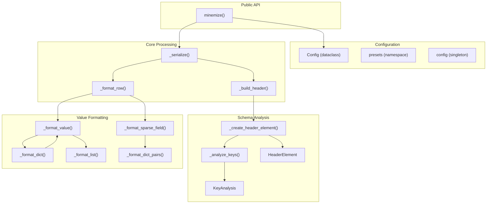
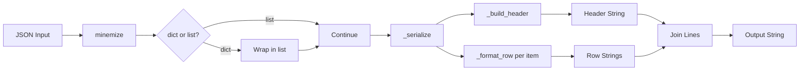
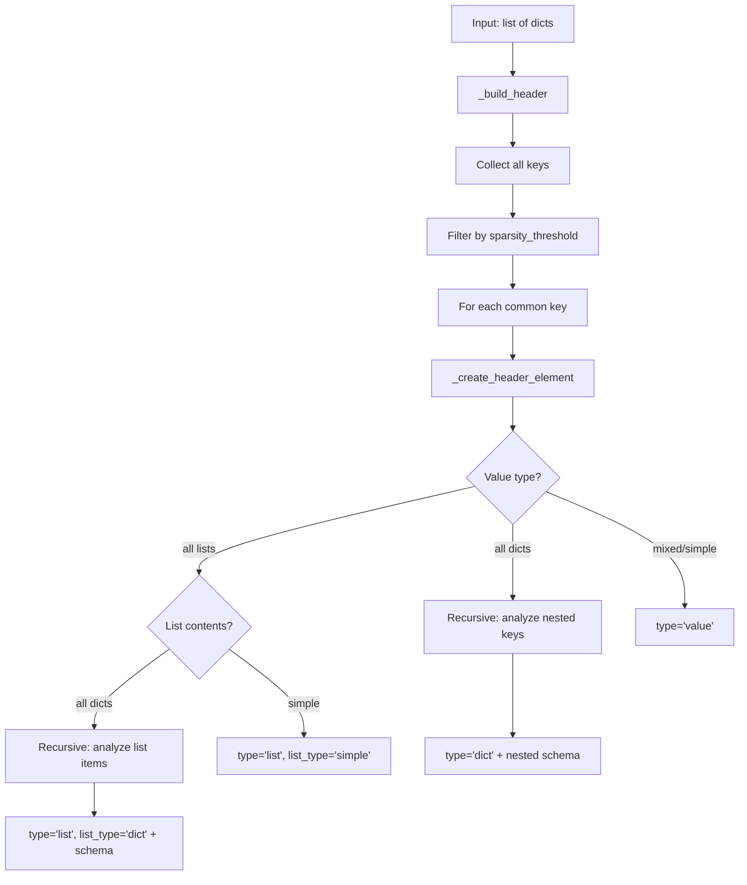
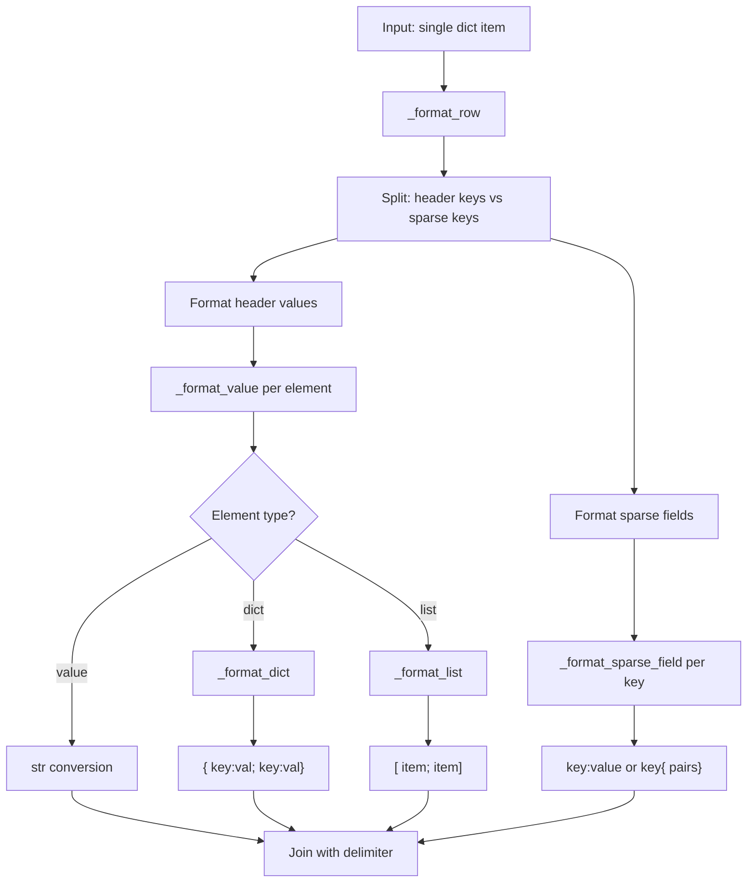

# Minemizer Architecture

This document describes the internal architecture of minemizer, a library for compacting JSON data into a token-efficient string format.

## Module Overview



## Data Flow



## Core Data Structures

### Config (config.py:7-44)

Configuration dataclass controlling output formatting:

| Property | Default | Description |
|----------|---------|-------------|
| `delimiter` | `";"` | Field separator |
| `use_spaces` | `True` | Add spaces around delimiters |
| `sparsity_threshold` | `0.5` | Key frequency threshold for header |
| `sparse_indicator` | `"..."` | Marker for sparse fields in header |
| `header_separator` | `None` | Row separator (e.g., `"---"` for markdown) |
| `wrap_lines` | `None` | Line wrapper (e.g., `"\|"` for markdown) |

Computed properties:
- `spaced_delimiter` → `"; "` or `";"`
- `spaced_kv_separator` → `": "` or `":"`
- `dict_open` → `"{ "` or `"{"`
- `list_open` → `"[ "` or `"["`

### KeyAnalysis (core.py:12-20)

Result of analyzing key frequency across items:

```python
@dataclass
class KeyAnalysis:
    common: list[str]   # Keys appearing >= threshold
    sparse: list[str]   # Keys appearing < threshold
```

### HeaderElement (core.py:24-53)

Schema definition for a single field:

```python
@dataclass
class HeaderElement:
    name: str
    type: str = "value"          # "value", "dict", "list"
    schema: list[HeaderElement]  # Nested schema for dicts/lists
    has_sparse: bool = False     # Whether nested dict has sparse keys
    list_type: str | None        # "dict" or "simple" for lists
```

## Processing Pipeline

### 1. Schema Building



### 2. Row Formatting



## Output Format Example

Given input:
```json
[
  {"id": 1, "name": "Alice", "contact": {"email": "a@co.com"}},
  {"id": 2, "name": "Bob", "contact": {"email": "b@co.com", "phone": "555"}}
]
```

Processing:
1. **Header analysis**: `id`, `name`, `contact` are common (100%)
2. **Nested analysis**: `contact.email` is common, `contact.phone` is sparse (50%)
3. **Header schema**: `id; name; contact{ email; ...}`
4. **Row 1**: `1; Alice; { a@co.com}`
5. **Row 2**: `2; Bob; { b@co.com; phone: 555}`

Output:
```
id; name; contact{ email; ...}
1; Alice; { a@co.com}
2; Bob; { b@co.com; phone: 555}
```

## Presets (config.py:47-87)

| Preset | delimiter | use_spaces | header_separator | wrap_lines |
|--------|-----------|------------|------------------|------------|
| `default`/`llm` | `;` | `True` | - | - |
| `markdown` | `\|` | `True` | `---` | `\|` |
| `csv` | `,` | `False` | - | - |
| `tsv` | `\t` | `False` | - | - |
| `compact` | `;` | `False` | - | - |

## Function Reference

| Function | Location | Purpose |
|----------|----------|---------|
| `minemize()` | core.py:217 | Public API entry point |
| `_serialize()` | core.py:195 | Orchestrates header + rows |
| `_build_header()` | core.py:118 | Creates header schema |
| `_create_header_element()` | core.py:77 | Recursive schema builder |
| `_analyze_keys()` | core.py:63 | Identifies common/sparse keys |
| `_format_row()` | core.py:188 | Formats single item |
| `_format_value()` | core.py:159 | Dispatches by type |
| `_format_dict()` | core.py:134 | Formats nested dicts |
| `_format_list()` | core.py:148 | Formats lists |
| `_format_sparse_field()` | core.py:169 | Formats non-header fields |
| `_format_dict_pairs()` | core.py:130 | Formats dict as key:value pairs |
| `_normalize()` | core.py:59 | Converts bools to lowercase |
