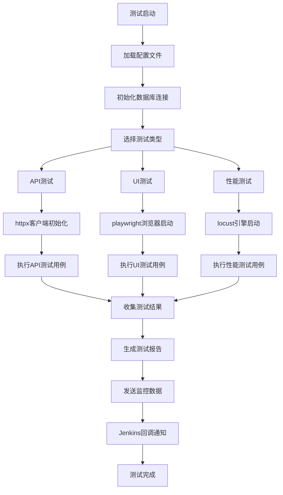

# Moss 自动化测试框架技术规范

## 测试执行流程



## 核心技术组件

### 1. 项目结构设计
```
mosspilot/
├── pyproject.toml              # uv项目配置
├── core/                       # 核心框架层
│   ├── base/                   # 基础组件
│   ├── config/                 # 配置管理
│   ├── database/               # 数据库层
│   ├── reporting/              # 报告系统
│   └── monitoring/             # 监控系统
├── modules/                    # 测试模块层
│   ├── api/                    # API测试
│   ├── ui/                     # UI测试
│   └── performance/            # 性能测试
├── tests/                      # 测试用例
├── data/                       # 测试数据
├── configs/                    # 配置文件
├── reports/                    # 报告输出
└── scripts/                    # 工具脚本
```

### 2. 核心依赖包
- **测试框架**: pytest 8.0+
- **HTTP客户端**: httpx 0.25+
- **UI自动化**: playwright 1.40+
- **性能测试**: locust 2.17+
- **数据验证**: pydantic 2.5+
- **数据库**: sqlalchemy 2.0+
- **模板引擎**: jinja2 3.1+
- **配置管理**: pyyaml 6.0+
- **日志系统**: loguru 0.7+

### 3. 配置管理系统
- 支持多环境配置 (dev/test/prod)
- YAML格式配置文件
- 环境变量覆盖机制
- 动态配置热加载

### 4. 数据库设计
主要表结构：
- `test_cases`: 测试用例元数据
- `test_executions`: 测试执行记录
- `test_results`: 详细测试结果
- `configurations`: 系统配置参数
- `reports`: 报告生成记录

### 5. 报告系统特性
- 自定义HTML模板引擎
- 实时测试进度展示
- 详细错误信息和截图
- 性能指标可视化图表
- 企业品牌定制支持

### 6. 监控集成能力
- 实时日志流处理
- 测试执行状态监控
- 性能指标自动收集
- 企业监控系统webhook集成
- 异常告警机制

### 7. Jenkins集成功能
- 标准化REST API接口
- 测试结果自动回调
- 构建状态实时通知
- 报告文件自动归档
- 失败重试机制

## 关键设计原则

1. **模块化设计**: 每个测试类型独立模块，便于维护和扩展
2. **配置驱动**: 通过配置文件控制测试行为，无需修改代码
3. **数据分离**: 测试数据与测试逻辑分离，支持数据驱动测试
4. **企业级**: 支持大规模并发执行和企业级安全要求
5. **可扩展性**: 插件化架构，支持自定义扩展
6. **易用性**: 开箱即用，最小化配置要求

## 性能和扩展性考虑

- 支持分布式测试执行
- 数据库连接池管理
- 异步IO优化
- 内存使用优化
- 并发控制机制