# **The Open Governance Manifesto**

### **Data is an Asset. Your Definitions are a Liability.**

We have spent the last decade solving the **Storage Problem**. Thanks to Apache Iceberg and Delta Lake, we can now store petabytes of data cheaply and reliably.

But we are still failing at the **Meaning Problem**.

Ask your Data Engineer for "Gross Churn" and you get one number. Ask your Tableau dashboard and you get another. Ask your Finance team and you get a third.  
This is Metric Drift. And in the age of AI, Metric Drift is fatal. If you feed conflicting definitions to an LLM, you don't get "Business Intelligence"—you get confident hallucinations.

## **The Solution: Headless Data Governance**

It is time to decouple the **Definition** (The *What*) from the **Tool** (The *How*).

Authentic Intelligence Labs introduces the Open Data Governance Schema (ODGS).  
ODGS is a vendor-neutral, JSON-based protocol that acts as the API for your business logic.

### **The Protocol: Write Once, Sync Everywhere**

Instead of defining "Revenue" three times (once in dbt, once in Looker, once in Excel), you define it once in ODGS.  
Our Sync Engine then compiles that definition into:

* SQL for your Data Warehouse (Snowflake/Databricks)  
* LookML for Looker  
* DAX for Power BI  
* **Semantic Context for your AI Agents**

# ODGS: The Open Data Governance Standard
> **The Protocol for "AI Safety" and "Algorithmic Accountability".**

## 📢 The Problem: Semantic Hallucinations
When AI agents or LLMs query your database, they guess the meaning of columns. This leads to **Semantic Hallucinations**—where the AI confidently returns the "Net Profit" but calculated it wrong because it didn't know your specific accounting rules.

## 🛡️ The Solution: ODGS
ODGS is a **machine-readable protocol** (JSON Schema) that explicitly defines your business logic. It serves as the "Ground Truth" for both Humans, AI Agents, and Regulators (EU AI Act).

It's not just documentation; it compiles into:
*   **dbt Tests** (for engineering reliability)
*   **Power BI/Tableau** (for BI consistency)
*   **AI Context** (so Copilots don't lie)

### **The Killer Feature: Metric Provenance**

Generative AI is a "Reasoning Engine," not a "Knowledge Base." It is great at syntax, but terrible at facts.  When an executive asks, _"What was our Churn last month?"_, the AI hallucinates because it sees three different "Churn" columns in your warehouse.

ODGS provides **Metric Provenance**. It forces the AI to look up the _human-codified definition_ first. It provides the **Chain of Custody** for your business logic, ensuring that every AI answer can be traced back to a specific, version-controlled definition in your Git repo.

We believe AI is only as good as the rules you give it.

* **Artificial Intelligence** guesses the answer based on probability.  
* **Authentic Intelligence** knows the answer based on codified human expertise.

ODGS captures the *Authentic Intelligence* of your domain experts—the nuances, the exceptions, the business rules—and codifies them into a standard that AI can respect.

### **Join the Revolution**

The Table Format War is over. The Semantic War has just begun.  
Don't build another silo. Build on the Standard.
# 🏛️ The Open Data Governance Schema (ODGS)


# 🧩 Why now, why this?

# ODGS: Open Data Governance Schema
### The Protocol for Algorithmic Accountability

[](https://opensource.org/licenses/Apache-2.0)

**ODGS** is an open standard that decouples **business logic** from **execution engines** (like dbt, Power BI, or Tableau). It serves as the "Ground Truth" for Enterprise AI, ensuring that the context fed to LLMs is mathematically verifiable and consistent with business reality.

> **The Problem:** "Semantic Hallucination." When an AI Agent calculates "Churn Rate", does it use the Marketing definition (Power BI) or the Finance definition (Snowflake)? If it guesses, it hallucinates.
>
> **The Solution:** ODGS defines metrics *once* in a protocol-agnostic schema. It then **compiles** these definitions into the native languages of your tools (SQL, DAX, TMSL, YAML).

## 🛡️ AI Safety & Governance
ODGS is designed for **Algorithmic Accountability**. It provides:
1.  **Provenance**: Every metric has a unique ID and owner, traceable back to the source.
2.  **Consistency**: The AI, the Dashboard, and the Regulatory Report use the *exact same* logic.
3.  **Auditability**: Changes to logic are Git-versioned and mathematically verified before deployment.

## 🚀 The `odgs` CLI
ODGS comes with a developer-first CLI to manage your governance layer.

```bash
# 1. Validate your schema for AI Safety compliance
odgs validate

# 2. Build artifacts for all downstream tools
odgs build
```




```mermaid
graph TD
    subgraph PROBLEM ["❌ The Problem: Definition Drift"]
        A[CFO: 'Gross Margin' in Excel] -->|Disconnect| B[dbt: SQL Logic]
        A -->|Disconnect| C[Power BI: DAX Logic]
        B -.-|Mismatch| C
    end

    subgraph SOLUTION ["✅ The Solution: Open Governance Schema"]
        D[("JSON Schema (OGS)
        Single Source of Truth")] 
        
        D -->|Auto-Sync| E[dbt / Snowflake]
        D -->|Auto-Sync| F[Power BI / Tableau]
        D -->|Auto-Sync| G[Data Catalog / Collibra]
    end

    style D fill:#f9f,stroke:#333,stroke-width:4px,color:black
    style PROBLEM fill:#ffcccc,stroke:#333,stroke-width:1px
    style SOLUTION fill:#ccffcc,stroke:#333,stroke-width:1px
```

The **Open Data Governance Schema (ODGS)** is a vendor-neutral JSON protocol that acts as the "API" for your business definitions. By decoupling the **Definition** (The "What") from the **Tool** (The "How"), you achieve Headless Governance.

### How it works

```json
// example: standard_metrics.json
{
  "metric_id": "KPI_102",
  "name": "Gross_Margin",
  "domain": "Finance",
  "calculation_logic": {
    "abstract": "Revenue - COGS",
    "sql_standard": "SUM(gross_sales) - SUM(cost_of_goods)",
    "dax_pattern": "[Total Sales] - [Total Cost]"
  },
  "owner": "CFO_Office",
  "quality_threshold": "99.5%"
}
```

## 📂 The Protocol Structure

This repository contains the core schemas that define the "Alphabet" of Data Governance:

| File | Purpose |
| :--- | :--- |
| **`standard_metrics.json`** | The "Golden Record" for KPIs. Define logic, ownership, and sensitivity here. |
| **`standard_dq_dimensions.json`** | The 60 industry-standard dimensions of data quality (Accuracy, Timeliness, Completeness, etc.). |
| **`standard_data_rules.json`** | Technical validation rules (Regex patterns, null checks, referential integrity). |
| **`root_cause_factors.json`** | A standardized taxonomy for *why* data breaks (e.g., `Process_Gap` vs `Integration_Failure`). |
| **`business_process_maps.json`** | Maps how data entities flow through the business lifecycle. |
| **`physical_data_map.json`** | Maps abstract metrics to physical database tables/columns. |
| **`ontology_graph.json`** | Defines relationships between business entities. |

## ✅ Validation & CI/CD Integration

The repository includes a **validator script** that enforces the governance schema:

```bash
python3 scripts/validate_schema.py
```

**Output:**
```
🔍 Running Open Governance Schema Validator...
✅ Loaded 72 metrics.
✅ Loaded 50 data rules.
🎉 All Governance Checks Passed!
```

### CI/CD Integration

Add this to your GitHub Actions workflow to enforce governance standards:

```yaml
- name: Validate Governance Schema
  run: python3 scripts/validate_schema.py
```

This ensures that all metrics and rules have:
- Unique IDs
- Assigned owners
- Defined domains
- Clear calculation logic

---

## 📦 Installation

### NPM (Node.js)

```bash
npm install odgs
```

Usage:
```javascript
import { standardMetrics } from 'odgs';
// or
const { standardMetrics } = require('odgs');
```

### PyPI (Python)

### PyPI (Python)

```bash
pip install "odgs[all]"
```

Usage:
```bash
# Initialize a new project
odgs init my_governance_layer

# Add a new metric
cd my_governance_layer
odgs add metric

# Validate schema
odgs validate

# Build artifacts
odgs build
```

## 🛠 Usage & Implementation

## 🔌 BI Adapters

The repository includes built-in adapters to generate configuration files for major BI tools:

| Tool | Output Format | Script |
| :--- | :--- | :--- |
| **dbt MetricFlow** | `semantic_models.yml` | `adapters/dbt/generate_semantic_models.py` |
| **Power BI** | `measures.tmsl.json` (TMSL) | `adapters/powerbi/generate_tmsl.py` |
| **Tableau** | `metrics.tds` (XML) | `adapters/tableau/generate_tds.py` |

### Generating Adapters

Run the following commands to generate the configurations:

```bash
# Generate dbt MetricFlow YAML
python3 adapters/dbt/generate_semantic_models.py

# Generate Power BI TMSL
python3 adapters/powerbi/generate_tmsl.py

# Generate Tableau TDS
python3 adapters/tableau/generate_tds.py
```

The generated files will be located in the `adapters/<tool>/` directories.

**What is generated?**
*   **Metrics**: Calculation logic (SQL/DAX) for all 72 standard metrics.
*   **Reference Data**: Static tables for DQ Dimensions, Root Causes, and Business Processes.
*   **Data Rules**:
    *   **dbt**: Generic tests (`macros/odgs_tests.sql`) derived from standard rules.
    *   **Power BI/Tableau**: Reference tables to join against.

### Option B: The Reference Implementation

If you prefer a managed "Headless Governance" layer that natively supports ODGS and handles the sync to Power BI/dbt automatically, feel free to see the art of possible with these end-state applications built with the same data:

*   **[Clavis](https://clavis.iyer.dev/)** (Plain HTML, CSS, JS)
*   **[Chartr](https://chartr.quirkyswirl.com/)** (React v2)

These examples demonstrate the end outcome for the business user of what the Open Data Governance Schema can do.

## Commercial Managed Service Partners

For commercial managed services, please visit:
*   **[QuirkySwirl](https://quirkyswirl.netlify.app/about)** 

-----

## 📄 License

This project is licensed under the **Apache License 2.0** - see the [LICENSE](LICENSE) file for details.

Copyright © 2025 [Authentic Intelligence Labs](https://github.com/Authentic-Intelligence-Labs)

---

**Contributing:** We welcome Pull Requests to expand the `dq_dimensions` or refine the `root_cause_factors` taxonomy.