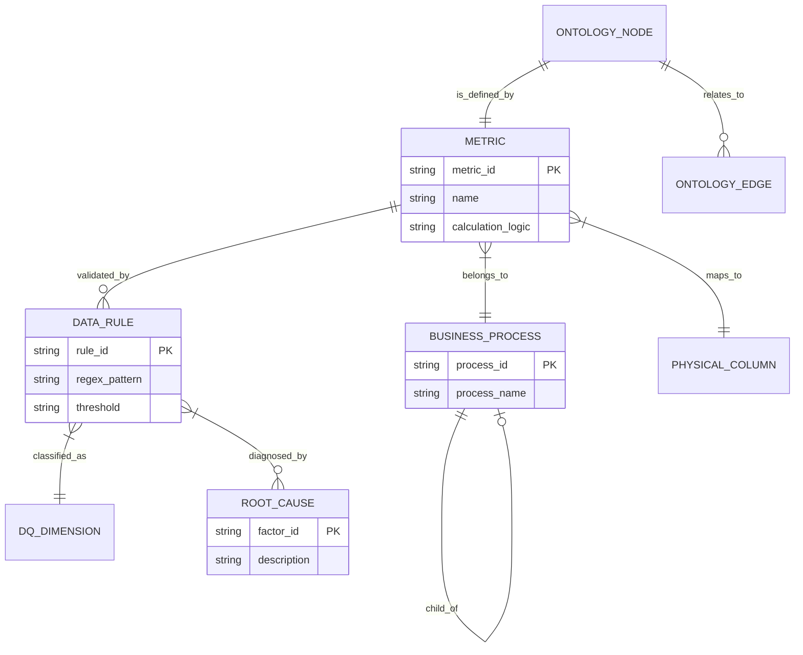

# The ODGS Graph Model

## interconnected Nodes
While ODGS is stored as flat JSON files, it logically represents a **Knowledge Graph**. Each file represents a type of node, and the references between them (e.g., `metric_id` linking to `rule_id`) form the edges.

This structure allows for powerful queries like: *"Show me all metrics affected by a failure in the 'Order-to-Cash' process."*

## The Schema Graph

## Why a Graph?
By treating governance as a graph, we enable:

1.  **Impact Analysis**: If `Order_ID` changes format, we traverse the graph to find every dependent Metric and Dashboard.
2.  **Root Cause Analysis**: If `Gross_Margin` drops, we traverse the graph to see which underlying Data Rules failed and which Business Process is responsible.
3.  **AI Context**: We can feed the LLM a subgraph relevant to the user's question, rather than the entire database schema.
