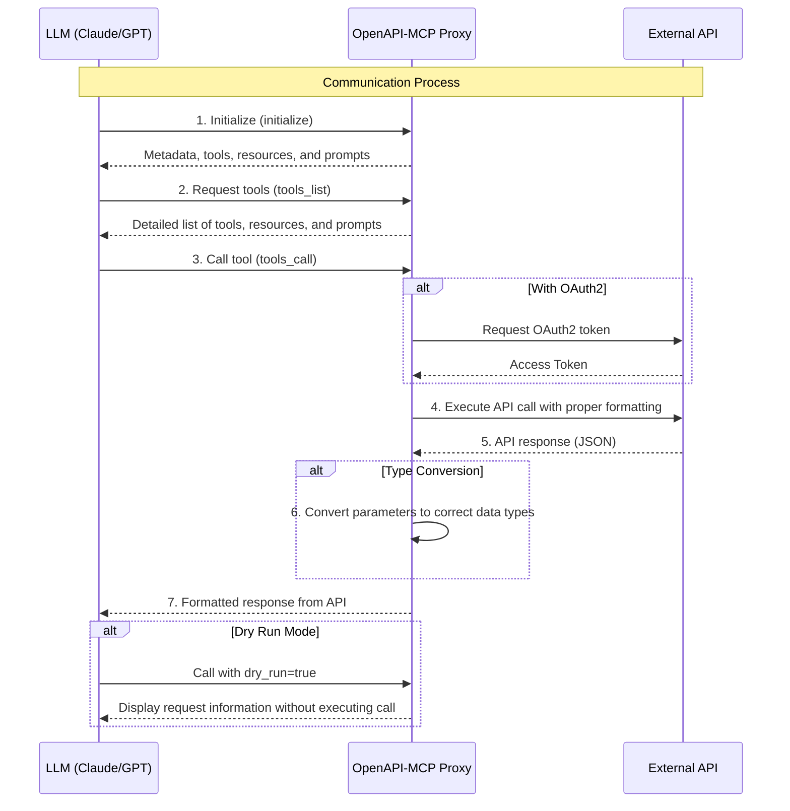

# OpenAPI to Model Context Protocol (MCP)

[](https://badge.fury.io/py/openapi-mcp-proxy)
[](LICENSE)


**The OpenAPI-MCP proxy translates OpenAPI specs into MCP tools, enabling AI agents to access external APIs without custom wrappers!**


## Bridge the gap between AI agents and external APIs

The OpenAPI to Model Context Protocol (MCP) proxy server bridges the gap between AI agents and external APIs by **dynamically translating** OpenAPI specifications into standardized **MCP tools**, **resources**, and **prompts**. This simplifies integration by eliminating the need for custom API wrappers.

Built with **FastMCP** following official MCP patterns and best practices, the server provides:
- ✅ **Official FastMCP Integration** - Uses the latest FastMCP framework for optimal performance
- ✅ **Proper MCP Transport** - Supports stdio, SSE, and streamable HTTP transports
- ✅ **Modular Architecture** - Clean separation of concerns with dependency injection
- ✅ **Production Ready** - Robust error handling, comprehensive logging, and type safety

- **Repository:** [https://github.com/gujord/OpenAPI-MCP](https://github.com/gujord/OpenAPI-MCP)

---

If you find it useful, please give it a ⭐ on GitHub!

---

## Key Features

### Core Functionality
- **FastMCP Transport:** Optimized for `stdio`, working out-of-the-box with popular LLM orchestrators.
- **OpenAPI Integration:** Parses and registers OpenAPI operations as callable tools.
- **Resource Registration:** Automatically converts OpenAPI component schemas into resource objects with defined URIs.
- **Prompt Generation:** Generates contextual prompts based on API operations to guide LLMs in using the API.
- **Dual Authentication:** Supports both OAuth2 Client Credentials flow and username/password authentication with automatic token caching.
- **MCP HTTP Transport:** Official MCP-compliant HTTP streaming transport with JSON-RPC 2.0 over SSE.
- **Server-Sent Events (SSE):** Legacy streaming support (deprecated - use MCP HTTP transport).
- **JSON-RPC 2.0 Support:** Fully compliant request/response structure.

### Advanced Features
- **Modular Architecture:** Clean separation of concerns with dedicated modules for authentication, request handling, and tool generation.
- **Robust Error Handling:** Comprehensive exception hierarchy with proper JSON-RPC error codes and structured error responses.
- **Auto Metadata:** Derives tool names, summaries, and schemas from the OpenAPI specification.
- **Sanitized Tool Names:** Ensures compatibility with MCP name constraints.
- **Flexible Parameter Parsing:** Supports query strings, JSON, and comma-separated formats with intelligent type conversion.
- **Enhanced Parameter Handling:** Automatically converts parameters to correct data types with validation.
- **Extended Tool Metadata:** Includes detailed parameter information, response schemas, and API categorization.
- **CRUD Operation Detection:** Automatically identifies and generates example prompts for Create, Read, Update, Delete operations.
- **MCP-Compliant Streaming:** Official MCP HTTP transport for real-time streaming with proper session management.

### Developer Experience
- **Configuration Management:** Centralized environment variable handling with validation and defaults.
- **Comprehensive Logging:** Structured logging with appropriate levels for debugging and monitoring.
- **Type Safety:** Full type hints and validation throughout the codebase.
- **Extensible Design:** Factory patterns and dependency injection for easy customization and testing.

## 🚀 Quick Start

### Installation

**Option 1: Using uvx (Recommended)**
```bash
# Run directly without installation
uvx openapi-mcp-proxy

# Or with environment variables
OPENAPI_URL="https://api.met.no/weatherapi/locationforecast/2.0/swagger" \
SERVER_NAME="weather" \
uvx openapi-mcp-proxy
```

**Option 2: Using pip**
```bash
pip install openapi-mcp-proxy

# Then run
OPENAPI_URL="https://api.met.no/weatherapi/locationforecast/2.0/swagger" \
SERVER_NAME="weather" \
openapi-mcp
```

**Option 3: From source**
```bash
git clone https://github.com/gujord/OpenAPI-MCP.git
cd OpenAPI-MCP
python3.12 -m venv venv
source venv/bin/activate  # On Windows: venv\Scripts\activate
pip install -e .
```

### 🎯 Simple Usage

**Quick Test (Norwegian Weather API)**
```bash
# Using uvx
OPENAPI_URL="https://api.met.no/weatherapi/locationforecast/2.0/swagger" \
SERVER_NAME="weather" \
uvx openapi-mcp

# Or using installed package
OPENAPI_URL="https://api.met.no/weatherapi/locationforecast/2.0/swagger" \
SERVER_NAME="weather" \
openapi-mcp
```

**HTTP Transport (Recommended for Claude Desktop)**
```bash
# Start weather API with HTTP transport
OPENAPI_URL="https://api.met.no/weatherapi/locationforecast/2.0/swagger" \
SERVER_NAME="weather" \
MCP_HTTP_ENABLED="true" \
MCP_HTTP_PORT="8001" \
openapi-mcp
```

### 🔗 Claude Desktop Setup

**1. Copy the provided configuration:**
```bash
cp claude_desktop_config.json ~/Library/Application\ Support/Claude/claude_desktop_config.json
```

**2. Start the weather server:**
```bash
OPENAPI_URL="https://api.met.no/weatherapi/locationforecast/2.0/swagger" \
SERVER_NAME="weather" \
MCP_HTTP_ENABLED="true" \
MCP_HTTP_PORT="8001" \
openapi-mcp
```

**3. Test in Claude Desktop:**
- Ask: *"What's the weather in Oslo tomorrow?"*
- Claude will use the `weather_get__compact` tool automatically!

### 🌐 Multiple API Servers

Run multiple OpenAPI services simultaneously:

```bash
# Terminal 1: Weather API
source venv/bin/activate && \
OPENAPI_URL="https://api.met.no/weatherapi/locationforecast/2.0/swagger" \
SERVER_NAME="weather" \
MCP_HTTP_ENABLED="true" \
MCP_HTTP_PORT="8001" \
python src/fastmcp_server.py

# Terminal 2: Petstore API  
source venv/bin/activate && \
OPENAPI_URL="https://petstore3.swagger.io/api/v3/openapi.json" \
SERVER_NAME="petstore" \
MCP_HTTP_ENABLED="true" \
MCP_HTTP_PORT="8002" \
python src/fastmcp_server.py
```

### 🐳 Docker Deployment

**Quick start with Docker:**
```bash
# Start all services (weather + petstore)
./docker-start.sh

# Or manually
docker-compose up --build -d
```

This automatically runs:
- Weather API on port 8001  
- Petstore API on port 8002

## ⚙️ Advanced Configuration

### Claude Desktop / Cursor / Windsurf

**HTTP Transport (Recommended):**

Use the provided configuration file:
```bash
cp claude_desktop_config.json ~/Library/Application\ Support/Claude/claude_desktop_config.json
```

Or create manually:
```json
{
  "mcpServers": {
    "weather": {
      "command": "npx",
      "args": ["mcp-remote", "http://127.0.0.1:8001/sse"]
    },
    "petstore": {
      "command": "npx", 
      "args": ["mcp-remote", "http://127.0.0.1:8002/sse"]
    }
  }
}
```

**Stdio Transport (Alternative):**
```json
{
  "mcpServers": {
    "weather": {
      "command": "/full/path/to/OpenAPI-MCP/venv/bin/python",
      "args": ["/full/path/to/OpenAPI-MCP/src/fastmcp_server.py"],
      "env": {
        "SERVER_NAME": "weather",
        "OPENAPI_URL": "https://api.met.no/weatherapi/locationforecast/2.0/swagger"
      },
      "transport": "stdio"
    }
  }
}
```

> **Note:** Replace `/full/path/to/OpenAPI-MCP` with your actual installation path.

#### With Username/Password Authentication
```json
{
  "mcpServers": {
    "secure_api": {
      "command": "full_path_to_openapi_mcp/venv/bin/python",
      "args": ["full_path_to_openapi_mcp/src/server.py"],
      "env": {
        "SERVER_NAME": "secure_api",
        "OPENAPI_URL": "https://api.example.com/openapi.json",
        "API_USERNAME": "your_username",
        "API_PASSWORD": "your_password"
      },
      "transport": "stdio"
    }
  }
}
```

#### With OAuth2 Authentication
```json
{
  "mcpServers": {
    "oauth_api": {
      "command": "full_path_to_openapi_mcp/venv/bin/python",
      "args": ["full_path_to_openapi_mcp/src/server.py"],
      "env": {
        "SERVER_NAME": "oauth_api",
        "OPENAPI_URL": "https://api.example.com/openapi.json",
        "OAUTH_CLIENT_ID": "your_client_id",
        "OAUTH_CLIENT_SECRET": "your_client_secret",
        "OAUTH_TOKEN_URL": "https://api.example.com/oauth/token"
      },
      "transport": "stdio"
    }
  }
}
```

#### Multiple API Servers with MCP HTTP Transport

Configure multiple OpenAPI services to run simultaneously:

```json
{
  "mcpServers": {
    "weather": {
      "command": "npx",
      "args": [
        "mcp-remote", 
        "http://127.0.0.1:8001/sse"
      ]
    },
    "petstore": {
      "command": "npx", 
      "args": [
        "mcp-remote",
        "http://127.0.0.1:8002/sse" 
      ]
    }
  }
}
```

This configuration gives Claude access to both weather data AND petstore API tools simultaneously, with clear tool naming like `weather_get__compact` and `petstore_addPet`.

#### Single API Server with MCP HTTP Transport

For a single API service:

**Standard SSE Configuration:**
```json
{
  "mcpServers": {
    "openapi_service": {
      "command": "npx",
      "args": [
        "mcp-remote",
        "http://127.0.0.1:8001/sse"
      ]
    }
  }
}
```

**Streamable HTTP Configuration:**
```json
{
  "mcpServers": {
    "openapi_service": {
      "command": "npx",
      "args": [
        "mcp-remote",
        "http://127.0.0.1:8001/mcp"
      ]
    }
  }
}
```

**With Debugging (for development):**
```json
{
  "mcpServers": {
    "openapi_service": {
      "command": "npx",
      "args": [
        "mcp-remote", 
        "http://127.0.0.1:8001/sse",
        "--debug"
      ]
    }
  }
}
```

**With Custom Transport Strategy:**
```json
{
  "mcpServers": {
    "openapi_service": {
      "command": "npx",
      "args": [
        "mcp-remote",
        "http://127.0.0.1:8001/mcp", 
        "--transport",
        "streamable-http"
      ]
    }
  }
}
```

#### With Legacy SSE Streaming (Deprecated)
```json
{
  "mcpServers": {
    "streaming_api": {
      "command": "full_path_to_openapi_mcp/venv/bin/python",
      "args": ["full_path_to_openapi_mcp/src/server.py"],
      "env": {
        "SERVER_NAME": "streaming_api",
        "OPENAPI_URL": "https://api.example.com/openapi.json",
        "SSE_ENABLED": "true",
        "SSE_HOST": "127.0.0.1",
        "SSE_PORT": "8001"
      },
      "transport": "stdio"
    }
  }
}
```

Apply this configuration to the following files:

- Cursor: `~/.cursor/mcp.json`
- Windsurf: `~/.codeium/windsurf/mcp_config.json`
- Claude Desktop: `~/Library/Application Support/Claude/claude_desktop_config.json`

> Replace `full_path_to_openapi_mcp` with your actual installation path.

### Quick Setup for Multiple APIs

Copy the provided example configuration:
```bash
cp claude_desktop_config.json ~/Library/Application\ Support/Claude/claude_desktop_config.json
```

Start both services:
```bash
# Terminal 1
source venv/bin/activate && \
OPENAPI_URL="https://api.met.no/weatherapi/locationforecast/2.0/swagger" \
SERVER_NAME="weather" \
MCP_HTTP_ENABLED="true" \
MCP_HTTP_PORT="8001" \
python src/fastmcp_server.py

# Terminal 2  
source venv/bin/activate && \
OPENAPI_URL="https://petstore3.swagger.io/api/v3/openapi.json" \
SERVER_NAME="petstore" \
MCP_HTTP_ENABLED="true" \
MCP_HTTP_PORT="8002" \
python src/fastmcp_server.py
```

Result: Claude gets access to both weather and petstore APIs with prefixed tool names.

### Environment Configuration

#### Core Configuration
| Variable              | Description                          | Required | Default                |
|-----------------------|--------------------------------------|----------|------------------------|
| `OPENAPI_URL`         | URL to the OpenAPI specification     | Yes      | -                      |
| `SERVER_NAME`         | MCP server name                      | No       | `openapi_proxy_server` |

#### OAuth2 Authentication
| Variable              | Description                          | Required | Default                |
|-----------------------|--------------------------------------|----------|------------------------|
| `OAUTH_CLIENT_ID`     | OAuth client ID                      | No       | -                      |
| `OAUTH_CLIENT_SECRET` | OAuth client secret                  | No       | -                      |
| `OAUTH_TOKEN_URL`     | OAuth token endpoint URL             | No       | -                      |
| `OAUTH_SCOPE`         | OAuth scope                          | No       | `api`                  |

#### Username/Password Authentication
| Variable              | Description                          | Required | Default                |
|-----------------------|--------------------------------------|----------|------------------------|
| `API_USERNAME`        | API username for authentication      | No       | -                      |
| `API_PASSWORD`        | API password for authentication      | No       | -                      |
| `API_LOGIN_ENDPOINT`  | Login endpoint URL                   | No       | Auto-detected          |

#### MCP HTTP Transport (Recommended)
| Variable              | Description                          | Required | Default                |
|-----------------------|--------------------------------------|----------|------------------------|
| `MCP_HTTP_ENABLED`    | Enable MCP HTTP transport            | No       | `false`                |
| `MCP_HTTP_HOST`       | MCP HTTP server host                 | No       | `127.0.0.1`            |
| `MCP_HTTP_PORT`       | MCP HTTP server port                 | No       | `8000`                 |
| `MCP_CORS_ORIGINS`    | CORS origins (comma-separated)       | No       | `*`                    |
| `MCP_MESSAGE_SIZE_LIMIT` | Message size limit                | No       | `4mb`                  |
| `MCP_BATCH_TIMEOUT`   | Batch timeout in seconds             | No       | `30`                   |
| `MCP_SESSION_TIMEOUT` | Session timeout in seconds           | No       | `3600`                 |

#### Legacy SSE Support (Deprecated)
| Variable              | Description                          | Required | Default                |
|-----------------------|--------------------------------------|----------|------------------------|
| `SSE_ENABLED`         | Enable SSE streaming support         | No       | `false`                |
| `SSE_HOST`            | SSE server host                      | No       | `127.0.0.1`            |
| `SSE_PORT`            | SSE server port                      | No       | `8000`                 |

## 🛠️ Examples & Use Cases

### Norwegian Weather API
Test with real weather data (no authentication required):

```bash
# Start weather server
source venv/bin/activate && \
OPENAPI_URL="https://api.met.no/weatherapi/locationforecast/2.0/swagger" \
SERVER_NAME="weather" \
MCP_HTTP_ENABLED="true" \
MCP_HTTP_PORT="8001" \
python src/fastmcp_server.py
```

**Available tools:**
- `weather_get__compact` - Weather forecast for coordinates
- `weather_get__complete` - Detailed weather forecast
- `weather_get__status` - Server status

**Example usage in Claude:**
- *"What's the weather in Oslo tomorrow?"* → Uses lat=59.9139, lon=10.7522
- *"Show me detailed weather for Bergen"* → Uses lat=60.3913, lon=5.3221

### Pet Store API
Test with Swagger's demo API:

```bash
# Start petstore server
source venv/bin/activate && \
OPENAPI_URL="https://petstore3.swagger.io/api/v3/openapi.json" \
SERVER_NAME="petstore" \
MCP_HTTP_ENABLED="true" \
MCP_HTTP_PORT="8002" \
python src/fastmcp_server.py
```

**Available tools:**
- `petstore_addPet` - Add a new pet to the store
- `petstore_findPetsByStatus` - Find pets by status
- `petstore_getPetById` - Find pet by ID

## 🏗️ Architecture

### FastMCP-Based Design

```
src/
├── fastmcp_server.py      # FastMCP-based main server (recommended)
├── server.py              # Legacy MCP server (fallback)
├── config.py              # Configuration management
├── auth.py                # OAuth authentication handling
├── openapi_loader.py      # OpenAPI spec loading and parsing
├── request_handler.py     # Request preparation and validation
├── schema_converter.py    # Schema conversion utilities
├── exceptions.py          # Custom exception hierarchy
└── __init__.py           # Package initialization
```

### Key Features

✅ **FastMCP Integration** - Uses latest FastMCP framework  
✅ **Automatic Tool Registration** - Converts OpenAPI operations to MCP tools  
✅ **Multi-Transport Support** - stdio, HTTP, SSE  
✅ **Parameter Validation** - Type conversion and validation  
✅ **Error Handling** - Comprehensive JSON-RPC error responses  
✅ **Authentication** - OAuth2 and username/password support

## How It Works

1. **Configuration Loading:** Validates environment variables and server configuration.
2. **OpenAPI Spec Loading:** Fetches and parses OpenAPI specifications with comprehensive error handling.
3. **Component Initialization:** Sets up modular components with dependency injection.
4. **Tool Registration:** Dynamically creates MCP tools from OpenAPI operations with full metadata.
5. **Resource Registration:** Converts OpenAPI schemas into MCP resources with proper URIs.
6. **Prompt Generation:** Creates contextual usage prompts and CRUD operation examples.
7. **Authentication:** Handles both OAuth2 and username/password authentication with token caching and automatic renewal.
8. **Request Processing:** Advanced parameter parsing, type conversion, and validation.
9. **Error Handling:** Comprehensive exception handling with structured error responses.



## Resources & Prompts

The server automatically generates comprehensive metadata to enhance AI integration:

### Resources
- **Schema-based Resources:** Automatically derived from OpenAPI component schemas
- **Structured URIs:** Resources are registered with consistent URIs (e.g., `/resource/{server_name}_{schema_name}`)
- **Type Conversion:** OpenAPI schemas are converted to MCP-compatible resource definitions
- **Metadata Enrichment:** Resources include server context and categorization tags

### Prompts
- **API Usage Guides:** General prompts explaining available operations and their parameters
- **CRUD Examples:** Automatically generated examples for Create, Read, Update, Delete operations
- **Contextual Guidance:** Operation-specific prompts with parameter descriptions and usage patterns
- **Server-specific Branding:** All prompts are prefixed with server name for multi-API environments

### Benefits
- **Enhanced Discoverability:** AI agents can better understand available API capabilities
- **Usage Guidance:** Prompts provide clear examples of how to use each operation
- **Type Safety:** Resource schemas ensure proper data structure understanding
- **Context Awareness:** Server-specific metadata helps with multi-API integration


## 📊 Performance & Production

### Performance Characteristics
- **Fast Startup:** Initializes in ~2-3 seconds
- **Low Memory:** ~50MB base memory usage
- **Concurrent Requests:** Handles multiple API calls simultaneously
- **Caching:** Automatic OpenAPI spec and authentication token caching

### Production Deployment
```bash
# Docker production deployment
docker-compose up -d

# Or with custom configuration
docker run -d \
  -e OPENAPI_URL="https://your-api.com/openapi.json" \
  -e SERVER_NAME="your_api" \
  -e MCP_HTTP_ENABLED="true" \
  -e MCP_HTTP_PORT="8001" \
  -p 8001:8001 \
  openapi-mcp:latest
```

### Monitoring
- Health check endpoint: `GET /health`
- Metrics via structured logging
- Error tracking with JSON-RPC error codes

## 🔍 Troubleshooting

### Common Issues

**❌ `RequestHandler.prepare_request() missing arguments`**
```bash
# Solution: Use fastmcp_server.py instead of server.py
python src/fastmcp_server.py  # ✅ Correct
```

**❌ Claude Desktop doesn't see the tools**
```bash
# Check configuration location
ls ~/Library/Application\ Support/Claude/claude_desktop_config.json

# Restart Claude Desktop after config changes
```

**❌ Connection refused on port 8001**
```bash
# Check if server is running
lsof -i :8001

# Check server logs for errors
```

**❌ SSL/TLS errors with OpenAPI URLs**
```bash
# Update certificates
pip install --upgrade certifi httpx
```

### Testing Tools

**Test server initialization:**
```bash
python test_weather_oslo.py
```

**Test with mcp-remote:**
```bash
npx mcp-remote http://127.0.0.1:8001/sse
```

**Check available tools:**
```bash
curl http://127.0.0.1:8001/health
```

### Environment Issues

**Python version mismatch:**
```bash
# Ensure Python 3.12+
python --version

# Recreate virtual environment if needed
rm -rf venv && python3.12 -m venv venv
```

**Missing dependencies:**
```bash
# Reinstall requirements
pip install --upgrade -r requirements.txt
```

## 🤝 Contributing

1. Fork this repository
2. Create a feature branch: `git checkout -b feature/amazing-feature`
3. Commit changes: `git commit -m 'Add amazing feature'`
4. Push to branch: `git push origin feature/amazing-feature`
5. Open a Pull Request

## 📄 License

[MIT License](LICENSE)

**If you find it useful, please give it a ⭐ on GitHub!**
