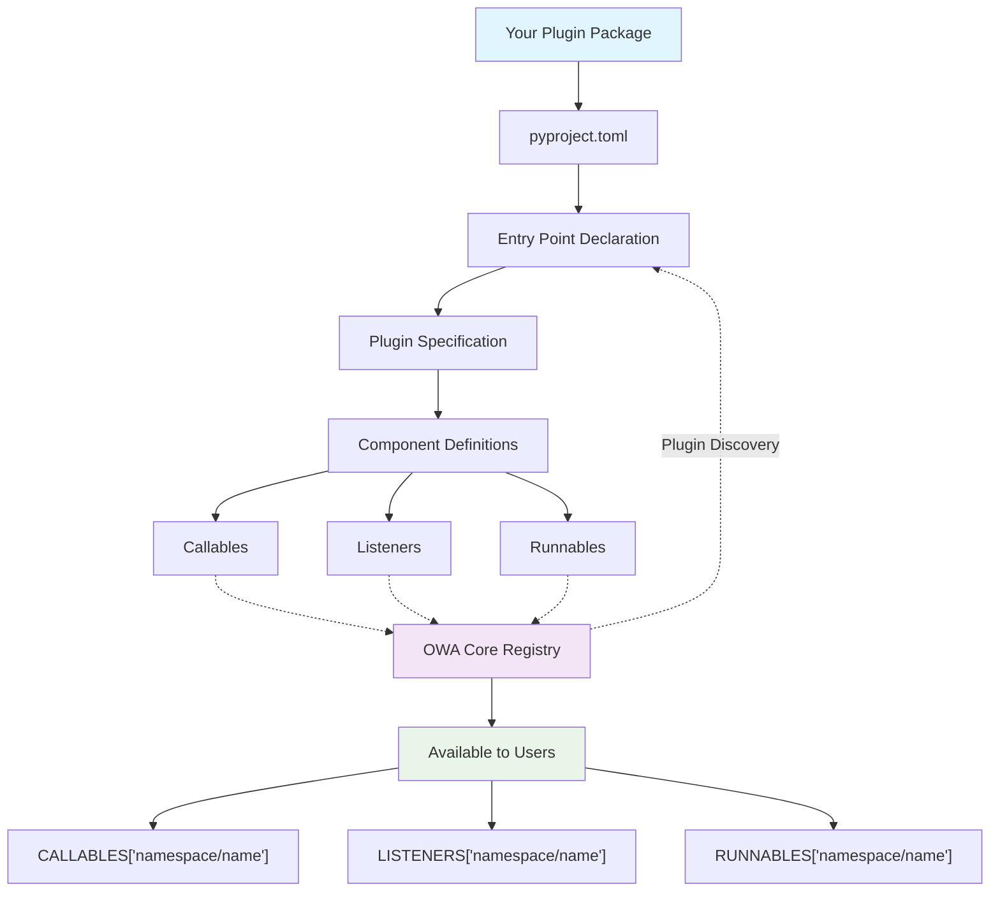

# Custom EnvPlugin Development

Create plugins that extend OWA with your own functionality.

!!! info "OWA's Env: MCP for Desktop Agents"
    Just as [Model Context Protocol (MCP)](https://modelcontextprotocol.io/) is the "USB-C of LLMs", **OWA's Env is the "USB-C of desktop agents"** - a universal interface for native desktop automation.

## Plugin Discovery

### How It Works

OWA automatically discovers plugins using Python's Entry Points system:



### Discovery Process

1. **Entry Point Scanning** - OWA scans all installed packages for `"owa.env.plugins"` entry points
2. **Plugin Spec Loading** - Loads and validates each `PluginSpec` object
3. **Lazy Registration** - Registers component metadata without importing actual code
4. **On-Demand Loading** - Components are imported only when first accessed

## Quick Start: Your First Plugin in 5 Minutes

### Step 1: Copy the Template

```bash
# Copy the example plugin as your starting point
cp -r projects/owa-env-example my-first-plugin
cd my-first-plugin
```

### Step 2: Make It Yours

Edit `pyproject.toml` to change the plugin name:

```toml
[project.entry-points."owa.env.plugins"]
myfirst = "owa.env.plugins.myfirst:plugin_spec"  # Changed from 'example'
```

Edit `owa/env/plugins/example.py` and change the namespace:

```python
plugin_spec = PluginSpec(
    namespace="myfirst",  # Changed from 'example'
    version="0.1.0",
    description="My first OWA plugin",
    # ... rest stays the same
)
```

### Step 3: Install and Test

```bash
# Install your plugin
pip install -e .

# Verify OWA discovered it
owl env list myfirst

# Test a component
python -c "from owa.core import CALLABLES; print(CALLABLES['myfirst/add'](2, 3))"
```

!!! success "🎉 Congratulations!"
    You just created your first OWA plugin. Your components are now available to any OWA user or application.

## Component Types

### Callables
Functions for immediate results:

```python
def get_weather(city: str) -> dict:
    return {"city": city, "temp": 25, "condition": "sunny"}

# Usage: CALLABLES["myplugin/weather"]("New York")
```

### Listeners
Event monitoring with callbacks (inherits from Runnable):

```python
from owa.core import Listener

class FileWatcher(Listener):
    def on_configure(self, callback, watch_folder, **kwargs):
        self.callback = callback
        self.watch_folder = watch_folder

    def start(self):
        # Monitor folder, call self.callback(event) on changes
        pass

    def stop(self):
        # Stop and cleanup
        pass
```

### Runnables
Background processes with start/stop control:

```python
from owa.core import Runnable

class DataCollector(Runnable):
    def on_configure(self, output_file, interval=60, **kwargs):
        self.output_file = output_file
        self.interval = interval

    def loop(self, *, stop_event):
        while not stop_event.is_set():
            # Do work
            stop_event.wait(self.interval)
```

## Plugin Specification

### Structure

```python title="owa/env/plugins/myplugin.py"
from owa.core.plugin_spec import PluginSpec

plugin_spec = PluginSpec(
    namespace="myplugin",
    version="0.1.0",
    description="My custom plugin",
    components={
        "callables": {
            "weather": "owa.env.myplugin.api:get_weather",
            "calculate": "owa.env.myplugin.math:add_numbers",
        },
        "listeners": {
            "file_watcher": "owa.env.myplugin.watchers:FileWatcher",
        },
        "runnables": {
            "data_collector": "owa.env.myplugin.workers:DataCollector",
        }
    }
)
```

### Key Elements

- **namespace**: Unique identifier for your plugin
- **components**: Maps component names to import paths
- **Import format**: `"module.path:object_name"`

## Reference Implementation

Study the working example: [`projects/owa-env-example`](https://github.com/open-world-agents/open-world-agents/tree/main/projects/owa-env-example)

### Getting Started

```bash
cd projects/owa-env-example
pip install -e .
owl env list example

# Test it works
python -c "
from owa.core import CALLABLES
result = CALLABLES['example/add'](2, 3)
print(f'2 + 3 = {result}')
"
```

### What It Shows

- File organization and project structure
- All three component types with working examples
- Proper entry point configuration
- Complete test suite

## Project Structure Options

!!! info "Choose based on your needs"
    === "Simple/Flat"
        Everything in one file - good for prototypes:
        ```
        my-plugin/
        ├── pyproject.toml
        ├── plugin.py              # All code here
        └── tests/
        ```

        ```toml title="pyproject.toml"
        [project.entry-points."owa.env.plugins"]
        myplugin = "plugin:plugin_spec"
        ```

    === "Company/Domain"
        Integrate with existing code:
        ```
        acme-tools/
        ├── pyproject.toml
        ├── acme/tools/
        │   ├── core/
        │   └── owa_plugin.py       # Plugin spec
        └── tests/
        ```

        ```toml title="pyproject.toml"
        [project.entry-points."owa.env.plugins"]
        acme_tools = "acme.tools.owa_plugin:plugin_spec"
        ```

    === "OWA Recommended"
        Follow OWA conventions:
        ```
        owa-env-myplugin/
        ├── pyproject.toml
        ├── owa/env/
        │   ├── myplugin/           # Implementation
        │   └── plugins/myplugin.py # Plugin spec
        └── tests/
        ```

        ```toml title="pyproject.toml"
        [project.entry-points."owa.env.plugins"]
        myplugin = "owa.env.plugins.myplugin:plugin_spec"
        ```

## Best Practices

### Naming Conventions
- **Namespace**: `desktop`, `my_company` (lowercase, underscores)
- **Components**: `mouse.click`, `file.read` (dots for hierarchy)
- **Package**: `owa-env-yourplugin`

### Error Handling
```python
def safe_function(param: str) -> dict:
    try:
        result = do_work(param)
        return {"success": True, "data": result}
    except Exception as e:
        return {"success": False, "error": str(e)}
```

### Resource Management
```python
class MyRunnable(Runnable):
    def loop(self, *, stop_event):
        try:
            resource = acquire_resource()
            while not stop_event.is_set():
                use_resource(resource)
                stop_event.wait(0.1)  # Small delay
        finally:
            release_resource(resource)
```

## Troubleshooting

!!! failure "Common Issues and Solutions"
    === "🔍 Plugin Not Discovered"
        **Symptoms**: `owl env list` doesn't show your plugin

        **Debug steps**:

        1. **Verify installation**:
           ```bash
           pip list | grep your-plugin-name
           ```

        2. **Check entry points**:
           ```bash
           python -c "
           try:
               from importlib.metadata import entry_points
           except ImportError:
               from importlib_metadata import entry_points

           eps = entry_points(group='owa.env.plugins')
           for ep in eps:
               print(f'{ep.name}: {ep.value}')
           "
           ```

        3. **Test plugin spec import**:
           ```bash
           python -c "from your.module.path import plugin_spec; print(plugin_spec.namespace)"
           ```

        **Common causes**:

        - Plugin not installed (`pip install -e .`)
        - Entry point name conflicts with existing plugin
        - Incorrect entry point path in `pyproject.toml`

    === "❌ Import Errors"
        **Symptoms**: Validation fails with import errors

        **Debug command**:
        ```bash
        owl env docs yourplugin
        ```

        **Common causes & solutions**:

        | Problem | Solution |
        |---------|----------|
        | Missing dependencies | Add them to `pyproject.toml` dependencies |
        | Wrong import paths | Check `module.path:object_name` format |
        | Circular imports | Keep plugin spec separate from implementation |
        | Module not found | Ensure module is importable after installation |

    === "🚫 Component Issues"
        **"Component not callable" errors**:

        ```python
        # ❌ Wrong - points to module
        "callables": {
            "bad": "mymodule.utils"
        }

        # ✅ Correct - points to function
        "callables": {
            "good": "mymodule.utils:my_function"
        }
        ```

        **Listener/Runnable doesn't work**:

        ```python
        # ✅ Correct structure
        from owa.core import Listener

        class MyListener(Listener):  # Must inherit
            def on_configure(self, callback, **kwargs):  # Must implement
                self.callback = callback
                # Your setup code
        ```

        **Common issues**:

        - Not inheriting from `owa.core.Listener` or `owa.core.Runnable`
        - Missing `on_configure()` method
        - Not calling `super().__init__()` in custom `__init__`

    === "🔧 Quick Diagnostics"
        **Run these commands to diagnose issues**:

        ```bash
        # Check if OWA can see your plugin
        owl env list yourplugin

        # Validate plugin specification
        owl env docs yourplugin --strict

        # Check for namespace conflicts
        owl env stats --namespaces

        # Test component loading manually
        python -c "
        from owa.core import CALLABLES, LISTENERS, RUNNABLES
        print('Available namespaces:')
        namespaces = set()
        for key in list(CALLABLES.keys()) + list(LISTENERS.keys()) + list(RUNNABLES.keys()):
            namespaces.add(key.split('/')[0])
        for ns in sorted(namespaces):
            print(f'  - {ns}')
        "
        ```

        **Still having issues?**

        - Check the [OWA GitHub Issues](https://github.com/open-world-agents/open-world-agents/issues)
        - Look at working examples in `projects/owa-env-*`
        - Ensure you're using compatible versions of dependencies


## Publishing

**PyPI (Recommended)**:
```bash
uv build
uv publish
```

**GitHub/Git**:
```bash
pip install git+https://github.com/user/owa-env-plugin.git
```

**Local Development**:
```bash
pip install -e /path/to/plugin
```

## Next Steps

| Topic | Description |
|-------|-------------|
| **[Environment Guide](guide.md)** | Complete system overview and advanced usage patterns |
| **[Built-in Plugins](plugins/std.md)** | Learn from standard, desktop, and GStreamer implementations |
| **[CLI Tools](../cli/env.md)** | Plugin management and exploration commands |
