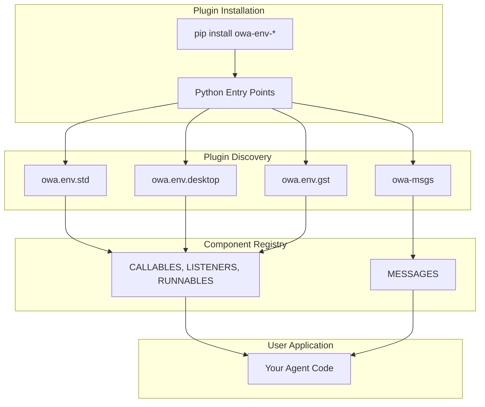

# Environment Guide

## Component Types

OWA's Environment provides three types of components for building real-time agents:

!!! info "Component Overview"
    === "Callables"
        **Direct function calls** - Invoke immediately for actions or state
        ```python
        CALLABLES["std/time_ns"]()  # Get current time
        CALLABLES["desktop/mouse.click"]("left", 2)  # Double-click
        ```

    === "Listeners"
        **Event monitoring** - Respond to events with callbacks
        ```python
        def on_event(data):
            print(f"Event: {data}")

        listener = LISTENERS["desktop/keyboard"]().configure(callback=on_event)
        with listener.session:
            input("Press Enter to stop...")
        ```

    === "Runnables"
        **Background processes** - Long-running tasks with start/stop control
        ```python
        process = RUNNABLES["gst/screen_capture"]().configure(fps=60)
        with process.session:
            frame = process.grab()
        ```

!!! question "Component Relationships"
    **Who initiates the action:**

    - **Callable**: You actively call the function
    - **Listener**: The system calls your callback when events occur (inherits from Runnable)
    - **Runnable**: Base class for background processes

    Traditional frameworks like [gymnasium.Env](https://gymnasium.farama.org/api/env/) only provide Callable-style interfaces.

## Registry System

Components are automatically discovered and registered when plugins are installed:

```python
from owa.core import CALLABLES, LISTENERS, RUNNABLES
# All installed plugins automatically available
```

**Key Features:**

- **Zero Configuration**: Automatic discovery via Python Entry Points
- **Unified Naming**: All components use `namespace/name` pattern
- **Immediate Availability**: Components ready after `pip install`

## Usage Examples

### Basic Usage

=== "Time & Scheduling"
    ```python
    from owa.core import CALLABLES, LISTENERS
    import time

    # Get current time
    current_time = CALLABLES["std/time_ns"]()
    print(f"Current time: {current_time}")

    # Periodic callback using context manager
    def on_tick():
        print(f"Tick: {CALLABLES['std/time_ns']()}")

    tick = LISTENERS["std/tick"]().configure(callback=on_tick, interval=1)
    with tick.session:
        time.sleep(3)  # Prints time every second for 3 seconds
    ```

=== "Desktop Automation"
    ```python
    from owa.core import CALLABLES, LISTENERS
    from owa.msgs.desktop.keyboard import KeyboardEvent

    # Screen capture and window management
    screen = CALLABLES['desktop/screen.capture']()
    print(f"Screen size: {screen.shape}")

    active_window = CALLABLES['desktop/window.get_active_window']()
    print(f"Active window: {active_window}")

    # Mouse control
    CALLABLES["desktop/mouse.click"]("left", 2)  # Double-click

    # Keyboard monitoring
    def on_key(event: KeyboardEvent):
        print(f"Key {event.event_type}: {event.vk}")

    with LISTENERS["desktop/keyboard"]().configure(callback=on_key).session:
        input("Press Enter to stop monitoring...")
    ```

=== "High-Performance Capture"
    ```python
    from owa.core import RUNNABLES
    import cv2

    # Real-time screen capture with GStreamer
    def process_frame(frame):
        cv2.imshow("Screen", frame.frame_arr)
        cv2.waitKey(1)

    screen = LISTENERS["gst/screen"]().configure(
        callback=process_frame,
        fps=60,
        show_cursor=True
    )

    with screen.session:
        input("Press Enter to stop capture...")
    ```

### Custom Plugin Development

Create your own plugins for automatic discovery:

```python
# pyproject.toml
[project.entry-points."owa.env.plugins"]
myplugin = "owa.env.myplugin:plugin_spec"

# Plugin specification
from owa.core.plugin_spec import PluginSpec

plugin_spec = PluginSpec(
    namespace="myplugin",
    version="0.1.0",
    description="My custom plugin",
    components={
        "callables": {"add": "owa.env.myplugin:add_function"},
        "listeners": {"events": "owa.env.myplugin:EventListener"}
    }
)

# Usage (automatically available after pip install)
result = CALLABLES["myplugin/add"](5, 3)  # Returns 8
```

!!! tip "Plugin Development"
    See [Custom Plugins Guide](custom_plugins.md) for detailed plugin creation instructions.

## Architecture Overview



## CLI Tools

Explore and manage plugins with the `owl env` command:

!!! example "Essential Commands"
    === "Plugin Discovery"
        ```bash
        # List all plugins
        owl env list

        # Show specific plugin details
        owl env list desktop

        # Search for components
        owl env search mouse
        ```

    === "Plugin Development"
        ```bash
        # Validate plugin specification
        owl env validate ./plugin.yaml

        # Check documentation quality
        owl env docs

        # View ecosystem statistics
        owl env stats --namespaces
        ```

    === "Example Output"
        ```bash
        $ owl env list
        📦 Discovered Plugins (4)
        ├── desktop (25 components)
        ├── gst (4 components)
        ├── std (2 components)
        └── example (6 components)

        $ owl env search mouse --table
        ┏━━━━━━━━━━━━━━━━━━━━━━━━━┳━━━━━━━━━━━┓
        ┃ Component               ┃ Type      ┃
        ┡━━━━━━━━━━━━━━━━━━━━━━━━━╇━━━━━━━━━━━┩
        │ desktop/mouse           │ listeners │
        │ desktop/mouse.click     │ callables │
        │ desktop/mouse.move      │ callables │
        └─────────────────────────┴───────────┘
        ```

!!! info "Complete CLI Reference"
    For detailed command options and examples, see **[CLI Environment Commands](../cli/env.md)**

## Message Registry

OWA provides centralized message definitions with automatic discovery:

```python
from owa.core import MESSAGES

# Access message classes
KeyboardEvent = MESSAGES['desktop/KeyboardEvent']
MouseEvent = MESSAGES['desktop/MouseEvent']

# Create instances
event = KeyboardEvent(event_type="press", vk=65, timestamp=1234567890)
```

**Message Naming**: `domain/MessageType` (e.g., `desktop/KeyboardEvent`)

**Core Message Types**:

| Type | Description |
|------|-------------|
| `desktop/KeyboardEvent` | Keyboard press/release events |
| `desktop/MouseEvent` | Mouse movement, clicks, scrolls |
| `desktop/ScreenCaptured` | Screen capture frames |
| `desktop/WindowInfo` | Window information |

**Custom Messages**: Register via entry points in `pyproject.toml`:
```toml
[project.entry-points."owa.msgs"]
"sensors/TemperatureReading" = "custom_sensors.messages:TemperatureReading"
```

!!! info "Message Tools & Development"
    - **CLI Tools**: Use `owl messages` commands for message management. See **[CLI Reference](../cli/messages.md)**
    - **Custom Messages**: For detailed guidance on creating custom message types, see **[Custom Messages Guide](../data/technical-reference/custom-messages.md)**

## Next Steps

| Topic | Description |
|-------|-------------|
| **[Plugin Development](custom_plugins.md)** | Create your own environment extensions |
| **[Built-in Plugins](plugins/std.md)** | Explore standard, desktop, and GStreamer plugins |
| **[CLI Tools](../cli/env.md)** | Complete command reference |