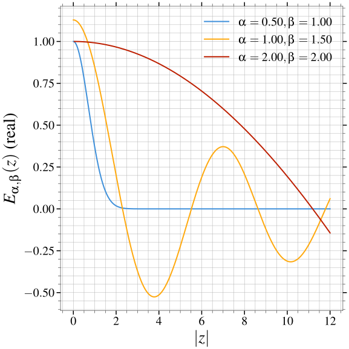
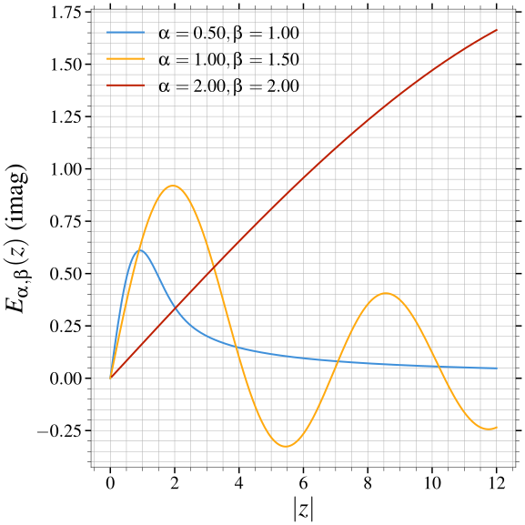
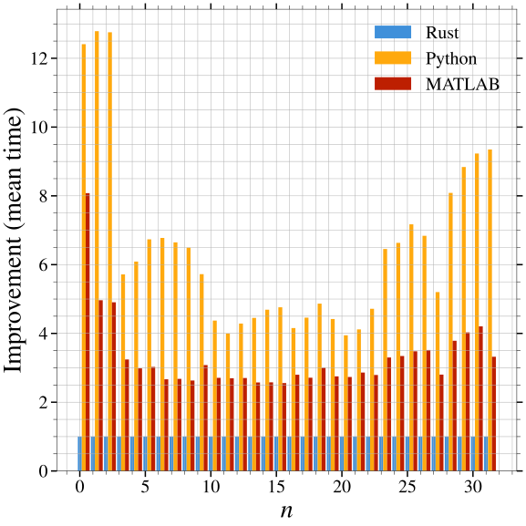

pymittagleffler documentation
=============================

Installation
------------

This package provides bindings around the Rust crate ``mittagleffler``. It can
be directly installed from PyPI using

.. code:: bash

    python -m pip install pymittagleffler

For development, you need to clone this repository and go into the ``python``
folder. We use `maturin <https://github.com/PyO3/maturin>`__ as the build system,
since this library is just a thin wrapper around some Rust code. To install
into your virtual environment, run

.. code::

    python -m pip install --verbose --no-build-isolation --editable .

This assumes that you have the build requirements already installed. In general,
the library follows the standard Python packaging rules, so read up on them in
the `official Python packaging guides <https://packaging.python.org/en/latest/>`__
if any of this sounds confusing.

Example
-------

As a simple example of the use of the functionality in this library, we will
evaluate the Mittag-Leffler function for several parameters of interest. The
function itself is defined most directly by the series expansion

.. math::

    E_{\alpha, \beta}(z) = \sum_{k = 0}^\infty \frac{z^k}{\Gamma(\alpha k + \beta)}

where :math:`\Re\{\alpha\} > 0` and :math:`\beta \in \mathbb{C}` is arbitrary.
There are also some nicer integral representations of the function, but this is
useful enough to get an idea of what we're dealing with. For some more information
see its `Wikipedia article <https://en.wikipedia.org/wiki/Mittag-Leffler_function>`__.

We setup up our evaluation as follows for some purely complex values of :math:`z`.

.. literalinclude:: ../../scripts/mittag-leffler-function.py
   :start-after: START_MITTAG_LEFFLER_EXAMPLE
   :end-before: END_MITTAG_LEFFLER_EXAMPLE
   :language: python
   :linenos:

This gives the following behaviour of the Mittag-Leffler function for the chosen
parameters. We can see that it exhibits a wide range of behaviors, both oscillatory
and fast decaying.

Performance
-----------

.. warning::

    This is simply a preliminary look at the performance of the library. Further
    optimizations are possible and any suggestions or tests in this direction
    are very welcome.

The results below have been generated using
:download:`bench_python.py <../../benches/bench_python.py>`. They compare the
implementation based on the Rust crate, a pure Python implementation of the same
algorithm from Garrappa (2015) `DOI <https://doi.org/10.1137/140971191>`__ and
the associated `MATLAB implementation <https://www.mathworks.com/matlabcentral/fileexchange/48154-the-mittag-leffler-function>`__.

The results are all normalized to the Rust implementation. As we can see, this
library is at least 2x faster than its competitors. There is still room
for improvement, both in the Rust crate implementation and in the bindings for
Python.

Reference
---------

.. automodule:: pymittagleffler

Changelog
=========

.. include:: ../CHANGELOG.rst

Acknowledgments
===============

Work on ``pymittagleffler`` was sponsored, in part, by the West University of
Timișoara under the START Grant Number 33580/25.05.2023.

The views and opinions expressed herein do not necessarily reflect those of the
funding agencies.

Indices and tables
==================

* :ref:`genindex`
* :ref:`modindex`
* :ref:`search`
