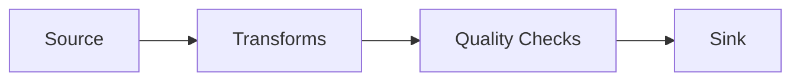

# User Guide

This guide covers all aspects of building pipelines with ETLX.

## Core Concepts

<div class="grid cards" markdown>

-   :material-cog:{ .lg .middle } **Configuration**

    ---

    Learn YAML configuration, variable substitution, and IDE integration.

    [:octicons-arrow-right-24: Configuration](configuration/index.md)

-   :material-database-import:{ .lg .middle } **Sources & Sinks**

    ---

    Read from and write to files, databases, and cloud storage.

    [:octicons-arrow-right-24: Sources & Sinks](io/index.md)

-   :material-swap-horizontal:{ .lg .middle } **Transforms**

    ---

    All 12 data transformation operations.

    [:octicons-arrow-right-24: Transforms](transforms/index.md)

-   :material-check-circle:{ .lg .middle } **Quality Checks**

    ---

    Validate data quality with built-in checks.

    [:octicons-arrow-right-24: Quality Checks](quality/index.md)

-   :material-server:{ .lg .middle } **Backends**

    ---

    Choose the right compute engine for your workload.

    [:octicons-arrow-right-24: Backends](backends/index.md)

</div>

## How ETLX Works

ETLX pipelines follow a simple flow:



1. **Source** - Read data from files, databases, or cloud storage
2. **Transforms** - Apply transformations in sequence
3. **Quality Checks** - Validate the transformed data
4. **Sink** - Write to the destination

## Configuration Methods

### YAML Configuration

Define pipelines declaratively:

```yaml
name: my_pipeline
engine: duckdb

source:
  type: file
  path: input.parquet

transforms:
  - op: filter
    predicate: amount > 0

sink:
  type: file
  path: output.parquet
```

### Python API

Build pipelines programmatically:

```python
from etlx import Pipeline
from etlx.config.models import FileSource, FileSink
from etlx.config.transforms import FilterTransform

pipeline = (
    Pipeline("my_pipeline", engine="duckdb")
    .source(FileSource(path="input.parquet"))
    .transform(FilterTransform(predicate="amount > 0"))
    .sink(FileSink(path="output.parquet"))
)

result = pipeline.run()
```

## Quick Reference

### Transform Operations

| Transform | Purpose |
|-----------|---------|
| [`select`](transforms/select.md) | Choose columns |
| [`rename`](transforms/rename.md) | Rename columns |
| [`filter`](transforms/filter.md) | Filter rows |
| [`derive_column`](transforms/derive-column.md) | Add computed columns |
| [`cast`](transforms/cast.md) | Convert types |
| [`fill_null`](transforms/fill-null.md) | Replace nulls |
| [`dedup`](transforms/dedup.md) | Remove duplicates |
| [`sort`](transforms/sort.md) | Order rows |
| [`join`](transforms/join.md) | Join datasets |
| [`aggregate`](transforms/aggregate.md) | Group and aggregate |
| [`union`](transforms/union.md) | Combine datasets |
| [`limit`](transforms/limit.md) | Limit rows |

### Quality Checks

| Check | Purpose |
|-------|---------|
| [`not_null`](quality/not-null.md) | No null values |
| [`unique`](quality/unique.md) | Uniqueness constraint |
| [`row_count`](quality/row-count.md) | Row count bounds |
| [`accepted_values`](quality/accepted-values.md) | Value whitelist |
| [`expression`](quality/expression.md) | Custom validation |

### Supported Backends

| Backend | Type | Default |
|---------|------|---------|
| [DuckDB](backends/duckdb.md) | Local | Yes |
| [Polars](backends/polars.md) | Local | Yes |
| [Spark](backends/spark.md) | Distributed | No |
| [Snowflake](backends/snowflake.md) | Cloud DW | No |
| [BigQuery](backends/bigquery.md) | Cloud DW | No |

## Next Steps

Start with [Configuration](configuration/index.md) to understand how pipelines are structured, then explore [Transforms](transforms/index.md) to learn the available operations.
