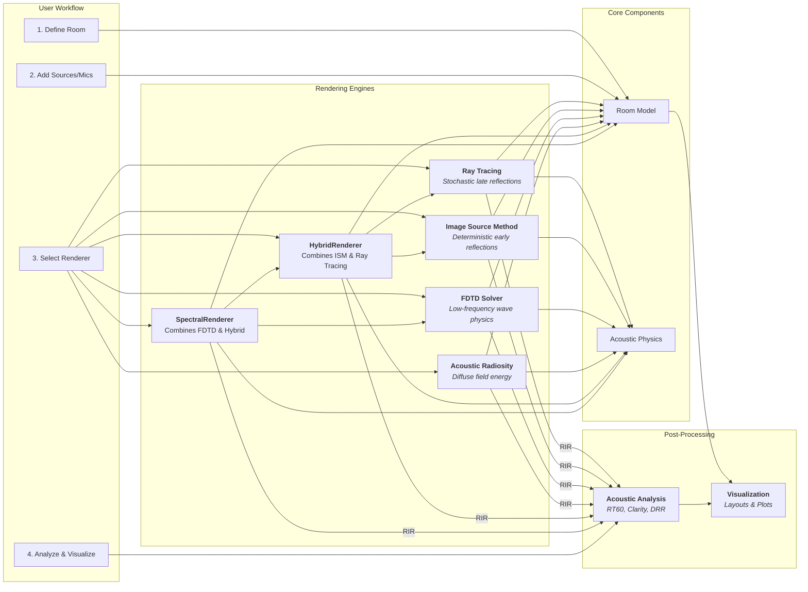

<p align="center">
  
</p>

A Python-based ray tracing acoustics simulator supporting complex room geometries, materials, and furniture.

[](https://badge.fury.io/py/rayroom)
[](https://rayroom.readthedocs.io/en/latest/?badge=latest)
[](https://opensource.org/licenses/MIT)

## Features

- **Ray Tracing Engine**: Stochastic ray tracing for late reflections.
- **Image Source Method (ISM)**: Deterministic early specular reflections.
- **Acoustic Radiosity**: Modeling of diffuse field energy exchange between surfaces.
- **FDTD Wave Solver**: Accurate low-frequency wave simulation using Finite Difference Time Domain.
- **Hybrid Rendering**: Combines methods for optimal accuracy and performance (ISM + Ray Tracing).
- **Spectral Rendering**: Frequency-dependent strategy using Wave equation for low frequencies and Geometric methods for high frequencies.
- **Room Creation**: Create shoebox rooms or complex polygons from corner lists.
- **Materials**: Frequency-dependent absorption, transmission (transparency), and scattering coefficients.
- **Objects**: Support for furniture, people (blockers), sources, and receivers (microphones).
- **Audio Formats**: Supports both mono and first-order Ambisonic (FOA) rendering.
- **Acoustic Analysis**: Post-simulation analysis including reverberation time (RT60), clarity (C50, C80), and Direct-to-Reverberant Ratio (DRR).

## Physics & Rendering

RayRoom implements multiple rendering strategies to model sound propagation accurately across different frequency bands and acoustic phenomena.

### 1. Ray Tracing (Stochastic)
Models sound as particles (rays) that bounce around the room.
- **Geometric Divergence**: Naturally handled by the divergence of rays.
- **Air Absorption**: ISO 9613-1 standard model based on temperature, humidity, and pressure.
- **Scattering**: Walls scatter rays based on their scattering coefficient.

### 2. Image Source Method (ISM)
Models specular reflections by mirroring sources across boundaries.
- **Purpose**: Captures precise early reflections (echoes) that are crucial for spatial perception.
- **Deterministic**: Unlike ray tracing, it finds exact reflection paths up to a specified order.

### 3. Acoustic Radiosity
A patch-based energy exchange method.
- **Purpose**: Models the late diffuse reverberation field.
- **Mechanism**: Divides walls into patches and solves the energy transfer matrix (view factors) to simulate diffuse inter-reflections.

### 4. Finite Difference Time Domain (FDTD)
Solves the acoustic wave equation on a 3D grid.
- **Purpose**: Accurate simulation of low-frequency phenomena like standing waves, diffraction, and interference which geometric methods (Ray/ISM) miss.
- **Mechanism**: Voxelizes the room and updates pressure fields over time steps.

### 5. Hybrid Engines
- **Hybrid Renderer**: Combines ISM (Early) and Ray Tracing (Late) for a complete impulse response.
- **Spectral Renderer**: Splits the audio spectrum. Uses **FDTD** for low frequencies (Wave physics) and **Hybrid Geometric** (ISM+Ray) for high frequencies.

## Architecture

Here is a high-level overview of the library's architecture, showing the relationship between the different rendering engines.



## Installation

You can install RayRoom directly from PyPI:

```bash
pip install rayroom
```

Or install from source:

```bash
git clone https://github.com/rayroom/rayroom.git
cd rayroom
pip install -e .
```

## Comparison & Demonstrations

To hear the differences between **RayRoom**'s rendering engines, including examples featuring Donald Trump and Bill Gates, please visit our [Comparisons page](examples/README.md).

## Usage

### Simple Shoebox Room with Audio Rendering

```python
import numpy as np
from scipy.io import wavfile
from rayroom import Room, Source, Receiver, RaytracingRenderer

# 1. Create a shoebox room
room = Room.create_shoebox([5, 4, 3])

# 2. Add a sound source
source = Source("TestSource", [2.5, 2, 1.5], power=1.0)
room.add_source(source)

# 3. Add a receiver (microphone)
receiver = Receiver("TestMic", [1, 2, 1.5], radius=0.1)
room.add_receiver(receiver)

# 4. Set up the renderer
renderer = RaytracingRenderer(room, fs=44100)

# 5. Assign audio to the source
# Create a 1-second sine wave at 440 Hz
fs = 44100
duration = 1.0
t = np.linspace(0., duration, int(fs * duration), endpoint=False)
audio_data = 0.5 * np.sin(2. * np.pi * 440. * t)
renderer.set_source_audio(source, audio_data)

# 6. Run the simulation
outputs = renderer.render(n_rays=10000, max_hops=30, rir_duration=1.5)

# 7. Save the output
output_audio = outputs[receiver.name]
wavfile.write("output.wav", fs, (output_audio * 32767).astype(np.int16))

print("Simulation complete. Audio saved to output.wav")
```

### Hybrid Rendering (ISM + Ray Tracing)

Use the `HybridRenderer` to combine deterministic early reflections with stochastic late reverberation.

```python
from rayroom import HybridRenderer

# ... setup room ...

renderer = HybridRenderer(room, fs=44100)
renderer.set_source_audio(source, "input.wav")

# ism_order=2 calculates exact reflections up to 2 bounces
outputs = renderer.render(n_rays=20000, ism_order=2)
```

### Spectral Rendering (Wave + Geometric)

Use the `SpectralRenderer` for high-fidelity simulation that accounts for wave physics at low frequencies.

```python
from rayroom import SpectralRenderer

# ... setup room ...

# crossover_freq determines where to switch from Wave to Geometric physics
renderer = SpectralRenderer(room, fs=44100, crossover_freq=1000)
renderer.set_source_audio(source, "input.wav")

outputs = renderer.render(rir_duration=1.0)
```

### Radiosity Rendering (ISM + Diffuse Energy)

Use `RadiosityRenderer` for smooth diffuse tails without ray sampling noise.

```python
from rayroom import RadiosityRenderer

# ... setup room ...

renderer = RadiosityRenderer(room, fs=44100, patch_size=0.5)
renderer.set_source_audio(source, "input.wav")

outputs = renderer.render(ism_order=2)
```

### Ambisonic Rendering

To render First-Order Ambisonic (FOA) audio, simply use an `AmbisonicReceiver`. The output will be a 4-channel audio file (W, X, Y, Z).

```python
from rayroom import AmbisonicReceiver

# ... setup room ...

# Use an Ambisonic receiver for FOA output
ambisonic_receiver = AmbisonicReceiver("AmbiMic", [1, 2, 1.5], radius=0.02)
room.add_receiver(ambisonic_receiver)

# ... run renderer ...
# output_audio will be a 4-channel numpy array
```

### Complex Geometry

See `examples/demo_polygon_room.py` for creating rooms from 2D floor plans.

## Acoustic Analysis & Visualization

RayRoom includes tools to analyze the acoustic properties of your simulated space from the generated Room Impulse Response (RIR). The renderer can return the RIR for each receiver if you set `record_paths=True` in the `render` method (note: this is renderer-dependent).

```python
from rayroom.analytics.acoustics import calculate_clarity, calculate_drr
from rayroom.room.visualize import plot_reverberation_time, plot_decay_curve

# Assuming 'rirs' is the dictionary of impulse responses from renderer.render()
rir = rirs[receiver.name]
fs = 44100

# 1. Calculate metrics
c80 = calculate_clarity(rir, fs, 80)  # Music clarity
drr = calculate_drr(rir, fs)
print(f"Music Clarity (C80): {c80:.2f} dB")
print(f"Direct-to-Reverberant Ratio: {drr:.2f} dB")

# 2. Plot reverberation time across frequency bands
plot_reverberation_time(rir, fs, filename="rt60.png", show=False)

# 3. Plot the decay curve for a specific frequency band
plot_decay_curve(rir, fs, band=1000, filename="decay_1000hz.png", show=False)
```

## Web Tools

RayRoom includes two visual web-based tools for designing rooms and creating simulation pipelines without writing code.

### 🏗️ Room Creator

Design acoustic rooms visually with a 2D/3D interface. Create custom geometries, place furniture, sources, and receivers, then export configurations for use in simulations.


```bash
python web/room_creator/launch_room_creator.py
```

### 🗺️ Blueprint Editor

Create complete audio simulation pipelines using a visual node-based editor. Connect nodes for rooms, renderers, effects, and metrics to build complex workflows.


```bash
python web/blueprint_pipeline/launch_blueprint_editor.py
```

For detailed documentation, see the [Web Tools README](web/README.md).

## Structure

- `rayroom/room/base.py`: Room and wall definitions.
- `rayroom/room/objects.py`: Source, Receiver, and Furniture classes.
- `rayroom/room/materials.py`: Material properties.
- `rayroom/room/visualize.py`: Visualization tools for room layouts and acoustic plots.
- `rayroom/analytics/acoustics.py`: Acoustic metrics calculation (RT60, Clarity, etc.).
- `rayroom/core/geometry.py`: Vector math and intersection tests.
- `rayroom/core/physics.py`: Acoustic physics models.
- `rayroom/core/utils.py`: Utility functions.
- `rayroom/engines/raytracer/core.py`: Main Ray Tracing engine.
- `rayroom/engines/raytracer/audio.py`: Audio processing for ray tracer.
- `rayroom/engines/ism/ism.py`: Image Source Method engine.
- `rayroom/engines/radiosity/radiosity.py`: Acoustic Radiosity renderer.
- `rayroom/engines/radiosity/core.py`: Acoustic Radiosity solver.
- `rayroom/engines/hybrid/hybrid.py`: Hybrid Geometric Renderer (ISM + Ray Tracing).
- `rayroom/engines/spectral/spectral.py`: Spectral Hybrid Renderer (Wave + Geometric).
- `rayroom/engines/spectral/fdtd.py`: FDTD Wave solver.

## Contributing

Pull requests are welcome. For major changes, please open an issue first to discuss what you would like to change.

Please make sure to update tests as appropriate.

## License

```plain
MIT License

Copyright (c) 2025 Yanis Labrak

Permission is hereby granted, free of charge, to any person obtaining a copy
of this software and associated documentation files (the "Software"), to deal
in the Software without restriction, including without limitation the rights
to use, copy, modify, merge, publish, distribute, sublicense, and/or sell
copies of the Software, and to permit persons to whom the Software is
furnished to do so, subject to the following conditions:

The above copyright notice and this permission notice shall be included in all
copies or substantial portions of the Software.

THE SOFTWARE IS PROVIDED "AS IS", WITHOUT WARRANTY OF ANY KIND, EXPRESS OR
IMPLIED, INCLUDING BUT NOT LIMITED TO THE WARRANTIES OF MERCHANTABILITY,
FITNESS FOR A PARTICULAR PURPOSE AND NONINFRINGEMENT. IN NO EVENT SHALL THE
AUTHORS OR COPYRIGHT HOLDERS BE LIABLE FOR ANY CLAIM, DAMAGES OR OTHER
LIABILITY, WHETHER IN AN ACTION OF CONTRACT, TORT OR OTHERWISE, ARISING FROM,
OUT OF OR IN CONNECTION WITH THE SOFTWARE OR THE USE OR OTHER DEALINGS IN THE
SOFTWARE.
```
