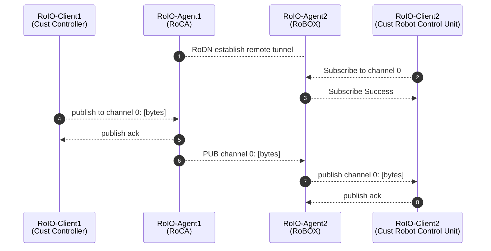

# robox-sdk-lite

## Directory Structure

<https://github.com/PacoLijt/robox-sdk-lite>

```
robox-sdk-lite
├── roio_proto.py           # RoIO protocol and message definitions
├── roio_client.py          # Implementation of the RoIOClient class, includes a __main__ method that reads input from stdin and publishes messages
├── roio_echo_client.py     # Sample RoIO Client implementation that echoes back received messages
├── roio_pub_meter.py       # Performance testing tool that publishes at 200Hz with 1000-byte packets
├── roio_sub_meter.py       # Tool that runs on the opposite end of roio_pub_meter.py to receive and count packets; the number of packets sent by pub_meter should match the number received by sub_meter
├── roio_agent_mock.py      # A mock RoIO Agent class for testing RoIOClient; simulates local message routing without going through RoDN
├── Logger.py               # Logging functionality
├── __init__.py
└── UdpSocket.py            # UDP socket functionality
```

## Overview

The `robox-sdk-lite` primarily provides the `RoIOClient` class for users to develop applications that interact with RoIO-enabled remote-controlled robots.

`RoIOClient` is a client class designed for real-time communication scenarios. It establishes UDP communication with a RoIO Agent, subscribes/unsubscribes to RoIO channels, maintains automatic heartbeat for subscriptions, and processes received publish messages using user-defined callback functions. It is suitable for applications requiring real-time peer-to-peer interaction (e.g., instant messaging, monitoring data reporting, robot control, game clients, etc.).

The following diagram illustrates the process of publishing a message from one direction to another. As long as both parties agree on a channel ID (`channelId`), they can send messages to each other. For example, control messages from RCA to Robot can be placed on `channelId == 1`, and status feedback in the reverse direction can be placed on `channel == 2`, or use `channelId` to distinguish different joints being controlled.



## SDK Usage

### Installation and Import

Install via pip:

```bash
pip install robox_sdk_lite
```

Import in Python 3 code:

```python
from robox_sdk_lite.roio_client import RoIOClient
```

### Initialize RoIOClient

```python
class RoIOClient(Thread):
    def __init__(self,
                 target: Tuple[str, int] = (os.getenv('ROIO_HOST', '127.0.0.1'),
                                         int(os.getenv('ROIO_PORT', '3333'))), 
                 max_queue_size: int = 5,
                 udp_timeout: int = 1,
                 pub_no_ack = False
                 ):
```

Usually, default parameters are sufficient:

```python
roio_cli = RoIOClient()
```

### RoIO Environment Variables

| Variable Name | Description | Default Value |
|---------------|-------------|----------------|
| ROIO_HOST     | Hostname or IP of the RoIO-Agent to connect to | 127.0.0.1 |
| ROIO_PORT     | Port of the RoIO-Agent to connect to | 3333 |
| CH_ID         | Channel ID used in meter and echo tests; must match between sender and receiver | 0 |

## Channels

RoIO supports 256 channels (0–255). Using a `channel_id` outside this range will result in an error. Channels are similar to topics in ROS and serve as logical units for message routing.

```python
# roio_proto.py
CHANNEL_RANGE = range(0x00, 0x100)  # 0–255
```

### Subscribe to a Channel

```python
def subscribe_to_channel(self, channel_id, callback=None):
```

- Returns `True` on success, `False` otherwise.
- Registers a callback to handle incoming messages on the specified channel.
- Automatically sends keep-alive messages to maintain the subscription.

#### Example Callback

```python
def echo_func(ch_id, bs):
    logger.info(f"ECHO: {ch_id}, {bs}")
    echo_client.publish_to_channel(ch_id, bs)

echo_client.subscribe_to_channel(CHANNEL_ID, echo_func)
echo_client.start()
```

### Unsubscribe from a Channel

```python
def unsubscribe_to_channel(self, channel_id):
```

- Idempotent operation.
- Can be used to check if the RoIO Agent is alive.

### Publish Bytes to a Channel

```python
def publish_to_channel(self, channel_id, bs):
```

- Sends a byte stream to the specified channel.
- Do not exceed MTU (~1400 bytes).

### Start/Stop RoIOClient

RoIOClient uses 3 internal threads:

- `roio-msgloop`: handles UDP socket communication
- `roio-keepalive`: maintains subscription heartbeats
- `roio-processor`: processes incoming messages and invokes callbacks

```python
roio_client.start()
# ... use client ...
roio_client.stop()
```

> ⚠️ Once stopped, the same instance cannot be restarted. Create a new instance if needed.

