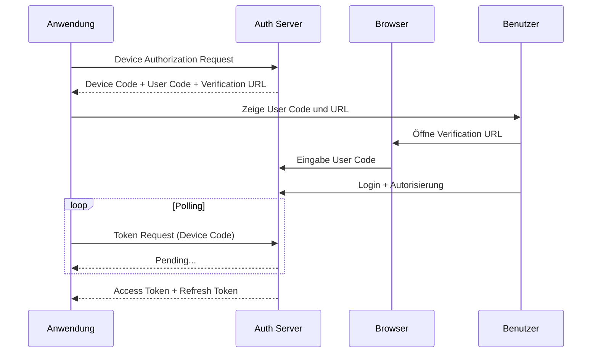

# Authentifizierungsmodi

`seven2one-questra-authentication` unterstützt zwei Hauptauthentifizierungsmodi, die für unterschiedliche Anwendungsfälle optimiert sind.

## Übersicht

| Modus | Use Case | User Interaction | Token-Typ |
|-------|----------|------------------|-----------|
| **Service Account** | Backend-Services, Automatisierung | Keine | Client Credentials |
| **Interactive User** | CLI-Tools, Desktop-Apps | Browser-Autorisierung | Device Code Flow |

## Service Account Authentifizierung

### Konzept

Service Account Authentifizierung verwendet den OAuth2 **Resource Owner Password Credentials** Grant Type. Der Client authentifiziert sich direkt mit Username und Password beim Authorization Server.

### Wann verwenden?

- Backend-Services und APIs
- Automatisierte Scripts und Cron-Jobs
- Server-zu-Server Kommunikation
- Anwendungen ohne Benutzerinteraktion

### Beispiel

```python
from questra_authentication import QuestraAuthentication

client = QuestraAuthentication(
    url="https://authentik.dev.example.com",
    username="ServiceUser",
    password="secret_password",
    oidc_discovery_paths=['/application/o/questra']
)

# Sofort einsatzbereit - keine Benutzerinteraktion erforderlich
token = client.get_access_token()
```

### Sicherheitshinweise

!!! warning "Credential-Sicherheit"
    - Speichern Sie Credentials **niemals** im Code
    - Verwenden Sie Umgebungsvariablen oder Secret-Management-Systeme
    - Rotieren Sie Passwords regelmäßig
    - Verwenden Sie dedizierte Service Accounts mit minimalen Berechtigungen

### Best Practices

#### Umgebungsvariablen verwenden

```python
import os

client = QuestraAuthentication(
    url=os.getenv("QUESTRA_AUTH_URL"),
    username=os.getenv("QUESTRA_SERVICE_USERNAME"),
    password=os.getenv("QUESTRA_SERVICE_PASSWORD")
)
```

#### Azure Key Vault Integration

```python
from azure.identity import DefaultAzureCredential
from azure.keyvault.secrets import SecretClient

# Key Vault Client
credential = DefaultAzureCredential()
key_vault_client = SecretClient(
    vault_url="https://my-vault.vault.azure.net/",
    credential=credential
)

# Secrets abrufen
username = key_vault_client.get_secret("questra-service-username").value
password = key_vault_client.get_secret("questra-service-password").value

# Authentifizierung
client = QuestraAuthentication(
    url="https://authentik.dev.example.com",
    username=username,
    password=password
)
```

## Interaktive Benutzer-Authentifizierung

### Konzept

Interaktive Authentifizierung verwendet den OAuth2 **Device Authorization Grant** (Device Code Flow). Der Benutzer autorisiert die Anwendung über einen Browser.

### Wann verwenden?

- Command-Line Tools (CLI)
- Desktop-Anwendungen
- Geräte ohne Browser (IoT, TV)
- Entwicklungs- und Test-Umgebungen

### Ablauf



### Beispiel

```python
from questra_authentication import QuestraAuthentication

# Interactive Mode aktivieren
client = QuestraAuthentication(
    url="https://authentik.dev.example.com",
    interactive=True,
    oidc_discovery_paths=['/application/o/questra']
)

# Ausgabe (Beispiel):
# Bitte besuchen Sie: https://authentik.dev.example.com/activate
# Geben Sie den Code ein: ABCD-EFGH

# Nach Autorisierung durch den Benutzer
token = client.get_access_token()
```

### User Experience Verbesserung

#### Auto-open Browser

```python
import webbrowser
from questra_authentication import OAuth2InteractiveUserCredential

# Custom Credential mit Browser-Auto-Open
credential = OAuth2InteractiveUserCredential()

# Später: verification_url automatisch öffnen
# webbrowser.open(verification_url)
```

#### Custom Nachrichten

Sie können die Ausgabe an den Benutzer anpassen:

```python
from questra_authentication import QuestraAuthentication

print("=== Questra Authentication ===")
print("Um fortzufahren, müssen Sie sich authentifizieren.")
print()

client = QuestraAuthentication(
    url="https://authentik.dev.example.com",
    interactive=True
)

print()
print("Authentifizierung erfolgreich!")
```

## Erweiterte Konfiguration

### Mehrere Discovery-Pfade

Für Umgebungen mit mehreren Identity Provider-Konfigurationen:

```python
client = QuestraAuthentication(
    url="https://authentik.dev.example.com",
    username="ServiceUser",
    password="secret_password",
    oidc_discovery_paths=[
        '/application/o/techstack',  # Wird zuerst versucht
        '/application/o/questra',    # Fallback
        '/application/o/legacy'       # Fallback
    ]
)
```

### Mehrere Auth-Server

Für High-Availability-Szenarien:

```python
client = QuestraAuthentication(
    url=[
        "https://auth-primary.example.com",
        "https://auth-secondary.example.com",
        "https://auth-backup.example.com"
    ],
    username="ServiceUser",
    password="secret_password",
    oidc_discovery_paths=['/application/o/questra']
)
```

Die URLs werden in der angegebenen Reihenfolge probiert.

### Custom OAuth2 Scopes

Standard-Scope ist `offline_access`. Für spezielle Anforderungen:

```python
client = QuestraAuthentication(
    url="https://authentik.dev.example.com",
    username="ServiceUser",
    password="secret_password",
    scope="openid profile email offline_access custom_scope"
)
```

!!! info "Scope-Bedeutung"
    - `openid`: OpenID Connect Authentifizierung
    - `profile`: Zugriff auf Benutzer-Profildaten
    - `email`: Zugriff auf E-Mail-Adresse
    - `offline_access`: Refresh Token erhalten
    - Custom Scopes: Anwendungsspezifische Berechtigungen

### Custom Client ID

Standard ist `"Questra"`. Für spezielle Konfigurationen:

```python
client = QuestraAuthentication(
    url="https://authentik.dev.example.com",
    client_id="MyCustomClient",
    username="ServiceUser",
    password="secret_password"
)
```

## Low-Level API

Für erweiterte Anwendungsfälle können Sie die Low-Level API direkt verwenden:

### OIDC Discovery

```python
from questra_authentication import OidcDiscoveryClient

discovery_client = OidcDiscoveryClient(
    urls="https://authentik.dev.example.com/application/o/questra"
)

oidc_config = discovery_client.discover()

print(f"Token Endpoint: {oidc_config.token_endpoint}")
print(f"Authorization Endpoint: {oidc_config.authorization_endpoint}")
```

### OAuth2 Credentials

```python
from questra_authentication import (
    OAuth2ServiceCredential,
    OAuth2InteractiveUserCredential
)

# Service Credential
service_cred = OAuth2ServiceCredential(
    username="ServiceUser",
    password="secret_password"
)

# Interactive Credential
interactive_cred = OAuth2InteractiveUserCredential()
```

### OAuth2 Authentication

```python
from questra_authentication import OAuth2Authentication

# Mit allen Optionen
oauth_client = OAuth2Authentication(
    client_id="Questra",
    credentials=service_cred,
    oidc_config=oidc_config,
    scope="offline_access",
    minimum_token_lifetime_seconds=120  # Token-Refresh 2 Minuten vor Ablauf
)

# Authentifizieren
oauth_client.authenticate()

# Token abrufen
token = oauth_client.get_access_token()
```

## Vergleich mit anderen Libraries

### vs. requests-oauthlib direkt

`seven2one-questra-authentication` ist ein Wrapper um `requests-oauthlib`, bietet aber:

- Automatisches OIDC Discovery
- Automatisches Token-Refresh
- Einfachere API
- Fehlerbehandlung
- Type Hints

### vs. authlib

Authlib ist mächtiger, aber komplexer. `seven2one-questra-authentication` ist speziell für Questra API optimiert.

### vs. python-keycloak

Ähnlich wie `python-keycloak`, aber nicht an einen bestimmten Identity Provider gebunden.

## Nächste Schritte

- [Token Management](../guides/token-management.md) - Details zum Token-Handling
- [Error Handling](../guides/error-handling.md) - Fehlerbehandlung
- [Best Practices](../guides/best-practices.md) - Produktions-Empfehlungen
- [API Referenz](../api/authentication.md) - Vollständige API-Dokumentation
