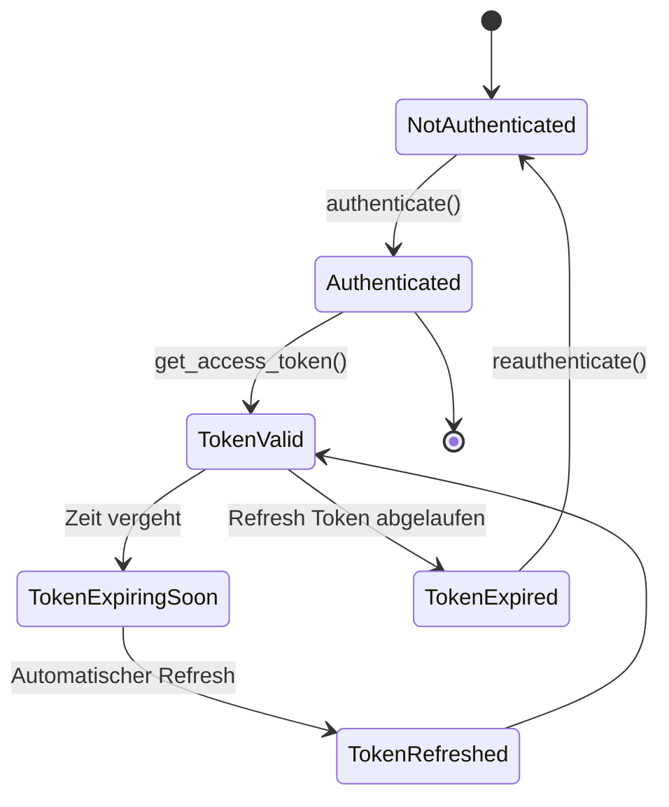

# Token Management

Details zur Token-Verwaltung und Best Practices.

## Token-Lebenszyklus



## Automatisches Token-Refresh

### Funktionsweise

`seven2one-questra-authentication` erneuert Tokens automatisch:

- **Default**: 60 Sekunden vor Ablauf
- **Konfigurierbar**: Via `minimum_token_lifetime_seconds`

```python
from questra_authentication import OAuth2Authentication

oauth_client = OAuth2Authentication(
    client_id="Questra",
    credentials=credentials,
    oidc_config=oidc_config,
    minimum_token_lifetime_seconds=300  # 5 Minuten vor Ablauf
)
```

### Refresh-Logik

```python
# Intern wird geprüft:
def _is_token_expired(self) -> bool:
    if not self.token_expires_at:
        return True
    remaining = self.token_expires_at - datetime.now()
    return remaining.total_seconds() < self.minimum_token_lifetime_seconds
```

## Token-Typen

### Access Token

- Kurze Lebensdauer (typisch: 5-15 Minuten)
- Wird für API-Aufrufe verwendet
- Automatische Erneuerung

```python
token = client.get_access_token()
headers = {"Authorization": f"Bearer {token}"}
```

### Refresh Token

- Längere Lebensdauer (typisch: 1-30 Tage)
- Wird automatisch im Hintergrund verwendet
- Nicht direkt zugänglich

## Token-Caching

### Wiederverwendung

Tokens werden automatisch gecacht:

```python
# Efficient - Token wird nur einmal geholt
client = QuestraAuthentication(...)

for i in range(100):
    token = client.get_access_token()  # Nur bei Bedarf neu geholt
    make_api_call(token)
```

### Manuelles Caching

Für erweiterte Szenarien:

```python
class TokenCache:
    def __init__(self, auth_client):
        self.auth_client = auth_client
        self._cached_token = None
        self._token_expires_at = None

    def get_token(self) -> str:
        if self._is_valid():
            return self._cached_token

        self._cached_token = self.auth_client.get_access_token()
        # Token-Ablaufzeit aus Session
        if self.auth_client._oauth_client.session:
            token_info = self.auth_client._oauth_client.session.token
            self._token_expires_at = token_info.get('expires_at')

        return self._cached_token

    def _is_valid(self) -> bool:
        if not self._cached_token or not self._token_expires_at:
            return False
        return time.time() < self._token_expires_at - 60

# Verwendung
cache = TokenCache(client)
token = cache.get_token()
```

## Token-Informationen

### Token-Eigenschaften abrufen

```python
# Nach Authentifizierung
if client._oauth_client and client._oauth_client.session:
    token_info = client._oauth_client.session.token

    print(f"Access Token: {token_info['access_token'][:20]}...")
    print(f"Token Type: {token_info['token_type']}")
    print(f"Expires At: {token_info['expires_at']}")
    print(f"Expires In: {token_info['expires_in']} seconds")

    if 'refresh_token' in token_info:
        print("Refresh Token available")

    if 'scope' in token_info:
        print(f"Scopes: {token_info['scope']}")
```

### Token dekodieren (JWT)

```python
import jwt
import json

token = client.get_access_token()

# JWT dekodieren (ohne Verifikation für Inspektion)
decoded = jwt.decode(token, options={"verify_signature": False})

print(json.dumps(decoded, indent=2))
# {
#   "sub": "user-id",
#   "iss": "https://authentik.dev.example.com",
#   "aud": ["Questra"],
#   "exp": 1234567890,
#   "iat": 1234567800,
#   "scope": "openid profile email"
# }
```

## Token-Persistierung

### Session-Token speichern

Für Desktop-Apps oder CLI-Tools:

```python
import json
from pathlib import Path

class TokenStore:
    def __init__(self, store_path: str = "~/.questra/token.json"):
        self.store_path = Path(store_path).expanduser()
        self.store_path.parent.mkdir(parents=True, exist_ok=True)

    def save_token(self, token_info: dict):
        """Speichert Token-Info sicher."""
        with open(self.store_path, 'w') as f:
            json.dump(token_info, f)
        # Unix: Nur Owner kann lesen/schreiben
        self.store_path.chmod(0o600)

    def load_token(self) -> dict | None:
        """Lädt gespeicherte Token-Info."""
        if not self.store_path.exists():
            return None
        with open(self.store_path, 'r') as f:
            return json.load(f)

# Verwendung
store = TokenStore()

# Nach Authentifizierung speichern
if client._oauth_client and client._oauth_client.session:
    store.save_token(client._oauth_client.session.token)

# Beim Start laden
cached_token = store.load_token()
if cached_token:
    # Token wiederverwenden wenn noch gültig
    pass
```

## Performance-Optimierung

### Batch-Requests

```python
def make_batch_requests(endpoints: list):
    # Token einmal holen
    token = client.get_access_token()
    headers = {"Authorization": f"Bearer {token}"}

    # Für alle Requests verwenden
    results = []
    for endpoint in endpoints:
        response = requests.get(endpoint, headers=headers)
        results.append(response.json())

    return results
```

### Async/Await

```python
import httpx
from questra_authentication import QuestraAuthentication

async def make_async_requests(endpoints: list):
    # Synchroner Token-Abruf
    token = client.get_access_token()
    headers = {"Authorization": f"Bearer {token}"}

    # Parallele Async-Requests
    async with httpx.AsyncClient() as http_client:
        tasks = [
            http_client.get(endpoint, headers=headers)
            for endpoint in endpoints
        ]
        responses = await asyncio.gather(*tasks)
        return [r.json() for r in responses]
```

## Token-Rotation

### Proaktive Erneuerung

```python
from threading import Thread
import time

class TokenRefresher:
    def __init__(self, auth_client, refresh_interval=300):
        self.auth_client = auth_client
        self.refresh_interval = refresh_interval
        self.running = False

    def start(self):
        """Startet Background-Thread für Token-Refresh."""
        self.running = True
        thread = Thread(target=self._refresh_loop, daemon=True)
        thread.start()

    def stop(self):
        """Stoppt Background-Thread."""
        self.running = False

    def _refresh_loop(self):
        while self.running:
            try:
                # Token proaktiv erneuern
                self.auth_client.get_access_token()
                time.sleep(self.refresh_interval)
            except Exception as e:
                logging.error(f"Token refresh failed: {e}")
                time.sleep(60)  # Retry nach 1 Minute

# Verwendung
refresher = TokenRefresher(client, refresh_interval=240)  # Alle 4 Minuten
refresher.start()
```

## Multi-Tenancy

### Mehrere Auth-Clients

```python
class TenantAuthManager:
    def __init__(self):
        self.clients = {}

    def get_client(self, tenant_id: str) -> QuestraAuthentication:
        if tenant_id not in self.clients:
            self.clients[tenant_id] = self._create_client(tenant_id)
        return self.clients[tenant_id]

    def _create_client(self, tenant_id: str) -> QuestraAuthentication:
        return QuestraAuthentication(
            url=os.getenv(f"TENANT_{tenant_id}_AUTH_URL"),
            username=os.getenv(f"TENANT_{tenant_id}_USERNAME"),
            password=os.getenv(f"TENANT_{tenant_id}_PASSWORD")
        )

# Verwendung
manager = TenantAuthManager()
client_a = manager.get_client("tenant_a")
client_b = manager.get_client("tenant_b")
```

## Debugging

### Token-Lifecycle logging

```python
import logging

# Enable DEBUG logging
logging.basicConfig(level=logging.DEBUG)
logger = logging.getLogger('questra_authentication')
logger.setLevel(logging.DEBUG)

# Zeigt:
# - "Starting authentication"
# - "Authentication successful"
# - "Token expired, refreshing"
# - "Token refreshed successfully"
```

### Token-Inspector

```python
def inspect_token(client: QuestraAuthentication):
    """Debug-Helper für Token-Informationen."""
    if not client._oauth_client or not client._oauth_client.session:
        print("No active session")
        return

    token_info = client._oauth_client.session.token
    expires_at = datetime.fromtimestamp(token_info['expires_at'])
    remaining = expires_at - datetime.now()

    print(f"Token Info:")
    print(f"  Type: {token_info['token_type']}")
    print(f"  Expires at: {expires_at}")
    print(f"  Remaining: {remaining}")
    print(f"  Has refresh token: {'refresh_token' in token_info}")
    print(f"  Scopes: {token_info.get('scope', 'N/A')}")

# Verwendung
inspect_token(client)
```

## Siehe auch

- [Best Practices](best-practices.md) - Produktions-Empfehlungen
- [Error Handling](error-handling.md) - Fehlerbehandlung
- [API Referenz](../api/authentication.md) - OAuth2Authentication Details
