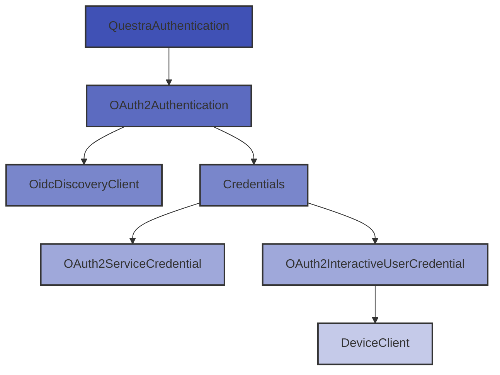

# Questra Authentication

Ein Python OAuth2 Authentication Client für die Questra API mit Unterstützung für Service Account und interaktive Benutzerauthentifizierung.

## Übersicht

Questra Authentication ist ein flexibles und benutzerfreundliches Authentifizierungsmodul, das speziell für die Integration mit der Questra API entwickelt wurde. Es abstrahiert die Komplexität der OAuth2-Authentifizierung und bietet eine einfache Schnittstelle für verschiedene Authentifizierungsszenarien.

## Hauptfunktionen

### Mehrere Authentifizierungsmodi

- **Service Account Authentifizierung**: Automatisierte Authentifizierung mit Username/Password für Backend-Services
- **Interaktive Benutzer-Authentifizierung**: OAuth2 Device Code Flow für interaktive Anwendungen

### Automatisches Token Management

- Automatische Token-Erneuerung bei Ablauf
- Konfigurierbare minimale Token-Lebensdauer
- Thread-sichere Token-Verwaltung

### OIDC Discovery

- Automatische Erkennung von OAuth2-Endpunkten
- Unterstützung mehrerer Discovery-Pfade
- Fallback zu `.well-known/openid-configuration`

### Typsichere Konfiguration

- Dataclass-basierte Konfigurationsobjekte
- Umfassende Exception-Hierarchie
- Vollständige Type Hints für IDEs

### Flexible Architektur

- Strategy Pattern für Credential-Handling
- Klare Trennung der Zuständigkeiten
- Einfach erweiterbar für neue Authentifizierungsmethoden

## Schnellstart

### Service Account

```python
from questra_authentication import QuestraAuthentication

# Client mit Service Account Credentials initialisieren
client = QuestraAuthentication(
    url="https://authentik.dev.example.com",
    username="ServiceUser",
    password="secret_password",
    oidc_discovery_paths=['/application/o/questra']
)

# Access Token abrufen (wird automatisch erneuert)
access_token = client.get_access_token()
```

### Interaktiver Benutzer

```python
from questra_authentication import QuestraAuthentication

# Client für interaktive Authentifizierung initialisieren
client = QuestraAuthentication(
    url="https://authentik.dev.example.com",
    interactive=True,
    oidc_discovery_paths=['/application/o/questra']
)

# Benutzer wird zur Autorisierung über Browser aufgefordert
access_token = client.get_access_token()
```

## Architektur



## Anforderungen

- Python >= 3.10
- requests-oauthlib >= 2.0.0

## Installation

=== "pip"

    ```bash
    pip install seven2one-questra-authentication
    ```

=== "poetry"

    ```bash
    poetry add seven2one-questra-authentication
    ```

## Nächste Schritte

- [Installation](getting-started/installation.md) - Detaillierte Installationsanleitung
- [Quickstart](getting-started/quickstart.md) - Erste Schritte mit dem Client
- [Authentifizierungsmodi](getting-started/authentication-modes.md) - Ausführliche Erklärung der verschiedenen Modi
- [API Referenz](api/index.md) - Vollständige API-Dokumentation

## Beispiele

### Mit mehreren Discovery-Pfaden

```python
client = QuestraAuthentication(
    url="https://authentik.dev.example.com",
    username="ServiceUser",
    password="secret_password",
    oidc_discovery_paths=[
        '/application/o/techstack',
        '/application/o/questra'
    ]
)
```

### Mit mehreren Basis-URLs

```python
client = QuestraAuthentication(
    url=[
        "https://auth1.example.com",
        "https://auth2.example.com"
    ],
    username="ServiceUser",
    password="secret_password",
    oidc_discovery_paths=['/application/o/questra']
)
```

### Mit Custom Scopes

```python
client = QuestraAuthentication(
    url="https://authentik.dev.example.com",
    username="ServiceUser",
    password="secret_password",
    scope="openid profile email"
)
```

## Exception Handling

```python
from questra_authentication import (
    QuestraAuthentication,
    AuthenticationError,
    OidcDiscoveryError
)

try:
    client = QuestraAuthentication(
        url="https://authentik.dev.example.com",
        username="ServiceUser",
        password="wrong_password"
    )
except OidcDiscoveryError as e:
    print(f"OIDC Discovery fehlgeschlagen: {e}")
    print(f"Versuchte URLs: {e.urls}")
except AuthenticationError as e:
    print(f"Authentifizierung fehlgeschlagen: {e}")
```

## Support und Contribution

Bei Fragen oder Problemen erstellen Sie bitte ein Issue im [Azure DevOps Repository](https://dev.azure.com/seven2one/Seven2one.Questra/_git/S2O.Questra.Python.Authentication).

## Lizenz

[Lizenzinformationen hinzufügen]
