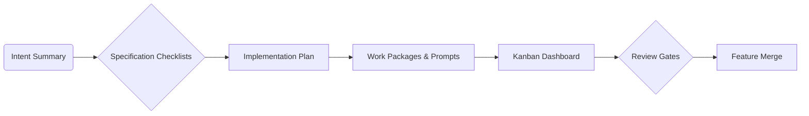

# Spec Workflow Automation

Spec Kitty streamlines **spec workflow automation** by enforcing discovery gates, generating guardrail documents, and tracking progress in a single system. This walkthrough highlights automation hooks that help teams move from feature intent to reviewed implementation without manual overhead.

## Automation Pillars

1. **Intent Capture:** `/spec-kitty.specify` records the user intent, runs a discovery interview, and scaffolds a spec with embedded validation checklists.
2. **Research & Plan Enforcement:** `/spec-kitty.research` scaffolds evidence logs, while `/spec-kitty.plan` copies mission-specific templates, runs research tooling, and fills in architecture data.
3. **Task Propagation:** `/spec-kitty.tasks` converts the plan into actionable work packages and generation-ready prompts.
4. **Lane Governance:** `.kittify/scripts/*` ensure every task transitions through required lanes before merge.

## Specification Tracking Lifecycle

- Each node corresponds to a Spec Kitty command.
- Dashboard provides **visual workflow** feedback across all steps.
- Review gates prevent merges until specs, plans, and tasks are in a consistent state.

## Key Automation Scripts

| Script | Purpose | Trigger |
|--------|---------|---------|
| `.kittify/scripts/bash/create-new-feature.sh` | Branch + worktree creation | `/spec-kitty.specify` |
| `.kittify/scripts/bash/setup-plan.sh` | Plan template copy & metadata | `/spec-kitty.plan` |
| `.kittify/scripts/bash/check-prerequisites.sh` | Artifact verification before tasks/implementation (includes fallback when `specify_cli` isn’t installed) | `/spec-kitty.tasks`, `/spec-kitty.implement` |
| `.kittify/scripts/bash/tasks-move-to-lane.sh` + `tasks_cli.py` | Lane tracking and dashboard updates | Every task transition |
| `.kittify/scripts/bash/update-agent-context.sh` | Refresh agent context files after plan changes | Post-plan updates |

### What’s New in the Spec Kitty Fork

- **Bundled task helpers:** `tasks_cli.py` and companion modules now ship with every scaffolded project, so lane automation works out of the box without installing the CLI as a package.
- **Mission fallback loader:** The prerequisite checker auto-detects missions even when `specify_cli` isn’t on PYTHONPATH, keeping automation intact inside packaged environments.
- **Dashboard-friendly lane metadata:** Helper scripts write `lane`, `agent`, `assignee`, and `shell_pid` to prompt frontmatter so the kanban dashboard and audit history remain accurate.

## Integrating With CI

- Run `spec-kitty tasks --validate` (coming soon) to ensure `tasks.md` references only prompts in the correct lanes.
- Block merges when `.worktrees/<feature>/tasks/for_review/` contains pending prompts.
- Publish dashboard screenshots or metrics as build artifacts for executive visibility.

## Automation Tips

- **Use Git hooks:** Pre-commit hooks can invoke `.kittify/scripts/bash/validate-task-workflow.sh` to confirm lane metadata.
- **Track spec debt:** Parse `spec.md` for `[NEEDS CLARIFICATION]` markers and fail CI if any remain before implementation.
- **Auto-sync agent context:** Schedule `.kittify/scripts/bash/update-agent-context.sh` to run after each plan update, ensuring that agents consume consistent instructions.
- **Emit lane notifications:** Wrap `.kittify/scripts/bash/tasks-move-to-lane.sh` so each transition posts to Slack/email and mirrors what the dashboard displays.

## Related Resources

- Kanban and dashboard deep dive: [`kanban-dashboard-guide.md`](kanban-dashboard-guide.md)
- Multi-agent coordination: [`multi-agent-orchestration.md`](multi-agent-orchestration.md)
- Real-world examples: [`../examples/parallel-implementation-tracking.md`](../examples/parallel-implementation-tracking.md)
