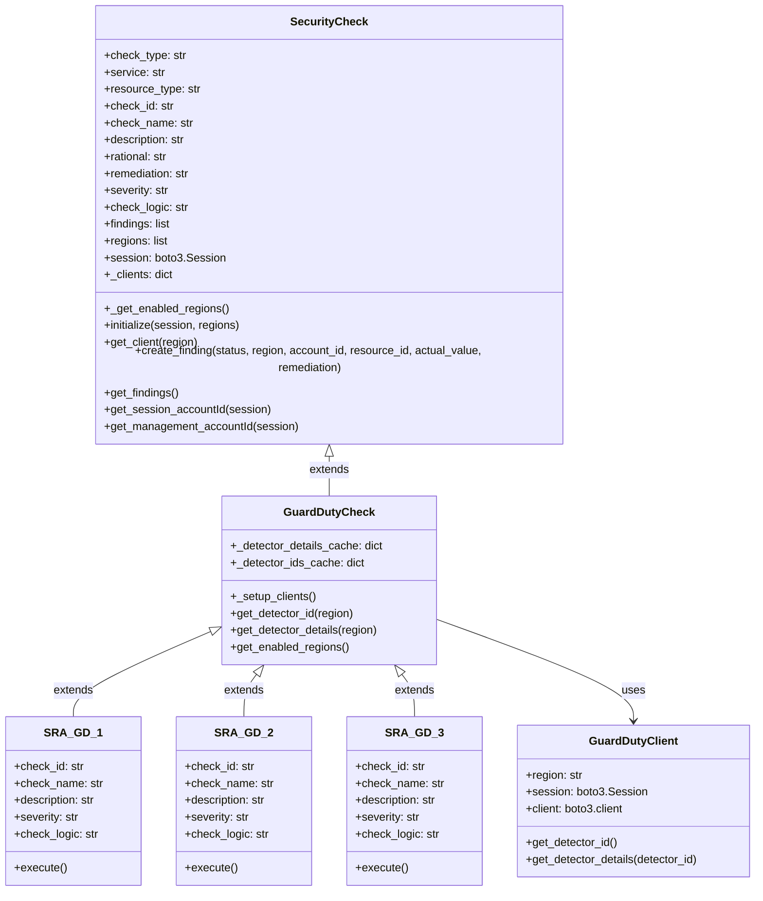

# SRA Verify

SRA Verify is a Python-based security auditing tool designed to assess AWS infrastructure configurations against the AWS
Security Reference Architecture (SRA). It helps identify security gaps and provides remediation guidance.

## Project Structure

```
sra-verify/
├── README.md
├── 1-sraverify-member-roles.yaml    # CloudFormation template for member roles
├── 2-sraverify-codebuild-deploy.yaml # CloudFormation template for CodeBuild
├── s3_sync_command.sh               # Script to sync files to S3
├── sraverify/                       # Main package directory
│   ├── setup.py                     # Package setup configuration
│   ├── requirements.txt             # Dependencies
│   ├── sraverify/                   # Core code
│   │   ├── main.py                  # Entry point
│   │   ├── core/                    # Core functionality
│   │   │   ├── check.py             # Base security check class
│   │   │   ├── session.py           # AWS session management
│   │   │   └── logging.py           # Logging configuration
│   │   ├── services/                # Service-specific modules
│   │   │   ├── guardduty/           # GuardDuty checks
│   │   │   │   ├── base.py          # GuardDuty base check class
│   │   │   │   ├── client.py        # GuardDuty API client
│   │   │   │   └── checks/          # Individual GuardDuty checks
│   │   │   └── cloudtrail/          # CloudTrail checks
│   │   └── utils/                   # Utility functions
│   └── tests/                       # Test cases
```

## Project architecture

SRA Verify is designed with an extensible framework that makes it easy to add new security checks. 



## Data Flow
SRA Verify performs security assessments by analyzing AWS service configurations and generating findings.

```ascii
[AWS Account] --> [SRAVerify Tool] --> [Security Checks] --> [Findings]
     |               |                       |                    |
     |               |                       |                    |
     v               v                       v                    v
[IAM Roles] --> [AWS Session] --> [Service Clients] --> [CSV Reports]
```

Component Interactions:
- SRAVerify assumes IAM roles in target accounts
- Executes service-specific security checks
- Generates findings with status and remediation steps
- Outputs results to CSV format
- Supports parallel execution across accounts
- Handles regional service availability

### Best Practices for Check Implementation

1. Meaningful IDs: Use a consistent naming scheme (SRA-XX-#) where XX is a service abbreviation
2. Clear Descriptions: Provide detailed descriptions of what the check verifies
3. Actionable Remediation: Include specific steps for remediation in failure cases
4. Caching: Use caching for expensive API calls that might be reused across checks

Follow these steps to implement your own checks:

### 1. Determine the AWS Service

First, decide which AWS service your check will target. If it's a service that already has checks (like GuardDuty or
CloudTrail), you can add to the existing module. Otherwise, you'll need to create a new service module.

### 2. Create Service Module (if needed)

If you're adding checks for a new service, create the following structure:

```
sraverify/sraverify/services/your_service/
├── __init__.py
├── base.py
├── client.py
└── checks/
    ├── __init__.py
    └── sra_xx_1.py
```

### 3. Implement Service Client

Create a client class to handle API interactions with the AWS service:

- Mirror AWS SDK method naming patterns when appropriate.

```python
# sraverify/sraverify/services/your_service/client.py
from typing import Dict, Optional, Any
import boto3
from botocore.exceptions import ClientError
from sraverify.core.logging import logger

class YourServiceClient:
    def __init__(self, region: str, session: Optional[boto3.Session] = None):
        self.region = region
        self.session = session or boto3.Session()
        self.client = self.session.client('your_service', region_name=region)

    def get_resource(self) -> Dict[str, Any]:
        try:
            return self.client.describe_resource()
        except ClientError as e:
            logger.error(f"Error getting resource in {self.region}: {e}")
            return {}
```

### 4. Create Base Check Class

Implement a base class for your service that extends SecurityCheck. 

```python
# sraverify/sraverify/services/your_service/base.py
from typing import Dict, Any
from sraverify.core.check import SecurityCheck
from sraverify.services.your_service.client import YourServiceClient

class YourServiceCheck(SecurityCheck):
    def __init__(self):
        super().__init__(
            check_type="account",  # or "management" if appropriate
            service="YourService",
            resource_type="AWS::YourService::Resource"
        )

    def _setup_clients(self):
        self._clients.clear()
        if hasattr(self, 'regions') and self.regions:
            for region in self.regions:
                self._clients[region] = YourServiceClient(region, session=self.session)

    # Add helper methods for common operations
    def get_resource_details(self, region: str) -> Dict[str, Any]:
        client = self.get_client(region)
        if not client:
            return {}
        return client.get_resource()
```

### 5. Implement Individual Checks

Create a new check class that extends your service's base check class:

```python
# sraverify/sraverify/services/your_service/checks/sra_xx_1.py
from typing import Dict, List, Any
from sraverify.services.your_service.base import YourServiceCheck

class SRA_XX_1(YourServiceCheck):
    def __init__(self):
        super().__init__()
        self.check_id = "SRA-XX-1"
        self.check_name = "Your check name"
        self.description = "Detailed description of what this check verifies"
        self.severity = "HIGH"  # or MEDIUM, LOW
        self.check_logic = "Description of the logic used to perform the check"

    def execute(self) -> List[Dict[str, Any]]:
        account_id = self.get_session_accountId(self.session)

        for region in self.regions:
            resource = self.get_resource_details(region)

            if not resource or not self._is_compliant(resource):
                self.findings.append(self.create_finding(
                    status="FAIL",
                    region=region,
                    account_id=account_id,
                    resource_id=None,
                    actual_value="Current configuration",
                    remediation="Steps to remediate the issue"
                ))
            else:
                self.findings.append(self.create_finding(
                    status="PASS",
                    region=region,
                    account_id=account_id,
                    resource_id=f"resource-id",
                    actual_value="Compliant configuration",
                    remediation="No remediation needed"
                ))

        return self.findings

    def _is_compliant(self, resource: Dict[str, Any]) -> bool:
        # Implement your compliance check logic here
        return resource.get('SecureSetting') == True
```

### 6. Register Your Check

Add your check to the __init__.py file in your service directory:

```python
# sraverify/sraverify/services/your_service/__init__.py
from sraverify.services.your_service.checks.sra_xx_1 import SRA_XX_1

CHECKS = {
    "SRA-XX-1": SRA_XX_1,
}
```

### 7. Import in Main Module

Finally, import your service's checks in the main module:

```python
# sraverify/sraverify/main.py
# Add to imports
from sraverify.services.your_service import CHECKS as your_service_checks

# Add to ALL_CHECKS dictionary
ALL_CHECKS = {
    **guardduty_checks,
    **cloudtrail_checks,
    **your_service_checks,  # Add your new checks
}
```

### 8. Test Your Check

Test your new check by running:

```bash
sraverify --check SRA-XX-1 --debug
```

## Caching

SRA Verify implements an efficient caching system to minimize redundant API calls when performing security checks across multiple AWS regions and services.
This improves performance and reduces the risk of hitting API rate limits.

```python
class ServiceCheck(SecurityCheck):
    # Class-level caches shared across all instances
    _resource_cache = {}
    _configuration_cache = {}
```

Refer the the GuardDuty base.py file for an implementation example.

## Check Types

SRA Verify categorizes security checks into different types based on their scope and the AWS account context they operate in. Understanding these check types
is essential for properly implementing and running checks across your AWS environment.

### Available Check Types

SRA Verify supports the following check types:

**Account Checks**

Account checks evaluate security configurations within a single AWS account. These checks focus on resources and settings that are account-specific and can
be assessed independently.

Examples:
- Verifying GuardDuty detector exists in each region
- Checking if CloudTrail logging is enabled

**Management Checks**

Management checks assess configurations that involve AWS Organizations management account or organization-wide settings. These checks typically require
access to the Organizations API and evaluate controls that affect multiple accounts.

Examples:
- Check for an organization CloudTrail

When SRA Verify is deployed and run via CodeBuild, management checks will be ran on the management account. Account checks will be ran on each member.

## Library Usage
### Installation as a Library
```bash
 pip install git+https://github.com/yourusername/sraverify.git
```

### Code Examples

Here's a comprehensive example demonstrating all major features of the SRAVerify library:

```python
#!/usr/bin/env python3
"""
Comprehensive example of using SRA Verify as a library.

This example demonstrates all the major functionality provided by the SRAVerify library,
including initialization, listing available checks and services, and running checks with
various filtering options.
"""

import json
from typing import Dict, Any
from sraverify import SRAVerify

# Configuration
AWS_PROFILE = 'default'  # Change this to your AWS profile if needed
AWS_REGIONS = ['us-east-1', 'us-west-2']  # Regions to check
AUDIT_ACCOUNTS = ['123456789012']  # Replace with your audit account IDs
LOG_ARCHIVE_ACCOUNTS = ['987654321098']  # Replace with your log archive account IDs

def print_section(title: str):
    """Print a section header."""
    print("\n" + "=" * 80)
    print(f" {title} ".center(80, "="))
    print("=" * 80 + "\n")

def pretty_print(data: Dict[str, Any]):
    """Print data in a formatted way."""
    print(json.dumps(data, indent=2))

def main():
    """Run the comprehensive example."""
    print_section("SRAVerify Library Usage Example")
    
    # Initialize SRAVerify with configuration
    print("Initializing SRAVerify...")
    sra = SRAVerify(
        profile=AWS_PROFILE,
        regions=AWS_REGIONS,
        debug=True  # Enable debug logging
    )
    print("✓ SRAVerify initialized\n")

    # Example 1: List all available services
    print_section("Available Services")
    services = sra.get_available_services()
    print("Services that can be checked:")
    for service in services:
        print(f"  • {service}")

    # Example 2: List all available checks
    print_section("Available Checks")
    all_checks = sra.get_available_checks()
    print("All available security checks:")
    for check_id, info in all_checks.items():
        print(f"\n{check_id}:")
        print(f"  Name: {info['name']}")
        print(f"  Service: {info['service']}")
        print(f"  Account Type: {info['account_type']}")
        print(f"  Severity: {info['severity']}")

    # Example 3: Get checks for specific account types
    print_section("Account-Specific Checks")
    account_types = ['management', 'audit', 'log-archive', 'application']
    
    for acc_type in account_types:
        checks = sra.get_available_checks(account_type=acc_type)
        print(f"\nChecks for {acc_type} accounts:")
        for check_id, info in checks.items():
            print(f"  • {check_id}: {info['name']}")

    # Example 4: Run all checks
    print_section("Running All Checks")
    print("Running all security checks...")
    findings = sra.run_checks(
        account_type='all',
        audit_accounts=AUDIT_ACCOUNTS,
        log_archive_accounts=LOG_ARCHIVE_ACCOUNTS,
        show_progress=True
    )
    
    # Process and display findings
    pass_count = sum(1 for f in findings if f['Status'] == 'PASS')
    fail_count = sum(1 for f in findings if f['Status'] == 'FAIL')
    error_count = sum(1 for f in findings if f['Status'] == 'ERROR')
    
    print("\nResults Summary:")
    print(f"  Total Findings: {len(findings)}")
    print(f"  Pass: {pass_count}")
    print(f"  Fail: {fail_count}")
    print(f"  Error: {error_count}")

    # Example 5: Run checks for specific service
    print_section("Service-Specific Checks")
    print("Running GuardDuty checks...")
    gd_findings = sra.run_checks(
        service='GuardDuty',
        show_progress=True
    )
    
    print(f"\nGuardDuty Findings: {len(gd_findings)}")
    for finding in gd_findings:
        print(f"\nCheck: {finding['CheckId']}")
        print(f"Status: {finding['Status']}")
        print(f"Title: {finding['Title']}")
        if finding['Status'] == 'FAIL':
            print(f"Remediation: {finding['Remediation']}")

    # Example 6: Run specific check
    print_section("Single Check Example")
    print("Running specific CloudTrail check (SRA-CT-1)...")
    ct_findings = sra.run_checks(
        check_id='SRA-CT-1',
        show_progress=True
    )
    
    print("\nCloudTrail Check Results:")
    pretty_print(ct_findings)

if __name__ == "__main__":
    main()
```

This example demonstrates:
1. Initializing SRA Verify with custom configuration
2. Listing available services
3. Listing all security checks
4. Getting account-specific checks
5. Running all security checks
6. Running service-specific checks
7. Running individual checks

To use this example:
1. Save it as `example_sraverify.py`
2. Update the AWS configuration variables at the top
3. Run with `python example_sraverify.py`

The example demonstrates all major features of the library with proper error handling and formatted output.