<div align="center">
  <div>
    <a href="https://strandsagents.com">
      
    </a>
  </div>

  <h1>
    Strands Robots
  </h1>

  <h2>
    Robot Control for Strands Agents
  </h2>

  <div align="center">
    <a href="https://pypi.org/project/strands-robots/"></a>
    <a href="https://github.com/cagataycali/strands-robots"></a>
    <a href="https://github.com/cagataycali/strands-robots/blob/main/LICENSE"></a>
    <a href="https://github.com/NVIDIA/Isaac-GR00T"></a>
    <a href="https://github.com/huggingface/lerobot"></a>
  </div>
  
  <p>
    <a href="https://strandsagents.com/">Strands Docs</a>
    ◆ <a href="https://github.com/NVIDIA/Isaac-GR00T">NVIDIA GR00T</a>
    ◆ <a href="https://github.com/huggingface/lerobot">LeRobot</a>
    ◆ <a href="https://github.com/dusty-nv/jetson-containers">Jetson Containers</a>
  </p>
</div>

Control robots with natural language through [Strands Agents](https://github.com/strands-agents/sdk-python). Integrates [NVIDIA Isaac GR00T](https://github.com/NVIDIA/Isaac-GR00T) for vision-language-action policies and [LeRobot](https://github.com/huggingface/lerobot) for universal robot support.

## How It Works


## Architecture


## Quick Start

```python
from strands import Agent
from strands_robots import Robot, gr00t_inference

# Create robot with cameras
robot = Robot(
    tool_name="my_arm",
    robot="so101_follower",
    cameras={
        "front": {"type": "opencv", "index_or_path": "/dev/video0", "fps": 30},
        "wrist": {"type": "opencv", "index_or_path": "/dev/video2", "fps": 30}
    },
    port="/dev/ttyACM0",
    data_config="so100_dualcam"
)

# Create agent with robot tool
agent = Agent(tools=[robot, gr00t_inference])

# Start GR00T inference service
agent.tool.gr00t_inference(
    action="start",
    checkpoint_path="/data/checkpoints/model",
    port=8000,
    data_config="so100_dualcam"
)

# Control robot with natural language
agent("Use my_arm to pick up the red block using GR00T policy on port 8000")
```

## Installation

```bash
pip install strands-robots
```

Or from source:

```bash
git clone https://github.com/cagataycali/strands-robots
cd strands-robots
pip install -e .
```

<details>
<summary><b>🐳 Jetson Container Setup (Required for GR00T)</b></summary>

GR00T inference requires the Isaac-GR00T Docker container on Jetson platforms:

```bash
# Clone jetson-containers
git clone https://github.com/dusty-nv/jetson-containers
cd jetson-containers

# Run Isaac GR00T container (background)
jetson-containers run $(autotag isaac-gr00t) &

# Container exposes inference service on port 5555 (ZMQ) or 8000 (HTTP)
```

**Tested Hardware:**
- NVIDIA Thor Dev Kit (Jetpack 7.0)
- NVIDIA Jetson AGX Orin (Jetpack 6.x)

See [Jetson Deployment Guide](https://github.com/NVIDIA/Isaac-GR00T/blob/main/deployment_scripts/README.md) for TensorRT optimization.

</details>

## Robot Control Flow

```mermaid
sequenceDiagram
    participant User
    participant Agent as Strands Agent
    participant Robot as Robot Tool
    participant Policy as GR00T Policy
    participant HW as Hardware

    User->>Agent: "Pick up the red block"
    Agent->>Robot: execute(instruction, policy_port)
    
    loop Control Loop @ 50Hz
        Robot->>HW: get_observation()
        HW-->>Robot: {cameras, joint_states}
        Robot->>Policy: get_actions(obs, instruction)
        Policy-->>Robot: action_chunk[16]
        
        loop Action Horizon
            Robot->>HW: send_action(action)
            Note over Robot,HW: 20ms sleep (50Hz)
        end
    end
    
    Robot-->>Agent: Task completed
    Agent-->>User: "✅ Picked up red block"
```



## Tools Reference

### Robot Tool

The `Robot` class is a Strands AgentTool that provides async robot control with real-time status reporting.

| Action | Parameters | Description | Example |
|--------|------------|-------------|---------|
| `execute` | `instruction`, `policy_port`, `duration` | Blocking execution until complete | `"Pick up the cube"` |
| `start` | `instruction`, `policy_port`, `duration` | Non-blocking async start | `"Wave your arm"` |
| `status` | - | Get current task status | Check progress |
| `stop` | - | Interrupt running task | Emergency stop |

**Natural Language Examples:**

```python
# Blocking execution (waits for completion)
agent("Use my_arm to pick up the red block using GR00T policy on port 8000")

# Async execution (returns immediately)
agent("Start my_arm waving using GR00T on port 8000, then check status")

# Stop running task
agent("Stop my_arm immediately")
```

<details>
<summary><b>Robot Constructor Parameters</b></summary>

| Parameter | Type | Default | Description |
|-----------|------|---------|-------------|
| `tool_name` | `str` | required | Name for this robot tool |
| `robot` | `str\|RobotConfig` | required | Robot type or config |
| `cameras` | `Dict` | `None` | Camera configuration |
| `port` | `str` | `None` | Serial port for robot |
| `data_config` | `str` | `None` | GR00T data config name |
| `control_frequency` | `float` | `50.0` | Control loop Hz |
| `action_horizon` | `int` | `8` | Actions per inference |

</details>

---

### GR00T Inference Tool

Manages GR00T policy inference services running in Docker containers.

| Action | Parameters | Description | Example |
|--------|------------|-------------|---------|
| `start` | `checkpoint_path`, `port`, `data_config` | Start inference service | `"Start GR00T on port 8000"` |
| `stop` | `port` | Stop service on port | `"Stop GR00T on port 8000"` |
| `status` | `port` | Check service status | `"Is GR00T running?"` |
| `list` | - | List all running services | `"List inference services"` |
| `find_containers` | - | Find GR00T containers | `"Find available containers"` |

**TensorRT Acceleration:**

```python
agent.tool.gr00t_inference(
    action="start",
    checkpoint_path="/data/checkpoints/model",
    port=8000,
    use_tensorrt=True,
    trt_engine_path="gr00t_engine",
    vit_dtype="fp8",    # ViT: fp16 or fp8
    llm_dtype="nvfp4",  # LLM: fp16, nvfp4, or fp8
    dit_dtype="fp8"     # DiT: fp16 or fp8
)
```

---

### Camera Tool

LeRobot-based camera management with OpenCV and RealSense support.

| Action | Parameters | Description | Example |
|--------|------------|-------------|---------|
| `discover` | - | Find all cameras | `"Discover cameras"` |
| `capture` | `camera_id`, `save_path` | Single image capture | `"Capture from /dev/video0"` |
| `capture_batch` | `camera_ids`, `async_mode` | Multi-camera capture | `"Capture from all cameras"` |
| `record` | `camera_id`, `capture_duration` | Record video | `"Record 10s video"` |
| `preview` | `camera_id`, `preview_duration` | Live preview | `"Preview camera 0"` |
| `test` | `camera_id` | Performance test | `"Test camera speed"` |

**Natural Language Examples:**

```python
# Discover available cameras
agent("Find all connected cameras")

# Capture from multiple cameras
agent("Capture images from front and wrist cameras")

# Record demonstration
agent("Record 30 seconds of video from the front camera")
```

---

### Serial Tool

Low-level serial communication for Feetech servos and custom protocols.

| Action | Parameters | Description | Example |
|--------|------------|-------------|---------|
| `list_ports` | - | Discover serial ports | `"List serial ports"` |
| `feetech_position` | `port`, `motor_id`, `position` | Move servo | `"Move motor 1 to center"` |
| `feetech_ping` | `port`, `motor_id` | Ping servo | `"Ping motor 1"` |
| `send` | `port`, `data/hex_data` | Send raw data | `"Send FF FF to robot"` |
| `monitor` | `port` | Monitor serial data | `"Monitor /dev/ttyACM0"` |

---

### Teleoperation Tool

Record demonstrations for imitation learning with LeRobot.

| Action | Parameters | Description | Example |
|--------|------------|-------------|---------|
| `start` | `robot_type`, `teleop_type` | Start teleoperation | `"Start teleoperation"` |
| `stop` | `session_name` | Stop session | `"Stop recording"` |
| `list` | - | List active sessions | `"List teleop sessions"` |
| `replay` | `dataset_repo_id`, `replay_episode` | Replay episode | `"Replay episode 5"` |

**Recording Demonstrations:**

```python
agent.tool.lerobot_teleoperate(
    action="start",
    robot_type="so101_follower",
    robot_port="/dev/ttyACM0",
    teleop_type="so101_leader",
    teleop_port="/dev/ttyACM1",
    dataset_repo_id="my_user/cube_picking",
    dataset_single_task="Pick up the red cube",
    dataset_num_episodes=50
)
```

---

### Pose Tool

Store, retrieve, and execute named robot poses.

| Action | Parameters | Description | Example |
|--------|------------|-------------|---------|
| `store_pose` | `pose_name` | Save current position | `"Save as 'home'"` |
| `load_pose` | `pose_name` | Move to saved pose | `"Go to home pose"` |
| `list_poses` | - | List all poses | `"List saved poses"` |
| `move_motor` | `motor_name`, `position` | Move single motor | `"Move gripper to 50%"` |
| `incremental_move` | `motor_name`, `delta` | Small movement | `"Move elbow +5°"` |
| `reset_to_home` | - | Safe home position | `"Reset to home"` |

---

## Supported Robots

| Robot | Config | Cameras | Description |
|-------|--------|---------|-------------|
| SO-100/SO-101 | `so100`, `so100_dualcam`, `so100_4cam` | 1-4 | Single arm desktop robot |
| Fourier GR-1 | `fourier_gr1_arms_only` | 1 | Bimanual humanoid arms |
| Bimanual Panda | `bimanual_panda_gripper` | 3 | Dual Franka Emika arms |
| Unitree G1 | `unitree_g1` | 1 | Humanoid robot platform |

<details>
<summary><b>GR00T Data Configurations</b></summary>

| Config | Video Keys | State Keys | Description |
|--------|------------|------------|-------------|
| `so100` | `video.webcam` | `state.single_arm`, `state.gripper` | Single camera |
| `so100_dualcam` | `video.front`, `video.wrist` | `state.single_arm`, `state.gripper` | Front + wrist |
| `so100_4cam` | `video.front`, `video.wrist`, `video.top`, `video.side` | `state.single_arm`, `state.gripper` | Quad camera |
| `fourier_gr1_arms_only` | `video.ego_view` | `state.left_arm`, `state.right_arm`, `state.left_hand`, `state.right_hand` | Humanoid arms |
| `bimanual_panda_gripper` | `video.right_wrist_view`, `video.left_wrist_view`, `video.front_view` | EEF pos/quat + gripper | Dual arm EEF |
| `unitree_g1` | `video.rs_view` | `state.left_arm`, `state.right_arm`, `state.left_hand`, `state.right_hand` | G1 humanoid |

</details>

## Policy Providers


```python
from strands_robots import create_policy

# GR00T policy (requires container)
policy = create_policy(
    provider="groot",
    data_config="so100_dualcam",
    host="localhost",
    port=8000
)

# Mock policy (for testing)
policy = create_policy(provider="mock")
```

## Project Structure

```
strands-robots/
├── strands_robots/
│   ├── __init__.py           # Package exports
│   ├── robot.py              # Universal Robot class (AgentTool)
│   ├── policies/
│   │   ├── __init__.py       # Policy ABC + factory
│   │   └── groot/
│   │       ├── __init__.py   # Gr00tPolicy implementation
│   │       ├── client.py     # ZMQ inference client
│   │       └── data_config.py # 6 embodiment configurations
│   └── tools/
│       ├── gr00t_inference.py   # Docker service manager
│       ├── lerobot_camera.py    # Camera operations
│       ├── lerobot_calibrate.py # Calibration management
│       ├── lerobot_teleoperate.py # Recording/replay
│       ├── pose_tool.py         # Pose management
│       └── serial_tool.py       # Serial communication
├── test.py                   # Integration example
└── pyproject.toml            # Package configuration
```

## Example: Complete Workflow

```python
#!/usr/bin/env python3
from strands import Agent
from strands_robots import Robot, gr00t_inference, lerobot_camera, pose_tool

# 1. Create robot with dual cameras
robot = Robot(
    tool_name="orange_arm",
    robot="so101_follower",
    cameras={
        "wrist": {"type": "opencv", "index_or_path": "/dev/video0", "fps": 15},
        "front": {"type": "opencv", "index_or_path": "/dev/video2", "fps": 15},
    },
    port="/dev/ttyACM0",
    data_config="so100_dualcam",
)

# 2. Create agent with all robot tools
agent = Agent(
    tools=[robot, gr00t_inference, lerobot_camera, pose_tool]
)

# 3. Start inference service
agent.tool.gr00t_inference(
    action="start",
    checkpoint_path="/data/checkpoints/gr00t-wave/checkpoint-300000",
    port=8000,
    data_config="so100_dualcam",
)

# 4. Interactive control loop
while True:
    user_input = input("\n🤖 > ")
    if user_input.lower() in ["exit", "quit"]:
        break
    agent(user_input)

# 5. Cleanup
agent.tool.gr00t_inference(action="stop", port=8000)
```

## Contributing

We welcome contributions! Please see:
- [GitHub Issues](https://github.com/cagataycali/strands-robots/issues) for bug reports
- [Pull Requests](https://github.com/cagataycali/strands-robots/pulls) for contributions

## License

Apache-2.0 - see [LICENSE](LICENSE) file.

## Links

<div align="center">
  <a href="https://github.com/cagataycali/strands-robots">GitHub</a>
  ◆ <a href="https://pypi.org/project/strands-robots/">PyPI</a>
  ◆ <a href="https://github.com/NVIDIA/Isaac-GR00T">NVIDIA GR00T</a>
  ◆ <a href="https://github.com/huggingface/lerobot">LeRobot</a>
  ◆ <a href="https://strandsagents.com/">Strands Docs</a>
</div>
