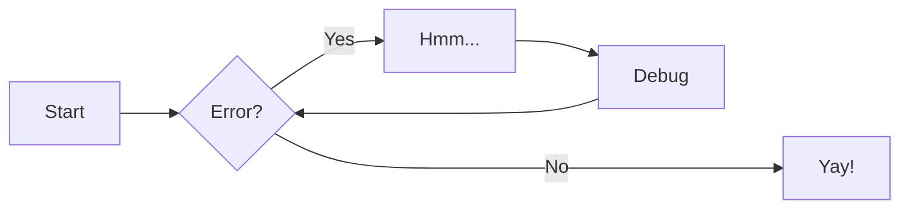

# Contributing to sts

## Development Setup

### Prerequisites

- Python 3.9 or later
- [pre-commit](https://pre-commit.com/) (required)
- [hatch](https://hatch.pypa.io/) (recommended)

### Initial Setup

1. Clone the repository:

   ```bash
   git clone https://gitlab.com/rh-kernel-stqe/sts.git
   cd sts
   ```

2. Install pre-commit hooks (required):

   ```bash
   pre-commit install
   ```

3. Install development dependencies:

   ```bash
   # If using hatch (recommended)
   hatch shell

   # If not using hatch
   pip install ruff pyright pre-commit pytest pytest-mock pytest-cov
   ```

### Development Tools

We use several tools to ensure code quality:

- [ruff](https://docs.astral.sh/ruff/): For linting and formatting
- [pyright](https://microsoft.github.io/pyright/): For static type checking
- [pytest](https://docs.pytest.org/): For testing
- [pre-commit](https://pre-commit.com/): For automated checks

#### Using Hatch (Recommended)

View available scripts:

```bash
hatch env show
```

Common commands:

```bash
# Format code
hatch run format

# Run linting checks
hatch run lint

# Run type checking
hatch run check

# Run all checks
hatch run all

# Run tests
hatch run pytest

# Build documentation
hatch run docs:build

# Serve documentation locally
hatch run docs:serve
```

#### Without Hatch

If you prefer not to use hatch, you can run the tools directly:

```bash
# Format code
ruff format
ruff check --fix

# Run linting checks
ruff check
ruff format --check

# Run type checking
pyright

# Run sts-libs tests
pytest sts_libs/tests/
```

## Code Style

pre-commit checks are checking for the following:

- Type hints are required for all functions and methods
- Docstrings loosely follow Google style (see [Docstring Style Guide](contributing/docstrings.md))
- Line length is limited to 120 characters
- Single quotes for strings
- Strict linting rules (see pyproject.toml for full configuration)

## Testing

- Unit tests are recommended where suitable
- Tests are written using pytest
- Coverage reports are generated automatically
- Tests should be focused and descriptive

## Documentation

- Documentation is built using mkdocs with the Material theme
- API documentation is automatically generated from docstrings
- Developers are encouraged to add their own documentation:
    * Add usage examples and best practices
    * Include troubleshooting tips
    * Provide architecture diagrams or flowcharts
    * Share implementation notes or design decisions
    * Document common pitfalls or gotchas
    * Add links to related documentation or resources

### Enhancing Documentation

While docstrings provide the core API documentation, you can enhance the documentation
by adding additional content before or after the auto-generated sections. For example:

```markdown
# My Module

Some introductory text explaining the module's purpose and key concepts.

## Usage Tips

Here are some best practices for using this module effectively...

## API Reference

::: sts.my_module

## Implementation Notes

Additional details about the implementation, design decisions, etc...

## Common Patterns

Examples of common usage patterns and their explanations...
```

### Using MkDocs Plugins

We encourage the use of MkDocs plugins to enhance documentation. The Material theme
supports many useful plugins that can improve documentation quality and readability.

Browse the [MkDocs Material Plugins page](https://squidfunk.github.io/mkdocs-material/plugins/)
for a complete list of available plugins and their features.

To use a plugin:

1. Add it to the project's [docs] dependencies
2. Configure it in mkdocs.yml
3. Use it in your documentation

For example, to add a Mermaid diagram:

```markdown



### Local Preview

Preview documentation locally using:

```bash
hatch run docs:serve
```

Visit <http://127.0.0.1:8000> to see your changes.

## Pull Requests

1. Create a new branch for your changes
2. Make sure pre-commit is installed (see above)
3. Write clear commit messages ([Conventional Commits](https://www.conventionalcommits.org/en/v1.0.0/)
   are recommended but not required)
4. Update documentation if needed
5. Add tests for new functionality where appropriate
6. Submit a merge request with a clear description of your changes
